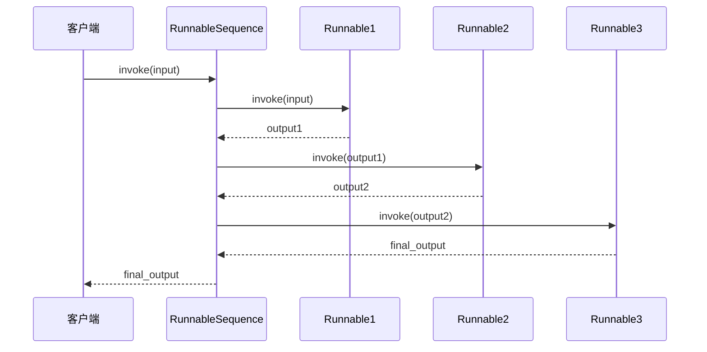
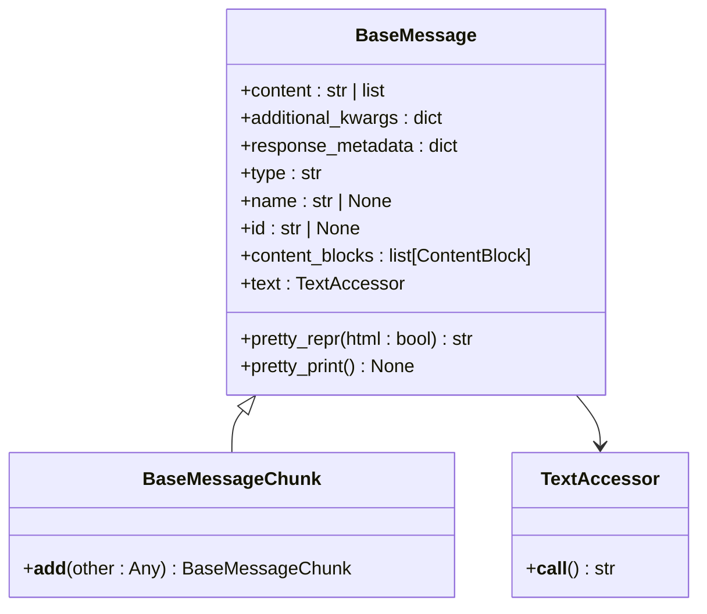
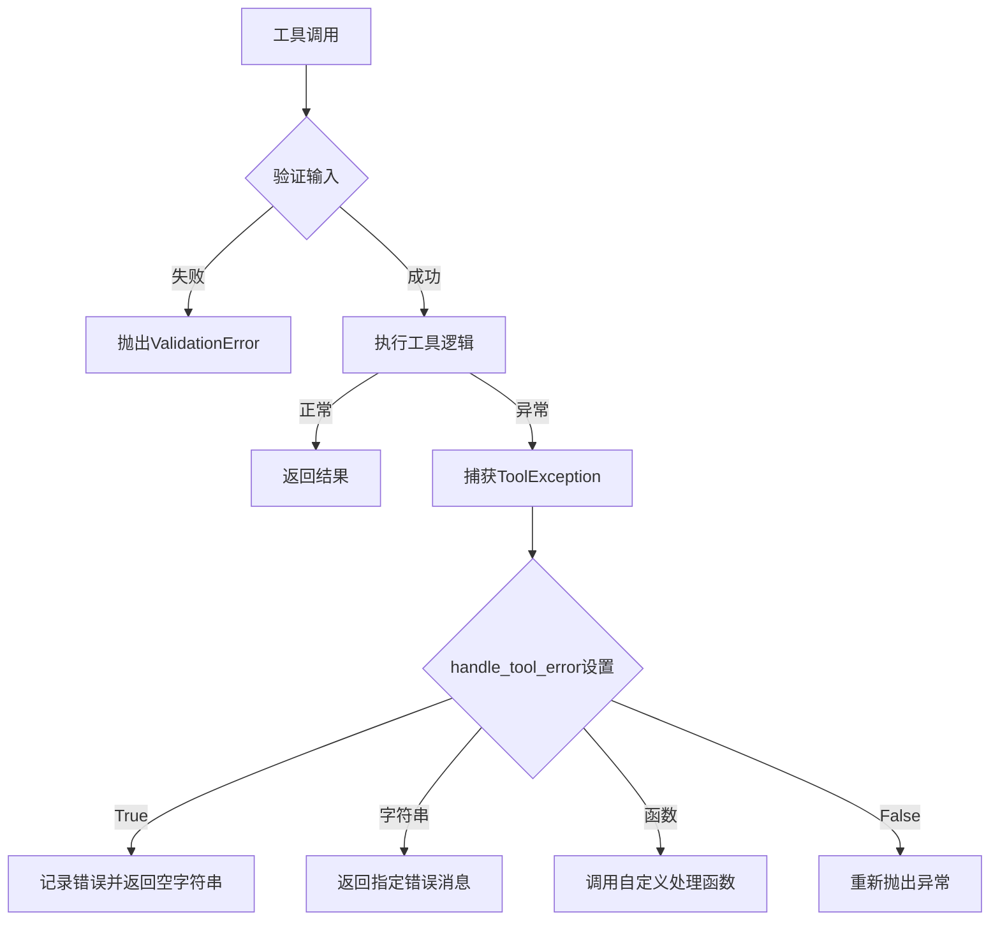

# LangChain 核心API参考

<cite>
**本文档中引用的文件**
- [__init__.py](file://libs/core/langchain_core/__init__.py)
- [base.py](file://libs/core/langchain_core/runnables/base.py)
- [language_models/base.py](file://libs/core/langchain_core/language_models/base.py)
- [language_models/chat_models.py](file://libs/core/langchain_core/language_models/chat_models.py)
- [messages/base.py](file://libs/core/langchain_core/messages/base.py)
- [prompts/base.py](file://libs/core/langchain_core/prompts/base.py)
- [tools/base.py](file://libs/core/langchain_core/tools/base.py)
- [callbacks/base.py](file://libs/core/langchain_core/callbacks/base.py)
- [tracers/base.py](file://libs/core/langchain_core/tracers/base.py)
- [output_parsers/base.py](file://libs/core/langchain_core/output_parsers/base.py)
- [utils/formatting.py](file://libs/core/langchain_core/utils/formatting.py)
- [version.py](file://libs/core/langchain_core/version.py)
</cite>

## 目录
1. [简介](#简介)
2. [项目结构概览](#项目结构概览)
3. [核心抽象基类](#核心抽象基类)
4. [运行器系统](#运行器系统)
5. [语言模型接口](#语言模型接口)
6. [消息系统](#消息系统)
7. [提示模板](#提示模板)
8. [工具系统](#工具系统)
9. [回调和追踪](#回调和追踪)
10. [输出解析器](#输出解析器)
11. [实用工具](#实用工具)
12. [版本信息](#版本信息)

## 简介

LangChain 核心API定义了LangChain生态系统的基础抽象。这些接口为聊天模型、LLM、向量存储、检索器等核心组件提供了统一的定义。核心库采用轻量级设计，不包含任何第三方集成，专注于提供通用的抽象和工具。

核心特性：
- 统一的调用协议（Runnables）
- LangChain表达式语言（LCEL）组合语法
- 异步和同步操作支持
- 批处理优化
- 流式处理支持
- 类型安全的输入输出验证

**章节来源**
- [__init__.py](file://libs/core/langchain_core/__init__.py#L1-L21)

## 项目结构概览

```mermaid
graph TD
A[langchain_core] --> B[runnables]
A --> C[language_models]
A --> D[messages]
A --> E[prompts]
A --> F[tools]
A --> G[callbacks]
A --> H[tracers]
A --> I[output_parsers]
A --> J[utils]
B --> B1[base.py - Runnable抽象]
B --> B2[config.py - 配置管理]
B --> B3[schema.py - 模式定义]
C --> C1[base.py - 基础语言模型]
C --> C2[chat_models.py - 聊天模型]
C --> C3[llms.py - 纯文本模型]
D --> D1[base.py - 消息基础类]
D --> D2[chat.py - 聊天消息]
D --> D3[system.py - 系统消息]
E --> E1[base.py - 提示模板基础]
E --> E2[chat.py - 聊天提示]
E --> E3[string.py - 字符串提示]
F --> F1[base.py - 工具基础类]
F --> F2[simple.py - 简单工具]
F --> F3[structured.py - 结构化工具]
G --> G1[base.py - 回调处理器]
G --> G2[manager.py - 回调管理器]
H --> H1[base.py - 追踪器基础]
H --> H2[core.py - 核心追踪逻辑]
I --> I1[base.py - 输出解析器基础]
I --> I2[string.py - 字符串解析器]
I --> I3[json.py - JSON解析器]
J --> J1[formatting.py - 格式化工具]
J --> J2[pydantic.py - Pydantic工具]
```



**图表来源**
- [__init__.py](file://libs/core/langchain_core/__init__.py#L1-L21)

## 核心抽象基类

### Runnable抽象基类

`Runnable`是LangChain中所有可执行组件的基础抽象类。它定义了统一的接口，支持同步、异步、批处理和流式操作。

#### 核心方法

| 方法 | 描述 | 参数 | 返回值 |
|------|------|------|--------|
| `invoke` | 同步执行单个输入 | `input: Input`, `config: RunnableConfig` | `Output` |
| `ainvoke` | 异步执行单个输入 | `input: Input`, `config: RunnableConfig` | `Awaitable[Output]` |
| `batch` | 批量处理多个输入 | `inputs: List[Input]`, `config: RunnableConfig` | `List[Output]` |
| `abatch` | 异步批量处理多个输入 | `inputs: List[Input]`, `config: RunnableConfig` | `Awaitable[List[Output]]` |
| `stream` | 流式处理单个输入 | `input: Input`, `config: RunnableConfig` | `Iterator[Output]` |
| `astream` | 异步流式处理单个输入 | `input: Input`, `config: RunnableConfig` | `AsyncIterator[Output]` |

#### 属性和配置

| 属性 | 类型 | 描述 |
|------|------|------|
| `name` | `str \| None` | 可选的组件名称，用于调试和追踪 |
| `input_schema` | `BaseModel` | 输入模式验证器 |
| `output_schema` | `BaseModel` | 输出模式验证器 |
| `config_schema` | `BaseModel` | 配置模式验证器 |

#### 组合操作



**图表来源**
- [base.py](file://libs/core/langchain_core/runnables/base.py#L2749-L2850)

**章节来源**
- [base.py](file://libs/core/langchain_core/runnables/base.py#L80-L400)

## 运行器系统

### RunnableLambda

`RunnableLambda`将Python可调用对象转换为`Runnable`，提供无缝的同步和异步上下文支持。

#### 构造函数参数

| 参数 | 类型 | 描述 | 默认值 |
|------|------|------|--------|
| `func` | `Callable` | 同步或异步可调用对象 | 必需 |
| `afunc` | `Callable \| None` | 可选的异步实现 | `None` |
| `name` | `str \| None` | 组件名称 | `None` |

#### 使用示例

```python
from langchain_core.runnables import RunnableLambda

def add_one(x: int) -> int:
    return x + 1

# 创建RunnableLambda
runnable = RunnableLambda(add_one)

# 同步调用
result = runnable.invoke(1)  # 返回 2

# 异步调用
result = await runnable.ainvoke(1)  # 返回 2
```

**章节来源**
- [base.py](file://libs/core/langchain_core/runnables/base.py#L4300-L4499)

### RunnableSequence

`RunnableSequence`是最重要的组合操作符，将多个`Runnable`按顺序连接形成链。

#### 特性

- 自动支持同步、异步和批处理
- 保留组件的流式属性
- 支持复杂的嵌套序列
- 类型安全的输入输出推断

#### 示例

```python
from langchain_core.runnables import RunnableLambda

def add_one(x: int) -> int:
    return x + 1

def multiply_two(x: int) -> int:
    return x * 2

# 使用管道操作符
sequence = RunnableLambda(add_one) | RunnableLambda(multiply_two)

# 或显式创建
sequence = RunnableSequence(
    first=RunnableLambda(add_one),
    last=RunnableLambda(multiply_two)
)
```

**章节来源**
- [base.py](file://libs/core/langchain_core/runnables/base.py#L2749-L2948)

### RunnableParallel

`RunnableParallel`并行运行多个`Runnable`，为每个提供相同的输入。

#### 使用场景

- 并行处理多个不同的任务
- 同时获取多种格式的输出
- 实现并行数据处理流水线

**章节来源**
- [base.py](file://libs/core/langchain_core/runnables/base.py#L3459-L3554)

## 语言模型接口

### BaseLanguageModel

`BaseLanguageModel`是所有语言模型的基础抽象类，定义了通用的语言模型接口。

#### 核心方法

| 方法 | 描述 | 参数 | 返回值 |
|------|------|------|--------|
| `generate_prompt` | 生成模型响应 | `prompts: List[PromptValue]`, `stop: List[str]` | `LLMResult` |
| `agenerate_prompt` | 异步生成模型响应 | `prompts: List[PromptValue]`, `stop: List[str]` | `Awaitable[LLMResult]` |
| `with_structured_output` | 结构化输出包装器 | `schema: Dict \| Type` | `Runnable` |

#### 属性

| 属性 | 类型 | 描述 |
|------|------|------|
| `cache` | `BaseCache \| bool \| None` | 缓存设置 |
| `verbose` | `bool` | 是否打印响应文本 |
| `callbacks` | `Callbacks` | 回调列表 |
| `tags` | `List[str] \| None` | 标签列表 |
| `metadata` | `Dict[str, Any] \| None` | 元数据 |

**章节来源**
- [language_models/base.py](file://libs/core/langchain_core/language_models/base.py#L100-L320)

### BaseChatModel

`BaseChatModel`继承自`BaseLanguageModel`，专门处理聊天对话场景。

#### 聊天模型特性

| 方法 | 描述 | 输入 | 输出 |
|------|------|------|------|
| `invoke` | 单次聊天调用 | `LanguageModelInput` | `AIMessage` |
| `stream` | 流式聊天调用 | `LanguageModelInput` | `Iterator[BaseMessageChunk]` |
| `astream_events` | 异步事件流 | `LanguageModelInput` | `AsyncIterator[StreamEvent]` |

#### 配置选项

| 属性 | 类型 | 描述 |
|------|------|------|
| `rate_limiter` | `BaseRateLimiter \| None` | 可选的速率限制器 |
| `disable_streaming` | `bool \| Literal["tool_calling"]` | 是否禁用流式处理 |
| `output_version` | `str \| None` | 输出格式版本 |

**章节来源**
- [language_models/chat_models.py](file://libs/core/langchain_core/language_models/chat_models.py#L217-L416)

## 消息系统

### BaseMessage

`BaseMessage`是所有消息类型的基类，定义了消息的基本结构。

#### 核心属性

| 属性 | 类型 | 描述 |
|------|------|------|
| `content` | `str \| List` | 消息内容 |
| `additional_kwargs` | `Dict` | 额外载荷数据 |
| `response_metadata` | `Dict` | 响应元数据 |
| `type` | `str` | 消息类型标识 |
| `name` | `str \| None` | 可选的消息名称 |
| `id` | `str \| None` | 可选的唯一标识符 |

#### 内容块系统



**图表来源**
- [messages/base.py](file://libs/core/langchain_core/messages/base.py#L80-L200)

#### 消息类型

| 类型 | 描述 | 使用场景 |
|------|------|----------|
| `HumanMessage` | 用户消息 | 用户输入 |
| `AIMessage` | AI回复 | 模型输出 |
| `SystemMessage` | 系统消息 | 模型指令 |
| `FunctionMessage` | 函数调用结果 | 工具调用反馈 |
| `ToolMessage` | 工具消息 | 工具执行结果 |

**章节来源**
- [messages/base.py](file://libs/core/langchain_core/messages/base.py#L80-L480)

## 提示模板

### BasePromptTemplate

`BasePromptTemplate`是所有提示模板的基础类，提供模板化的输入处理能力。

#### 核心属性

| 属性 | 类型 | 描述 |
|------|------|------|
| `input_variables` | `List[str]` | 必需的输入变量列表 |
| `optional_variables` | `List[str]` | 可选的输入变量列表 |
| `input_types` | `Dict[str, Any]` | 输入变量类型映射 |
| `output_parser` | `BaseOutputParser \| None` | 输出解析器 |
| `partial_variables` | `Mapping[str, Any]` | 部分变量 |

#### 方法

| 方法 | 描述 | 参数 | 返回值 |
|------|------|------|--------|
| `format_prompt` | 格式化为PromptValue | `**kwargs` | `PromptValue` |
| `format` | 格式化为字符串 | `**kwargs` | `FormatOutputType` |
| `partial` | 创建部分模板 | `**kwargs` | `BasePromptTemplate` |

#### 使用示例

```python
from langchain_core.prompts import PromptTemplate

# 创建提示模板
prompt = PromptTemplate.from_template("你好，{name}！")

# 格式化
formatted = prompt.format(name="世界")  # "你好，世界！"

# 部分应用
partial_prompt = prompt.partial(name="LangChain")
final = partial_prompt.format()  # "你好，LangChain！"
```

**章节来源**
- [prompts/base.py](file://libs/core/langchain_core/prompts/base.py#L40-L462)

## 工具系统

### BaseTool

`BaseTool`是所有工具的基础抽象类，定义了工具的标准接口。

#### 核心属性

| 属性 | 类型 | 描述 |
|------|------|------|
| `name` | `str` | 工具的唯一名称 |
| `description` | `str` | 工具描述，告诉模型何时/如何使用 |
| `args_schema` | `ArgsSchema \| None` | 输入参数的Pydantic模式 |
| `return_direct` | `bool` | 是否直接返回输出 |
| `verbose` | `bool` | 是否记录进度 |
| `handle_tool_error` | `bool \| str \| Callable` | 工具错误处理策略 |

#### 错误处理



**图表来源**
- [tools/base.py](file://libs/core/langchain_core/tools/base.py#L600-L800)

#### 工具创建示例

```python
from langchain_core.tools import BaseTool

class CalculatorTool(BaseTool):
    name = "calculator"
    description = "一个简单的计算器工具"
    
    def _run(self, expression: str) -> str:
        try:
            result = eval(expression)
            return str(result)
        except Exception as e:
            return f"计算错误: {str(e)}"
```

**章节来源**
- [tools/base.py](file://libs/core/langchain_core/tools/base.py#L400-L1422)

## 回调和追踪

### BaseCallbackHandler

`BaseCallbackHandler`是所有回调处理器的基础类，提供生命周期事件的钩子。

#### 生命周期事件

| 事件类型 | 方法 | 触发时机 |
|----------|------|----------|
| LLM | `on_llm_start`, `on_llm_end`, `on_llm_error` | 模型调用生命周期 |
| Chat Model | `on_chat_model_start`, `on_chat_model_end` | 聊天模型调用生命周期 |
| Chain | `on_chain_start`, `on_chain_end`, `on_chain_error` | 链调用生命周期 |
| Tool | `on_tool_start`, `on_tool_end`, `on_tool_error` | 工具调用生命周期 |
| Retriever | `on_retriever_start`, `on_retriever_end`, `on_retriever_error` | 检索器调用生命周期 |

#### 回调配置

```python
from langchain_core.callbacks import StdOutCallbackHandler

# 配置回调
config = {
    "callbacks": [StdOutCallbackHandler()],
    "tags": ["my_tag"],
    "metadata": {"user_id": "123"}
}

# 应用到Runnable
result = runnable.invoke(input_data, config=config)
```

**章节来源**
- [callbacks/base.py](file://libs/core/langchain_core/callbacks/base.py#L1-L1104)

### BaseTracer

`BaseTracer`是追踪器的基础类，用于记录和持久化运行时信息。

#### 追踪功能

- 运行时状态跟踪
- 性能指标收集
- 错误诊断信息
- 调试和监控支持

**章节来源**
- [tracers/base.py](file://libs/core/langchain_core/tracers/base.py#L1-L916)

## 输出解析器

### BaseOutputParser

`BaseOutputParser`是所有输出解析器的基础类，负责将模型输出转换为结构化数据。

#### 核心方法

| 方法 | 描述 | 参数 | 返回值 |
|------|------|------|--------|
| `parse` | 解析单个输出 | `text: str` | `T` |
| `parse_result` | 解析生成结果 | `result: List[Generation]` | `T` |
| `aparse` | 异步解析 | `text: str` | `Awaitable[T]` |
| `aparse_result` | 异步解析生成结果 | `result: List[Generation]` | `Awaitable[T]` |

#### 解析器类型

| 类型 | 描述 | 使用场景 |
|------|------|----------|
| `StrOutputParser` | 字符串解析器 | 直接文本输出 |
| `JsonOutputParser` | JSON解析器 | 结构化JSON输出 |
| `PydanticOutputParser` | Pydantic解析器 | 类型安全的结构化输出 |
| `ListOutputParser` | 列表解析器 | 分隔符分隔的列表 |

#### 使用示例

```python
from langchain_core.output_parsers import JsonOutputParser
from langchain_core.prompts import PromptTemplate

# 创建JSON解析器
parser = JsonOutputParser()

# 创建带解析器的提示
prompt = PromptTemplate.from_template(
    "请以JSON格式回答：{question}"
).pipe(parser)

# 解析输出
result = prompt.invoke({"question": "什么是人工智能？"})
```

**章节来源**
- [output_parsers/base.py](file://libs/core/langchain_core/output_parsers/base.py#L1-L334)

## 实用工具

### StrictFormatter

`StrictFormatter`是一个严格的字符串格式化器，用于模板验证。

#### 功能特性

- 检查多余的键值对
- 验证所有输入变量都被使用
- 类型安全的字符串格式化

#### 使用示例

```python
from langchain_core.utils import formatter

# 正确的格式化
formatted = formatter.format("Hello, {name}!", name="World")

# 将抛出ValueError：提供了多余的参数
formatted = formatter.format("Hello, {name}!", name="World", age=30)
```

**章节来源**
- [utils/formatting.py](file://libs/core/langchain_core/utils/formatting.py#L1-L52)

## 版本信息

### 版本号

当前版本：`1.0.1`

### 版本兼容性

- 向后兼容性：维护API稳定性
- 新功能：通过版本标记引入
- 废弃警告：提前通知API变更

**章节来源**
- [version.py](file://libs/core/langchain_core/version.py#L1-L4)

## 总结

LangChain核心API提供了一套完整而灵活的框架，支持构建复杂的AI应用程序。通过统一的抽象接口、强大的组合能力和丰富的工具集，开发者可以轻松地创建、测试和部署各种AI工作流。

### 关键优势

1. **类型安全**：完整的类型注解和验证
2. **异步支持**：原生的异步操作支持
3. **流式处理**：实时数据处理能力
4. **可组合性**：灵活的组件组合机制
5. **可扩展性**：易于扩展和定制

### 最佳实践

- 使用`RunnableSequence`构建清晰的处理流程
- 为复杂工具定义详细的`args_schema`
- 合理使用回调和追踪进行调试
- 利用输出解析器确保结构化数据
- 保持组件的单一职责原则