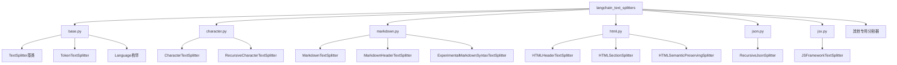
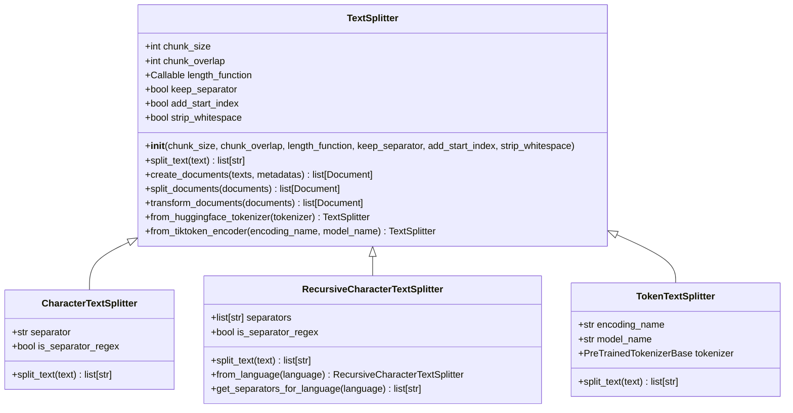
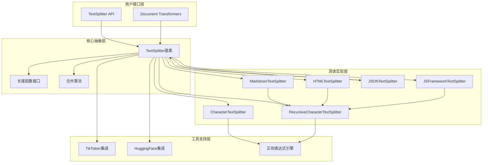
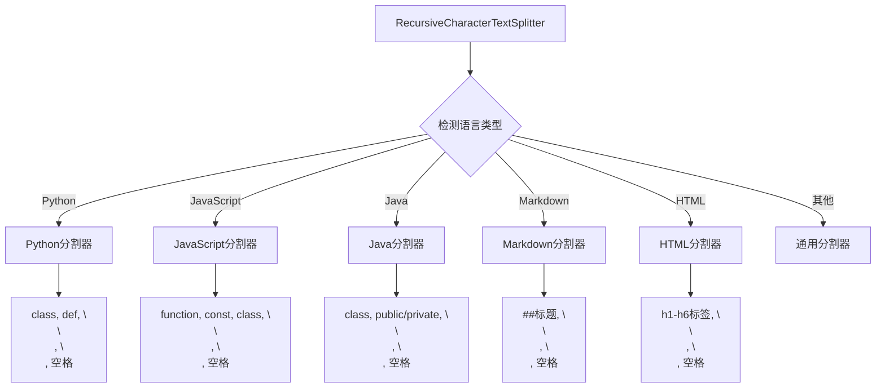
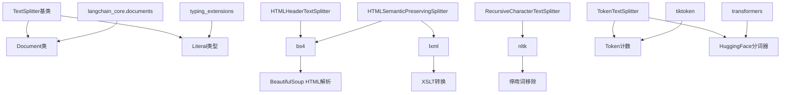

# 文本处理

<cite>
**本文档中引用的文件**
- [base.py](file://libs/text-splitters/langchain_text_splitters/base.py)
- [character.py](file://libs/text-splitters/langchain_text_splitters/character.py)
- [markdown.py](file://libs/text-splitters/langchain_text_splitters/markdown.py)
- [html.py](file://libs/text-splitters/langchain_text_splitters/html.py)
- [json.py](file://libs/text-splitters/langchain_text_splitters/json.py)
- [jsx.py](file://libs/text-splitters/langchain_text_splitters/jsx.py)
- [__init__.py](file://libs/text-splitters/langchain_text_splitters/__init__.py)
- [test_text_splitters.py](file://libs/text-splitters/tests/unit_tests/test_text_splitters.py)
</cite>

## 目录
1. [简介](#简介)
2. [项目结构](#项目结构)
3. [核心组件](#核心组件)
4. [架构概览](#架构概览)
5. [详细组件分析](#详细组件分析)
6. [依赖关系分析](#依赖关系分析)
7. [性能考虑](#性能考虑)
8. [故障排除指南](#故障排除指南)
9. [结论](#结论)

## 简介

LangChain文本分割工具是一个专门设计用于将大型文档分解为较小、可管理块的强大库。在将文本输入到语言模型（LLM）之前，适当的文本分割是确保信息准确传递和检索的关键步骤。该库提供了多种专门化的文本分割器，每种都针对特定类型的文档格式进行了优化。

文本分割的主要目标包括：
- 将大文档分解为适合LLM处理的大小
- 保持语义完整性，避免破坏上下文
- 支持不同文档格式的特殊需求
- 提供灵活的配置选项以适应不同的用例

## 项目结构

LangChain文本分割工具采用模块化架构，每个分割器都有专门的实现：



**图表来源**
- [base.py](file://libs/text-splitters/langchain_text_splitters/base.py#L1-L50)
- [character.py](file://libs/text-splitters/langchain_text_splitters/character.py#L1-L30)
- [markdown.py](file://libs/text-splitters/langchain_text_splitters/markdown.py#L1-L30)

**章节来源**
- [__init__.py](file://libs/text-splitters/langchain_text_splitters/__init__.py#L42-L67)

## 核心组件

### TextSplitter基类

所有文本分割器的基础抽象类，定义了统一的接口和核心功能：



**图表来源**
- [base.py](file://libs/text-splitters/langchain_text_splitters/base.py#L35-L150)
- [character.py](file://libs/text-splitters/langchain_text_splitters/character.py#L10-L80)

**章节来源**
- [base.py](file://libs/text-splitters/langchain_text_splitters/base.py#L35-L150)

## 架构概览

文本分割器系统采用分层架构设计，从通用基础类到专门化分割器：



**图表来源**
- [base.py](file://libs/text-splitters/langchain_text_splitters/base.py#L35-L200)
- [character.py](file://libs/text-splitters/langchain_text_splitters/character.py#L10-L80)

## 详细组件分析

### CharacterTextSplitter

最基础的字符级文本分割器，按指定分隔符分割文本：

#### 工作原理
1. **分隔符处理**：支持普通字符串和正则表达式分隔符
2. **分离器保留**：可选择保留或丢弃分隔符
3. **递归合并**：使用合并算法确保块大小符合要求

#### 关键参数
- `separator`：分隔符字符串，默认为双换行符
- `is_separator_regex`：是否将分隔符视为正则表达式
- `chunk_size`：最大块大小
- `chunk_overlap`：块间重叠字符数

#### 使用场景
- 基本文本分割
- CSV文件处理
- 日志文件分割

**章节来源**
- [character.py](file://libs/text-splitters/langchain_text_splitters/character.py#L10-L50)

### RecursiveCharacterTextSplitter

智能递归文本分割器，尝试多种分隔符找到最佳分割点：

#### 分离器优先级
1. 双换行符 `\n\n`
2. 单换行符 `\n`
3. 空格 `" "`
4. 字符级别 `""`

#### 高级特性
- **语言特定分割**：针对不同编程语言优化
- **正则表达式支持**：支持复杂的分割模式
- **零宽断言保护**：避免在正则表达式的零宽断言中重新插入分隔符

#### 语言特定分割器



**图表来源**
- [character.py](file://libs/text-splitters/langchain_text_splitters/character.py#L150-L700)

**章节来源**
- [character.py](file://libs/text-splitters/langchain_text_splitters/character.py#L80-L200)

### MarkdownTextSplitter

专门用于Markdown文档的分割器，基于标题层次结构：

#### 标题分割策略
- **标准标题**：`#` 到 `######` 标题
- **水平线**：`***`, `---`, `___`
- **代码块**：``` 开始和结束标记
- **表格**：Markdown表格语法

#### 高级功能
- **头部元数据保留**：为每个段落保留标题层级信息
- **自定义标题模式**：支持自定义标题格式
- **内容聚合**：将相关标题下的内容合并

**章节来源**
- [markdown.py](file://libs/text-splitters/langchain_text_splitters/markdown.py#L10-L50)

### HTMLTextSplitter系列

提供多种HTML处理方式：

#### HTMLHeaderTextSplitter
- **标题分割**：基于HTML标题标签（h1-h6）
- **层次结构**：保留嵌套标题的层次关系
- **灵活输出**：可选择逐元素或聚合输出

#### HTMLSectionSplitter
- **标签分割**：基于指定HTML标签分割
- **XSLT转换**：使用XSLT进行内容转换
- **二次分割**：结合递归字符分割器

#### HTMLSemanticPreservingSplitter
- **语义保留**：保持HTML元素的语义完整性
- **媒体处理**：转换图片、视频、音频为Markdown格式
- **链接转换**：将HTML链接转换为Markdown格式

**章节来源**
- [html.py](file://libs/text-splitters/langchain_text_splitters/html.py#L50-L200)

### JSONTextSplitter

专门处理JSON数据的分割器：

#### 分割策略
- **层级保持**：保持JSON对象的嵌套结构
- **大小控制**：根据配置的最大和最小块大小分割
- **列表转换**：可选地将数组转换为字典以改善分割效果

#### 特殊功能
- **动态路径跟踪**：记录每个字段在JSON树中的位置
- **结构完整性**：确保分割后的JSON片段仍然是有效的JSON
- **文档创建**：直接生成Document对象

**章节来源**
- [json.py](file://libs/text-splitters/langchain_text_splitters/json.py#L15-L80)

### JSFrameworkTextSplitter

专门为JavaScript框架代码设计的分割器：

#### 框架特定功能
- **组件标签检测**：自动识别React/Vue/Svelte组件标签
- **语法元素**：JavaScript语法关键字作为分割点
- **框架集成**：结合框架特有的代码结构

#### 分割边界
- **组件标签**：`<Component>`
- **JavaScript语法**：`function`, `const`, `class`, `if`等
- **标准分隔符**：`\n\n`, `&&\n`, `||\n`

**章节来源**
- [jsx.py](file://libs/text-splitters/langchain_text_splitters/jsx.py#L10-L50)

## 依赖关系分析

文本分割器系统的依赖关系展现了清晰的分层架构：



**图表来源**
- [base.py](file://libs/text-splitters/langchain_text_splitters/base.py#L1-L30)
- [html.py](file://libs/text-splitters/langchain_text_splitters/html.py#L1-L30)

**章节来源**
- [base.py](file://libs/text-splitters/langchain_text_splitters/base.py#L1-L30)

## 性能考虑

### 块大小和重叠配置

选择合适的`chunk_size`和`chunk_overlap`参数对性能至关重要：

| 参数 | 影响因素 | 推荐值 | 性能影响 |
|------|----------|--------|----------|
| chunk_size | LLM上下文窗口限制 | 1000-4000字符 | 大块提高上下文连续性，小块减少计算开销 |
| chunk_overlap | 上下文连续性 | 10%-20%的chunk_size | 高重叠保证语义连续性，低重叠节省存储空间 |

### 分割器性能对比

```mermaid
graph LR
A[简单文本] --> B[CharacterTextSplitter<br/>O(n)]
C[结构化文档] --> D[RecursiveCharacterTextSplitter<br/>O(n*m)]
E[Markdown] --> F[MarkdownTextSplitter<br/>O(n*log n)]
G[HTML] --> H[HTMLSemanticPreservingSplitter<br/>O(n*m)]
I[JSON] --> J[JSONTextSplitter<br/>O(n)]
note1[注：n=文本长度，m=分割器数量]
```

### 内存使用优化

- **流式处理**：支持大文件的流式分割
- **延迟加载**：按需加载依赖库
- **缓存机制**：重复分割相同内容时的缓存策略

## 故障排除指南

### 常见问题及解决方案

#### 1. 块过大问题
**症状**：生成的块超过LLM的上下文限制
**解决方案**：
- 减少`chunk_size`参数
- 使用更严格的分割器（如Markdown或HTML分割器）
- 启用二次分割机制

#### 2. 上下文断裂
**症状**：相邻块之间缺乏语义连续性
**解决方案**：
- 增加`chunk_overlap`参数
- 使用语义感知的分割器
- 调整分割器的优先级顺序

#### 3. 性能问题
**症状**：分割过程耗时过长
**解决方案**：
- 选择专门的分割器而非通用分割器
- 优化分割器参数配置
- 使用异步处理机制

#### 4. 格式丢失
**症状**：分割后文档格式不正确
**解决方案**：
- 使用专门的格式分割器
- 启用格式保留选项
- 自定义分割逻辑

**章节来源**
- [test_text_splitters.py](file://libs/text-splitters/tests/unit_tests/test_text_splitters.py#L359-L405)

## 结论

LangChain文本分割工具提供了一个全面而灵活的解决方案，能够处理各种类型的文档格式。通过合理选择和配置分割器，可以显著提升检索增强生成（RAG）应用的性能和准确性。

### 最佳实践建议

1. **根据文档类型选择分割器**：Markdown文档使用MarkdownTextSplitter，HTML文档使用HTMLSemanticPreservingSplitter
2. **平衡块大小和重叠**：根据具体应用场景调整chunk_size和chunk_overlap
3. **考虑语义连续性**：在重要文档中适当增加重叠以保持上下文
4. **监控性能指标**：定期评估分割质量和处理效率

### 扩展开发

对于特殊需求，可以：
- 继承`TextSplitter`基类创建自定义分割器
- 实现专门的长度函数以适配特定的度量标准
- 开发领域特定的分割逻辑

通过深入理解和正确使用这些文本分割工具，开发者可以构建更加高效和准确的AI驱动应用程序。