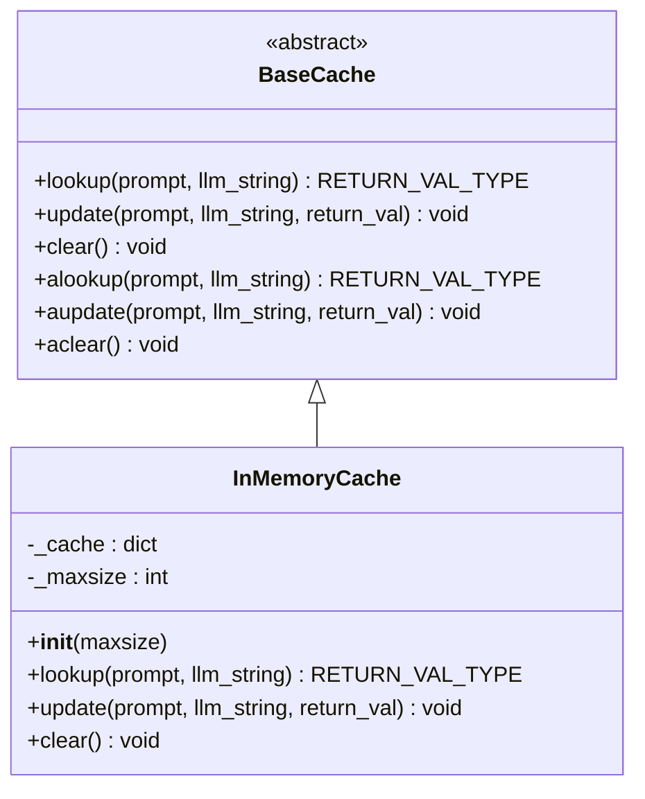
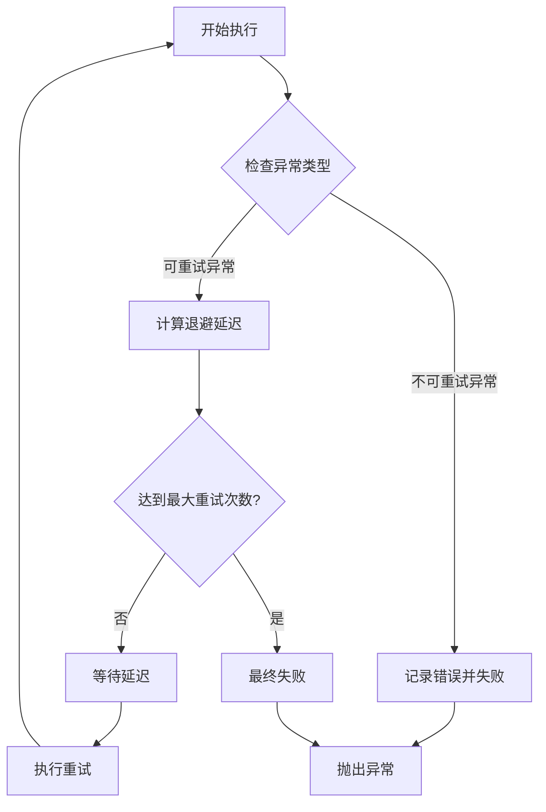
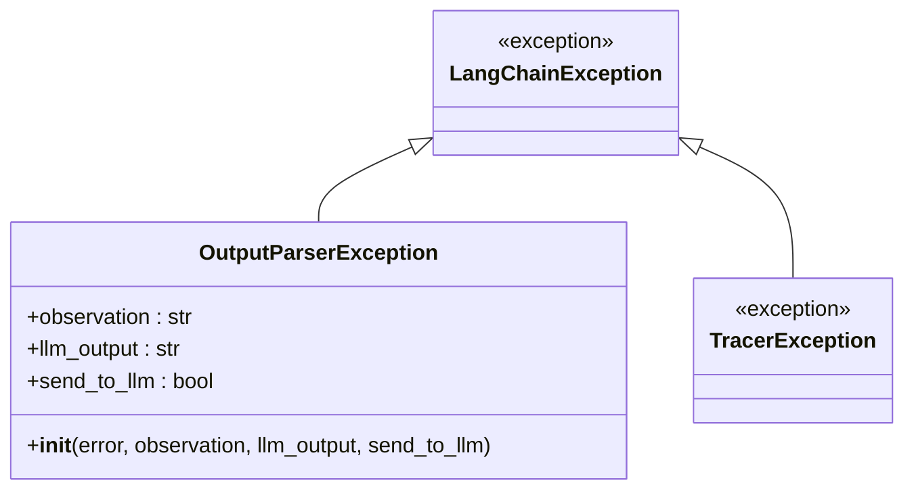
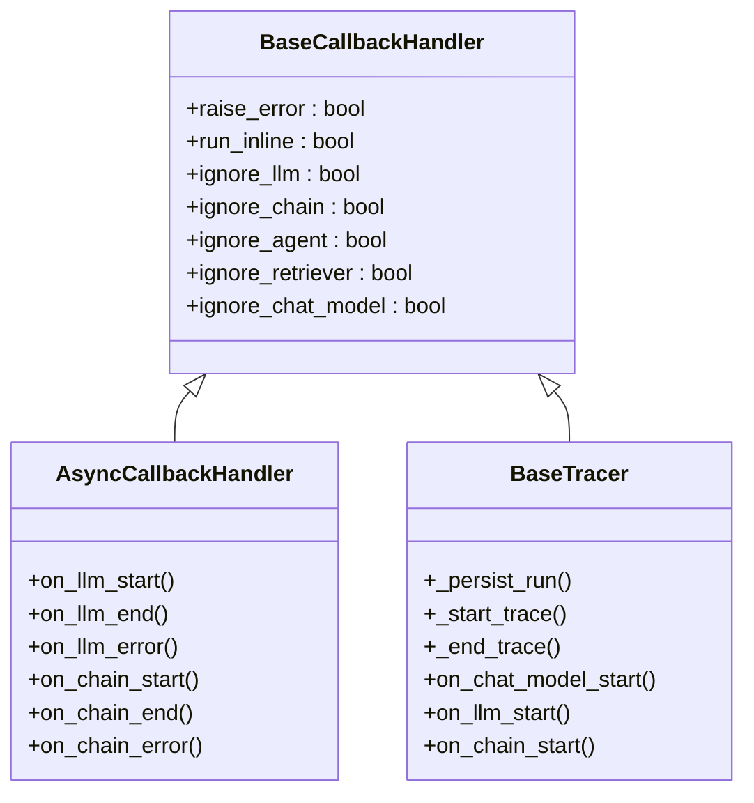
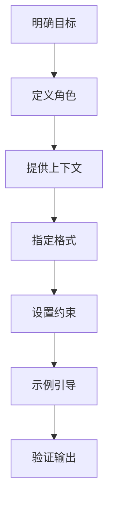
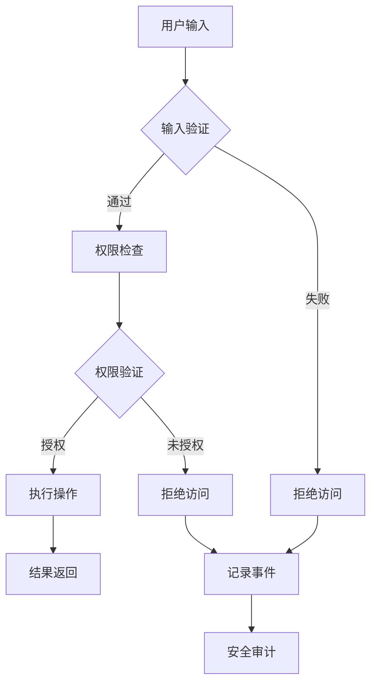
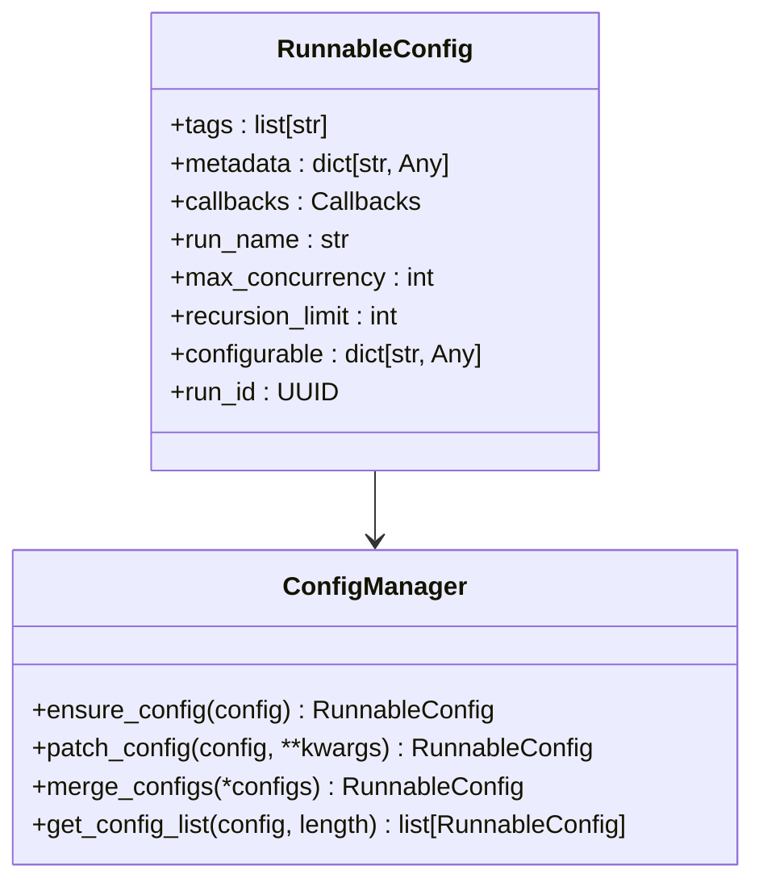
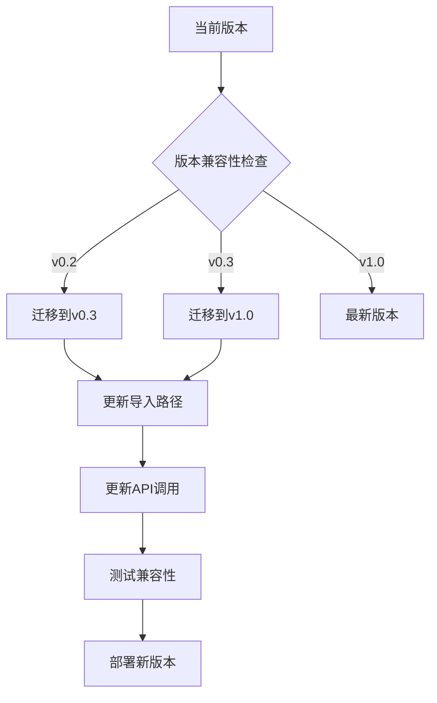

# LangChain应用开发最佳实践指南

<cite>
**本文档中引用的文件**
- [caches.py](file://libs/core/langchain_core/caches.py)
- [base.py](file://libs/core/langchain_core/callbacks/base.py)
- [base.py](file://libs/core/langchain_core/tracers/base.py)
- [env.py](file://libs/core/langchain_core/utils/env.py)
- [MIGRATE.md](file://MIGRATE.md)
- [retry.py](file://libs/core/langchain_core/runnables/retry.py)
- [base.py](file://libs/core/langchain_core/prompts/base.py)
- [exceptions.py](file://libs/core/langchain_core/exceptions.py)
- [SECURITY.md](file://SECURITY.md)
- [langchain.py](file://libs/core/langchain_core/tracers/langchain.py)
- [globals.py](file://libs/core/langchain_core/globals.py)
- [config.py](file://libs/core/langchain_core/runnables/config.py)
</cite>

## 目录
1. [简介](#简介)
2. [性能优化与缓存策略](#性能优化与缓存策略)
3. [错误处理与重试机制](#错误处理与重试机制)
4. [调试与监控](#调试与监控)
5. [提示工程最佳实践](#提示工程最佳实践)
6. [安全最佳实践](#安全最佳实践)
7. [配置管理](#配置管理)
8. [版本迁移指南](#版本迁移指南)
9. [总结](#总结)

## 简介

LangChain是一个强大的框架，用于构建基于大型语言模型的应用程序。本指南涵盖了开发LangChain应用时的关键最佳实践，包括性能优化、错误处理、安全性和配置管理等方面。

## 性能优化与缓存策略

### 缓存架构概述

LangChain提供了灵活的缓存系统来减少重复的LLM调用，从而提高应用程序性能。



**图表来源**
- [caches.py](file://libs/core/langchain_core/caches.py#L25-L229)

### 实现高效的缓存策略

#### 1. 使用内存缓存

```python
# 基本内存缓存配置
from langchain_core.caches import InMemoryCache
from langchain_core.globals import set_llm_cache

# 设置全局缓存
cache = InMemoryCache(maxsize=1000)
set_llm_cache(cache)
```

#### 2. 自定义缓存实现

```python
class RedisCache(BaseCache):
    def __init__(self, redis_client):
        self.redis = redis_client
    
    def lookup(self, prompt: str, llm_string: str) -> RETURN_VAL_TYPE | None:
        key = f"{prompt}:{llm_string}"
        cached_result = self.redis.get(key)
        if cached_result:
            return json.loads(cached_result)
        return None
    
    def update(self, prompt: str, llm_string: str, return_val: RETURN_VAL_TYPE) -> None:
        key = f"{prompt}:{llm_string}"
        self.redis.set(key, json.dumps(return_val))
    
    def clear(self, **kwargs: Any) -> None:
        self.redis.flushdb()
```

#### 3. 缓存键策略

确保缓存键的唯一性对于避免缓存冲突至关重要：

```python
def generate_cache_key(prompt: str, llm_config: dict) -> str:
    """生成唯一的缓存键"""
    config_hash = hashlib.md5(json.dumps(llm_config, sort_keys=True).encode()).hexdigest()
    return f"{hashlib.md5(prompt.encode()).hexdigest()}:{config_hash}"
```

**章节来源**
- [caches.py](file://libs/core/langchain_core/caches.py#L25-L229)
- [globals.py](file://libs/core/langchain_core/globals.py#L45-L73)

## 错误处理与重试机制

### 重试策略架构

LangChain提供了强大的重试机制来处理网络错误和其他临时性故障。



**图表来源**
- [retry.py](file://libs/core/langchain_core/runnables/retry.py#L1-L380)

### 实现健壮的重试策略

#### 1. 基本重试配置

```python
from langchain_core.runnables import RunnableRetry

# 创建重试配置
retry_config = RunnableRetry(
    retry_exception_types=(ConnectionError, TimeoutError),
    max_attempt_number=3,
    wait_exponential_jitter=True,
    exponential_jitter_params={
        "initial": 1.0,
        "max": 60.0,
        "exp_base": 2.0,
        "jitter": 0.1
    }
)
```

#### 2. 高级重试策略

```python
class CustomRetryLogic(RunnableRetry):
    def __init__(self, max_retries=3):
        super().__init__(
            retry_exception_types=(
                ConnectionError,
                TimeoutError,
                RateLimitError
            ),
            max_attempt_number=max_retries,
            wait_exponential_jitter=True
        )
    
    def _should_retry(self, exception: Exception) -> bool:
        """自定义重试逻辑"""
        if isinstance(exception, RateLimitError):
            # 检查是否为速率限制错误
            return exception.status_code == 429
        return isinstance(exception, (ConnectionError, TimeoutError))
```

#### 3. 工具级重试

```python
from langchain_v1.langchain.agents.middleware.tool_retry import ToolRetryMiddleware

# 为特定工具设置重试
retry_middleware = ToolRetryMiddleware(
    max_retries=5,
    tools=["database_query", "external_api_call"],
    retry_on=lambda exc: isinstance(exc, HTTPError) and 500 <= exc.status_code < 600,
    backoff_factor=2.0,
    initial_delay=1.0,
    max_delay=30.0
)
```

### 错误分类与处理



**图表来源**
- [exceptions.py](file://libs/core/langchain_core/exceptions.py#L1-L92)

**章节来源**
- [retry.py](file://libs/core/langchain_core/runnables/retry.py#L1-L380)
- [exceptions.py](file://libs/core/langchain_core/exceptions.py#L1-L92)

## 调试与监控

### 回调系统架构

LangChain的回调系统提供了全面的调试和监控能力。



**图表来源**
- [base.py](file://libs/core/langchain_core/callbacks/base.py#L1-L1104)
- [base.py](file://libs/core/langchain_core/tracers/base.py#L1-L916)

### 实现调试和监控

#### 1. 基础回调处理器

```python
from langchain_core.callbacks import BaseCallbackHandler
import logging

class DebugCallbackHandler(BaseCallbackHandler):
    def __init__(self, level=logging.INFO):
        self.logger = logging.getLogger(__name__)
        self.level = level
    
    def on_llm_start(self, serialized, prompts, **kwargs):
        self.logger.log(self.level, f"LLM开始: {serialized.get('name')}")
        self.logger.log(self.level, f"输入长度: {len(prompts[0])}")
    
    def on_llm_end(self, response, **kwargs):
        self.logger.log(self.level, f"LLM结束: {len(response.generations[0][0].text)}字符")
    
    def on_llm_error(self, error, **kwargs):
        self.logger.error(f"LLM错误: {error}")
```

#### 2. LangSmith集成

```python
from langchain_core.tracers.langchain import LangChainTracer
from langchain_core.globals import set_llm_cache

# 配置LangSmith追踪
tracer = LangChainTracer(
    project_name="my-langchain-project",
    example_id="example-123"
)

# 添加到回调管理器
callback_manager.add_handler(tracer)
```

#### 3. 自定义指标收集

```python
class MetricsCallbackHandler(BaseCallbackHandler):
    def __init__(self):
        self.metrics = {
            "llm_calls": 0,
            "chain_executions": 0,
            "errors": 0,
            "total_tokens": 0
        }
    
    def on_llm_start(self, serialized, prompts, **kwargs):
        self.metrics["llm_calls"] += 1
        self.metrics["total_tokens"] += sum(len(p.split()) for p in prompts)
    
    def on_chain_start(self, serialized, inputs, **kwargs):
        self.metrics["chain_executions"] += 1
    
    def on_llm_error(self, error, **kwargs):
        self.metrics["errors"] += 1
```

**章节来源**
- [base.py](file://libs/core/langchain_core/callbacks/base.py#L1-L1104)
- [langchain.py](file://libs/core/langchain_core/tracers/langchain.py#L1-L321)

## 提示工程最佳实践

### 提示模板设计原则



### 高质量提示设计

#### 1. 结构化提示模板

```python
from langchain_core.prompts import PromptTemplate

# 基本提示模板
template = PromptTemplate(
    input_variables=["topic", "tone"],
    template="""
你是一个专业的{tone}写作者。
请根据以下主题创作内容：
主题: {topic}

要求:
1. 使用简洁明了的语言
2. 包含至少3个要点
3. 字数控制在150字以内

输出格式:
- 简短引言
- 主要观点1
- 主要观点2
- 主要观点3
- 总结
""",
)

# 使用部分变量
partial_template = template.partial(
    tone="正式",
    format_instructions="请严格遵循上述格式要求"
)
```

#### 2. 多轮对话提示

```python
from langchain_core.prompts import ChatPromptTemplate

# 对话式提示模板
chat_template = ChatPromptTemplate.from_messages([
    ("system", "你是一个有用的助手，总是以JSON格式响应。"),
    ("human", "{question}"),
    ("ai", "这是我的JSON响应："),
    ("human", "请确认这个JSON是否正确。"),
])

# 动态上下文
def create_conversation_context(history, current_question):
    messages = []
    for turn in history[-5:]:  # 最近5轮对话
        messages.extend([
            ("human", turn["user"]),
            ("ai", turn["assistant"])
        ])
    messages.append(("human", current_question))
    return chat_template.format_messages(messages=messages)
```

#### 3. 输出解析器集成

```python
from langchain_core.output_parsers import JsonOutputParser

# JSON输出解析器
parser = JsonOutputParser()

prompt = PromptTemplate(
    template="""提供一个包含以下信息的JSON对象：
    {format_instructions}
    
    用户请求: {request}
    """,
    input_variables=["request"],
    output_parser=parser
)
```

**章节来源**
- [base.py](file://libs/core/langchain_core/prompts/base.py#L1-L462)

## 安全最佳实践

### 安全威胁模型



### API密钥安全管理

#### 1. 环境变量配置

```python
from langchain_core.utils.env import get_from_env, env_var_is_set

# 安全获取API密钥
def get_api_key(service_name: str) -> str:
    """安全获取API密钥"""
    try:
        return get_from_env(
            key=service_name.lower() + "_api_key",
            env_key=service_name.upper() + "_API_KEY",
            default=""
        )
    except ValueError:
        raise SecurityError(f"缺少必要的API密钥: {service_name}_API_KEY")

# 检查密钥是否存在
def validate_api_key_exists(service_name: str) -> bool:
    """验证API密钥是否已设置"""
    return env_var_is_set(service_name.upper() + "_API_KEY")
```

#### 2. 敏感数据保护

```python
from langchain_core.utils.utils import secret_from_env

# 安全的密钥获取
def get_secure_credentials():
    """获取安全的凭据"""
    return {
        "openai_api_key": secret_from_env("OPENAI_API_KEY"),
        "anthropic_api_key": secret_from_env("ANTHROPIC_API_KEY"),
        "database_password": secret_from_env("DATABASE_PASSWORD", default="")
    }
```

#### 3. 防止提示注入

```python
import re

def sanitize_input(user_input: str) -> str:
    """清理用户输入以防止提示注入"""
    # 移除潜在的恶意模式
    dangerous_patterns = [
        r'--.*$',           # SQL注释
        r'<script.*?>',     # HTML脚本
        r'\.\./',           # 目录遍历
        r'[\{\}\[\]\(\)]', # 特殊符号
    ]
    
    for pattern in dangerous_patterns:
        user_input = re.sub(pattern, '', user_input)
    
    return user_input

def validate_prompt(prompt: str) -> bool:
    """验证提示的安全性"""
    # 检查敏感信息泄露
    sensitive_keywords = ['password', 'api_key', 'secret']
    for keyword in sensitive_keywords:
        if keyword in prompt.lower():
            return False
    
    # 检查过长的输入
    if len(prompt) > 1000:
        return False
    
    return True
```

### 权限控制策略

#### 1. 最小权限原则

```python
class PermissionManager:
    def __init__(self):
        self.permissions = {
            "read": ["document.read", "summary.view"],
            "write": ["document.write", "annotation.create"],
            "admin": ["user.manage", "system.config"]
        }
    
    def check_permission(self, user_role: str, action: str) -> bool:
        """检查用户权限"""
        if user_role == "admin":
            return True
        
        required_permissions = self.action_permissions.get(action, [])
        user_permissions = set(self.permissions.get(user_role, []))
        
        return all(perm in user_permissions for perm in required_permissions)
```

#### 2. 访问控制列表

```python
class ACLManager:
    def __init__(self):
        self.acl_rules = {}
    
    def add_rule(self, resource: str, roles: list[str]):
        """添加访问控制规则"""
        self.acl_rules[resource] = set(roles)
    
    def can_access(self, resource: str, user_roles: list[str]) -> bool:
        """检查资源访问权限"""
        if resource not in self.acl_rules:
            return False
        
        user_roles_set = set(user_roles)
        required_roles = self.acl_rules[resource]
        
        return bool(user_roles_set & required_roles)
```

**章节来源**
- [SECURITY.md](file://SECURITY.md#L1-L30)
- [env.py](file://libs/core/langchain_core/utils/env.py#L1-L86)

## 配置管理

### 配置系统架构



**图表来源**
- [config.py](file://libs/core/langchain_core/runnables/config.py#L1-L609)

### 环境变量管理

#### 1. 统一配置接口

```python
from langchain_core.utils.env import get_from_dict_or_env

class ConfigurationManager:
    def __init__(self):
        self.config = {}
    
    def load_config(self, config_file: str = None):
        """加载配置文件"""
        if config_file:
            # 从文件加载配置
            with open(config_file, 'r') as f:
                self.config = json.load(f)
        else:
            # 使用默认配置
            self.config = self.get_default_config()
    
    def get_setting(self, key: str, default=None):
        """获取配置项"""
        return get_from_dict_or_env(
            self.config,
            key,
            key.upper(),
            default
        )
    
    def get_default_config(self):
        """获取默认配置"""
        return {
            "llm": {
                "model": "gpt-4",
                "temperature": 0.7,
                "max_tokens": 1000
            },
            "cache": {
                "enabled": True,
                "type": "memory",
                "max_size": 1000
            },
            "logging": {
                "level": "INFO",
                "format": "%(asctime)s - %(name)s - %(levelname)s - %(message)s"
            }
        }
```

#### 2. 运行时配置

```python
from langchain_core.runnables.config import ensure_config, patch_config

# 基本配置
basic_config = {
    "tags": ["production"],
    "metadata": {"version": "1.0.0"},
    "recursion_limit": 50
}

# 确保配置完整性
config = ensure_config(basic_config)

# 动态修改配置
updated_config = patch_config(
    config,
    max_concurrency=10,
    run_name="custom-chain"
)
```

#### 3. 上下文配置管理

```python
from langchain_core.runnables.config import set_config_context

# 在特定上下文中设置配置
with set_config_context({
    "tags": ["batch-processing"],
    "metadata": {"batch_size": 100},
    "callbacks": [BatchProcessingCallback()]
}):
    # 批量处理逻辑
    results = chain.batch(inputs)
```

### 配置验证

```python
from pydantic import BaseModel, validator
from typing import Optional

class LLMConfig(BaseModel):
    model: str = "gpt-4"
    temperature: float = 0.7
    max_tokens: int = 1000
    api_key: Optional[str] = None
    
    @validator('temperature')
    def temperature_range(cls, v):
        if not 0 <= v <= 1:
            raise ValueError('温度必须在0到1之间')
        return v
    
    @validator('max_tokens')
    def max_tokens_positive(cls, v):
        if v <= 0:
            raise ValueError('最大令牌数必须为正数')
        return v

class AppConfig(BaseModel):
    llm: LLMConfig = LLMConfig()
    cache: dict = {"enabled": True, "type": "memory"}
    logging: dict = {"level": "INFO"}
    
    class Config:
        extra = "forbid"  # 禁止未知字段
```

**章节来源**
- [config.py](file://libs/core/langchain_core/runnables/config.py#L1-L609)
- [env.py](file://libs/core/langchain_core/utils/env.py#L1-L86)

## 版本迁移指南

### 迁移策略概览

LangChain提供了详细的迁移指南来帮助开发者升级到新版本。



### 关键迁移步骤

#### 1. 导入路径更新

根据[MIGRATE.md](file://MIGRATE.md#L1-L10)，需要更新导入语句：

```python
# 旧版本
from langchain.llms import OpenAI
from langchain.chains import LLMChain

# 新版本
from langchain_openai import ChatOpenAI
from langchain.chains import create_extraction_chain
```

#### 2. API变更处理

```python
# 旧版本API
chain = LLMChain(llm=llm, prompt=prompt)

# 新版本API
chain = prompt | llm
```

#### 3. 配置迁移

```python
# 旧版本配置
from langchain import LLMChain, PromptTemplate

chain = LLMChain(
    llm=llm,
    prompt=template,
    verbose=True,
    callbacks=[DebugCallback()]
)

# 新版本配置
from langchain_core.runnables import RunnableConfig

config = RunnableConfig(
    tags=["production"],
    metadata={"version": "2.0"},
    callbacks=[DebugCallback()],
    verbose=True
)

result = chain.invoke(input_data, config=config)
```

### 兼容性检查清单

#### 1. 依赖包检查

```bash
# 检查当前版本
pip show langchain

# 更新到最新版本
pip install --upgrade langchain

# 检查兼容性
python -c "import langchain; print(langchain.__version__)"
```

#### 2. 测试迁移

```python
def test_migration():
    """测试迁移后的兼容性"""
    try:
        # 尝试新的API
        new_api = NewLangChainAPI()
        result = new_api.process(data)
        return True
    except ImportError:
        # 回退到旧版本
        old_api = OldLangChainAPI()
        result = old_api.process(data)
        return False
```

**章节来源**
- [MIGRATE.md](file://MIGRATE.md#L1-L10)

## 总结

本指南涵盖了LangChain应用开发的各个方面，包括：

### 核心最佳实践

1. **性能优化**：通过缓存系统减少LLM调用成本
2. **错误处理**：实现健壮的重试机制和异常处理
3. **监控调试**：使用回调系统和LangSmith进行实时监控
4. **提示工程**：设计清晰、无歧义的提示模板
5. **安全防护**：实施最小权限原则和输入验证
6. **配置管理**：使用环境变量和配置文件管理设置
7. **版本迁移**：遵循官方迁移指南保持代码兼容性

### 实施建议

- **渐进式改进**：逐步应用这些最佳实践，避免一次性大规模重构
- **持续监控**：建立完善的监控体系，及时发现和解决问题
- **团队培训**：确保团队成员了解并遵循这些最佳实践
- **文档维护**：定期更新项目文档，反映最新的最佳实践

通过遵循这些最佳实践，您可以构建更可靠、更高效、更安全的LangChain应用程序。