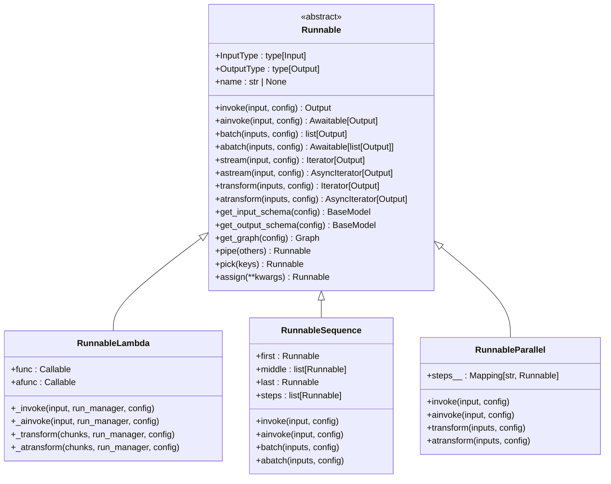
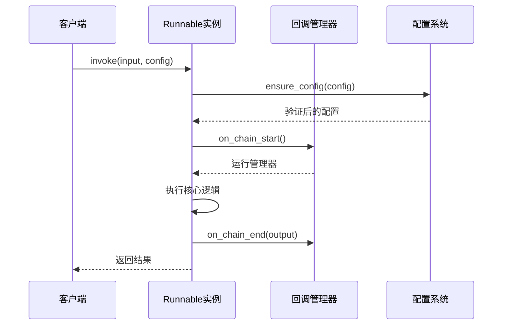
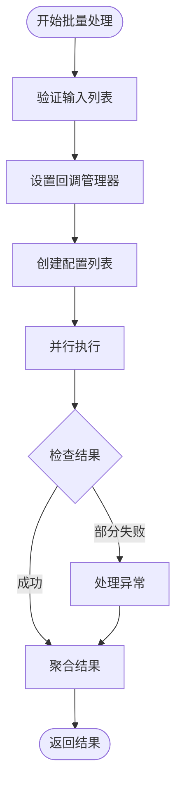
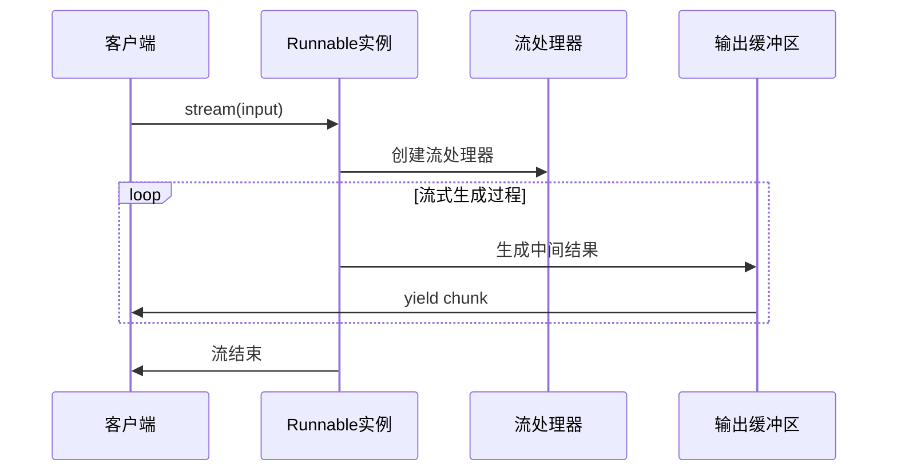
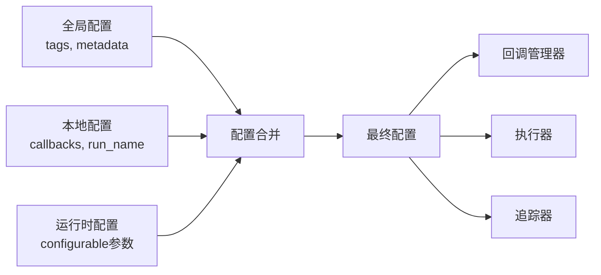
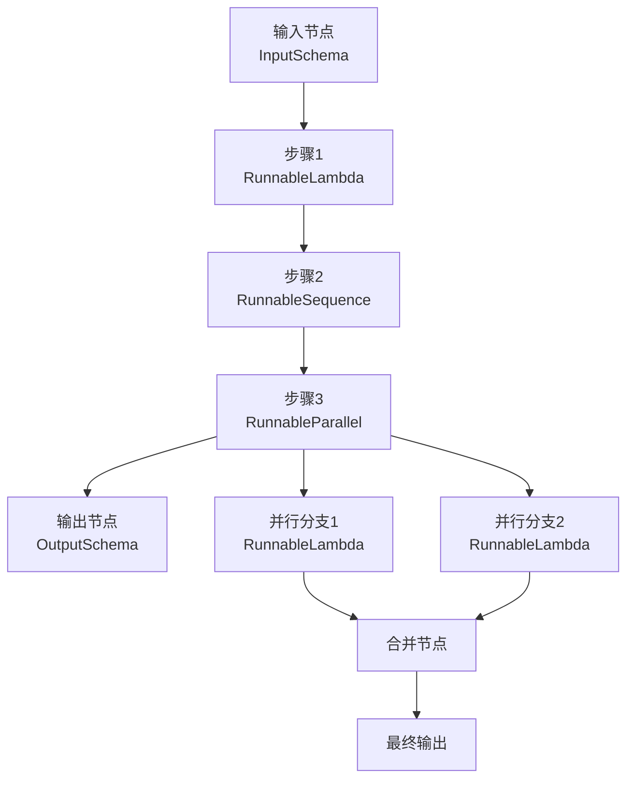
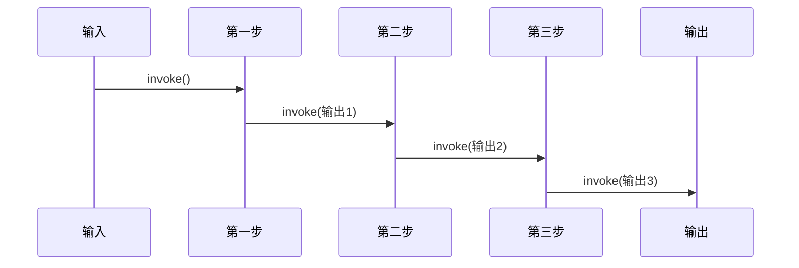
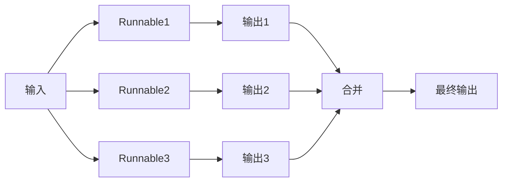
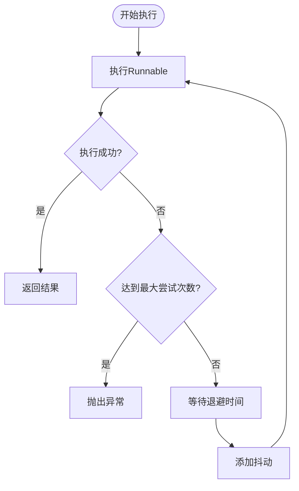
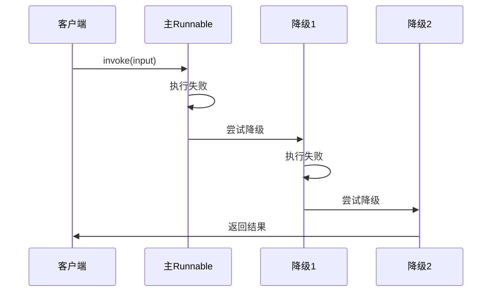

# 可运行组件 (Runnables)

<cite>
**本文档中引用的文件**
- [base.py](file://libs/core/langchain_core/runnables/base.py)
- [config.py](file://libs/core/langchain_core/runnables/config.py)
- [__init__.py](file://libs/core/langchain_core/runnables/__init__.py)
- [graph.py](file://libs/core/langchain_core/runnables/graph.py)
- [schema.py](file://libs/core/langchain_core/runnables/schema.py)
- [utils.py](file://libs/core/langchain_core/runnables/utils.py)
- [retry.py](file://libs/core/langchain_core/runnables/retry.py)
- [fallbacks.py](file://libs/core/langchain_core/runnables/fallbacks.py)
</cite>

## 目录
1. [简介](#简介)
2. [Runnable接口设计原理](#runnable接口设计原理)
3. [五大核心方法详解](#五大核心方法详解)
4. [RunnableConfig配置系统](#runnableconfig配置系统)
5. [RunnableGraph可视化](#runnablegraph可视化)
6. [工作流组合模式](#工作流组合模式)
7. [错误处理与重试机制](#错误处理与重试机制)
8. [高级特性](#高级特性)
9. [最佳实践](#最佳实践)
10. [总结](#总结)

## 简介

Runnable是LangChain的核心抽象，代表一个可以被调用、批处理、流式传输、转换和组合的单元。它为构建生产级AI应用程序提供了统一的接口，支持同步、异步、批处理和流式操作，使开发者能够轻松创建可扩展的AI工作流。

Runnable的设计哲学是提供一个通用的接口，让不同的AI组件（如语言模型、提示模板、输出解析器等）能够无缝协作，同时保持代码的简洁性和可维护性。

## Runnable接口设计原理

### 核心抽象

Runnable是一个泛型抽象基类，定义了所有可执行组件的基础契约：



**图表来源**
- [base.py](file://libs/core/langchain_core/runnables/base.py#L80-L200)
- [base.py](file://libs/core/langchain_core/runnables/base.py#L4324-L5062)
- [base.py](file://libs/core/langchain_core/runnables/base.py#L2752-L3494)
- [base.py](file://libs/core/langchain_core/runnables/base.py#L3497-L4015)

### 设计原则

1. **统一接口**: 所有Runnable都遵循相同的接口规范
2. **链式调用**: 支持通过管道操作符(`|`)进行链式组合
3. **类型安全**: 使用泛型确保输入输出类型的正确性
4. **异步优先**: 内置对异步操作的支持
5. **可组合性**: 支持多种组合模式（序列、并行、分支等）

**章节来源**
- [base.py](file://libs/core/langchain_core/runnables/base.py#L80-L200)

## 五大核心方法详解

### invoke 和 ainvoke 方法

这两个方法用于同步和异步地将单个输入转换为输出。

#### invoke方法特点：
- **同步执行**: 在当前线程中阻塞直到完成
- **简单直接**: 最常用的调用方式
- **错误处理**: 直接抛出异常或返回结果

#### ainvoke方法特点：
- **异步执行**: 不阻塞当前线程
- **并发友好**: 适合高并发场景
- **资源高效**: 利用异步I/O提高性能



**图表来源**
- [base.py](file://libs/core/langchain_core/runnables/base.py#L3100-L3150)
- [base.py](file://libs/core/langchain_core/runnables/base.py#L3152-L3200)

### batch 和 abatch 方法

这两个方法用于高效地处理多个输入，支持批量优化。

#### batch方法特点：
- **并行处理**: 默认使用线程池并行执行
- **性能优化**: 比逐个调用invoke更高效
- **错误隔离**: 支持部分失败时返回异常

#### abatch方法特点：
- **异步批量**: 完全异步的批量处理
- **并发控制**: 可以限制并发数量
- **流式响应**: 可以逐步返回结果



**图表来源**
- [base.py](file://libs/core/langchain_core/runnables/base.py#L3202-L3350)
- [base.py](file://libs/core/langchain_core/runnables/base.py#L3352-L3500)

### stream 和 astream 方法

这两个方法支持流式输出，允许在生成过程中实时接收中间结果。

#### stream方法特点：
- **同步流式**: 逐个产生输出
- **内存友好**: 不需要等待完整输出
- **实时反馈**: 用户可以立即看到部分结果

#### astream方法特点：
- **异步流式**: 完全异步的流式处理
- **非阻塞**: 不影响其他操作
- **高吞吐**: 适合高负载场景



**图表来源**
- [base.py](file://libs/core/langchain_core/runnables/base.py#L1100-L1150)
- [base.py](file://libs/core/langchain_core/runnables/base.py#L1152-L1200)

### transform 和 atransform 方法

这些方法专门用于处理输入流到输出流的转换，支持真正的流式处理。

#### transform方法特点：
- **流式转换**: 处理输入流并产生输出流
- **低延迟**: 可以在输入完全到达前就开始处理
- **内存效率**: 不需要缓存整个输入

#### atransform方法特点：
- **异步流式**: 完全异步的流式转换
- **并发处理**: 可以同时处理多个输入块
- **动态调整**: 根据输入速度动态调整处理速率

**章节来源**
- [base.py](file://libs/core/langchain_core/runnables/base.py#L1485-L1581)
- [base.py](file://libs/core/langchain_core/runnables/base.py#L1583-L1680)

## RunnableConfig配置系统

### 配置结构

RunnableConfig是一个TypedDict，包含了运行时的所有配置信息：

| 配置项 | 类型 | 描述 | 默认值 |
|--------|------|------|--------|
| `tags` | `list[str]` | 调用标签，用于过滤和追踪 | `[]` |
| `metadata` | `dict[str, Any]` | 元数据信息，JSON可序列化 | `{}` |
| `callbacks` | `Callbacks` | 回调处理器列表 | `None` |
| `run_name` | `str` | 运行名称，用于追踪 | 类名 |
| `max_concurrency` | `int \| None` | 最大并发数 | `None` |
| `recursion_limit` | `int` | 递归限制 | `25` |
| `configurable` | `dict[str, Any]` | 可配置参数 | `{}` |
| `run_id` | `uuid.UUID \| None` | 运行唯一标识符 | 自动生成 |

### 配置传递机制



**图表来源**
- [config.py](file://libs/core/langchain_core/runnables/config.py#L40-L80)

### 回调系统

回调系统提供了丰富的事件钩子，支持：
- **生命周期事件**: 开始、结束、错误
- **中间结果**: 流式输出、事件流
- **性能监控**: 延迟、吞吐量、错误率

**章节来源**
- [config.py](file://libs/core/langchain_core/runnables/config.py#L40-L150)

## RunnableGraph可视化

### 图形表示

RunnableGraph提供了可视化的执行流程表示，帮助开发者理解和调试复杂的链式结构。



**图表来源**
- [graph.py](file://libs/core/langchain_core/runnables/graph.py#L400-L500)

### 可视化工具

1. **ASCII艺术**: 简单文本格式的图形表示
2. **Mermaid语法**: 支持图表渲染的Markdown格式
3. **PNG图像**: 导出为可分享的图片格式
4. **交互式图表**: 支持点击和缩放的Web版本

### 调试应用

- **执行路径追踪**: 查看实际执行的路径
- **性能分析**: 识别瓶颈节点
- **错误定位**: 快速找到失败点
- **依赖关系**: 明确组件间的依赖

**章节来源**
- [graph.py](file://libs/core/langchain_core/runnables/graph.py#L600-L736)

## 工作流组合模式

### RunnableSequence - 序列组合

RunnableSequence是最重要的组合操作符，将多个Runnable按顺序连接：



**图表来源**
- [base.py](file://libs/core/langchain_core/runnables/base.py#L2752-L2859)

### RunnableParallel - 并行组合

RunnableParallel支持同时运行多个Runnable，适用于需要并行处理的场景：



**图表来源**
- [base.py](file://libs/core/langchain_core/runnables/base.py#L3497-L3599)

### 组合模式的应用

1. **数据预处理**: 并行提取不同特征
2. **多模型推理**: 同时使用多个模型
3. **结果融合**: 结合多个输出的结果
4. **条件路由**: 根据输入选择不同的处理路径

**章节来源**
- [base.py](file://libs/core/langchain_core/runnables/base.py#L2752-L3494)

## 错误处理与重试机制

### 重试策略

RunnableRetry提供了强大的重试功能，支持指数退避和抖动：



**图表来源**
- [retry.py](file://libs/core/langchain_core/runnables/retry.py#L150-L200)

### 降级策略

RunnableWithFallbacks提供了优雅的降级机制：



**图表来源**
- [fallbacks.py](file://libs/core/langchain_core/runnables/fallbacks.py#L150-L200)

### 错误处理最佳实践

1. **分层处理**: 不同级别的错误采用不同的处理策略
2. **日志记录**: 记录详细的错误信息用于调试
3. **用户友好的错误**: 向用户提供有意义的错误消息
4. **监控告警**: 设置适当的监控和告警机制

**章节来源**
- [retry.py](file://libs/core/langchain_core/runnables/retry.py#L50-L150)
- [fallbacks.py](file://libs/core/langchain_core/runnables/fallbacks.py#L50-L150)

## 高级特性

### 超时控制

通过配置`max_concurrency`和`recursion_limit`实现超时控制：

```python
# 示例：设置最大并发数为5
config = RunnableConfig(max_concurrency=5)

# 示例：设置递归深度限制
config = RunnableConfig(recursion_limit=10)
```

### 中断信号

支持优雅的中断机制，允许外部停止长时间运行的操作：

```python
# 示例：设置中断信号
import signal

def interrupt_handler(signum, frame):
    raise KeyboardInterrupt("Operation interrupted")

signal.signal(signal.SIGINT, interrupt_handler)
```

### 性能优化

1. **并发控制**: 通过`max_concurrency`限制并发度
2. **连接池**: 复用网络连接减少开销
3. **缓存机制**: 缓存昂贵的计算结果
4. **批处理优化**: 自动优化批处理大小

### 监控和追踪

内置的监控系统提供：
- **执行时间统计**
- **错误率监控**
- **资源使用情况**
- **链路追踪**

**章节来源**
- [config.py](file://libs/core/langchain_core/runnables/config.py#L200-L300)

## 最佳实践

### 代码组织

1. **单一职责**: 每个Runnable专注于特定任务
2. **组合优于继承**: 使用组合模式构建复杂逻辑
3. **配置驱动**: 将可变参数通过配置传递
4. **错误处理**: 为每个Runnable提供适当的错误处理

### 性能考虑

1. **异步优先**: 在IO密集型操作中优先使用异步方法
2. **批处理优化**: 对于大量数据使用batch方法
3. **并发控制**: 合理设置并发限制避免资源耗尽
4. **内存管理**: 注意流式处理中的内存使用

### 调试技巧

1. **启用调试模式**: 设置全局调试标志
2. **使用可视化工具**: 利用Graph可视化理解执行流程
3. **添加日志**: 在关键节点添加详细的日志记录
4. **单元测试**: 为每个Runnable编写充分的测试

### 生产部署

1. **监控告警**: 设置完善的监控体系
2. **健康检查**: 实现定期的健康状态检查
3. **容量规划**: 根据预期负载规划资源
4. **故障恢复**: 准备完善的故障恢复预案

## 总结

Runnable作为LangChain的核心抽象，提供了强大而灵活的可执行组件框架。通过统一的接口设计、丰富的组合模式、完善的配置系统和强大的错误处理机制，它使得构建复杂的AI应用程序变得简单而可靠。

掌握Runnable的设计原理和使用方法，对于开发高质量的AI应用至关重要。无论是简单的数据处理还是复杂的多步骤AI工作流，Runnable都能提供合适的解决方案，帮助开发者构建可扩展、可维护的AI系统。

随着AI技术的不断发展，Runnable的设计理念将继续演进，为开发者提供更加强大和易用的工具来构建下一代AI应用程序。