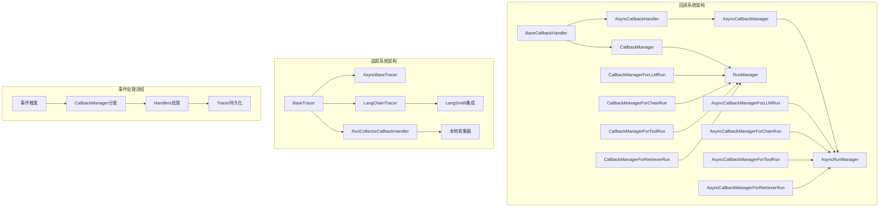
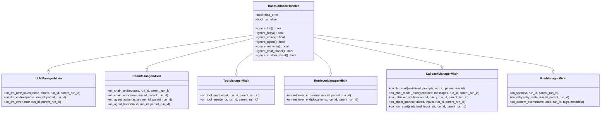
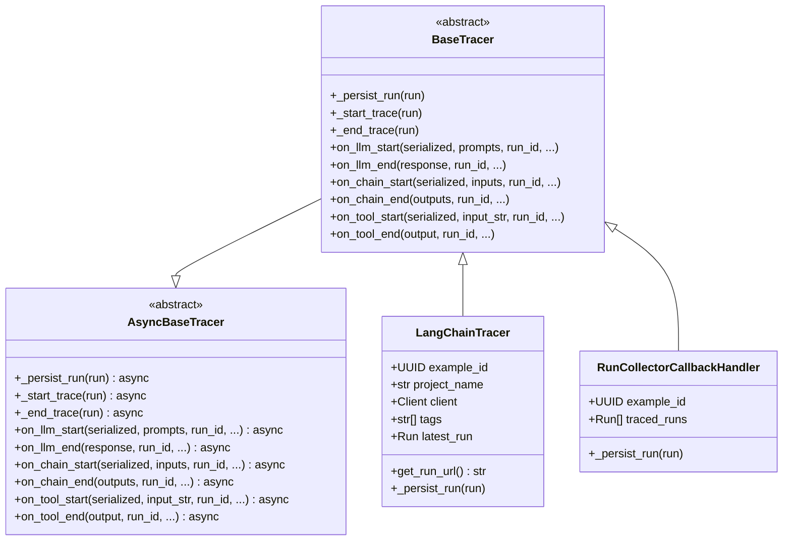
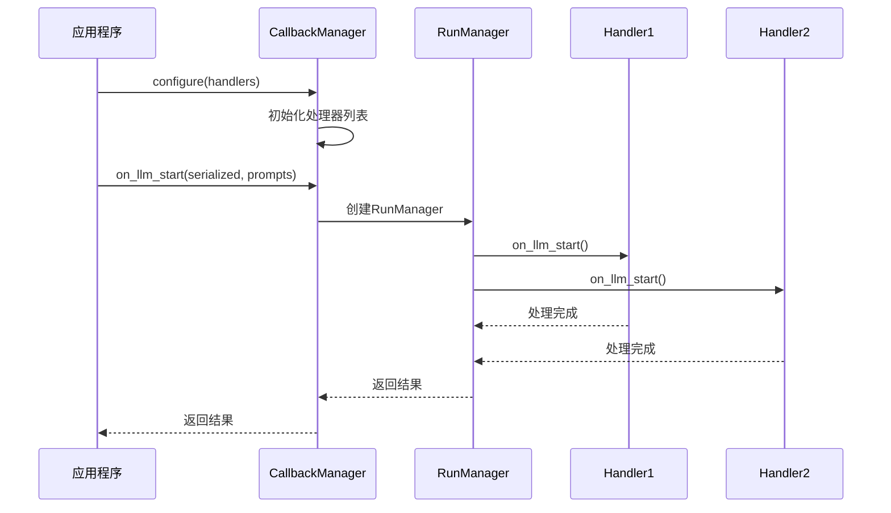
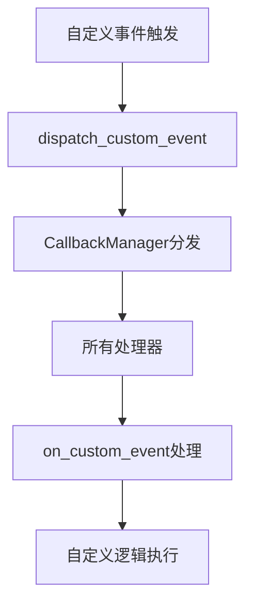
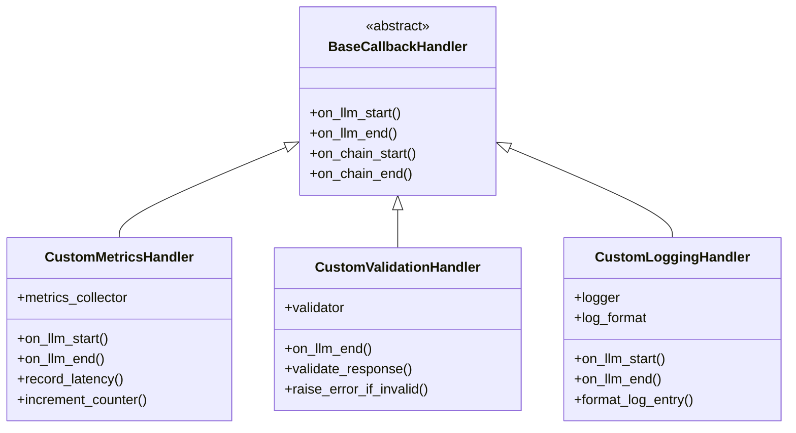
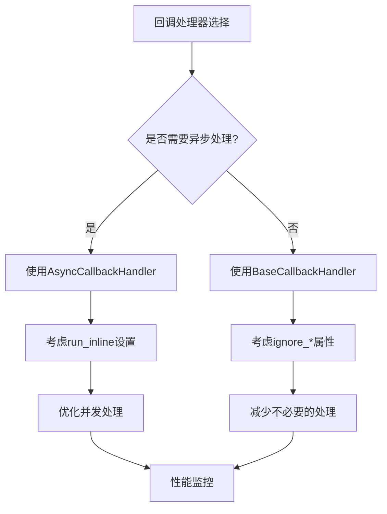

# 回调与追踪 (Callbacks & Tracers)

<cite>
**本文档中引用的文件**
- [libs/core/langchain_core/callbacks/__init__.py](file://libs/core/langchain_core/callbacks/__init__.py)
- [libs/core/langchain_core/callbacks/base.py](file://libs/core/langchain_core/callbacks/base.py)
- [libs/core/langchain_core/callbacks/manager.py](file://libs/core/langchain_core/callbacks/manager.py)
- [libs/core/langchain_core/callbacks/file.py](file://libs/core/langchain_core/callbacks/file.py)
- [libs/core/langchain_core/callbacks/stdout.py](file://libs/core/langchain_core/callbacks/stdout.py)
- [libs/core/langchain_core/callbacks/streaming_stdout.py](file://libs/core/langchain_core/callbacks/streaming_stdout.py)
- [libs/core/langchain_core/tracers/__init__.py](file://libs/core/langchain_core/tracers/__init__.py)
- [libs/core/langchain_core/tracers/base.py](file://libs/core/langchain_core/tracers/base.py)
- [libs/core/langchain_core/tracers/schemas.py](file://libs/core/langchain_core/tracers/schemas.py)
- [libs/core/langchain_core/tracers/context.py](file://libs/core/langchain_core/tracers/context.py)
- [libs/core/langchain_core/tracers/langchain.py](file://libs/core/langchain_core/tracers/langchain.py)
- [libs/core/langchain_core/tracers/run_collector.py](file://libs/core/langchain_core/tracers/run_collector.py)
- [libs/core/langchain_core/tracers/log_stream.py](file://libs/core/langchain_core/tracers/log_stream.py)
</cite>

## 目录
1. [简介](#简介)
2. [系统架构概览](#系统架构概览)
3. [Callbacks系统详解](#callbacks系统详解)
4. [Tracers系统详解](#tracers系统详解)
5. [CallbackManager工作机制](#callbackmanager工作机制)
6. [回调事件类型与生命周期](#回调事件类型与生命周期)
7. [自定义回调处理器开发](#自定义回调处理器开发)
8. [配置与使用示例](#配置与使用示例)
9. [高级应用场景](#高级应用场景)
10. [性能优化与最佳实践](#性能优化与最佳实践)

## 简介

LangChain的回调与追踪系统是一个强大的观察者模式实现，用于监控LLM应用程序的整个执行生命周期。该系统提供了丰富的事件钩子，支持调试、性能分析、日志记录、流式输出等多种功能。

### 核心特性

- **观察者模式实现**：基于事件驱动的架构，支持多种回调处理器
- **完整的生命周期监控**：从LLM启动到链结束的全过程跟踪
- **异步支持**：同时支持同步和异步回调处理
- **可扩展性**：易于自定义和扩展的回调处理器
- **多平台集成**：支持LangSmith、文件输出、标准输出等多种目标

## 系统架构概览



**图表来源**
- [libs/core/langchain_core/callbacks/base.py](file://libs/core/langchain_core/callbacks/base.py#L1-L100)
- [libs/core/langchain_core/callbacks/manager.py](file://libs/core/langchain_core/callbacks/manager.py#L1-L100)
- [libs/core/langchain_core/tracers/base.py](file://libs/core/langchain_core/tracers/base.py#L1-L100)

## Callbacks系统详解

### BaseCallbackHandler基础类

BaseCallbackHandler是所有回调处理器的基础抽象类，实现了观察者模式的核心接口。



**图表来源**
- [libs/core/langchain_core/callbacks/base.py](file://libs/core/langchain_core/callbacks/base.py#L150-L300)

### AsyncCallbackHandler异步回调

AsyncCallbackHandler提供了异步版本的回调处理能力，适用于需要高性能处理的场景。

**章节来源**
- [libs/core/langchain_core/callbacks/base.py](file://libs/core/langchain_core/callbacks/base.py#L400-L700)

## Tracers系统详解

### BaseTracer基础追踪器

BaseTracer继承自BaseCallbackHandler，专门用于将运行数据持久化到外部系统。



**图表来源**
- [libs/core/langchain_core/tracers/base.py](file://libs/core/langchain_core/tracers/base.py#L20-L200)
- [libs/core/langchain_core/tracers/langchain.py](file://libs/core/langchain_core/tracers/langchain.py#L50-L150)

### LangChainTracer集成

LangChainTracer是与LangSmith集成的主要实现，负责将运行数据发送到LangSmith平台。

**章节来源**
- [libs/core/langchain_core/tracers/langchain.py](file://libs/core/langchain_core/tracers/langchain.py#L1-L200)

### RunCollectorCallbackHandler本地收集

RunCollectorCallbackHandler用于本地收集所有运行数据，便于离线分析和测试。

**章节来源**
- [libs/core/langchain_core/tracers/run_collector.py](file://libs/core/langchain_core/tracers/run_collector.py#L1-L41)

## CallbackManager工作机制

### 同步CallbackManager

CallbackManager是同步回调处理的核心组件，负责管理回调处理器的注册和事件分发。



**图表来源**
- [libs/core/langchain_core/callbacks/manager.py](file://libs/core/langchain_core/callbacks/manager.py#L200-L400)

### 异步CallbackManager

AsyncCallbackManager提供异步处理能力，支持并发事件处理。

**章节来源**
- [libs/core/langchain_core/callbacks/manager.py](file://libs/core/langchain_core/callbacks/manager.py#L400-L600)

### RunManager层级结构

RunManager形成了一个层次化的管理结构，支持父子关系的事件传播。

```mermaid
graph TD
A[ParentRunManager] --> B[ChildRunManager1]
A --> C[ChildRunManager2]
B --> D[GrandChildRunManager1]
B --> E[GrandChildRunManager2]
C --> F[GrandChildRunManager3]
A -.->|get_child()| G[CallbackManager]
B -.->|get_child()| H[CallbackManager]
C -.->|get_child()| I[CallbackManager]
```

**图表来源**
- [libs/core/langchain_core/callbacks/manager.py](file://libs/core/langchain_core/callbacks/manager.py#L600-L800)

## 回调事件类型与生命周期

### LLM相关事件

| 事件名称 | 触发时机 | 参数 | 用途 |
|---------|---------|------|------|
| `on_llm_start` | LLM开始执行时 | serialized, prompts, run_id | 记录模型启动信息 |
| `on_chat_model_start` | 聊天模型开始执行时 | serialized, messages, run_id | 特定于聊天模型的启动 |
| `on_llm_new_token` | 生成新token时 | token, chunk, run_id | 流式输出处理 |
| `on_llm_end` | LLM执行结束时 | response, run_id | 记录最终结果 |
| `on_llm_error` | LLM执行出错时 | error, run_id | 错误处理和日志 |

### 链相关事件

| 事件名称 | 触发时机 | 参数 | 用途 |
|---------|---------|------|------|
| `on_chain_start` | 链开始执行时 | serialized, inputs, run_id | 记录链启动信息 |
| `on_chain_end` | 链执行结束时 | outputs, run_id | 记录链最终输出 |
| `on_chain_error` | 链执行出错时 | error, run_id | 链级错误处理 |

### 工具相关事件

| 事件名称 | 触发时机 | 参数 | 用途 |
|---------|---------|------|------|
| `on_tool_start` | 工具开始执行时 | serialized, input_str, run_id | 记录工具启动 |
| `on_tool_end` | 工具执行结束时 | output, run_id | 记录工具输出 |
| `on_tool_error` | 工具执行出错时 | error, run_id | 工具级错误处理 |

### 检索器相关事件

| 事件名称 | 触发时机 | 参数 | 用途 |
|---------|---------|------|------|
| `on_retriever_start` | 检索器开始执行时 | serialized, query, run_id | 记录检索启动 |
| `on_retriever_end` | 检索器执行结束时 | documents, run_id | 记录检索结果 |
| `on_retriever_error` | 检索器执行出错时 | error, run_id | 检索器错误处理 |

### 自定义事件

开发者可以通过`on_custom_event`方法处理自定义事件：



**图表来源**
- [libs/core/langchain_core/callbacks/manager.py](file://libs/core/langchain_core/callbacks/manager.py#L2460-L2501)

**章节来源**
- [libs/core/langchain_core/callbacks/base.py](file://libs/core/langchain_core/callbacks/base.py#L150-L400)

## 自定义回调处理器开发

### 基础自定义处理器

开发者可以继承BaseCallbackHandler或AsyncCallbackHandler来创建自定义处理器：

```python
# 示例：自定义日志处理器
class CustomLoggerHandler(BaseCallbackHandler):
    def __init__(self, log_level: str = "INFO"):
        self.log_level = log_level
    
    def on_llm_start(self, serialized, prompts, **kwargs):
        print(f"[LLM START] Model: {serialized.get('name')}")
    
    def on_llm_end(self, response, **kwargs):
        print(f"[LLM END] Tokens: {len(response.generations[0].text)}")
```

### 异步自定义处理器

对于需要异步处理的场景，可以使用AsyncCallbackHandler：

```python
# 示例：异步数据库存储处理器
class AsyncDBHandler(AsyncCallbackHandler):
    def __init__(self, db_connection):
        self.db = db_connection
    
    async def on_llm_end(self, response, **kwargs):
        await self.db.store_run_data({
            "run_id": kwargs["run_id"],
            "model": kwargs.get("serialized", {}).get("name"),
            "tokens": len(response.generations[0].text)
        })
```

### 高级自定义处理器模式



**章节来源**
- [libs/core/langchain_core/callbacks/base.py](file://libs/core/langchain_core/callbacks/base.py#L300-L500)

## 配置与使用示例

### 基础配置

```python
from langchain_core.callbacks import StdOutCallbackHandler, FileCallbackHandler
from langchain_core.callbacks.manager import CallbackManager

# 创建回调管理器
callback_manager = CallbackManager([
    StdOutCallbackHandler(),      # 输出到控制台
    FileCallbackHandler("logs.txt")  # 写入文件
])

# 使用回调管理器
llm.invoke("Hello", config={"callbacks": callback_manager})
```

### 异步配置

```python
from langchain_core.callbacks.manager import AsyncCallbackManager

# 异步回调管理器
async_callback_manager = AsyncCallbackManager([
    AsyncLoggingHandler(),
    AsyncMetricsHandler()
])

# 异步使用
await llm.ainvoke("Hello", config={"callbacks": async_callback_manager})
```

### 上下文组配置

```python
from langchain_core.callbacks.manager import trace_as_chain_group

# 将多个调用组合为单个运行
with trace_as_chain_group("my_group", inputs={"query": "Hello"}) as manager:
    result1 = llm.invoke("First call", config={"callbacks": manager})
    result2 = llm.invoke("Second call", config={"callbacks": manager})
    manager.on_chain_end({"final_result": result1 + result2})
```

### 流式输出配置

```python
from langchain_core.callbacks import StreamingStdOutCallbackHandler

# 流式输出处理器
streaming_handler = StreamingStdOutCallbackHandler()

# 启用流式输出
llm.invoke("Generate text", config={
    "callbacks": [streaming_handler],
    "streaming": True
})
```

**章节来源**
- [libs/core/langchain_core/callbacks/manager.py](file://libs/core/langchain_core/callbacks/manager.py#L76-L152)

## 高级应用场景

### 分布式追踪

```python
from langchain_core.tracers.context import tracing_v2_enabled

# 在分布式环境中启用追踪
with tracing_v2_enabled(project_name="distributed-app"):
    # 应用程序代码
    result = chain.invoke(input_data)
```

### 性能监控

```python
class PerformanceMonitorHandler(BaseCallbackHandler):
    def __init__(self):
        self.start_times = {}
        self.metrics = {}
    
    def on_llm_start(self, serialized, prompts, **kwargs):
        run_id = kwargs["run_id"]
        self.start_times[run_id] = time.time()
    
    def on_llm_end(self, response, **kwargs):
        run_id = kwargs["run_id"]
        duration = time.time() - self.start_times[run_id]
        
        # 记录指标
        self.metrics[run_id] = {
            "duration": duration,
            "tokens": len(response.generations[0].text),
            "timestamp": time.time()
        }
```

### 成本分析

```python
class CostAnalyzerHandler(BaseCallbackHandler):
    def __init__(self):
        self.costs = {}
    
    def on_llm_end(self, response, **kwargs):
        run_id = kwargs["run_id"]
        model_name = kwargs.get("serialized", {}).get("name", "")
        
        # 计算成本（示例）
        total_tokens = sum(len(gen.text) for gen in response.generations)
        cost = calculate_cost(model_name, total_tokens)
        
        self.costs[run_id] = {
            "model": model_name,
            "cost": cost,
            "tokens": total_tokens
        }
```

### 实时监控仪表板

```python
class DashboardHandler(BaseCallbackHandler):
    def __init__(self, websocket_server):
        self.websocket_server = websocket_server
    
    def on_llm_end(self, response, **kwargs):
        run_data = {
            "run_id": str(kwargs["run_id"]),
            "status": "completed",
            "duration": self.calculate_duration(kwargs["run_id"]),
            "output": response.generations[0].text
        }
        
        # 发送到实时仪表板
        self.websocket_server.broadcast(run_data)
```

### 数据验证与清洗

```python
class DataValidatorHandler(BaseCallbackHandler):
    def __init__(self, validator_rules):
        self.rules = validator_rules
    
    def on_llm_end(self, response, **kwargs):
        output = response.generations[0].text
        
        # 应用验证规则
        for rule in self.rules:
            if not rule.validate(output):
                raise ValidationError(f"Rule {rule.name} failed: {output}")
        
        # 清洗数据
        cleaned_output = self.clean_output(output)
        return cleaned_output
```

**章节来源**
- [libs/core/langchain_core/tracers/context.py](file://libs/core/langchain_core/tracers/context.py#L30-L80)

## 性能优化与最佳实践

### 回调处理器优化



### 最佳实践建议

1. **合理使用ignore属性**：
   ```python
   class OptimizedHandler(BaseCallbackHandler):
       @property
       def ignore_llm(self) -> bool:
           return True  # 如果不需要处理LLM事件
   ```

2. **异步处理优化**：
   ```python
   class AsyncOptimizedHandler(AsyncCallbackHandler):
       run_inline = False  # 允许并发处理
       
       async def on_llm_end(self, response, **kwargs):
           # 异步I/O操作
           await self.async_save_to_db(response)
   ```

3. **内存管理**：
   ```python
   class MemoryEfficientHandler(BaseCallbackHandler):
       def __init__(self):
           self.buffer = []
           self.max_buffer_size = 1000
       
       def on_llm_end(self, response, **kwargs):
           self.buffer.append(response)
           if len(self.buffer) >= self.max_buffer_size:
               self.flush_buffer()
               self.buffer.clear()
   ```

4. **错误处理策略**：
   ```python
   class RobustHandler(BaseCallbackHandler):
       raise_error = False  # 不中断主流程
       
       def on_llm_error(self, error, **kwargs):
           logger.error(f"Callback error: {error}")
           # 只记录错误，不中断执行
   ```

### 性能监控指标

| 指标类型 | 监控内容 | 优化建议 |
|---------|---------|----------|
| 延迟 | 事件响应时间 | 使用异步处理，减少阻塞操作 |
| 吞吐量 | 每秒处理事件数 | 并发处理，批量操作 |
| 内存使用 | 回调处理器内存占用 | 及时清理缓冲区，使用弱引用 |
| 错误率 | 回调处理失败比例 | 完善错误处理，设置重试机制 |

### 扩展性设计

```python
class PluginManagerHandler(BaseCallbackHandler):
    def __init__(self):
        self.plugins = []
    
    def register_plugin(self, plugin):
        self.plugins.append(plugin)
    
    def on_llm_end(self, response, **kwargs):
        for plugin in self.plugins:
            plugin.process(response, **kwargs)
```

**章节来源**
- [libs/core/langchain_core/callbacks/base.py](file://libs/core/langchain_core/callbacks/base.py#L250-L300)
- [libs/core/langchain_core/callbacks/manager.py](file://libs/core/langchain_core/callbacks/manager.py#L100-L200)

## 结论

LangChain的回调与追踪系统提供了一个强大而灵活的框架，用于监控和分析LLM应用程序的执行过程。通过观察者模式的设计，系统能够无缝地集成各种监控、日志记录、性能分析等功能，同时保持良好的扩展性和性能。

关键优势包括：
- **完整的生命周期覆盖**：从模型启动到链结束的全过程监控
- **异步支持**：高性能的并发事件处理能力
- **可扩展架构**：易于自定义和扩展的处理器体系
- **多平台集成**：支持本地收集和云端服务集成
- **丰富的内置处理器**：提供多种开箱即用的功能

通过合理配置和使用这些回调与追踪功能，开发者可以构建更加可观测、可维护和高性能的LLM应用程序。