# 提示工程 (Prompts)

<cite>
**本文档中引用的文件**
- [base.py](file://libs/core/langchain_core/prompts/base.py)
- [chat.py](file://libs/core/langchain_core/prompts/chat.py)
- [few_shot.py](file://libs/core/langchain_core/prompts/few_shot.py)
- [prompt.py](file://libs/core/langchain_core/prompts/prompt.py)
- [loading.py](file://libs/core/langchain_core/prompts/loading.py)
- [message.py](file://libs/core/langchain_core/prompts/message.py)
- [string.py](file://libs/core/langchain_core/prompts/string.py)
- [base.py](file://libs/core/langchain_core/example_selectors/base.py)
- [semantic_similarity.py](file://libs/core/langchain_core/example_selectors/semantic_similarity.py)
- [length_based.py](file://libs/core/langchain_core/example_selectors/length_based.py)
- [test_prompt.py](file://libs/core/tests/unit_tests/prompts/test_prompt.py)
</cite>

## 目录
1. [简介](#简介)
2. [项目结构](#项目结构)
3. [核心组件](#核心组件)
4. [架构概览](#架构概览)
5. [详细组件分析](#详细组件分析)
6. [依赖关系分析](#依赖关系分析)
7. [性能考虑](#性能考虑)
8. [故障排除指南](#故障排除指南)
9. [结论](#结论)

## 简介

提示工程是LangChain框架中的核心功能之一，它提供了一套完整的工具来设计、管理和优化大语言模型的提示词。本文档深入探讨了LangChain中提示工程的设计原理和实现细节，包括PromptTemplate的基础设计、ChatPromptTemplate的消息组织结构、FewShotPromptTemplate的小样本学习机制，以及各种高级特性和最佳实践。

提示工程系统的核心目标是：
- 提供灵活且可复用的提示模板设计
- 支持多种消息格式和对话结构
- 实现智能的示例选择和动态提示生成
- 确保提示的安全性和性能优化
- 提供完整的版本控制和加载机制

## 项目结构

LangChain的提示工程模块采用分层架构设计，主要包含以下核心目录结构：

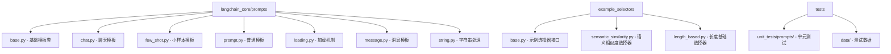

**图表来源**
- [base.py](file://libs/core/langchain_core/prompts/base.py#L1-L50)
- [chat.py](file://libs/core/langchain_core/prompts/chat.py#L1-L50)
- [few_shot.py](file://libs/core/langchain_core/prompts/few_shot.py#L1-L50)

**章节来源**
- [base.py](file://libs/core/langchain_core/prompts/base.py#L1-L100)
- [chat.py](file://libs/core/langchain_core/prompts/chat.py#L1-L100)

## 核心组件

### BasePromptTemplate - 基础提示模板

BasePromptTemplate是所有提示模板的抽象基类，定义了提示模板的核心接口和行为规范。

#### 主要特性
- **输入变量管理**: 支持必需变量和可选变量的区分
- **部分变量支持**: 允许预设部分参数值
- **输出解析器集成**: 可与输出解析器链式工作
- **元数据和标签**: 支持追踪和分类功能
- **序列化能力**: 支持保存和加载

#### 关键属性
- `input_variables`: 必需的输入变量列表
- `optional_variables`: 可选的输入变量列表  
- `partial_variables`: 部分变量字典
- `output_parser`: 输出解析器实例
- `metadata`: 元数据信息
- `tags`: 标签列表

**章节来源**
- [base.py](file://libs/core/langchain_core/prompts/base.py#L35-L150)

### PromptTemplate - 普通文本模板

PromptTemplate是最基础的提示模板类型，专门用于处理纯文本格式的提示。

#### 设计特点
- **多格式支持**: 支持f-string、mustache和jinja2三种模板格式
- **模板验证**: 可选的模板语法验证功能
- **文件加载**: 支持从文件加载模板
- **示例生成**: 提供从示例快速生成模板的方法

#### 核心方法
- `from_template()`: 从模板字符串创建
- `from_file()`: 从文件加载模板
- `from_examples()`: 从示例列表生成
- `format()`: 同步格式化
- `aformat()`: 异步格式化

**章节来源**
- [prompt.py](file://libs/core/langchain_core/prompts/prompt.py#L20-L100)

### ChatPromptTemplate - 聊天消息模板

ChatPromptTemplate专门用于构建聊天对话场景的提示模板，支持复杂的多角色消息结构。

#### 消息类型组件
- **SystemMessagePromptTemplate**: 系统消息模板
- **HumanMessagePromptTemplate**: 用户消息模板  
- **AIMessagePromptTemplate**: AI消息模板
- **ChatMessagePromptTemplate**: 通用聊天消息模板
- **MessagesPlaceholder**: 动态消息占位符

#### 结构化设计
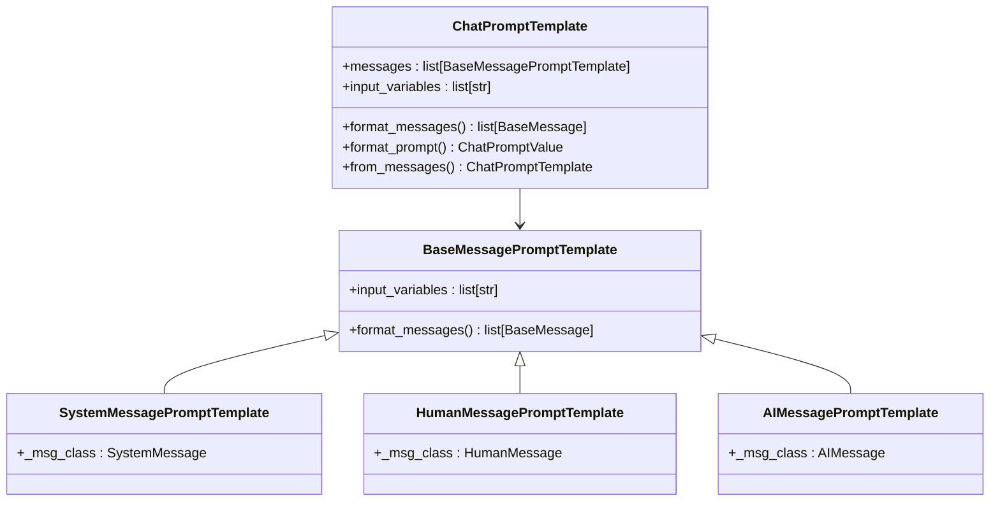

**图表来源**
- [chat.py](file://libs/core/langchain_core/prompts/chat.py#L100-L200)
- [message.py](file://libs/core/langchain_core/prompts/message.py#L15-L50)

**章节来源**
- [chat.py](file://libs/core/langchain_core/prompts/chat.py#L200-L400)

## 架构概览

LangChain的提示工程架构采用分层设计，从底层的基础模板到高层的应用场景，形成了完整的提示处理流水线。

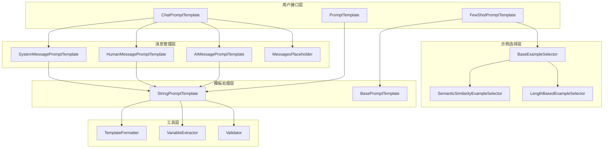

**图表来源**
- [base.py](file://libs/core/langchain_core/prompts/base.py#L50-L150)
- [chat.py](file://libs/core/langchain_core/prompts/chat.py#L400-L600)
- [few_shot.py](file://libs/core/langchain_core/prompts/few_shot.py#L100-L200)

## 详细组件分析

### PromptTemplate设计原理

PromptTemplate采用了工厂模式和建造者模式的结合，提供了灵活的模板创建方式。

#### 变量占位符系统
模板支持多种变量占位符格式：
- **f-string格式**: `{variable}` - 默认推荐格式
- **mustache格式**: `{{variable}}` - 简单的模板引擎
- **jinja2格式**: `{{variable}}` - 功能丰富的模板引擎（需额外安装）

#### 模板验证机制
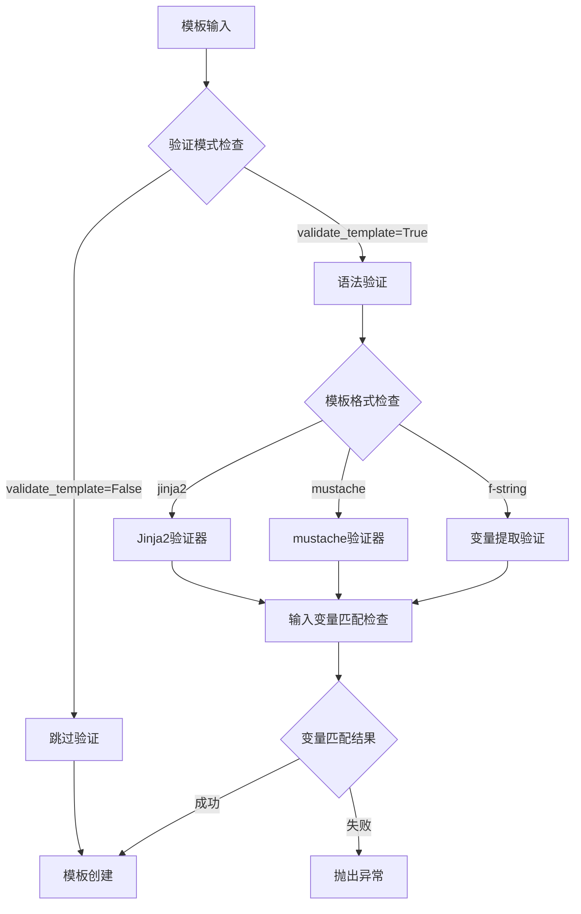

**图表来源**
- [string.py](file://libs/core/langchain_core/prompts/string.py#L200-L300)
- [prompt.py](file://libs/core/langchain_core/prompts/prompt.py#L80-L150)

**章节来源**
- [prompt.py](file://libs/core/langchain_core/prompts/prompt.py#L100-L200)
- [string.py](file://libs/core/langchain_core/prompts/string.py#L150-L250)

### ChatPromptTemplate结构分析

ChatPromptTemplate通过组合不同的消息模板来构建复杂的对话结构。

#### 消息模板组合模式
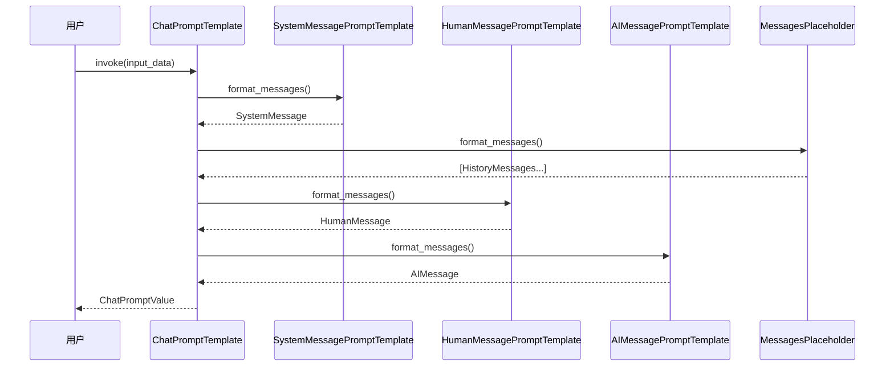

**图表来源**
- [chat.py](file://libs/core/langchain_core/prompts/chat.py#L600-L800)

#### MessagesPlaceholder动态处理
MessagesPlaceholder提供了灵活的动态消息处理能力：

| 特性 | 描述 | 使用场景 |
|------|------|----------|
| 可选参数 | 支持optional=True时无参数调用 | 处理空历史记录 |
| 数量限制 | 通过n_messages参数限制消息数量 | 控制上下文长度 |
| 类型转换 | 自动将各种格式转换为BaseMessage | 兼容不同输入格式 |

**章节来源**
- [chat.py](file://libs/core/langchain_core/prompts/chat.py#L30-L150)

### FewShotPromptTemplate小样本学习

FewShotPromptTemplate实现了动态示例选择和固定示例集合两种模式。

#### 示例选择机制
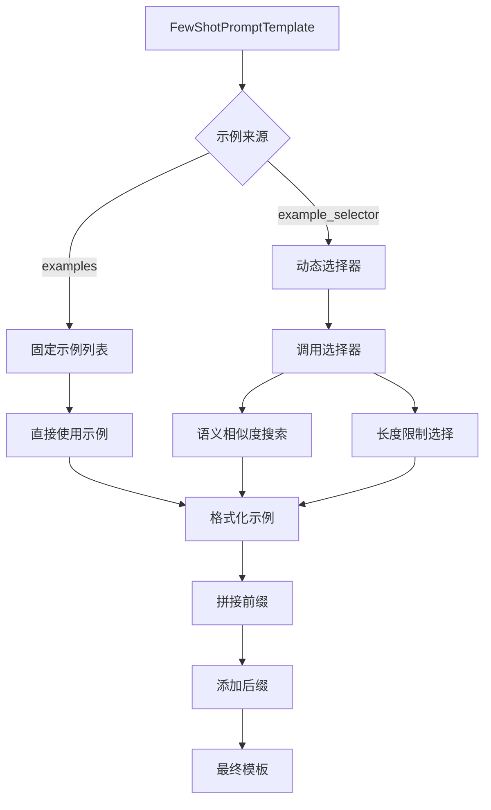

**图表来源**
- [few_shot.py](file://libs/core/langchain_core/prompts/few_shot.py#L20-L100)

#### ExampleSelector动态选择
LangChain提供了两种主要的示例选择策略：

| 选择器类型 | 工作原理 | 适用场景 |
|------------|----------|----------|
| SemanticSimilarityExampleSelector | 基于向量相似度检索 | 相关性优先的示例选择 |
| LengthBasedExampleSelector | 基于长度限制选择 | 上下文长度敏感的任务 |

**章节来源**
- [few_shot.py](file://libs/core/langchain_core/prompts/few_shot.py#L100-L300)
- [semantic_similarity.py](file://libs/core/langchain_core/example_selectors/semantic_similarity.py#L50-L150)

### 提示安全过滤和输入验证

#### 安全机制设计
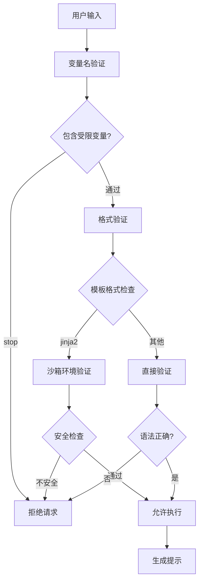

**图表来源**
- [base.py](file://libs/core/langchain_core/prompts/base.py#L80-L120)
- [string.py](file://libs/core/langchain_core/prompts/string.py#L50-L100)

#### 输入验证规则
- **变量冲突检测**: 防止input_variables和partial_variables重叠
- **受限变量保护**: 禁用名为"stop"的变量名
- **模板语法验证**: 检查模板语法的正确性
- **参数完整性检查**: 确保所有必需变量都已提供

**章节来源**
- [base.py](file://libs/core/langchain_core/prompts/base.py#L120-L200)

### 提示版本控制和加载机制

#### 加载系统架构
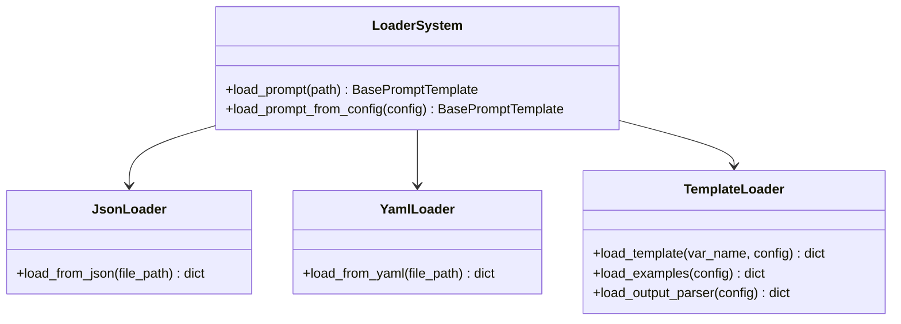

**图表来源**
- [loading.py](file://libs/core/langchain_core/prompts/loading.py#L15-L80)

#### 序列化和反序列化
提示模板支持JSON和YAML两种格式的序列化：

| 格式 | 优势 | 使用场景 |
|------|------|----------|
| JSON | 性能好，广泛支持 | 生产环境，快速加载 |
| YAML | 可读性强，注释友好 | 开发调试，配置文件 |

**章节来源**
- [loading.py](file://libs/core/langchain_core/prompts/loading.py#L80-L150)

### 模板继承和扩展

#### 继承层次结构
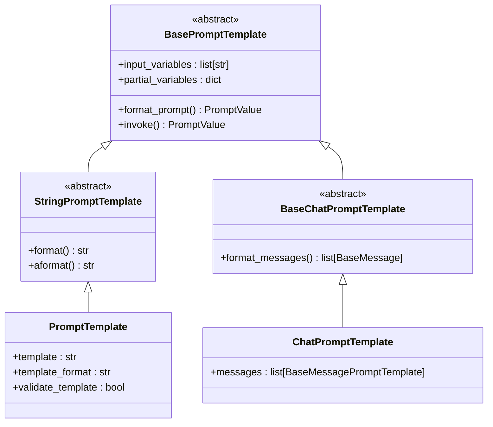

**图表来源**
- [base.py](file://libs/core/langchain_core/prompts/base.py#L35-L100)
- [string.py](file://libs/core/langchain_core/prompts/string.py#L250-L300)

#### 扩展点设计
- **自定义格式化器**: 支持新的模板格式
- **自定义验证器**: 添加特定的验证逻辑
- **自定义选择器**: 实现特殊的示例选择策略
- **自定义消息类型**: 扩展消息模板系统

**章节来源**
- [base.py](file://libs/core/langchain_core/prompts/base.py#L200-L300)

## 依赖关系分析

### 核心依赖图
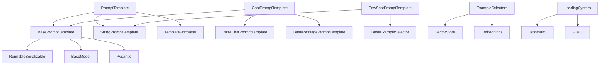

**图表来源**
- [base.py](file://libs/core/langchain_core/prompts/base.py#L1-L30)
- [chat.py](file://libs/core/langchain_core/prompts/chat.py#L1-L30)
- [few_shot.py](file://libs/core/langchain_core/prompts/few_shot.py#L1-L30)

### 外部依赖管理
- **Jinja2**: 可选的模板引擎支持
- **Pydantic**: 数据验证和序列化
- **TypingExtensions**: 类型提示增强
- **YAML**: 配置文件支持

**章节来源**
- [string.py](file://libs/core/langchain_core/prompts/string.py#L1-L50)
- [loading.py](file://libs/core/langchain_core/prompts/loading.py#L1-L30)

## 性能考虑

### 模板编译优化
- **延迟编译**: 模板在首次使用时编译
- **缓存机制**: 编译后的模板结果缓存
- **增量更新**: 支持部分变量的动态更新

### 内存管理
- **对象池**: 重用消息对象减少GC压力
- **弱引用**: 避免循环引用导致的内存泄漏
- **流式处理**: 大规模示例的流式选择

### 并发处理
- **异步支持**: 所有主要操作都支持异步
- **并行选择**: 示例选择器支持并发处理
- **连接池**: 向量数据库连接复用

## 故障排除指南

### 常见问题诊断

#### 模板格式错误
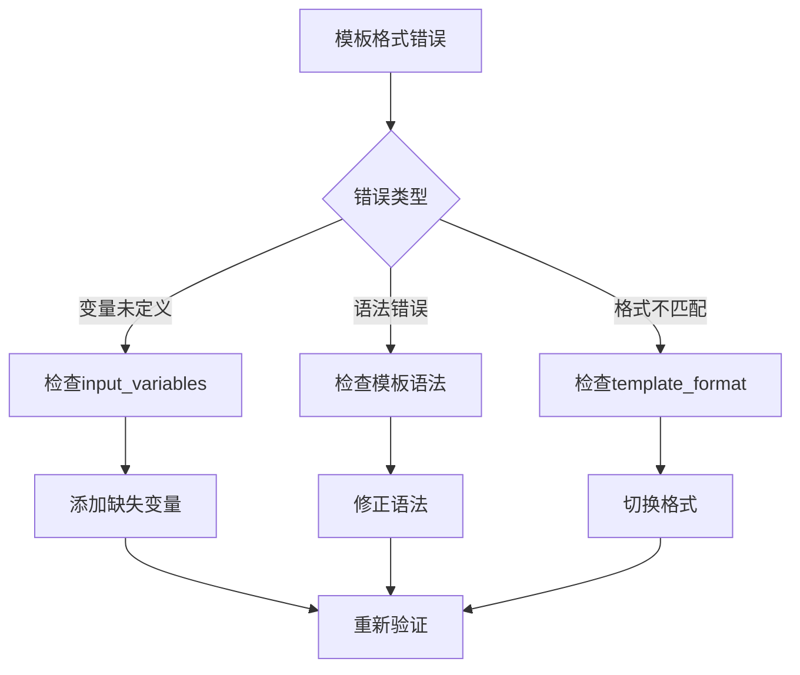

#### 示例选择问题
- **语义相似度选择器**: 检查嵌入模型和向量存储配置
- **长度限制选择器**: 验证最大长度设置和文本长度计算
- **自定义选择器**: 确认选择逻辑的正确性

#### 性能问题排查
- **模板编译慢**: 检查模板复杂度和验证设置
- **示例选择慢**: 优化向量搜索参数和索引
- **内存占用高**: 检查缓存大小和对象生命周期

**章节来源**
- [base.py](file://libs/core/langchain_core/prompts/base.py#L150-L250)
- [string.py](file://libs/core/langchain_core/prompts/string.py#L300-L345)

### 调试技巧

#### 日志配置
```python
import logging
logging.getLogger('langchain_core.prompts').setLevel(logging.DEBUG)
```

#### 模板可视化
使用`pretty_repr()`方法查看模板的内部结构：
- 显示变量定义
- 展示消息模板层次
- 检查格式化状态

#### 性能监控
- 启用回调处理器跟踪执行时间
- 监控内存使用情况
- 分析模板编译和格式化耗时

## 结论

LangChain的提示工程系统展现了现代AI应用中提示设计的最佳实践。通过精心设计的分层架构，该系统不仅提供了强大的功能，还保持了良好的可扩展性和维护性。

### 主要优势
- **灵活性**: 支持多种模板格式和消息类型
- **安全性**: 完善的输入验证和安全机制
- **可扩展性**: 清晰的继承体系和扩展点
- **易用性**: 直观的API设计和丰富的示例

### 最佳实践建议
1. **合理使用模板格式**: 根据需求选择合适的模板引擎
2. **优化示例选择**: 根据任务特点选择合适的示例选择策略
3. **实施安全措施**: 始终启用输入验证和适当的权限控制
4. **关注性能指标**: 监控模板编译和格式化的性能影响

### 发展方向
- **智能模板生成**: 利用机器学习自动优化提示设计
- **跨模态支持**: 扩展对图像、音频等多模态输入的支持
- **实时优化**: 基于用户反馈动态调整提示策略
- **标准化协议**: 推动提示工程标准的制定和普及

通过深入理解和合理运用这些提示工程特性，开发者可以构建更加智能、高效和安全的AI应用系统。