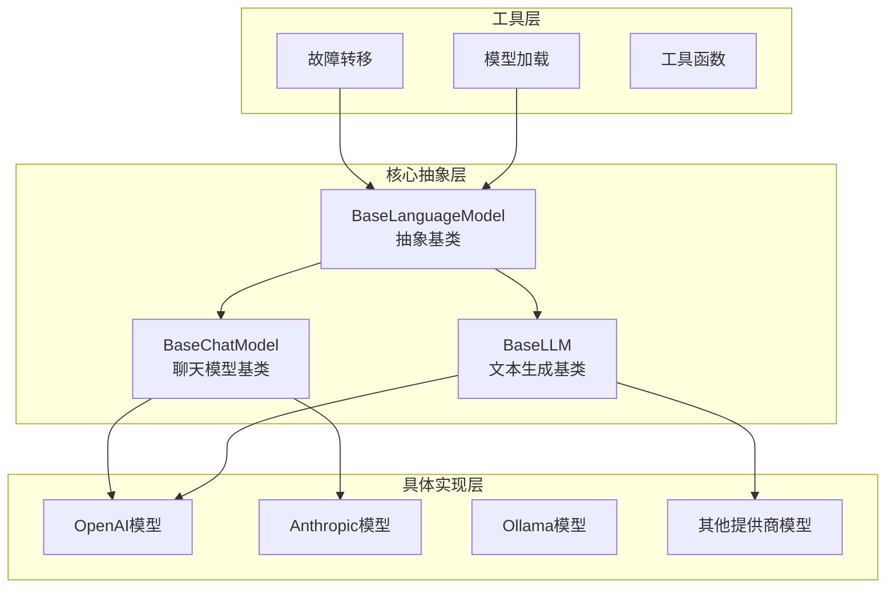
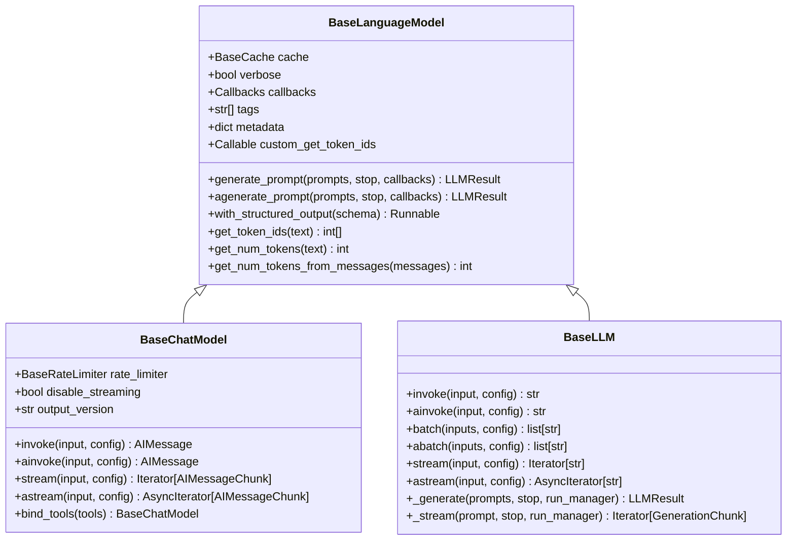
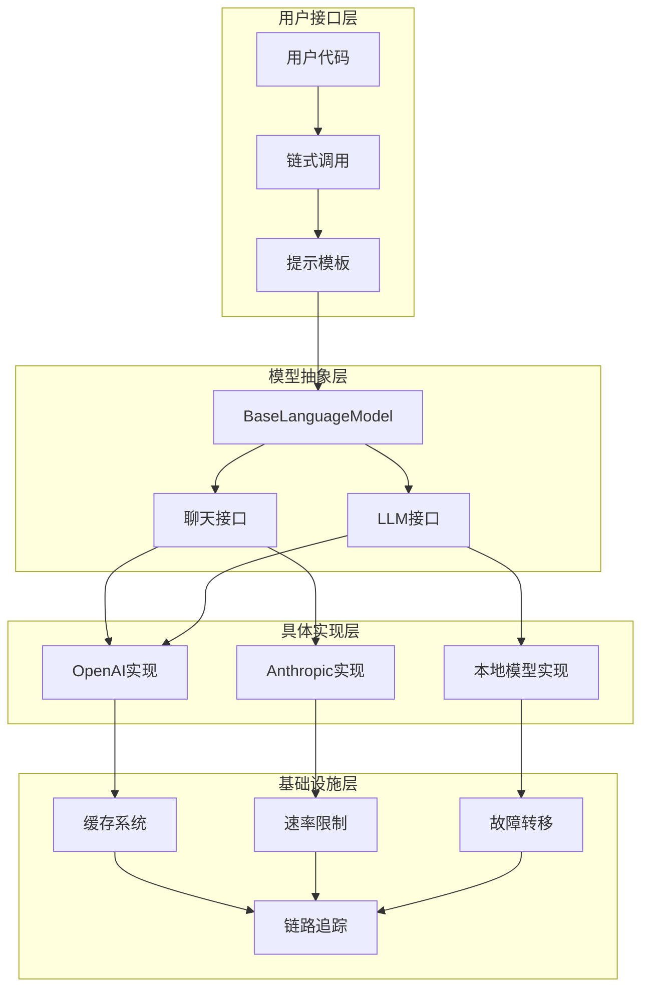
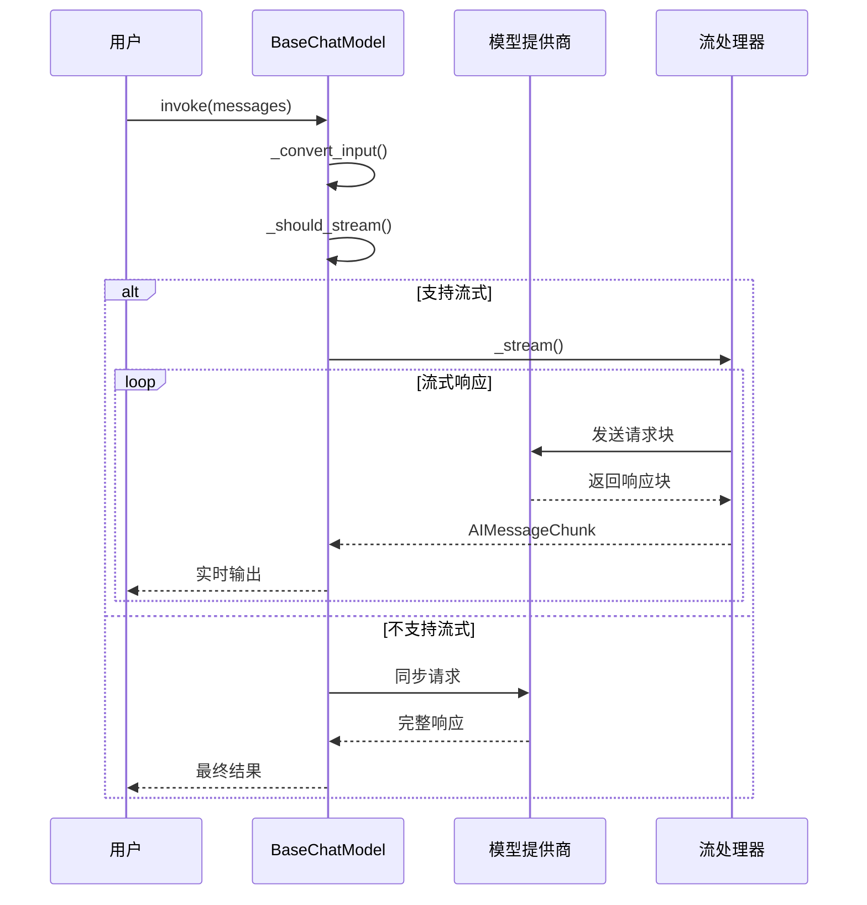
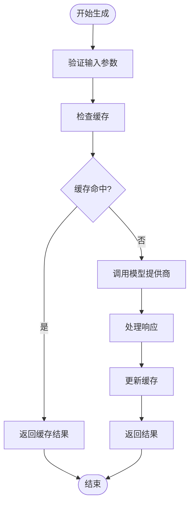
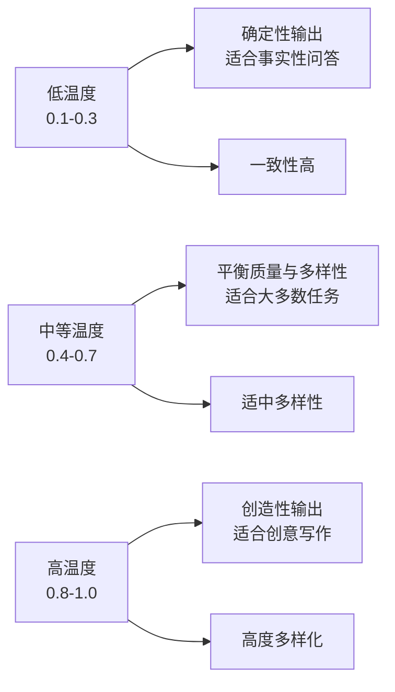
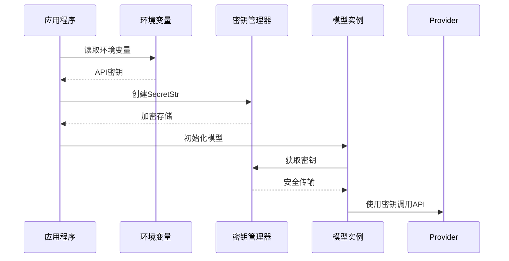
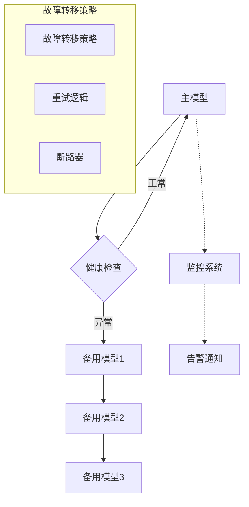
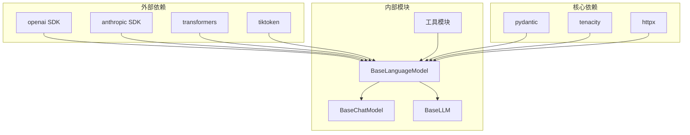

# 模型集成 (Models)

<cite>
**本文档中引用的文件**
- [base.py](file://libs/core/langchain_core/language_models/base.py)
- [chat_models.py](file://libs/core/langchain_core/language_models/chat_models.py)
- [llms.py](file://libs/core/langchain_core/language_models/llms.py)
- [fallbacks.py](file://libs/core/langchain_core/runnables/fallbacks.py)
- [openai.py](file://libs/partners/openai/langchain_openai/chat_models/base.py)
- [anthropic.py](file://libs/partners/anthropic/langchain_anthropic/chat_models.py)
- [load.py](file://libs/core/langchain_core/load/load.py)
</cite>

## 目录
1. [简介](#简介)
2. [项目结构](#项目结构)
3. [核心组件](#核心组件)
4. [架构概览](#架构概览)
5. [详细组件分析](#详细组件分析)
6. [依赖关系分析](#依赖关系分析)
7. [性能考虑](#性能考虑)
8. [故障排除指南](#故障排除指南)
9. [结论](#结论)

## 简介

LangChain的模型集成系统提供了一个统一的抽象层，用于与各种大语言模型提供商进行交互。该系统的核心是BaseLanguageModel抽象基类，它为所有语言模型提供了统一的接口，同时支持聊天模型(BaseChatModel)和纯文本生成模型(BaseLLM)两种不同的实现方式。

模型集成系统的关键特性包括：
- 统一的模型接口设计
- 支持多种模型提供商
- 高级容错机制
- 性能优化和成本控制
- 灵活的配置管理

## 项目结构

LangChain的模型集成模块采用分层架构设计，主要分为以下几个层次：

**图表来源**
- [base.py](file://libs/core/langchain_core/language_models/base.py#L1-L50)
- [chat_models.py](file://libs/core/langchain_core/language_models/chat_models.py#L1-L100)
- [llms.py](file://libs/core/langchain_core/language_models/llms.py#L1-L50)

## 核心组件

### BaseLanguageModel抽象基类

BaseLanguageModel是所有语言模型的统一抽象基类，定义了模型的基本接口和通用功能：

**图表来源**
- [base.py](file://libs/core/langchain_core/language_models/base.py#L100-L200)
- [chat_models.py](file://libs/core/langchain_core/language_models/chat_models.py#L200-L300)
- [llms.py](file://libs/core/langchain_core/language_models/llms.py#L200-L300)

**章节来源**
- [base.py](file://libs/core/langchain_core/language_models/base.py#L100-L320)
- [chat_models.py](file://libs/core/langchain_core/language_models/chat_models.py#L200-L400)
- [llms.py](file://libs/core/langchain_core/language_models/llms.py#L200-L400)

## 架构概览

LangChain的模型集成架构采用多层设计模式，确保了系统的可扩展性和维护性：

**图表来源**
- [base.py](file://libs/core/langchain_core/language_models/base.py#L1-L100)
- [chat_models.py](file://libs/core/langchain_core/language_models/chat_models.py#L1-L200)
- [llms.py](file://libs/core/langchain_core/language_models/llms.py#L1-L200)

## 详细组件分析

### BaseChatModel与BaseLLM的具体实现差异

#### BaseChatModel特性

BaseChatModel专门用于处理对话式交互，具有以下核心特性：

1. **消息格式处理**：支持复杂的多轮对话消息格式
2. **流式响应**：提供实时的流式输出能力
3. **工具调用**：内置对函数调用和工具使用的支持
4. **状态管理**：维护对话上下文和历史记录

**图表来源**
- [chat_models.py](file://libs/core/langchain_core/language_models/chat_models.py#L400-L600)

#### BaseLLM特性

BaseLLM专注于纯文本生成任务，具有以下特点：

1. **简单输入输出**：接受字符串输入，返回字符串输出
2. **批量处理**：支持批量生成多个文本
3. **异步操作**：提供完整的异步API支持
4. **缓存优化**：内置智能缓存机制

**图表来源**
- [llms.py](file://libs/core/langchain_core/language_models/llms.py#L300-L500)

**章节来源**
- [chat_models.py](file://libs/core/langchain_core/language_models/chat_models.py#L200-L800)
- [llms.py](file://libs/core/langchain_core/language_models/llms.py#L200-L800)

### 模型配置选项详解

#### 核心配置参数

LangChain支持丰富的模型配置选项，这些参数直接影响模型的行为和输出质量：

| 参数名称 | 类型 | 默认值 | 描述 | 调优建议 |
|---------|------|--------|------|----------|
| `temperature` | float | 1.0 | 控制随机性，范围0.0-2.0 | 低值(0.1-0.3)适合确定性任务，高值(0.7-1.0)适合创造性任务 |
| `max_tokens` | int | None | 最大生成token数 | 根据任务复杂度设置，对话任务通常100-500 |
| `top_p` | float | 1.0 | 核采样参数，范围0.0-1.0 | 建议设置为0.9，平衡质量和多样性 |
| `top_k` | int | 40 | 保留前k个候选词 | 数字越大，生成越多样化 |
| `frequency_penalty` | float | 0.0 | 频率惩罚系数 | 正值减少重复，负值鼓励重复 |
| `presence_penalty` | float | 0.0 | 存在惩罚系数 | 类似频率惩罚，但基于词汇出现次数 |
| `stop` | list[str] | None | 停止序列 | 设置合适的停止词避免不必要生成 |

#### 温度参数调优策略

温度参数是影响模型输出多样性的关键因素：

**章节来源**
- [openai.py](file://libs/partners/openai/langchain_openai/chat_models/base.py#L1-L300)
- [anthropic.py](file://libs/partners/anthropic/langchain_anthropic/chat_models.py#L1-L200)

### 认证和API密钥管理

#### 安全的密钥管理

LangChain提供了安全的API密钥管理机制：

**图表来源**
- [load.py](file://libs/core/langchain_core/load/load.py#L100-L200)

#### 多种认证方式

1. **环境变量**：推荐的安全方式
2. **直接传入**：适用于测试和临时使用
3. **配置文件**：支持YAML格式的配置文件
4. **密钥映射**：支持多个密钥的动态切换

**章节来源**
- [load.py](file://libs/core/langchain_core/load/load.py#L1-L200)

### 故障转移和负载均衡

#### 故障转移机制

LangChain提供了强大的故障转移能力，确保服务的高可用性：

**图表来源**
- [fallbacks.py](file://libs/core/langchain_core/runnables/fallbacks.py#L1-L150)

#### 负载均衡策略

1. **轮询调度**：均匀分配请求到各个模型实例
2. **权重调度**：根据模型性能调整分配比例
3. **健康优先**：优先选择健康的模型实例
4. **地理位置**：根据用户位置选择最近的模型节点

**章节来源**
- [fallbacks.py](file://libs/core/langchain_core/runnables/fallbacks.py#L1-L200)

### 性能基准测试和成本优化

#### 性能监控指标

LangChain提供了全面的性能监控体系：

| 指标类别 | 具体指标 | 监控目的 | 优化建议 |
|---------|----------|----------|----------|
| 响应时间 | 延迟、吞吐量 | 评估系统性能 | 优化模型选择和缓存策略 |
| 成本控制 | Token消耗、API费用 | 成本效益分析 | 使用更经济的模型变体 |
| 质量评估 | 准确率、相关性 | 输出质量监控 | 调整参数和提示工程 |
| 可用性 | 可用性百分比 | 服务稳定性 | 实施故障转移机制 |

#### 成本优化策略

1. **模型选择优化**：根据任务需求选择合适的模型
2. **缓存策略**：合理利用缓存减少重复计算
3. **批处理**：合并多个请求提高效率
4. **上下文压缩**：优化输入长度减少Token消耗

**章节来源**
- [llms.py](file://libs/core/langchain_core/language_models/llms.py#L50-L150)

## 依赖关系分析

LangChain模型集成系统的依赖关系体现了清晰的分层架构：

**图表来源**
- [base.py](file://libs/core/langchain_core/language_models/base.py#L1-L50)
- [chat_models.py](file://libs/core/langchain_core/language_models/chat_models.py#L1-L50)
- [llms.py](file://libs/core/langchain_core/language_models/llms.py#L1-L50)

**章节来源**
- [base.py](file://libs/core/langchain_core/language_models/base.py#L1-L100)
- [chat_models.py](file://libs/core/langchain_core/language_models/chat_models.py#L1-L100)
- [llms.py](file://libs/core/langchain_core/language_models/llms.py#L1-L100)

## 性能考虑

### 缓存策略

LangChain实现了多层次的缓存机制来提升性能：

1. **内存缓存**：快速访问的本地缓存
2. **分布式缓存**：跨服务共享的缓存
3. **智能失效**：基于内容的缓存失效策略

### 异步处理

系统全面支持异步操作，特别是在以下场景中：

- 批量处理大量请求
- 流式响应处理
- 并发连接管理
- 非阻塞I/O操作

### 内存管理

1. **对象池化**：重用频繁创建的对象
2. **延迟加载**：按需加载资源
3. **垃圾回收优化**：及时释放不需要的资源

## 故障排除指南

### 常见问题及解决方案

#### 认证失败

**问题描述**：API密钥无效或过期

**解决方案**：
1. 检查环境变量设置
2. 验证密钥格式正确性
3. 确认密钥权限足够

#### 模型不可用

**问题描述**：目标模型服务不可达

**解决方案**：
1. 检查网络连接
2. 验证模型名称拼写
3. 使用故障转移机制

#### 性能问题

**问题描述**：响应时间过长

**解决方案**：
1. 启用缓存机制
2. 优化提示模板
3. 调整并发设置

**章节来源**
- [fallbacks.py](file://libs/core/langchain_core/runnables/fallbacks.py#L100-L200)

## 结论

LangChain的模型集成系统提供了一个强大而灵活的框架，用于与各种大语言模型提供商进行交互。通过统一的抽象接口、完善的错误处理机制和丰富的配置选项，开发者可以轻松地在不同模型之间切换，并实现高性能的应用程序。

系统的主要优势包括：

1. **统一接口**：BaseLanguageModel提供了统一的模型接口
2. **类型特化**：BaseChatModel和BaseLLM分别针对不同使用场景优化
3. **容错能力**：内置故障转移和重试机制
4. **性能优化**：支持缓存、批处理和异步操作
5. **安全可靠**：提供安全的密钥管理和监控机制

随着大语言模型生态的不断发展，LangChain的模型集成系统将继续演进，为开发者提供更加完善和高效的工具集。