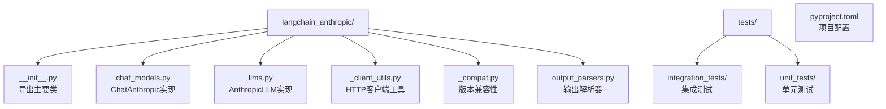
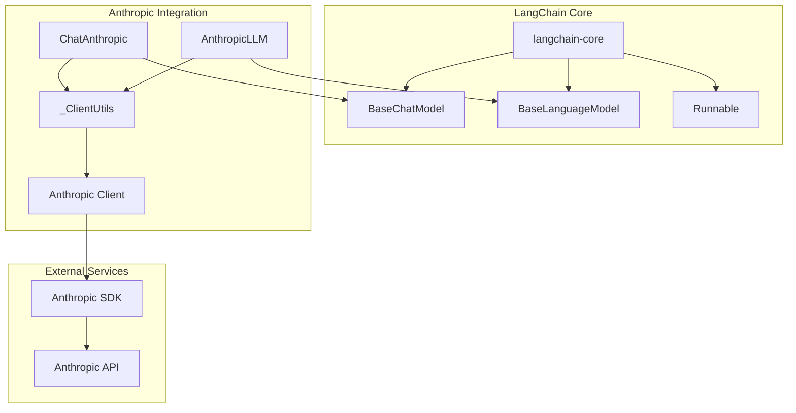
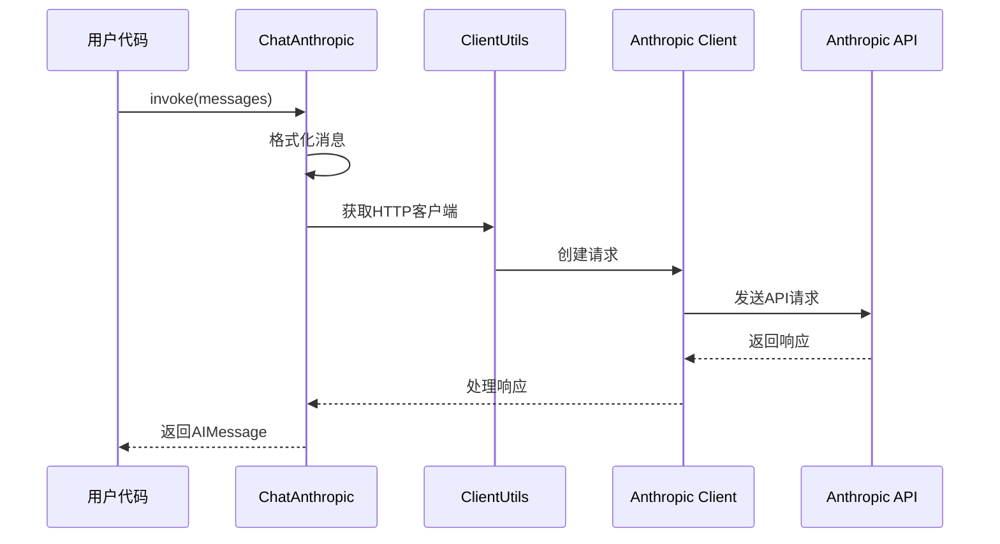
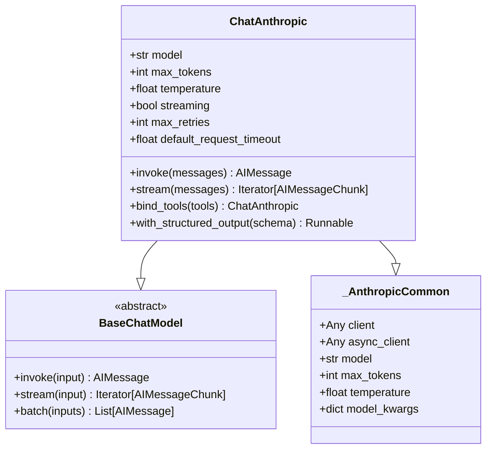
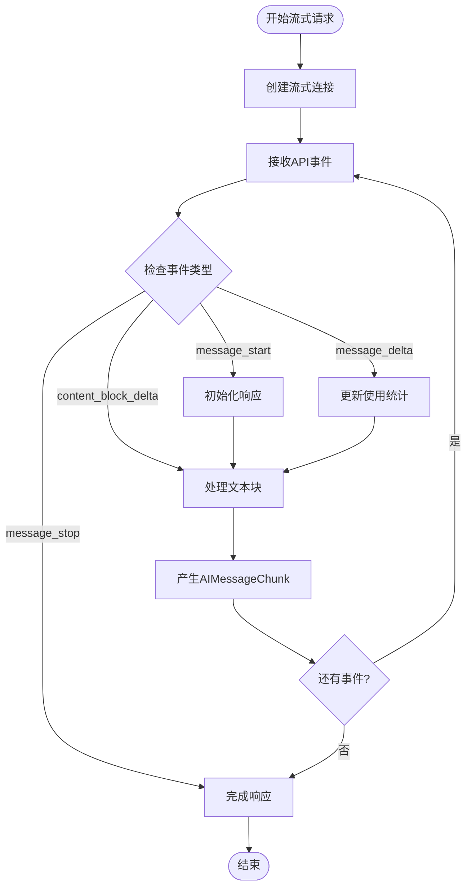
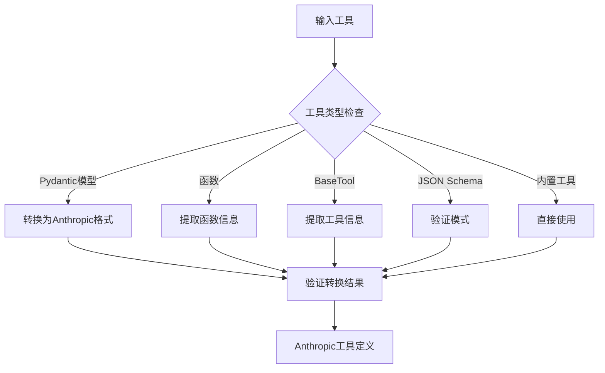
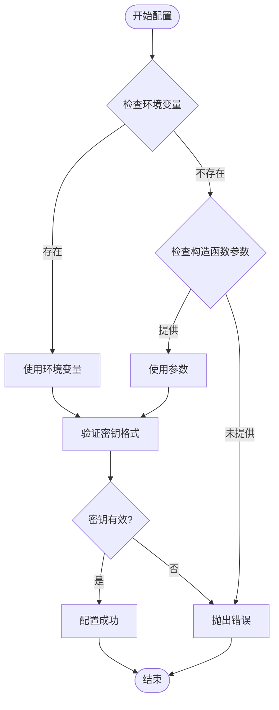
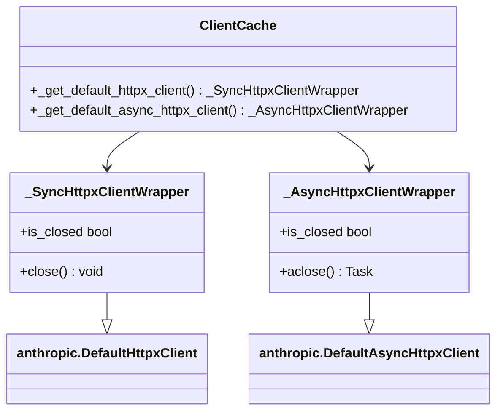
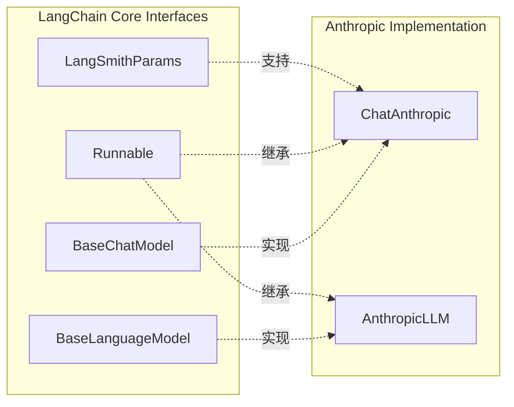
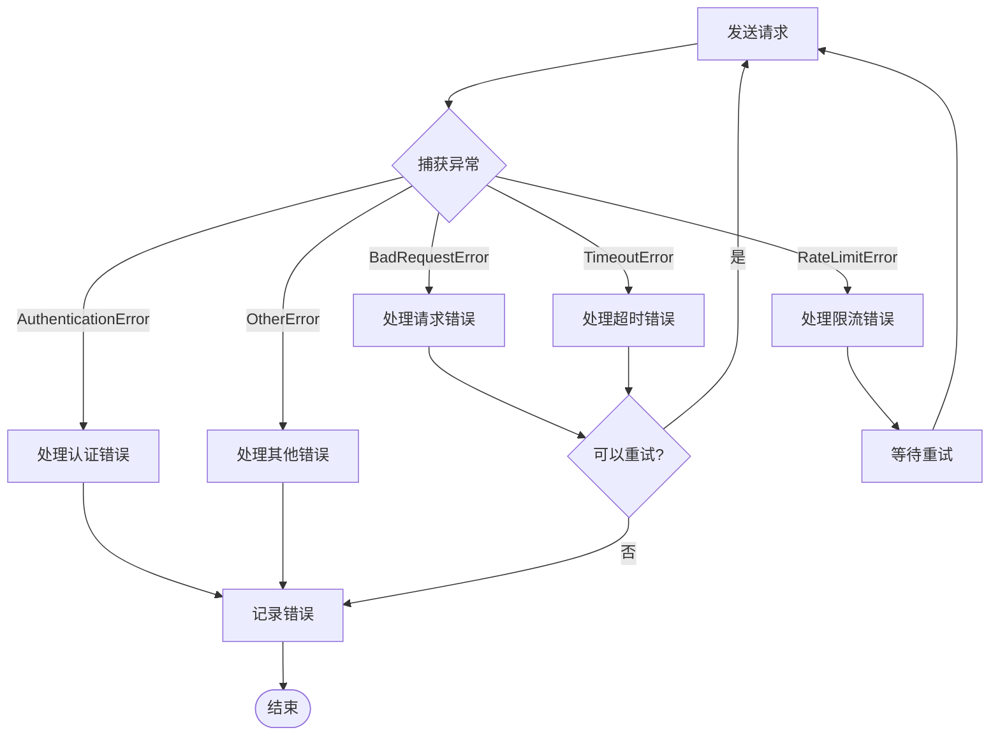

# Anthropic 集成

<cite>
**本文档中引用的文件**
- [libs/partners/anthropic/langchain_anthropic/__init__.py](file://libs/partners/anthropic/langchain_anthropic/__init__.py)
- [libs/partners/anthropic/langchain_anthropic/chat_models.py](file://libs/partners/anthropic/langchain_anthropic/chat_models.py)
- [libs/partners/anthropic/langchain_anthropic/llms.py](file://libs/partners/anthropic/langchain_anthropic/llms.py)
- [libs/partners/anthropic/langchain_anthropic/_client_utils.py](file://libs/partners/anthropic/langchain_anthropic/_client_utils.py)
- [libs/partners/anthropic/pyproject.toml](file://libs/partners/anthropic/pyproject.toml)
- [libs/partners/anthropic/tests/integration_tests/test_chat_models.py](file://libs/partners/anthropic/tests/integration_tests/test_chat_models.py)
- [libs/partners/anthropic/tests/integration_tests/test_standard.py](file://libs/partners/anthropic/tests/integration_tests/test_standard.py)
</cite>

## 目录
1. [简介](#简介)
2. [项目结构](#项目结构)
3. [核心组件](#核心组件)
4. [架构概览](#架构概览)
5. [详细组件分析](#详细组件分析)
6. [依赖关系分析](#依赖关系分析)
7. [性能考虑](#性能考虑)
8. [故障排除指南](#故障排除指南)
9. [结论](#结论)

## 简介

LangChain与Anthropic的集成提供了对Claude系列大型语言模型的全面访问能力。该集成通过`langchain-anthropic`包实现，为开发者提供了两个主要的模型接口：异步聊天模型`ChatAnthropic`和基础LLM模型`AnthropicLLM`。这个集成不仅支持标准的文本生成任务，还提供了对工具调用、流式响应、多模态输入等高级功能的支持。

该集成的核心目标是为LangChain生态系统提供一个可靠、高性能且功能丰富的Anthropic Claude模型接口，同时保持与LangChain其他组件的无缝兼容性。

## 项目结构

Anthropic集成采用模块化设计，主要包含以下核心文件：

**图表来源**
- [libs/partners/anthropic/langchain_anthropic/__init__.py](file://libs/partners/anthropic/langchain_anthropic/__init__.py#L1-L14)
- [libs/partners/anthropic/langchain_anthropic/chat_models.py](file://libs/partners/anthropic/langchain_anthropic/chat_models.py#L1-L50)

**章节来源**
- [libs/partners/anthropic/langchain_anthropic/__init__.py](file://libs/partners/anthropic/langchain_anthropic/__init__.py#L1-L14)
- [libs/partners/anthropic/pyproject.toml](file://libs/partners/anthropic/pyproject.toml#L1-L50)

## 核心组件

### 主要导出类

该集成导出了三个核心类，每个都有特定的用途和功能：

1. **ChatAnthropic**: 异步聊天模型，支持现代消息格式和工具调用
2. **AnthropicLLM**: 基础LLM模型，主要用于向后兼容
3. **convert_to_anthropic_tool**: 工具转换函数，用于将各种工具格式转换为Anthropic兼容格式

### 模型配置系统

集成提供了灵活的配置选项，包括：
- 模型选择（claude-3-5-sonnet-latest等）
- 生成参数（temperature、max_tokens等）
- 客户端配置（超时、重试次数、代理设置）
- 高级功能（工具选择、思考模式、引用支持）

**章节来源**
- [libs/partners/anthropic/langchain_anthropic/__init__.py](file://libs/partners/anthropic/langchain_anthropic/__init__.py#L1-L14)
- [libs/partners/anthropic/langchain_anthropic/chat_models.py](file://libs/partners/anthropic/langchain_anthropic/chat_models.py#L565-L606)

## 架构概览

### 系统架构图

**图表来源**
- [libs/partners/anthropic/langchain_anthropic/chat_models.py](file://libs/partners/anthropic/langchain_anthropic/chat_models.py#L565-L606)
- [libs/partners/anthropic/langchain_anthropic/llms.py](file://libs/partners/anthropic/langchain_anthropic/llms.py#L1-L50)

### 组件交互流程

**图表来源**
- [libs/partners/anthropic/langchain_anthropic/chat_models.py](file://libs/partners/anthropic/langchain_anthropic/chat_models.py#L1725-L1759)
- [libs/partners/anthropic/langchain_anthropic/_client_utils.py](file://libs/partners/anthropic/langchain_anthropic/_client_utils.py#L1-L50)

## 详细组件分析

### ChatAnthropic 聊天模型

`ChatAnthropic`是该集成的核心组件，实现了`BaseChatModel`抽象接口，提供完整的聊天功能。

#### 核心特性

1. **异步支持**: 支持同步和异步操作
2. **流式响应**: 提供实时的流式令牌生成
3. **工具调用**: 支持函数调用和工具使用
4. **多模态输入**: 支持文本、图像、PDF等多种输入格式
5. **高级功能**: 思考模式、引用、提示缓存等

#### 实现细节

**图表来源**
- [libs/partners/anthropic/langchain_anthropic/chat_models.py](file://libs/partners/anthropic/langchain_anthropic/chat_models.py#L565-L606)
- [libs/partners/anthropic/langchain_anthropic/chat_models.py](file://libs/partners/anthropic/langchain_anthropic/chat_models.py#L1725-L1759)

#### 流式响应处理

流式响应是`ChatAnthropic`的重要功能，通过事件驱动的方式处理API响应：

**图表来源**
- [libs/partners/anthropic/langchain_anthropic/chat_models.py](file://libs/partners/anthropic/langchain_anthropic/chat_models.py#L1725-L1759)
- [libs/partners/anthropic/langchain_anthropic/chat_models.py](file://libs/partners/anthropic/langchain_anthropic/chat_models.py#L2460-L2505)

**章节来源**
- [libs/partners/anthropic/langchain_anthropic/chat_models.py](file://libs/partners/anthropic/langchain_anthropic/chat_models.py#L565-L1300)

### AnthropicLLM 基础LLM模型

虽然推荐使用`ChatAnthropic`，但`AnthropicLLM`仍然提供对Claude模型的基本访问：

#### 设计特点

1. **向后兼容**: 为旧代码提供兼容性
2. **简单接口**: 提供基本的文本生成功能
3. **弃用警告**: 明确标记为过时的实现

#### 使用场景

- 迁移过程中的临时解决方案
- 简单的文本生成任务
- 不需要高级功能的场景

**章节来源**
- [libs/partners/anthropic/langchain_anthropic/llms.py](file://libs/partners/anthropic/langchain_anthropic/llms.py#L1-L429)

### 工具调用系统

该集成提供了强大的工具调用功能，支持多种工具格式的转换和使用：

#### 工具转换机制

**图表来源**
- [libs/partners/anthropic/langchain_anthropic/chat_models.py](file://libs/partners/anthropic/langchain_anthropic/chat_models.py#L2127-L2157)

#### 工具选择参数

集成支持灵活的工具选择策略：

| 参数类型 | 描述 | 示例 |
|---------|------|------|
| `None` | 默认自动选择 | 自动决定是否使用工具 |
| `"auto"` | 自动选择 | 根据需要自动使用工具 |
| `"any"` | 强制使用 | 必须使用工具 |
| 字符串工具名 | 特定工具 | `"get_weather"` |
| 字典 | 详细配置 | `{"type": "tool", "name": "tool_name"}` |

**章节来源**
- [libs/partners/anthropic/langchain_anthropic/chat_models.py](file://libs/partners/anthropic/langchain_anthropic/chat_models.py#L2127-L2157)

### 认证和安全

#### API密钥管理

集成提供了多种API密钥配置方式：

1. **环境变量**: `ANTHROPIC_API_KEY`
2. **构造函数参数**: 直接传递API密钥
3. **SecretStr**: 安全的密钥存储

#### 安全最佳实践

**图表来源**
- [libs/partners/anthropic/langchain_anthropic/llms.py](file://libs/partners/anthropic/langchain_anthropic/llms.py#L80-L120)

**章节来源**
- [libs/partners/anthropic/langchain_anthropic/llms.py](file://libs/partners/anthropic/langchain_anthropic/llms.py#L80-L120)

### HTTP客户端管理

#### 客户端缓存机制

为了提高性能和资源利用率，集成实现了智能的HTTP客户端缓存：

**图表来源**
- [libs/partners/anthropic/langchain_anthropic/_client_utils.py](file://libs/partners/anthropic/langchain_anthropic/_client_utils.py#L1-L84)

#### 连接池优化

客户端缓存利用LRU算法管理连接，避免重复创建昂贵的HTTP连接对象，显著提升性能。

**章节来源**
- [libs/partners/anthropic/langchain_anthropic/_client_utils.py](file://libs/partners/anthropic/langchain_anthropic/_client_utils.py#L1-L84)

## 依赖关系分析

### 核心依赖

该集成依赖于以下关键库：

| 依赖项 | 版本要求 | 用途 |
|--------|----------|------|
| `anthropic` | `>=0.69.0,<1.0.0` | Anthropic API客户端 |
| `langchain-core` | `>=1.0.0,<2.0.0` | LangChain核心接口 |
| `pydantic` | `>=2.7.4,<3.0.0` | 数据验证和序列化 |

### LangChain兼容性

集成严格遵循LangChain的核心接口规范：

**图表来源**
- [libs/partners/anthropic/pyproject.toml](file://libs/partners/anthropic/pyproject.toml#L8-L12)

### 版本兼容性

集成维护了严格的版本兼容性策略，确保与不同版本的LangChain核心库协同工作。

**章节来源**
- [libs/partners/anthropic/pyproject.toml](file://libs/partners/anthropic/pyproject.toml#L8-L12)

## 性能考虑

### 并发处理

集成提供了完整的异步支持，允许高效的并发请求处理：

- **异步调用**: `ainvoke`、`astream`、`abatch`
- **并发限制**: 可通过`max_concurrency`控制
- **连接复用**: HTTP客户端缓存减少连接开销

### 缓存策略

#### 提示缓存

支持提示缓存以减少重复计算：

- **短期缓存**: 5分钟生命周期
- **长期缓存**: 1小时生命周期
- **条件缓存**: 基于运行时条件的动态缓存

#### 连接缓存

HTTP客户端缓存通过LRU策略管理，避免重复创建连接。

### 内存管理

- **流式处理**: 避免大响应的内存占用
- **分块传输**: 支持大文件的分块处理
- **及时释放**: 自动清理不再使用的资源

## 故障排除指南

### 常见问题

#### 认证问题

**问题**: `AuthenticationError` 或 `Invalid API Key`

**解决方案**:
1. 检查环境变量 `ANTHROPIC_API_KEY` 是否正确设置
2. 验证API密钥的有效性
3. 确认密钥具有适当的权限

#### 网络连接问题

**问题**: 请求超时或连接失败

**解决方案**:
1. 检查网络连接
2. 配置代理设置（如果需要）
3. 调整超时参数
4. 启用重试机制

#### 模型可用性问题

**问题**: 指定的模型不可用

**解决方案**:
1. 检查模型名称拼写
2. 确认账户有权访问指定模型
3. 使用默认模型作为备选

### 错误处理机制

**图表来源**
- [libs/partners/anthropic/langchain_anthropic/chat_models.py](file://libs/partners/anthropic/langchain_anthropic/chat_models.py#L400-L450)

### 调试技巧

1. **启用详细日志**: 设置适当的日志级别
2. **使用回调**: 监控请求和响应
3. **检查使用统计**: 监控令牌使用情况
4. **验证输入格式**: 确保消息格式正确

**章节来源**
- [libs/partners/anthropic/langchain_anthropic/chat_models.py](file://libs/partners/anthropic/langchain_anthropic/chat_models.py#L400-L450)

## 结论

LangChain与Anthropic的集成提供了一个功能强大、性能优异且易于使用的Claude模型接口。该集成通过以下关键特性实现了这一目标：

### 主要优势

1. **完整的功能覆盖**: 支持从基本文本生成到高级工具调用的所有功能
2. **优秀的性能**: 通过缓存和异步处理提供高效的执行
3. **无缝集成**: 严格遵循LangChain接口规范，确保与其他组件的兼容性
4. **灵活的配置**: 提供丰富的配置选项以适应不同的使用场景
5. **强大的工具支持**: 支持多种工具格式和复杂的工具调用逻辑

### 最佳实践建议

1. **优先使用ChatAnthropic**: 对于新项目，推荐使用`ChatAnthropic`而非`AnthropicLLM`
2. **合理配置缓存**: 利用提示缓存和连接缓存提升性能
3. **监控使用情况**: 定期检查令牌使用和成本
4. **处理错误**: 实现适当的错误处理和重试机制
5. **安全配置**: 正确管理API密钥和敏感信息

### 未来发展方向

该集成持续演进，计划支持更多Anthropic的新功能，包括：
- 更多模型的支持
- 新的工具调用模式
- 增强的多模态能力
- 更好的性能优化

通过这个集成，开发者可以轻松地将Claude的强大能力集成到LangChain应用中，构建出功能丰富、性能优异的AI应用程序。