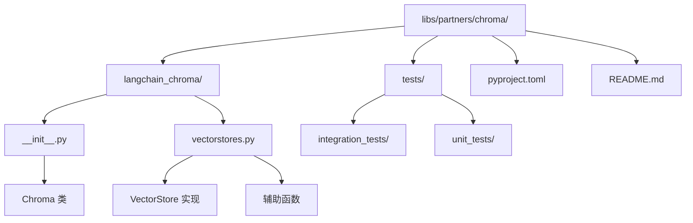
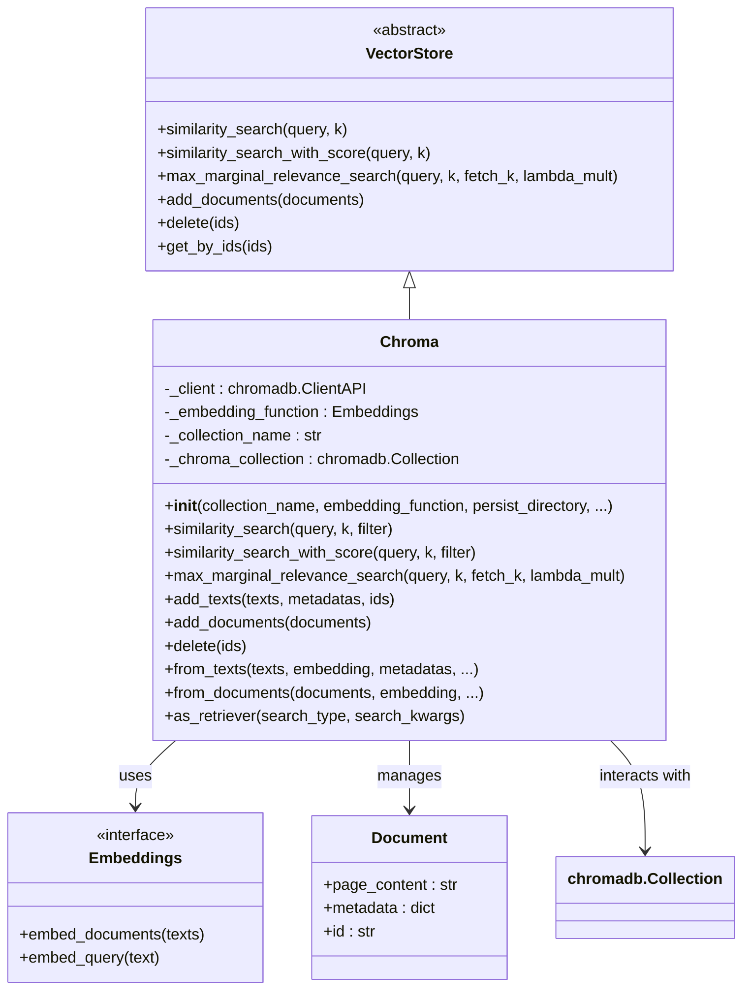
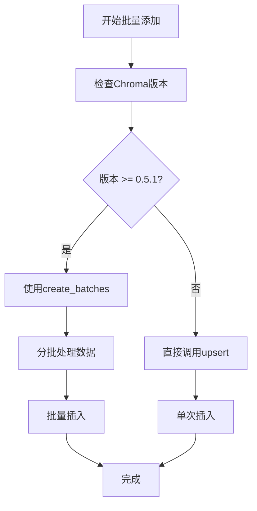
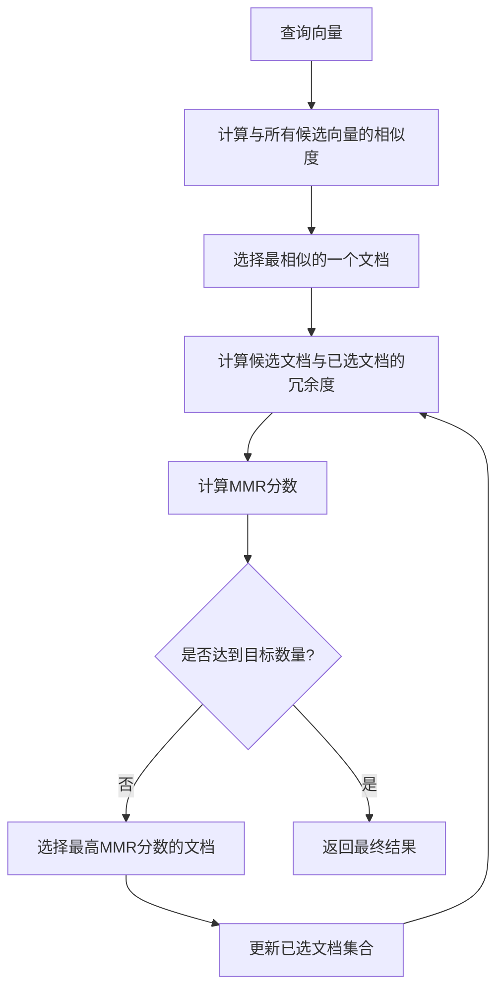
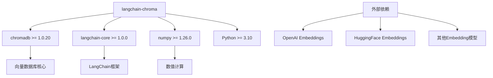

# Chroma 集成

<cite>
**本文档中引用的文件**
- [libs/partners/chroma/langchain_chroma/__init__.py](file://libs/partners/chroma/langchain_chroma/__init__.py)
- [libs/partners/chroma/langchain_chroma/vectorstores.py](file://libs/partners/chroma/langchain_chroma/vectorstores.py)
- [libs/core/langchain_core/vectorstores/base.py](file://libs/core/langchain_core/vectorstores/base.py)
- [libs/partners/chroma/pyproject.toml](file://libs/partners/chroma/pyproject.toml)
- [libs/partners/chroma/README.md](file://libs/partners/chroma/README.md)
- [libs/partners/chroma/tests/integration_tests/test_vectorstores.py](file://libs/partners/chroma/tests/integration_tests/test_vectorstores.py)
- [libs/partners/chroma/tests/unit_tests/test_vectorstores.py](file://libs/partners/chroma/tests/unit_tests/test_vectorstores.py)
</cite>

## 目录
1. [简介](#简介)
2. [项目结构](#项目结构)
3. [核心组件](#核心组件)
4. [架构概览](#架构概览)
5. [详细组件分析](#详细组件分析)
6. [依赖关系分析](#依赖关系分析)
7. [性能考虑](#性能考虑)
8. [故障排除指南](#故障排除指南)
9. [结论](#结论)

## 简介

LangChain与Chroma向量数据库的集成提供了一个轻量级、易于使用的向量存储后端，专门设计用于支持相似性搜索和检索增强生成（RAG）应用。该集成通过`Chroma`类实现了`langchain_core`中的`VectorStore`接口，为LangChain生态系统提供了高性能的向量存储解决方案。

Chroma作为现代向量数据库，具有以下关键特性：
- 支持多种距离度量（余弦、欧几里得、内积）
- 提供内存模式和持久化模式两种运行方式
- 支持分布式部署和云服务
- 内置MMR（最大边际相关性）搜索算法
- 完整的元数据过滤和查询功能

## 项目结构



**图表来源**
- [libs/partners/chroma/langchain_chroma/__init__.py](file://libs/partners/chroma/langchain_chroma/__init__.py#L1-L8)
- [libs/partners/chroma/langchain_chroma/vectorstores.py](file://libs/partners/chroma/langchain_chroma/vectorstores.py#L1-L50)

**章节来源**
- [libs/partners/chroma/pyproject.toml](file://libs/partners/chroma/pyproject.toml#L1-L20)
- [libs/partners/chroma/README.md](file://libs/partners/chroma/README.md#L1-L23)

## 核心组件

### Chroma类

`Chroma`类是整个集成的核心，它继承自`langchain_core.vectorstores.VectorStore`基类，并实现了完整的向量存储功能。该类提供了以下主要功能：

- **初始化配置**：支持多种客户端连接方式（本地、HTTP、云端）
- **文档管理**：添加、更新、删除和查询文档
- **相似性搜索**：支持基于文本和向量的搜索
- **高级搜索**：MMR（最大边际相关性）搜索
- **元数据操作**：复杂的过滤和查询功能

### 向量存储接口实现

通过实现`VectorStore`接口，Chroma确保了与LangChain生态系统的完全兼容性，支持：

- 文本和文档的嵌入向量计算
- 基于相似性的检索
- 元数据驱动的过滤
- 批量操作优化

**章节来源**
- [libs/partners/chroma/langchain_chroma/vectorstores.py](file://libs/partners/chroma/langchain_chroma/vectorstores.py#L155-L350)
- [libs/core/langchain_core/vectorstores/base.py](file://libs/core/langchain_core/vectorstores/base.py#L40-L100)

## 架构概览



**图表来源**
- [libs/partners/chroma/langchain_chroma/vectorstores.py](file://libs/partners/chroma/langchain_chroma/vectorstores.py#L155-L200)
- [libs/core/langchain_core/vectorstores/base.py](file://libs/core/langchain_core/vectorstores/base.py#L40-L80)

## 详细组件分析

### 初始化和客户端配置

Chroma支持多种部署模式，每种都有其特定的优势：

#### 本地持久化模式
```python
# 本地持久化配置
vector_store = Chroma(
    collection_name="my_collection",
    embedding_function=embeddings,
    persist_directory="./chroma_db"
)
```

#### 内存模式
```python
# 内存模式配置（临时数据）
vector_store = Chroma(
    collection_name="temp_collection",
    embedding_function=embeddings
)
```

#### 分布式部署
```python
# 远程服务器配置
vector_store = Chroma(
    host="localhost",
    port=8000,
    ssl=False,
    headers={"Authorization": "Bearer token"}
)
```

#### 云端服务
```python
# Chroma Cloud配置
vector_store = Chroma(
    chroma_cloud_api_key="your-api-key",
    tenant="your-tenant",
    database="your-database"
)
```

**章节来源**
- [libs/partners/chroma/langchain_chroma/vectorstores.py](file://libs/partners/chroma/langchain_chroma/vectorstores.py#L280-L380)

### 文档添加和管理

#### 添加文本文档
```python
# 基本文本添加
texts = ["第一段文本", "第二段文本", "第三段文本"]
ids = ["doc1", "doc2", "doc3"]
metadatas = [{"source": "file1"}, {"source": "file2"}, {"source": "file3"}]

vector_store.add_texts(
    texts=texts,
    metadatas=metadatas,
    ids=ids
)
```

#### 添加文档对象
```python
from langchain_core.documents import Document

documents = [
    Document(page_content="文档内容1", metadata={"author": "张三"}),
    Document(page_content="文档内容2", metadata={"author": "李四"})
]

vector_store.add_documents(documents=documents)
```

#### 批量操作优化
对于大规模数据，系统自动处理批量分片：



**图表来源**
- [libs/partners/chroma/langchain_chroma/vectorstores.py](file://libs/partners/chroma/langchain_chroma/vectorstores.py#L600-L650)

**章节来源**
- [libs/partners/chroma/langchain_chroma/vectorstores.py](file://libs/partners/chroma/langchain_chroma/vectorstores.py#L550-L650)

### 相似性搜索功能

#### 基础相似性搜索
```python
# 基本相似性搜索
results = vector_store.similarity_search(
    query="搜索关键词",
    k=5
)

# 搜索结果包含文档内容和元数据
for doc in results:
    print(f"内容: {doc.page_content}")
    print(f"元数据: {doc.metadata}")
```

#### 带分数的搜索
```python
# 获取相似性分数
results_with_scores = vector_store.similarity_search_with_score(
    query="搜索关键词",
    k=5
)

for doc, score in results_with_scores:
    print(f"相似度: {score:.4f}")
    print(f"内容: {doc.page_content}")
```

#### 元数据过滤搜索
```python
# 带条件过滤的搜索
filtered_results = vector_store.similarity_search(
    query="搜索关键词",
    k=5,
    filter={"category": "技术文档", "language": "中文"}
)
```

#### 向量搜索
```python
# 使用预计算的向量进行搜索
embedding = embeddings.embed_query("查询文本")
vector_results = vector_store.similarity_search_by_vector(
    embedding=embedding,
    k=5
)
```

**章节来源**
- [libs/partners/chroma/langchain_chroma/vectorstores.py](file://libs/partners/chroma/langchain_chroma/vectorstores.py#L650-L750)

### 最大边际相关性（MMR）搜索

MMR算法在相似性和多样性之间取得平衡：

```python
# MMR搜索配置
retriever = vector_store.as_retriever(
    search_type="mmr",
    search_kwargs={
        "k": 5,           # 返回数量
        "fetch_k": 20,    # 初始候选数量
        "lambda_mult": 0.5  # 多样性权重（0=最大多样性，1=最小多样性）
    }
)

# 使用检索器
relevant_docs = retriever.invoke("查询文本")
```

MMR算法的工作原理：



**图表来源**
- [libs/partners/chroma/langchain_chroma/vectorstores.py](file://libs/partners/chroma/langchain_chroma/vectorstores.py#L950-L1000)

**章节来源**
- [libs/partners/chroma/langchain_chroma/vectorstores.py](file://libs/partners/chroma/langchain_chroma/vectorstores.py#L1000-L1100)

### 图像搜索功能

Chroma还支持图像向量搜索，适用于多模态应用场景：

```python
# 添加图像文档
image_uris = ["image1.jpg", "image2.png"]
vector_store.add_images(
    uris=image_uris,
    metadatas=[{"type": "photo"}, {"type": "diagram"}]
)

# 图像相似性搜索
similar_images = vector_store.similarity_search_by_image(
    uri="query_image.jpg",
    k=5
)
```

**章节来源**
- [libs/partners/chroma/langchain_chroma/vectorstores.py](file://libs/partners/chroma/langchain_chroma/vectorstores.py#L450-L550)

### 数据库操作

#### 更新文档
```python
# 更新单个文档
updated_doc = Document(
    page_content="更新后的内容",
    metadata={"version": "2.0"}
)

vector_store.update_document(
    document_id="doc1",
    document=updated_doc
)

# 批量更新
vector_store.update_documents(
    ids=["doc1", "doc2"],
    documents=[updated_doc1, updated_doc2]
)
```

#### 删除文档
```python
# 删除指定ID的文档
vector_store.delete(ids=["doc1", "doc2"])

# 清空整个集合
vector_store.delete_collection()
```

#### 获取数据
```python
# 获取所有文档
all_docs = vector_store.get()

# 获取特定ID的文档
specific_docs = vector_store.get(ids=["doc1", "doc2"])

# 包含嵌入向量的查询
docs_with_vectors = vector_store.get(
    include=["embeddings", "metadatas", "documents"]
)
```

**章节来源**
- [libs/partners/chroma/langchain_chroma/vectorstores.py](file://libs/partners/chroma/langchain_chroma/vectorstores.py#L1150-L1250)

## 依赖关系分析

### 核心依赖



**图表来源**
- [libs/partners/chroma/pyproject.toml](file://libs/partners/chroma/pyproject.toml#L8-L15)

### 与LangChain核心的关系

Chroma与LangChain核心模块的集成体现在以下几个方面：

1. **VectorStore接口实现**：完全遵循LangChain的向量存储标准
2. **Document数据模型**：使用LangChain的标准文档格式
3. **Embeddings集成**：无缝对接各种Embedding模型
4. **Retriever组件**：可直接转换为LangChain的检索器

**章节来源**
- [libs/partners/chroma/pyproject.toml](file://libs/partners/chroma/pyproject.toml#L1-L20)

## 性能考虑

### 内存模式 vs 持久化模式

| 特性 | 内存模式 | 持久化模式 |
|------|----------|------------|
| 数据持久性 | 临时存储，重启丢失 | 永久存储到磁盘 |
| 启动速度 | 快速启动 | 需要加载数据 |
| 存储容量 | 受内存限制 | 受磁盘空间限制 |
| 并发访问 | 单进程 | 多进程/分布式 |
| 数据恢复 | 不支持 | 支持断点续传 |

### 大型数据集优化

#### 批量操作策略
- 自动检测Chroma版本并使用最优的批量处理方式
- 支持动态批次大小调整
- 内存使用监控和优化

#### 索引优化
- 支持HNSW和SPANn索引算法
- 可配置的距离度量（余弦、欧几里得、内积）
- 动态索引参数调整

#### 查询优化
- 并行查询处理
- 结果缓存机制
- 智能过滤器优化

### 性能监控

```python
# 性能监控示例
import time

# 记录搜索时间
start_time = time.time()
results = vector_store.similarity_search("查询文本", k=10)
search_time = time.time() - start_time

print(f"搜索耗时: {search_time:.4f}秒")
print(f"返回结果数: {len(results)}")
```

## 故障排除指南

### 常见问题及解决方案

#### 1. 连接问题
**问题**：无法连接到Chroma服务器
**解决方案**：
- 检查网络连接和防火墙设置
- 验证主机名和端口配置
- 确认SSL证书有效性

#### 2. 内存不足
**问题**：处理大量数据时内存溢出
**解决方案**：
- 使用批量操作
- 调整批次大小
- 考虑使用持久化模式

#### 3. 嵌入向量不匹配
**问题**：嵌入维度不一致
**解决方案**：
- 确保Embedding模型输出维度一致
- 检查输入文本预处理
- 验证Embedding函数配置

#### 4. 元数据过滤错误
**问题**：复杂元数据导致过滤失败
**解决方案**：
- 使用`filter_complex_metadata`工具清理元数据
- 简化元数据结构
- 检查数据类型一致性

### 调试技巧

```python
# 启用详细日志
import logging
logging.basicConfig(level=logging.DEBUG)

# 检查集合状态
print(f"集合名称: {vector_store._collection.name}")
print(f"文档数量: {vector_store._collection.count()}")

# 测试基本功能
test_embedding = vector_store.embeddings.embed_query("测试")
print(f"嵌入向量维度: {len(test_embedding)}")
```

**章节来源**
- [libs/partners/chroma/langchain_chroma/vectorstores.py](file://libs/partners/chroma/langchain_chroma/vectorstores.py#L350-L400)

## 结论

LangChain与Chroma向量数据库的集成提供了一个强大而灵活的解决方案，专为现代AI应用设计。该集成的主要优势包括：

### 技术优势
- **标准化接口**：完全符合LangChain的VectorStore规范
- **多模式支持**：内存、持久化、分布式和云端部署
- **高性能搜索**：支持多种距离度量和高级搜索算法
- **易用性**：简洁的API设计和丰富的文档

### 应用场景
- **RAG系统**：构建知识库和问答系统
- **推荐系统**：基于内容的相似性推荐
- **语义搜索**：跨文档的语义匹配
- **多模态应用**：文本和图像的联合检索

### 发展前景
随着AI应用对向量存储需求的增长，该集成将继续演进，支持更多先进的搜索算法和优化技术，为开发者提供更加强大和易用的向量数据库解决方案。

通过合理配置和使用，Chroma集成能够显著提升LangChain应用的性能和用户体验，是构建现代AI应用的理想选择。