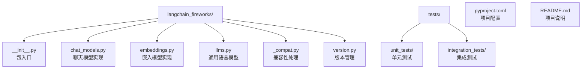
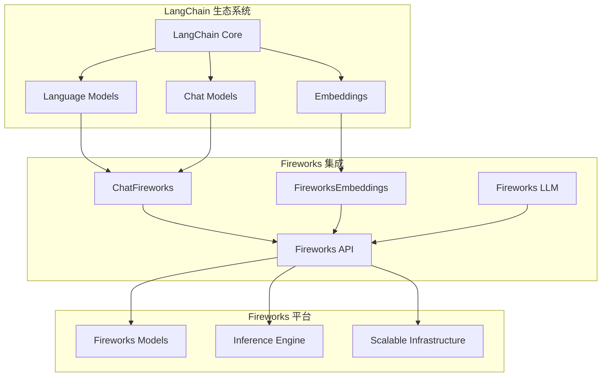
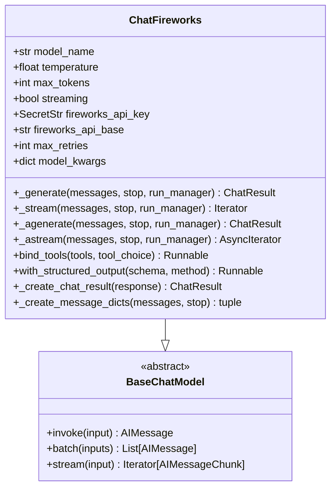
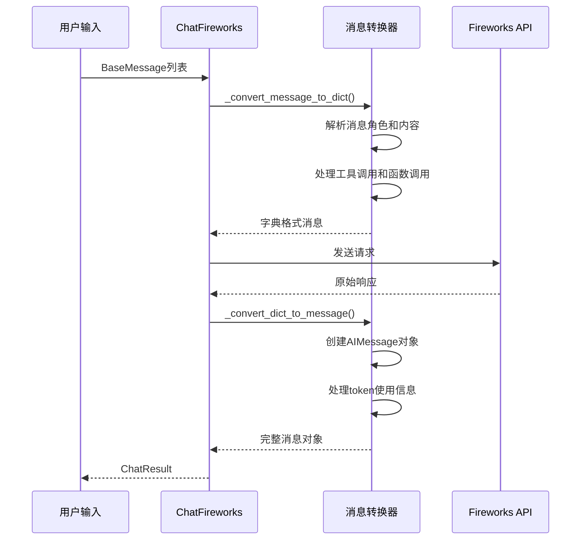
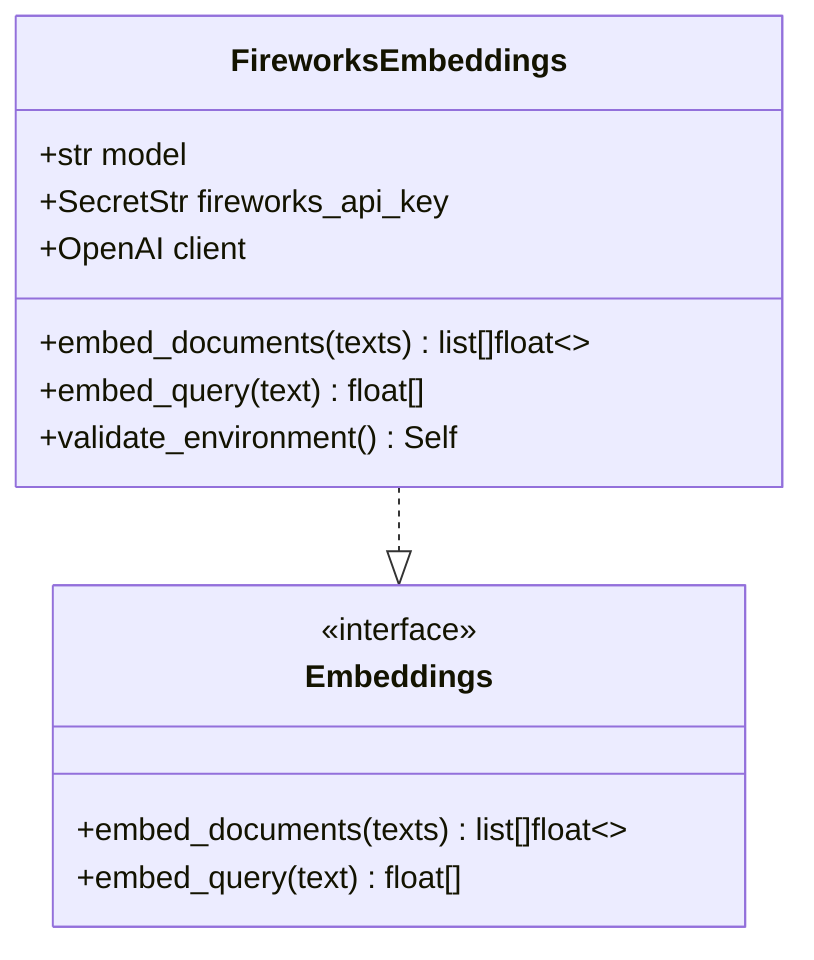
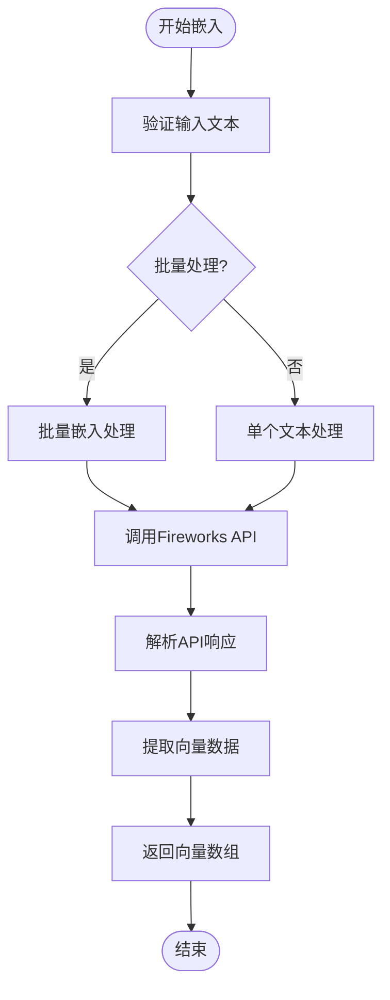
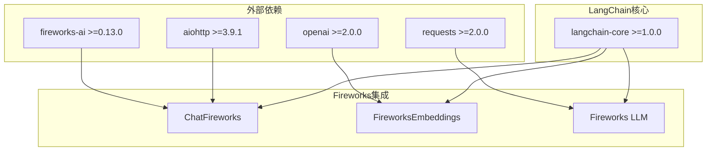

# Fireworks 集成

<cite>
**本文档中引用的文件**
- [libs/partners/fireworks/README.md](file://libs/partners/fireworks/README.md)
- [libs/partners/fireworks/langchain_fireworks/__init__.py](file://libs/partners/fireworks/langchain_fireworks/__init__.py)
- [libs/partners/fireworks/langchain_fireworks/chat_models.py](file://libs/partners/fireworks/langchain_fireworks/chat_models.py)
- [libs/partners/fireworks/langchain_fireworks/embeddings.py](file://libs/partners/fireworks/langchain_fireworks/embeddings.py)
- [libs/partners/fireworks/langchain_fireworks/llms.py](file://libs/partners/fireworks/langchain_fireworks/llms.py)
- [libs/partners/fireworks/langchain_fireworks/_compat.py](file://libs/partners/fireworks/langchain_fireworks/_compat.py)
- [libs/partners/fireworks/langchain_fireworks/version.py](file://libs/partners/fireworks/langchain_fireworks/version.py)
- [libs/partners/fireworks/pyproject.toml](file://libs/partners/fireworks/pyproject.toml)
- [libs/partners/fireworks/tests/unit_tests/test_imports.py](file://libs/partners/fireworks/tests/unit_tests/test_imports.py)
- [libs/partners/fireworks/tests/unit_tests/test_embeddings.py](file://libs/partners/fireworks/tests/unit_tests/test_embeddings.py)
- [libs/partners/fireworks/tests/integration_tests/test_embeddings.py](file://libs/partners/fireworks/tests/integration_tests/test_embeddings.py)
</cite>

## 目录
1. [简介](#简介)
2. [项目结构](#项目结构)
3. [核心组件](#核心组件)
4. [架构概览](#架构概览)
5. [详细组件分析](#详细组件分析)
6. [依赖关系分析](#依赖关系分析)
7. [性能考虑](#性能考虑)
8. [故障排除指南](#故障排除指南)
9. [结论](#结论)

## 简介

Fireworks集成是LangChain生态系统中的一个重要合作伙伴包，专门用于连接Fireworks.ai平台和LangChain框架。Fireworks.ai是一个高性能的大语言模型服务平台，以其低延迟和高效率而闻名，特别适合需要实时响应的应用场景。

该集成提供了对Fireworks平台上各种开源大语言模型的统一访问接口，包括聊天模型（ChatFireworks）、嵌入模型（FireworksEmbeddings）和通用语言模型（Fireworks）。通过这个集成，开发者可以轻松地在LangChain应用中使用Fireworks平台托管的最新开源模型，享受其优化的推理引擎和可扩展的基础设施。

## 项目结构

Fireworks集成包采用模块化设计，主要包含以下核心文件：



**图表来源**
- [libs/partners/fireworks/langchain_fireworks/__init__.py](file://libs/partners/fireworks/langchain_fireworks/__init__.py#L1-L10)
- [libs/partners/fireworks/pyproject.toml](file://libs/partners/fireworks/pyproject.toml#L1-L20)

**章节来源**
- [libs/partners/fireworks/langchain_fireworks/__init__.py](file://libs/partners/fireworks/langchain_fireworks/__init__.py#L1-L10)
- [libs/partners/fireworks/README.md](file://libs/partners/fireworks/README.md#L1-L23)

## 核心组件

Fireworks集成包含三个主要的核心组件，每个都针对不同的使用场景进行了优化：

### 组件概览表

| 组件 | 类名 | 主要功能 | 支持的模型类型 |
|------|------|----------|----------------|
| 聊天模型 | ChatFireworks | 对话式交互、工具调用、结构化输出 | 多种聊天模型 |
| 嵌入模型 | FireworksEmbeddings | 文本向量化、语义搜索 | 嵌入模型 |
| 通用语言模型 | Fireworks | 文本生成、补全 | 通用LLM |

**章节来源**
- [libs/partners/fireworks/langchain_fireworks/__init__.py](file://libs/partners/fireworks/langchain_fireworks/__init__.py#L1-L10)
- [libs/partners/fireworks/tests/unit_tests/test_imports.py](file://libs/partners/fireworks/tests/unit_tests/test_imports.py#L1-L11)

## 架构概览

Fireworks集成采用了标准的LangChain架构模式，实现了`langchain_core`接口规范，确保与LangChain生态系统的完全兼容性。



**图表来源**
- [libs/partners/fireworks/langchain_fireworks/chat_models.py](file://libs/partners/fireworks/langchain_fireworks/chat_models.py#L200-L300)
- [libs/partners/fireworks/langchain_fireworks/embeddings.py](file://libs/partners/fireworks/langchain_fireworks/embeddings.py#L1-L50)

## 详细组件分析

### ChatFireworks 聊天模型

ChatFireworks是Fireworks集成的核心组件，提供了完整的聊天模型功能，支持多种高级特性。

#### 核心功能特性



**图表来源**
- [libs/partners/fireworks/langchain_fireworks/chat_models.py](file://libs/partners/fireworks/langchain_fireworks/chat_models.py#L200-L400)

#### 消息转换机制

ChatFireworks实现了复杂的消息转换机制，能够处理不同格式的消息：



**图表来源**
- [libs/partners/fireworks/langchain_fireworks/chat_models.py](file://libs/partners/fireworks/langchain_fireworks/chat_models.py#L100-L200)

#### 结构化输出支持

ChatFireworks提供了强大的结构化输出功能，支持多种输出格式：

| 方法 | 描述 | 使用场景 |
|------|------|----------|
| function_calling | 使用工具调用功能 | 复杂的数据提取和验证 |
| json_mode | JSON模式输出 | 纯JSON格式的数据生成 |
| json_schema | JSON Schema验证 | 类型安全的数据生成 |

**章节来源**
- [libs/partners/fireworks/langchain_fireworks/chat_models.py](file://libs/partners/fireworks/langchain_fireworks/chat_models.py#L700-L800)

### FireworksEmbeddings 嵌入模型

FireworksEmbeddings提供了高效的文本向量化功能，支持多种嵌入模型。

#### 嵌入模型架构



**图表来源**
- [libs/partners/fireworks/langchain_fireworks/embeddings.py](file://libs/partners/fireworks/langchain_fireworks/embeddings.py#L1-L50)

#### 嵌入功能流程



**图表来源**
- [libs/partners/fireworks/langchain_fireworks/embeddings.py](file://libs/partners/fireworks/langchain_fireworks/embeddings.py#L80-L106)

**章节来源**
- [libs/partners/fireworks/langchain_fireworks/embeddings.py](file://libs/partners/fireworks/langchain_fireworks/embeddings.py#L1-L106)

### Fireworks LLM 通用语言模型

Fireworks类提供了通用的语言模型功能，适用于文本生成和补全任务。

#### LLM配置参数

| 参数 | 类型 | 默认值 | 描述 |
|------|------|--------|------|
| model | str | 必需 | 模型名称 |
| temperature | float | None | 控制随机性的温度参数 |
| max_tokens | int | None | 最大生成token数 |
| top_p | float | None | 核采样参数 |
| top_k | int | None | Top-k采样参数 |
| repetition_penalty | float | None | 重复惩罚参数 |
| logprobs | int | None | 返回的log概率数量 |

**章节来源**
- [libs/partners/fireworks/langchain_fireworks/llms.py](file://libs/partners/fireworks/langchain_fireworks/llms.py#L1-L100)

## 依赖关系分析

Fireworks集成的依赖关系体现了其轻量级和模块化的设计理念。



**图表来源**
- [libs/partners/fireworks/pyproject.toml](file://libs/partners/fireworks/pyproject.toml#L8-L15)

### 版本兼容性

集成包严格遵循语义化版本控制，确保与LangChain核心的兼容性：

- **langchain-core**: >=1.0.0,<2.0.0
- **fireworks-ai**: >=0.13.0,<1.0.0
- **Python**: >=3.10.0,<4.0.0

**章节来源**
- [libs/partners/fireworks/pyproject.toml](file://libs/partners/fireworks/pyproject.toml#L8-L20)

## 性能考虑

Fireworks集成在设计时充分考虑了性能优化，提供了多种配置选项来满足不同场景的需求。

### 性能优化策略

#### 连接池和重试机制
- **最大重试次数**: 可配置的重试机制，防止网络波动导致的失败
- **请求超时**: 支持自定义超时设置，平衡响应时间和稳定性
- **异步支持**: 提供同步和异步两种调用方式

#### 流式处理优化
- **流式生成**: 支持实时流式响应，降低首字节时间
- **增量处理**: 分块处理大型响应，减少内存占用
- **并发控制**: 合理的并发限制，避免资源耗尽

### 成本控制建议

#### Token使用优化
- **max_tokens参数**: 合理设置最大token数，避免不必要的费用
- **temperature调节**: 适当降低温度参数，提高生成质量的同时减少token消耗
- **提示词优化**: 编写简洁有效的提示词，减少token使用

#### 模型选择策略
- **模型匹配**: 根据任务复杂度选择合适的模型
- **缓存策略**: 利用LangChain的缓存机制，避免重复计算
- **批处理**: 对于大量相似请求，使用批量处理模式

## 故障排除指南

### 常见问题及解决方案

#### API密钥相关问题

**问题**: API密钥无效或未设置
```python
# 错误示例
from langchain_fireworks import ChatFireworks
model = ChatFireworks(model_name="some-model")  # 抛出错误
```

**解决方案**: 
1. 设置环境变量 `FIREWORKS_API_KEY`
2. 在初始化时直接传入API密钥
3. 使用SecretStr安全存储密钥

#### 模型不可用问题

**问题**: 指定的模型不存在或不可用
```python
# 检查可用模型
available_models = ["accounts/fireworks/models/llama-v3p1-8b-instruct"]
```

**解决方案**: 
- 查阅Fireworks官方文档确认模型名称
- 确保模型在当前账户权限范围内
- 使用默认模型作为临时解决方案

#### 网络连接问题

**问题**: 请求超时或网络连接失败
```python
# 配置超时和重试
model = ChatFireworks(
    model_name="some-model",
    request_timeout=30.0,
    max_retries=3
)
```

**解决方案**: 
- 增加超时时间
- 启用重试机制
- 检查网络连接状态

**章节来源**
- [libs/partners/fireworks/langchain_fireworks/chat_models.py](file://libs/partners/fireworks/langchain_fireworks/chat_models.py#L300-L400)

## 结论

Fireworks集成为LangChain生态系统提供了强大而灵活的开源大语言模型访问能力。通过ChatFireworks、FireworksEmbeddings和Fireworks LLM三个核心组件，开发者可以轻松构建高性能的AI应用。

### 主要优势

1. **高性能**: 基于Fireworks平台的优化推理引擎，提供低延迟响应
2. **易用性**: 完整的LangChain接口实现，无缝集成现有应用
3. **灵活性**: 支持多种模型和配置选项，适应不同应用场景
4. **可扩展性**: 可扩展的基础设施支持大规模部署
5. **成本效益**: 竞争性的定价策略和灵活的计费模式

### 最佳实践建议

1. **合理配置参数**: 根据具体需求调整温度、最大token数等参数
2. **监控使用情况**: 定期检查API使用量和成本
3. **错误处理**: 实现完善的错误处理和重试机制
4. **性能测试**: 在生产环境中进行充分的性能测试
5. **安全考虑**: 正确管理API密钥和敏感数据

Fireworks集成代表了现代AI应用开发的一个重要方向，它不仅提供了技术上的先进性，更重要的是为开发者创造了一个更加开放和高效的AI开发环境。