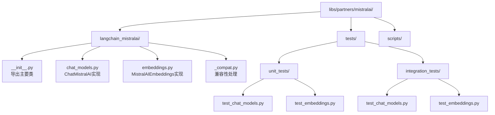
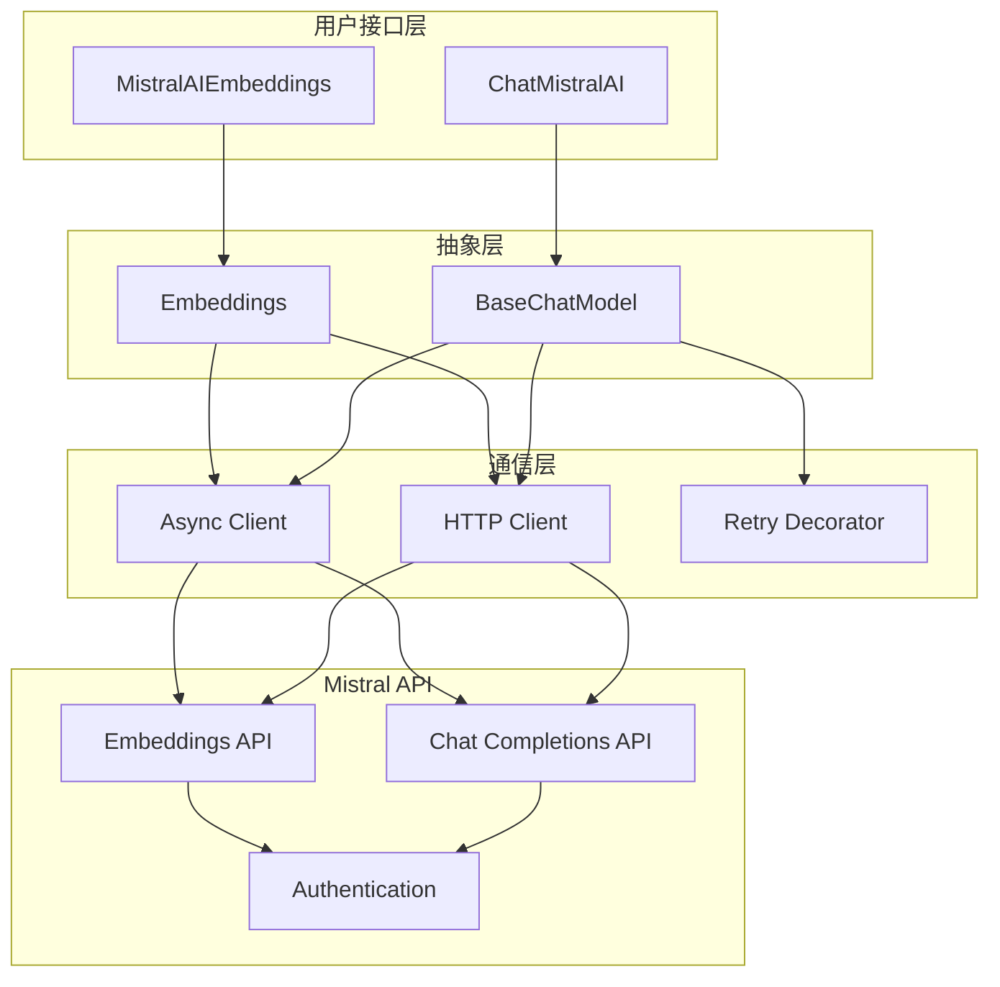
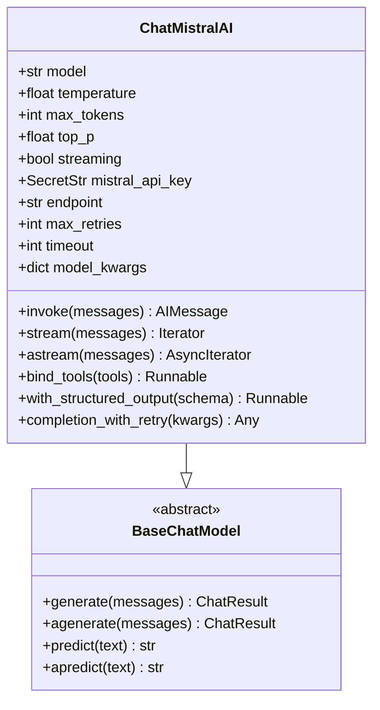
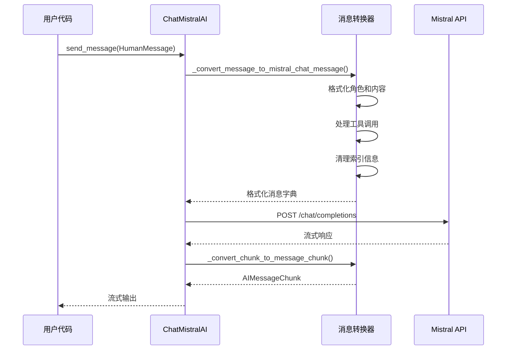
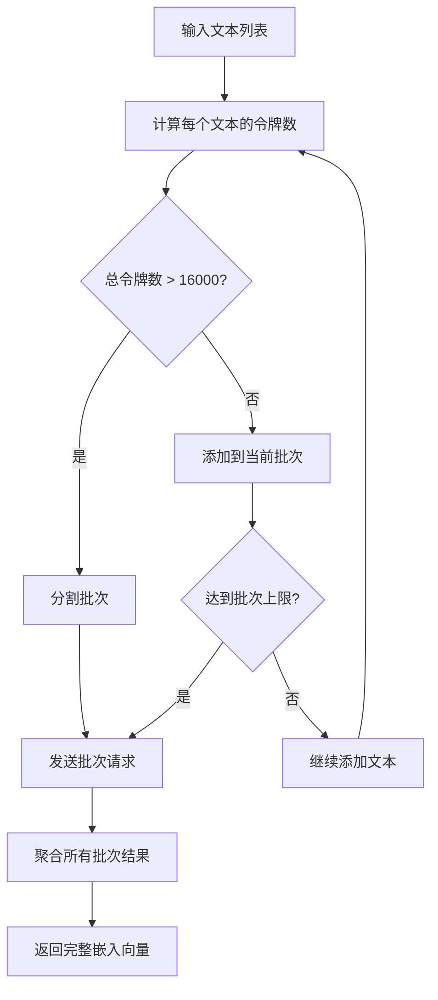
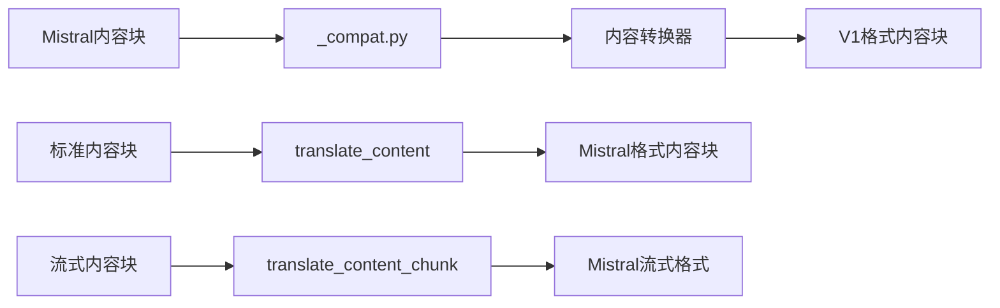
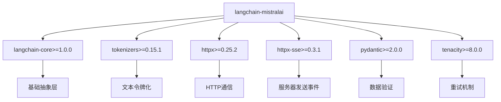

# MistralAI 集成

<cite>
**本文档中引用的文件**
- [libs/partners/mistralai/README.md](file://libs/partners/mistralai/README.md)
- [libs/partners/mistralai/pyproject.toml](file://libs/partners/mistralai/pyproject.toml)
- [libs/partners/mistralai/langchain_mistralai/__init__.py](file://libs/partners/mistralai/langchain_mistralai/__init__.py)
- [libs/partners/mistralai/langchain_mistralai/chat_models.py](file://libs/partners/mistralai/langchain_mistralai/chat_models.py)
- [libs/partners/mistralai/langchain_mistralai/embeddings.py](file://libs/partners/mistralai/langchain_mistralai/embeddings.py)
- [libs/partners/mistralai/langchain_mistralai/_compat.py](file://libs/partners/mistralai/langchain_mistralai/_compat.py)
- [libs/partners/mistralai/tests/unit_tests/test_chat_models.py](file://libs/partners/mistralai/tests/unit_tests/test_chat_models.py)
- [libs/partners/mistralai/tests/unit_tests/test_embeddings.py](file://libs/partners/mistralai/tests/unit_tests/test_embeddings.py)
- [libs/partners/mistralai/tests/integration_tests/test_chat_models.py](file://libs/partners/mistralai/tests/integration_tests/test_chat_models.py)
- [libs/partners/mistralai/tests/integration_tests/test_embeddings.py](file://libs/partners/mistralai/tests/integration_tests/test_embeddings.py)
</cite>

## 目录
1. [简介](#简介)
2. [项目结构](#项目结构)
3. [核心组件](#核心组件)
4. [架构概览](#架构概览)
5. [详细组件分析](#详细组件分析)
6. [依赖关系分析](#依赖关系分析)
7. [性能考虑](#性能考虑)
8. [故障排除指南](#故障排除指南)
9. [结论](#结论)

## 简介

LangChain与MistralAI集成是一个强大的连接器，为开发者提供了对Mistral AI公司发布的高性能、高效率大语言模型的便捷访问。该集成封装了Mistral的REST API，遵循`langchain_core`的抽象层，确保与LangChain框架的其他部分无缝协作。

Mistral AI以其在较小参数量下表现出的卓越性能而闻名，在保持高质量输出的同时显著降低了计算成本。该集成支持多种Mistral模型，包括Mistral、Mixtral等系列模型，为开发者提供了灵活的选择。

## 项目结构

MistralAI集成位于LangChain项目的合作伙伴模块中，采用清晰的组织结构：



**图表来源**
- [libs/partners/mistralai/langchain_mistralai/__init__.py](file://libs/partners/mistralai/langchain_mistralai/__init__.py#L1-L5)
- [libs/partners/mistralai/langchain_mistralai/chat_models.py](file://libs/partners/mistralai/langchain_mistralai/chat_models.py#L1-L50)
- [libs/partners/mistralai/langchain_mistralai/embeddings.py](file://libs/partners/mistralai/langchain_mistralai/embeddings.py#L1-L50)

**章节来源**
- [libs/partners/mistralai/README.md](file://libs/partners/mistralai/README.md#L1-L19)
- [libs/partners/mistralai/pyproject.toml](file://libs/partners/mistralai/pyproject.toml#L1-L110)

## 核心组件

MistralAI集成包含两个核心组件，分别处理不同的AI功能：

### 主要导出组件

集成通过`__init__.py`导出了两个主要类：
- **ChatMistralAI**: 基于Mistral API的聊天模型实现
- **MistralAIEmbeddings**: Mistral嵌入模型的实现

### 技术栈组成

该集成建立在以下技术栈之上：
- **HTTP客户端**: 使用`httpx`库进行API通信
- **异步支持**: 提供同步和异步操作接口
- **重试机制**: 基于`tenacity`库的智能重试
- **类型安全**: 使用`pydantic`进行数据验证
- **令牌化**: 集成`tokenizers`库进行文本处理

**章节来源**
- [libs/partners/mistralai/langchain_mistralai/__init__.py](file://libs/partners/mistralai/langchain_mistralai/__init__.py#L1-L5)
- [libs/partners/mistralai/pyproject.toml](file://libs/partners/mistralai/pyproject.toml#L8-L15)

## 架构概览

MistralAI集成采用了分层架构设计，确保了良好的可扩展性和维护性：



**图表来源**
- [libs/partners/mistralai/langchain_mistralai/chat_models.py](file://libs/partners/mistralai/langchain_mistralai/chat_models.py#L445-L481)
- [libs/partners/mistralai/langchain_mistralai/embeddings.py](file://libs/partners/mistralai/langchain_mistralai/embeddings.py#L45-L85)

该架构的核心特点：
- **分离关注点**: 不同层次负责不同职责
- **可插拔设计**: 支持自定义客户端和重试策略
- **类型安全**: 使用Pydantic确保数据完整性
- **错误处理**: 内置重试和异常处理机制

## 详细组件分析

### ChatMistralAI 聊天模型

`ChatMistralAI`是集成的核心组件，提供了与Mistral聊天模型交互的完整接口。

#### 核心特性



**图表来源**
- [libs/partners/mistralai/langchain_mistralai/chat_models.py](file://libs/partners/mistralai/langchain_mistralai/chat_models.py#L445-L481)

#### 消息转换机制

系统实现了复杂的消息转换逻辑，确保LangChain消息格式与Mistral API格式的正确映射：



**图表来源**
- [libs/partners/mistralai/langchain_mistralai/chat_models.py](file://libs/partners/mistralai/langchain_mistralai/chat_models.py#L350-L420)
- [libs/partners/mistralai/langchain_mistralai/chat_models.py](file://libs/partners/mistralai/langchain_mistralai/chat_models.py#L250-L350)

#### 工具调用支持

MistralAI集成提供了强大的工具调用功能，支持函数调用和结构化输出：

- **工具绑定**: 通过`bind_tools()`方法绑定外部工具
- **结构化输出**: 支持JSON模式、JSON Schema和函数调用三种输出格式
- **错误处理**: 完善的工具调用错误捕获和恢复机制

**章节来源**
- [libs/partners/mistralai/langchain_mistralai/chat_models.py](file://libs/partners/mistralai/langchain_mistralai/chat_models.py#L700-L750)
- [libs/partners/mistralai/tests/unit_tests/test_chat_models.py](file://libs/partners/mistralai/tests/unit_tests/test_chat_models.py#L275-L352)

### MistralAIEmbeddings 嵌入模型

嵌入模型组件提供了文本向量化功能，支持语义搜索和相似度计算。

#### 批处理优化



**图表来源**
- [libs/partners/mistralai/langchain_mistralai/embeddings.py](file://libs/partners/mistralai/langchain_mistralai/embeddings.py#L190-L220)

#### 异步处理能力

嵌入模型同时支持同步和异步操作：

- **同步接口**: `embed_documents()` 和 `embed_query()`
- **异步接口**: `aembed_documents()` 和 `aembed_query()`
- **批量处理**: 自动优化批次大小以提高效率
- **重试机制**: 内置错误重试和超时处理

**章节来源**
- [libs/partners/mistralai/langchain_mistralai/embeddings.py](file://libs/partners/mistralai/langchain_mistralai/embeddings.py#L230-L322)
- [libs/partners/mistralai/tests/integration_tests/test_embeddings.py](file://libs/partners/mistralai/tests/integration_tests/test_embeddings.py#L1-L91)

### 兼容性处理

集成包含了专门的兼容性模块，处理不同版本之间的差异：



**图表来源**
- [libs/partners/mistralai/langchain_mistralai/_compat.py](file://libs/partners/mistralai/langchain_mistralai/_compat.py#L1-L126)

**章节来源**
- [libs/partners/mistralai/langchain_mistralai/_compat.py](file://libs/partners/mistralai/langchain_mistralai/_compat.py#L1-L126)

## 依赖关系分析

MistralAI集成的依赖关系体现了现代Python包管理的最佳实践：



**图表来源**
- [libs/partners/mistralai/pyproject.toml](file://libs/partners/mistralai/pyproject.toml#L8-L15)

### 关键依赖说明

| 依赖项 | 版本要求 | 用途 |
|--------|----------|------|
| langchain-core | >=1.0.0,<2.0.0 | 提供基础抽象和接口 |
| tokenizers | >=0.15.1,<1.0.0 | 文本令牌化和批处理优化 |
| httpx | >=0.25.2,<1.0.0 | HTTP客户端和异步支持 |
| httpx-sse | >=0.3.1,<1.0.0 | 服务器发送事件流处理 |
| pydantic | >=2.0.0,<3.0.0 | 数据验证和序列化 |
| tenacity | >=8.0.0 | 智能重试机制 |

**章节来源**
- [libs/partners/mistralai/pyproject.toml](file://libs/partners/mistralai/pyproject.toml#L8-L15)

## 性能考虑

### 模型选择和优化

MistralAI集成支持多种模型，每种都有其特定的性能特征：

| 模型系列 | 参数规模 | 推理速度 | 成本效益 | 适用场景 |
|----------|----------|----------|----------|----------|
| mistral-small | 中等 | 快速 | 高 | 通用任务、快速推理 |
| mistral-medium | 较大 | 中等 | 中等 | 复杂对话、长文档处理 |
| mistral-large | 最大 | 较慢 | 低 | 高质量生成、复杂推理 |
| ministral-8b | 小型 | 最快 | 最高 | 轻量级应用、边缘部署 |
| magistral-medium | 特殊 | 中等 | 中等 | 推理增强功能 |

### 批处理优化策略

系统实现了智能的批处理策略来优化API调用：

- **令牌计数**: 使用Hugging Face tokenizer精确计算批次大小
- **动态调整**: 根据模型限制自动调整批次大小
- **并发控制**: 支持最大64个并发请求
- **内存管理**: 及时释放处理完成的批次数据

### 缓存和重用机制

- **连接复用**: HTTP客户端连接池减少握手开销
- **SSL上下文缓存**: 全局SSL上下文避免重复创建
- **工具调用ID缓存**: 工具调用ID转换结果缓存

## 故障排除指南

### 常见问题和解决方案

#### API密钥问题
```python
# 错误：API密钥未设置
# 解决方案1：环境变量
export MISTRAL_API_KEY="your-api-key"

# 解决方案2：直接传入
mistral = ChatMistralAI(api_key="your-api-key")
```

#### 连接超时问题
```python
# 增加超时时间
mistral = ChatMistralAI(timeout=300)  # 5分钟

# 增加重试次数
mistral = ChatMistralAI(max_retries=10)
```

#### 批处理限制
```python
# 大文档处理
documents = ["very long text"] * 100
# 系统会自动分割为多个批次
embeddings = MistralAIEmbeddings().embed_documents(documents)
```

#### 工具调用ID冲突
系统自动处理工具调用ID的格式转换，确保与Mistral API兼容。

**章节来源**
- [libs/partners/mistralai/tests/unit_tests/test_chat_models.py](file://libs/partners/mistralai/tests/unit_tests/test_chat_models.py#L150-L200)
- [libs/partners/mistralai/tests/integration_tests/test_chat_models.py](file://libs/partners/mistralai/tests/integration_tests/test_chat_models.py#L80-L120)

### 调试技巧

1. **启用日志记录**: 设置`logging.level`为DEBUG查看详细信息
2. **检查网络连接**: 验证API端点可达性
3. **监控令牌使用**: 使用`usage_metadata`跟踪API调用统计
4. **测试小规模输入**: 先用少量数据验证集成工作正常

## 结论

LangChain与MistralAI集成提供了一个强大、灵活且易于使用的接口，使开发者能够充分利用Mistral AI的高性能模型。该集成的主要优势包括：

### 技术优势
- **无缝集成**: 完全遵循LangChain框架的设计原则
- **类型安全**: 使用Pydantic确保数据完整性
- **异步支持**: 同时提供同步和异步操作接口
- **错误处理**: 内置重试机制和异常处理

### 功能特性
- **多模型支持**: 支持Mistral系列的各种模型
- **工具调用**: 完整的函数调用和结构化输出支持
- **嵌入功能**: 高效的文本向量化能力
- **流式处理**: 实时响应和增量输出

### 性能优化
- **智能批处理**: 自动优化API调用批次大小
- **连接复用**: 减少网络开销
- **并发控制**: 支持高并发请求处理

该集成不仅简化了Mistral AI API的使用，还为开发者提供了与LangChain生态系统其他组件无缝协作的能力，是构建现代化AI应用程序的理想选择。