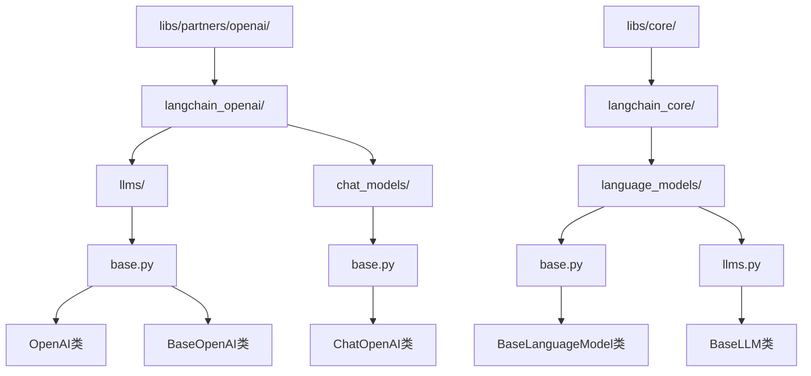
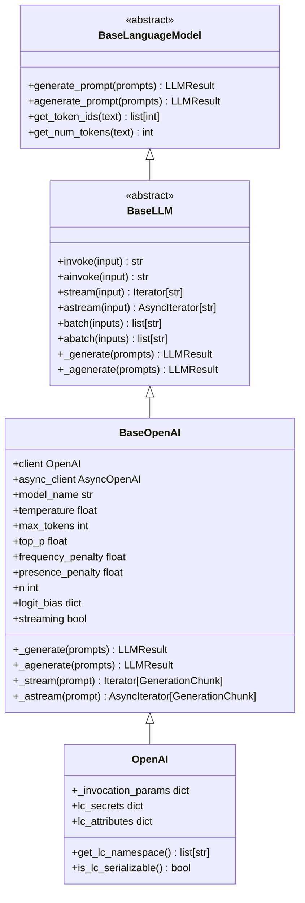
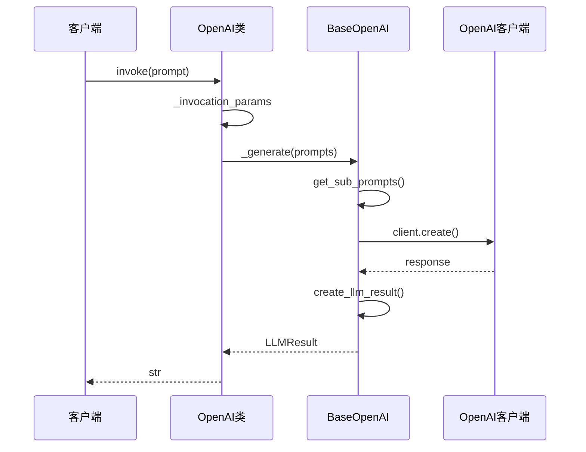
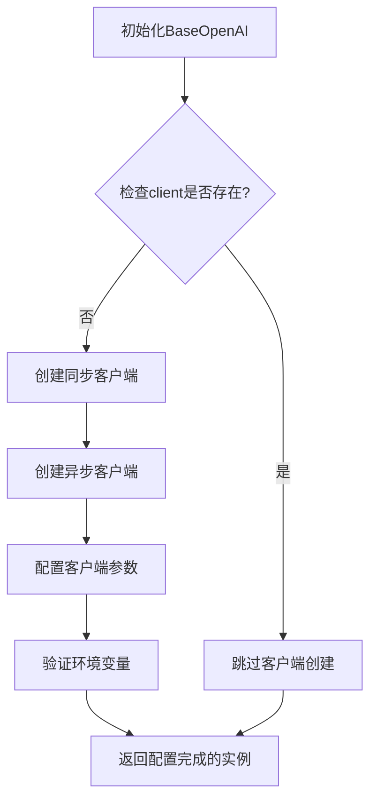
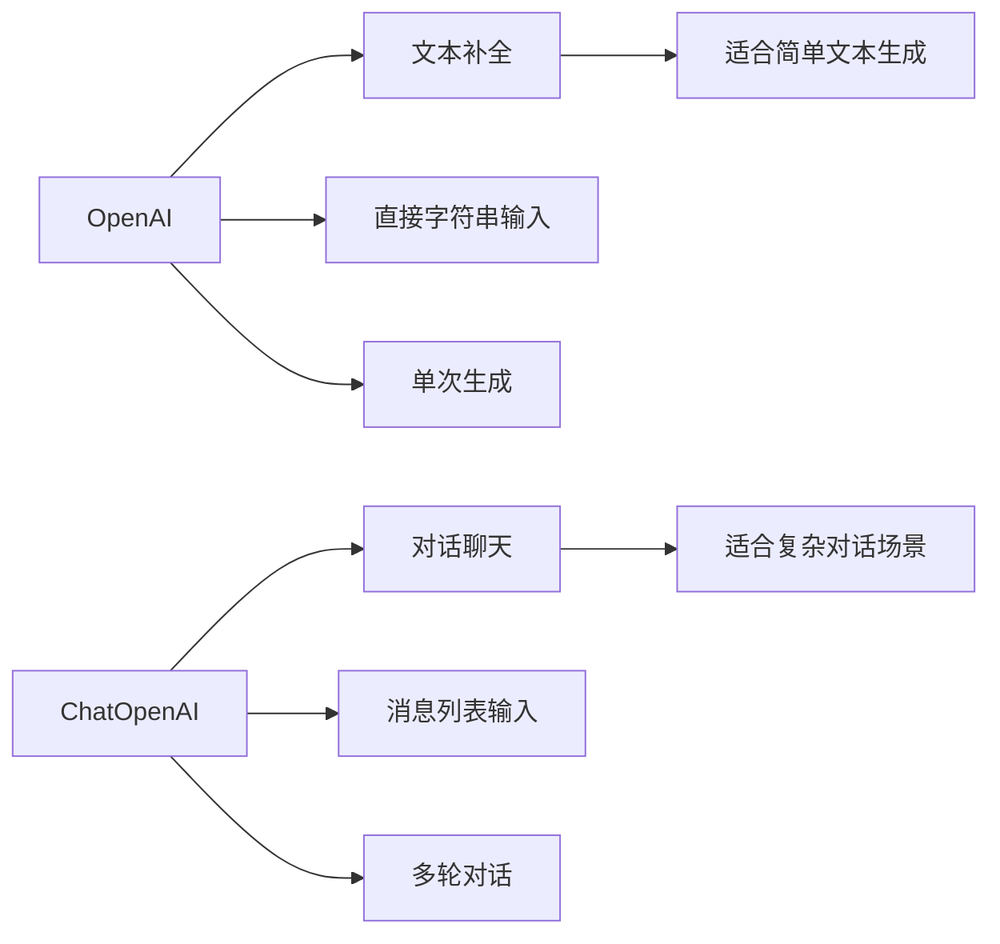

# 基础LLM模型 (OpenAI)

<cite>
**本文档中引用的文件**
- [base.py](file://libs/partners/openai/langchain_openai/llms/base.py)
- [base.py](file://libs/core/langchain_core/language_models/base.py)
- [llms.py](file://libs/core/langchain_core/language_models/llms.py)
- [base.py](file://libs/partners/openai/langchain_openai/chat_models/base.py)
- [__init__.py](file://libs/partners/openai/langchain_openai/llms/__init__.py)
- [test_token_counts.py](file://libs/partners/openai/tests/unit_tests/test_token_counts.py)
</cite>

## 目录
1. [简介](#简介)
2. [项目结构](#项目结构)
3. [核心组件](#核心组件)
4. [架构概览](#架构概览)
5. [详细组件分析](#详细组件分析)
6. [与ChatOpenAI的对比](#与chatopenai的对比)
7. [配置和使用指南](#配置和使用指南)
8. [性能考虑](#性能考虑)
9. [故障排除指南](#故障排除指南)
10. [结论](#结论)

## 简介

LangChain中的OpenAI基础LLM模型（`OpenAI`类）为开发者提供了与OpenAI传统的文本补全模型（如text-davinci-003）进行交互的能力。这个类实现了`langchain_core.language_models.llms.BaseLLM`接口，为传统的文本生成任务提供了标准化的访问方式。

虽然当前以聊天模型为主导的开发范式已经占据了主流地位，但OpenAI基础LLM模型仍然在某些特定场景下具有重要价值，特别是在需要传统文本补全功能的应用中。

## 项目结构

LangChain中的OpenAI相关组件主要分布在以下目录结构中：



**图表来源**
- [base.py](file://libs/partners/openai/langchain_openai/llms/base.py#L1-L50)
- [base.py](file://libs/core/langchain_core/language_models/base.py#L1-L50)
- [llms.py](file://libs/core/langchain_core/language_models/llms.py#L1-L50)

**章节来源**
- [base.py](file://libs/partners/openai/langchain_openai/llms/base.py#L1-L100)
- [__init__.py](file://libs/partners/openai/langchain_openai/llms/__init__.py#L1-L7)

## 核心组件

### OpenAI类

`OpenAI`类是LangChain中OpenAI传统文本补全模型的主要实现，继承自`BaseOpenAI`类，后者又继承自`BaseLLM`。这个类提供了完整的文本生成能力，支持同步和异步调用、流式输出等功能。

### BaseOpenAI基类

`BaseOpenAI`类作为所有OpenAI模型的基础，提供了通用的功能和配置选项，包括：
- API客户端管理
- 参数验证和处理
- 流式和非流式生成
- 缓存支持
- 错误处理

### BaseLLM接口

`BaseLLM`类定义了所有语言模型的基本接口，确保了不同模型实现之间的一致性。

**章节来源**
- [base.py](file://libs/partners/openai/langchain_openai/llms/base.py#L703-L833)
- [base.py](file://libs/partners/openai/langchain_openai/llms/base.py#L37-L130)

## 架构概览



**图表来源**
- [base.py](file://libs/core/langchain_core/language_models/base.py#L100-L200)
- [llms.py](file://libs/core/langchain_core/language_models/llms.py#L286-L350)
- [base.py](file://libs/partners/openai/langchain_openai/llms/base.py#L37-L130)

## 详细组件分析

### OpenAI类实现

`OpenAI`类是LangChain中OpenAI传统文本补全模型的核心实现。它提供了以下关键特性：

#### 主要属性和配置

| 属性 | 类型 | 默认值 | 描述 |
|------|------|--------|------|
| `model_name` | str | "gpt-3.5-turbo-instruct" | 要使用的OpenAI模型名称 |
| `temperature` | float | 0.7 | 采样温度，控制随机性 |
| `max_tokens` | int | 256 | 生成的最大标记数 |
| `top_p` | float | 1.0 | 核采样参数 |
| `frequency_penalty` | float | 0.0 | 频率惩罚 |
| `presence_penalty` | float | 0.0 | 存在惩罚 |
| `n` | int | 1 | 为每个提示生成的完成数量 |
| `logit_bias` | dict | None | 特定标记的概率调整 |
| `streaming` | bool | False | 是否启用流式输出 |

#### 核心方法实现



**图表来源**
- [base.py](file://libs/partners/openai/langchain_openai/llms/base.py#L400-L500)
- [base.py](file://libs/partners/openai/langchain_openai/llms/base.py#L500-L600)

#### 异步操作支持

OpenAI类完全支持异步操作，提供了`ainvoke()`、`astream()`和`abatch()`方法，允许在异步环境中高效使用模型。

**章节来源**
- [base.py](file://libs/partners/openai/langchain_openai/llms/base.py#L703-L833)
- [base.py](file://libs/partners/openai/langchain_openai/llms/base.py#L300-L400)

### BaseOpenAI基类功能

`BaseOpenAI`类提供了OpenAI模型的通用功能，包括：

#### API客户端管理



**图表来源**
- [base.py](file://libs/partners/openai/langchain_openai/llms/base.py#L286-L321)

#### 参数验证和处理

BaseOpenAI类包含了严格的参数验证逻辑，确保传入的参数符合OpenAI API的要求。

**章节来源**
- [base.py](file://libs/partners/openai/langchain_openai/llms/base.py#L200-L286)

## 与ChatOpenAI的对比

### 参数差异对比

| 参数类别 | OpenAI | ChatOpenAI | 差异说明 |
|----------|--------|------------|----------|
| 模型名称 | `model` | `model` | 基本相同，但ChatOpenAI支持更多聊天模型 |
| 温度控制 | `temperature` | `temperature` | 基本相同 |
| 最大令牌数 | `max_tokens` | `max_tokens` | 基本相同 |
| 流式输出 | `streaming` | `streaming` | OpenAI不支持流式输出 |
| 上下文大小 | 内置计算 | 内置计算 | OpenAI自动处理上下文限制 |
| 消息格式 | 文本字符串 | 消息列表 | ChatOpenAI支持消息格式 |

### 使用模式差异



### 适用场景对比

| 场景 | OpenAI | ChatOpenAI | 推荐理由 |
|------|--------|------------|----------|
| 简单文本生成 | ✅ | ❌ | OpenAI更适合 |
| 对话系统 | ❌ | ✅ | ChatOpenAI更适合 |
| 批量文本处理 | ✅ | ⚠️ | OpenAI效率更高 |
| 复杂对话管理 | ❌ | ✅ | ChatOpenAI原生支持 |

**章节来源**
- [base.py](file://libs/partners/openai/langchain_openai/llms/base.py#L286-L321)
- [base.py](file://libs/partners/openai/langchain_openai/chat_models/base.py#L909-L950)

## 配置和使用指南

### 基本配置

#### 环境变量设置

```bash
export OPENAI_API_KEY="your-api-key"
export OPENAI_ORG_ID="your-organization-id"  # 可选
export OPENAI_API_BASE="https://api.openai.com/v1"  # 自定义端点时使用
```

#### 基本使用示例

```python
from langchain_openai import OpenAI

# 基本实例化
model = OpenAI(
    model="gpt-3.5-turbo-instruct",
    temperature=0.7,
    max_tokens=256,
    top_p=1.0,
    frequency_penalty=0.0,
    presence_penalty=0.0
)

# 同步调用
result = model.invoke("解释什么是人工智能")
print(result)

# 流式输出
for chunk in model.stream("写一首关于春天的诗"):
    print(chunk, end="")

# 异步调用
import asyncio
async def main():
    result = await model.ainvoke("Python编程的最佳实践")
    print(result)

asyncio.run(main())
```

### 高级配置选项

#### 批量处理配置

```python
# 配置批量处理大小
model = OpenAI(
    model="gpt-3.5-turbo-instruct",
    batch_size=20,  # 控制并发请求数量
    max_retries=3,  # 设置重试次数
    request_timeout=30.0  # 设置请求超时
)
```

#### 自定义HTTP客户端

```python
import httpx
from langchain_openai import OpenAI

# 使用自定义HTTP客户端
http_client = httpx.Client(
    proxies="http://proxy.example.com:8080",
    timeout=httpx.Timeout(30.0)
)

model = OpenAI(
    model="gpt-3.5-turbo-instruct",
    http_client=http_client,
    http_async_client=httpx.AsyncClient()
)
```

#### 上下文大小管理

```python
from langchain_openai import OpenAI

model = OpenAI(model="text-davinci-003")

# 获取模型上下文大小
context_size = model.max_context_size
print(f"模型最大上下文: {context_size} tokens")

# 计算可用令牌数
prompt = "这是一个测试提示"
available_tokens = model.max_tokens_for_prompt(prompt)
print(f"可用令牌数: {available_tokens}")
```

**章节来源**
- [base.py](file://libs/partners/openai/langchain_openai/llms/base.py#L130-L200)
- [base.py](file://libs/partners/openai/langchain_openai/llms/base.py#L624-L668)

## 性能考虑

### 并发处理优化

OpenAI类支持批量处理和并发调用，可以通过以下方式优化性能：

1. **批量大小调整**：通过`batch_size`参数控制并发请求数量
2. **连接池复用**：使用自定义HTTP客户端实现连接池复用
3. **异步调用**：利用异步方法提高I/O密集型任务的效率

### 内存管理

- **流式处理**：对于长文本生成，建议使用流式输出避免内存占用过高
- **上下文限制**：合理设置`max_tokens`防止超出模型上下文限制

### 缓存策略

OpenAI类集成了LangChain的缓存机制，可以显著提高重复查询的性能：

```python
from langchain_core.caches import InMemoryCache
from langchain_openai import OpenAI

# 启用缓存
model = OpenAI(
    model="gpt-3.5-turbo-instruct",
    cache=InMemoryCache()  # 或者 True 使用全局缓存
)
```

## 故障排除指南

### 常见问题及解决方案

#### API密钥问题

```python
# 问题：API密钥未正确设置
# 解决方案：检查环境变量或显式传递
from langchain_openai import OpenAI

# 方法1：设置环境变量
# export OPENAI_API_KEY="your-key"

# 方法2：显式传递
model = OpenAI(api_key="your-key")
```

#### 请求超时问题

```python
# 增加超时时间
model = OpenAI(
    request_timeout=60.0,  # 增加到60秒
    max_retries=5  # 增加重试次数
)
```

#### 上下文溢出

```python
# 检查并调整提示长度
model = OpenAI(model="text-davinci-003")

prompt = "一个很长的提示..."
available_tokens = model.max_tokens_for_prompt(prompt)

if available_tokens <= 0:
    # 截断提示或使用其他方法
    prompt = prompt[:model.max_context_size - 100]
```

#### 令牌计数问题

```python
# 使用正确的令牌计数器
from langchain_openai import OpenAI

model = OpenAI(model="text-davinci-003")

# 正确的令牌计数
text = "Hello world"
tokens = model.get_num_tokens(text)
print(f"文本包含 {tokens} 个令牌")
```

**章节来源**
- [base.py](file://libs/partners/openai/langchain_openai/llms/base.py#L200-L286)
- [test_token_counts.py](file://libs/partners/openai/tests/unit_tests/test_token_counts.py#L1-L33)

## 结论

LangChain中的OpenAI基础LLM模型（`OpenAI`类）为开发者提供了一个强大而灵活的接口，用于与OpenAI的传统文本补全模型进行交互。尽管当前以聊天模型为主导的开发范式已经占据主流，但OpenAI基础LLM模型在特定场景下仍然具有不可替代的价值。

### 主要优势

1. **标准化接口**：实现了`BaseLLM`接口，与其他LangChain组件无缝集成
2. **完整功能**：支持同步/异步调用、流式输出、批量处理等
3. **灵活配置**：丰富的参数配置选项满足不同需求
4. **性能优化**：内置缓存、批量处理、并发支持等优化特性

### 适用场景

- 简单的文本生成任务
- 批量文本处理应用
- 需要传统文本补全功能的遗留系统
- 对成本敏感的文本生成应用

### 发展趋势

随着OpenAI不断推出新的模型和功能，OpenAI基础LLM模型将继续演进，为开发者提供更多强大的文本生成能力。同时，它也将继续与LangChain生态系统保持紧密集成，为构建复杂的AI应用提供坚实的基础。