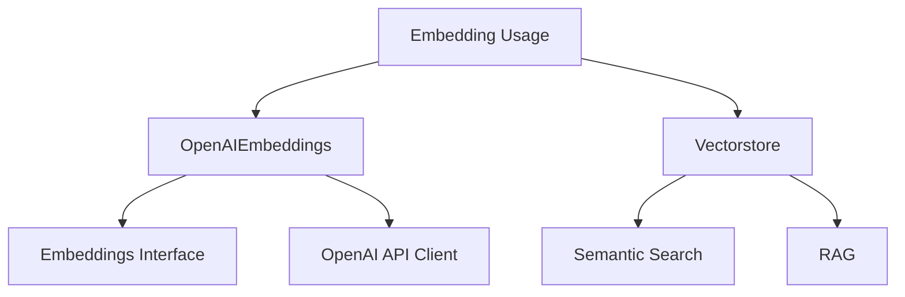
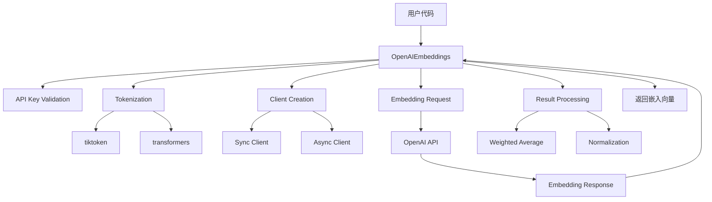
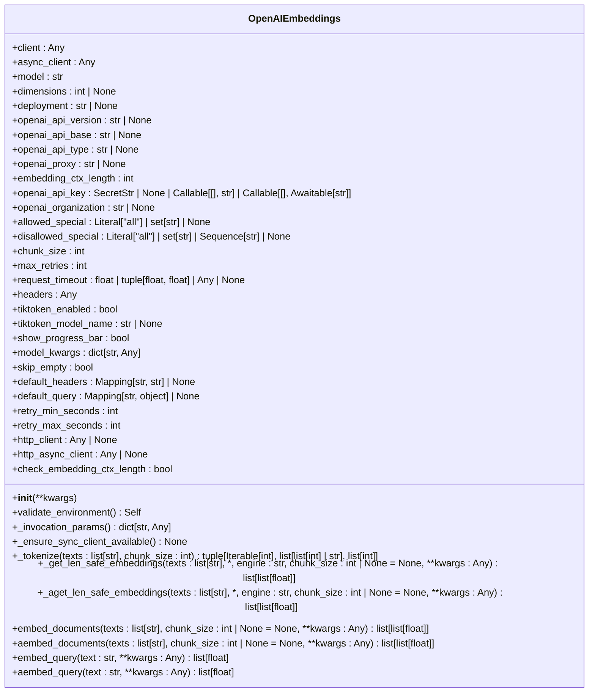
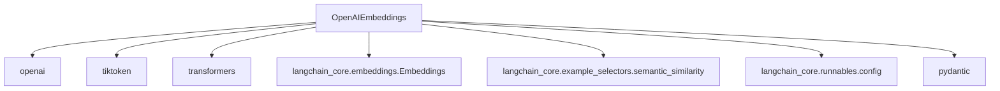

# 嵌入模型 (OpenAIEmbeddings)

<cite>
**本文档中引用的文件**
- [base.py](file://libs/partners/openai/langchain_openai/embeddings/base.py)
- [embeddings.py](file://libs/core/langchain_core/embeddings/embeddings.py)
- [test_base.py](file://libs/partners/openai/tests/unit_tests/embeddings/test_base.py)
- [semantic_similarity.py](file://libs/core/langchain_core/example_selectors/semantic_similarity.py)
- [cache.py](file://libs/langchain/langchain_classic/embeddings/cache.py)
</cite>

## 目录
1. [简介](#简介)
2. [项目结构](#项目结构)
3. [核心组件](#核心组件)
4. [架构概述](#架构概述)
5. [详细组件分析](#详细组件分析)
6. [依赖分析](#依赖分析)
7. [性能考虑](#性能考虑)
8. [故障排除指南](#故障排除指南)
9. [结论](#结论)

## 简介
`OpenAIEmbeddings` 类是 LangChain 框架中与 OpenAI 嵌入模型（如 text-embedding-ada-002）进行交互的主要接口。该类提供了将文本转换为高维向量表示的功能，这些向量可用于语义搜索、检索增强生成（RAG）等应用。本文档将详细介绍 `OpenAIEmbeddings` 的配置、使用方法、核心功能以及在实际应用中的最佳实践。

## 项目结构
LangChain 项目中的嵌入模型功能主要分布在 `libs/partners/openai/langchain_openai/embeddings/` 目录下。核心实现位于 `base.py` 文件中，而 `__init__.py` 文件则负责导出 `OpenAIEmbeddings` 和 `AzureOpenAIEmbeddings` 类。相关的接口定义在 `libs/core/langchain_core/embeddings/embeddings.py` 中，测试文件位于 `libs/partners/openai/tests/unit_tests/embeddings/` 目录下。

**Diagram sources**
- [base.py](file://libs/partners/openai/langchain_openai/embeddings/base.py)
- [embeddings.py](file://libs/core/langchain_core/embeddings/embeddings.py)

**Section sources**
- [base.py](file://libs/partners/openai/langchain_openai/embeddings/base.py)
- [embeddings.py](file://libs/core/langchain_core/embeddings/embeddings.py)

## 核心组件
`OpenAIEmbeddings` 类是 LangChain 中处理 OpenAI 嵌入的核心组件。它继承自 `BaseModel` 和 `Embeddings` 接口，提供了与 OpenAI 嵌入 API 交互所需的所有功能，包括同步和异步的文档与查询嵌入方法。该类通过 `client` 和 `async_client` 字段管理与 OpenAI API 的同步和异步连接。

**Section sources**
- [base.py](file://libs/partners/openai/langchain_openai/embeddings/base.py)

## 架构概述
`OpenAIEmbeddings` 的架构围绕着与 OpenAI API 的高效、可靠交互而设计。它利用 `openai` Python 包来创建同步和异步客户端，并通过 `tiktoken` 或 `transformers` 库来处理文本的分词，以确保输入文本的长度不会超过模型的上下文限制。该类还实现了批处理、重试机制和速率限制处理，以优化性能和可靠性。

**Diagram sources**
- [base.py](file://libs/partners/openai/langchain_openai/embeddings/base.py)

## 详细组件分析

### OpenAIEmbeddings 类分析
`OpenAIEmbeddings` 类是 LangChain 与 OpenAI 嵌入模型交互的桥梁。它封装了所有与 API 通信的复杂性，为用户提供了一个简洁的接口。

#### 类定义与初始化
`OpenAIEmbeddings` 类的初始化参数允许用户配置模型、API 密钥、请求超时、重试次数等。关键参数包括 `model`（指定使用的嵌入模型）、`dimensions`（对于 text-embedding-3 系列模型，可指定嵌入向量的维度）、`api_key`（OpenAI API 密钥）和 `chunk_size`（批处理大小）。

**Diagram sources**
- [base.py](file://libs/partners/openai/langchain_openai/embeddings/base.py)

### 嵌入方法实现
`OpenAIEmbeddings` 提供了 `embed_documents` 和 `embed_query` 两个核心方法来生成嵌入向量。

#### embed_documents 方法
该方法用于对一批文档进行嵌入。它首先检查输入文本的长度是否超过 `embedding_ctx_length`，如果超过，则调用 `_get_len_safe_embeddings` 方法进行分块处理。该方法会将长文本分割成符合上下文长度限制的块，分别获取嵌入，然后根据块的长度进行加权平均，最终得到一个归一化的嵌入向量。

#### embed_query 方法
该方法用于对单个查询进行嵌入。其实现非常简单，它直接调用 `embed_documents` 方法，将查询文本包装成一个单元素列表，并返回结果列表中的第一个（也是唯一一个）嵌入向量。

**Section sources**
- [base.py](file://libs/partners/openai/langchain_openai/embeddings/base.py)

### API 速率限制与错误处理
`OpenAIEmbeddings` 类内置了对 API 速率限制和错误的处理机制。通过 `max_retries` 参数，用户可以指定请求失败时的最大重试次数。`request_timeout` 参数允许设置请求超时时间。此外，`retry_min_seconds` 和 `retry_max_seconds` 参数定义了重试之间的最小和最大等待时间，以实现指数退避策略。当 API 密钥无效或网络出现问题时，该类会抛出相应的异常，如 `ValueError` 或 `ImportError`。

**Section sources**
- [base.py](file://libs/partners/openai/langchain_openai/embeddings/base.py)

## 依赖分析
`OpenAIEmbeddings` 类依赖于多个外部库和内部模块。主要依赖包括 `openai` 库用于与 OpenAI API 通信，`tiktoken` 库用于 OpenAI 模型的分词，以及可选的 `transformers` 库用于非 OpenAI 实现的分词。在 LangChain 内部，它依赖于 `langchain_core.embeddings.Embeddings` 接口，并与 `langchain_core.example_selectors.semantic_similarity` 等模块集成，用于基于语义相似性的示例选择。

**Diagram sources**
- [base.py](file://libs/partners/openai/langchain_openai/embeddings/base.py)
- [embeddings.py](file://libs/core/langchain_core/embeddings/embeddings.py)
- [semantic_similarity.py](file://libs/core/langchain_core/example_selectors/semantic_similarity.py)

## 性能考虑
为了优化性能，`OpenAIEmbeddings` 实现了多种策略。首先，通过 `chunk_size` 参数进行批处理，可以显著减少与 API 的通信次数。其次，`_get_len_safe_embeddings` 方法通过加权平均处理长文本，确保了嵌入的质量。此外，用户可以通过设置 `show_progress_bar=True` 来监控嵌入过程的进度。对于频繁访问的查询，可以结合 `langchain_classic.embeddings.cache` 模块实现缓存，以避免重复的 API 调用。

## 故障排除指南
在使用 `OpenAIEmbeddings` 时，可能会遇到一些常见问题。最常见的问题是 API 密钥无效或未设置，这会导致 `ValueError`。确保环境变量 `OPENAI_API_KEY` 已正确设置，或在初始化时直接传入 `api_key` 参数。另一个常见问题是文本长度超过模型的上下文限制，这可以通过启用 `check_embedding_ctx_length`（默认为 `True`）来自动处理。如果遇到分词问题，可以尝试设置 `tiktoken_enabled=False` 并安装 `transformers` 库作为后备方案。

**Section sources**
- [base.py](file://libs/partners/openai/langchain_openai/embeddings/base.py)
- [cache.py](file://libs/langchain/langchain_classic/embeddings/cache.py)

## 结论
`OpenAIEmbeddings` 是 LangChain 框架中一个强大且灵活的组件，它简化了与 OpenAI 嵌入模型的集成。通过提供清晰的 API、健壮的错误处理和性能优化功能，它使得开发者能够轻松地将语义搜索和 RAG 等高级功能集成到他们的应用中。理解其配置选项、核心方法和最佳实践对于构建高效、可靠的基于嵌入的应用至关重要。