# Azure OpenAI 聊天模型

<cite>
**本文档中引用的文件**
- [azure.py](file://libs/partners/openai/langchain_openai/chat_models/azure.py)
- [base.py](file://libs/partners/openai/langchain_openai/chat_models/base.py)
- [test_azure.py](file://libs/partners/openai/tests/unit_tests/chat_models/test_azure.py)
- [__init__.py](file://libs/partners/openai/langchain_openai/chat_models/__init__.py)
</cite>

## 目录
1. [简介](#简介)
2. [项目结构](#项目结构)
3. [核心组件](#核心组件)
4. [架构概览](#架构概览)
5. [详细组件分析](#详细组件分析)
6. [配置参数详解](#配置参数详解)
7. [企业级应用场景](#企业级应用场景)
8. [安全性和合规性](#安全性和合规性)
9. [最佳实践](#最佳实践)
10. [故障排除指南](#故障排除指南)
11. [总结](#总结)

## 简介

Azure OpenAI 聊天模型（AzureChatOpenAI）是LangChain框架中专门为Azure OpenAI服务设计的接口实现。它扩展了标准的ChatOpenAI模型，提供了针对Azure平台特性的优化配置和功能支持。该模型专为企业级应用设计，具备高安全性、合规性要求环境下的部署能力，并与Azure生态系统深度集成。

AzureChatOpenAI不仅继承了OpenAI模型的所有功能特性，还针对Azure特有的认证机制、网络配置和部署模式进行了专门优化，为企业用户提供了一致且可靠的AI服务体验。

## 项目结构

AzureChatOpenAI在LangChain项目中的组织结构体现了模块化和可扩展的设计理念：

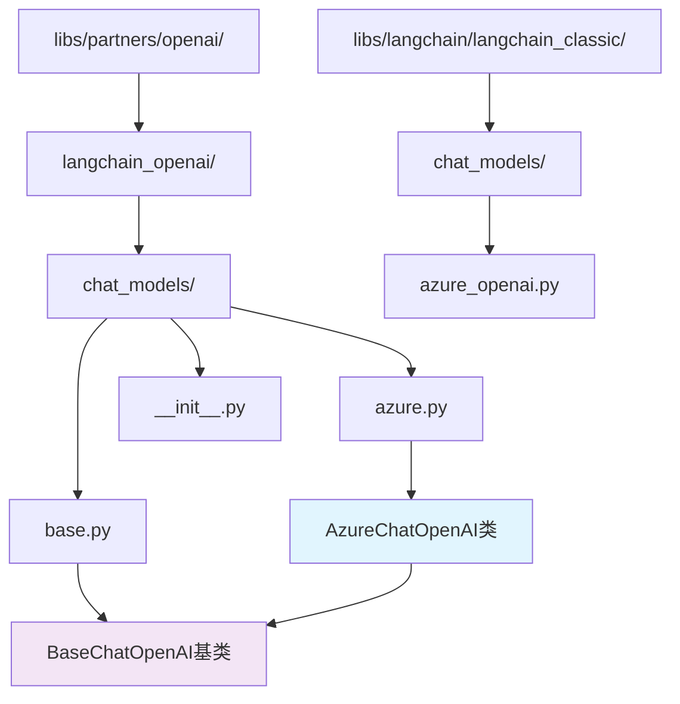

**图表来源**
- [azure.py](file://libs/partners/openai/langchain_openai/chat_models/azure.py#L33-L343)
- [base.py](file://libs/partners/openai/langchain_openai/chat_models/base.py#L400-L500)

**章节来源**
- [azure.py](file://libs/partners/openai/langchain_openai/chat_models/azure.py#L1-L50)
- [__init__.py](file://libs/partners/openai/langchain_openai/chat_models/__init__.py#L1-L7)

## 核心组件

AzureChatOpenAI的核心组件包括认证管理、客户端配置、请求处理和响应解析等关键功能模块：

### 主要特性组件

| 组件 | 功能描述 | 配置参数 |
|------|----------|----------|
| **认证管理** | 支持API密钥和Azure AD令牌认证 | `openai_api_key`, `azure_ad_token` |
| **客户端配置** | Azure特定的API版本和端点设置 | `azure_endpoint`, `openai_api_version` |
| **部署管理** | 模型部署名称和版本控制 | `deployment_name`, `model_version` |
| **异步支持** | 同步和异步请求处理 | `azure_ad_token_provider`, `azure_ad_async_token_provider` |
| **参数验证** | 输入参数的完整性检查 | `disabled_params`, `validate_base_url` |

### 类继承关系

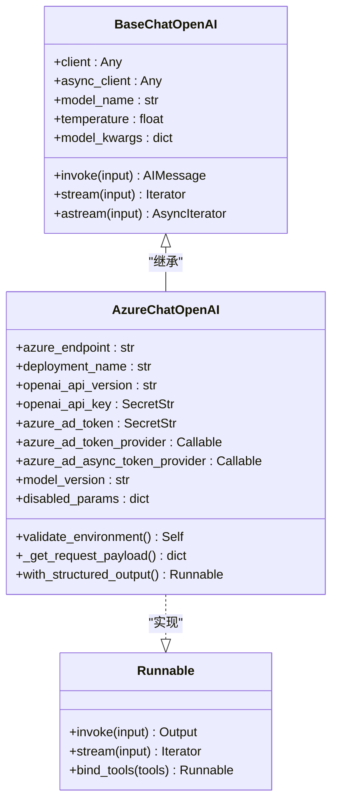

**图表来源**
- [azure.py](file://libs/partners/openai/langchain_openai/chat_models/azure.py#L33-L343)
- [base.py](file://libs/partners/openai/langchain_openai/chat_models/base.py#L400-L500)

**章节来源**
- [azure.py](file://libs/partners/openai/langchain_openai/chat_models/azure.py#L33-L343)
- [base.py](file://libs/partners/openai/langchain_openai/chat_models/base.py#L400-L600)

## 架构概览

AzureChatOpenAI采用分层架构设计，确保了良好的可维护性和扩展性：

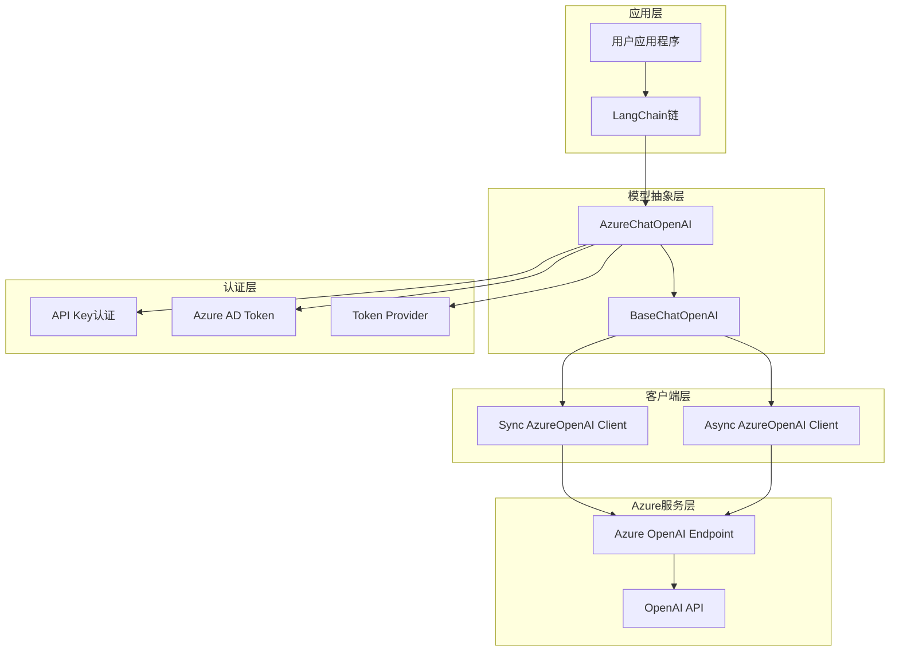

**图表来源**
- [azure.py](file://libs/partners/openai/langchain_openai/chat_models/azure.py#L655-L678)
- [base.py](file://libs/partners/openai/langchain_openai/chat_models/base.py#L400-L500)

## 详细组件分析

### AzureChatOpenAI类实现

AzureChatOpenAI类是Azure OpenAI服务的核心接口，提供了完整的模型交互功能：

#### 关键字段定义

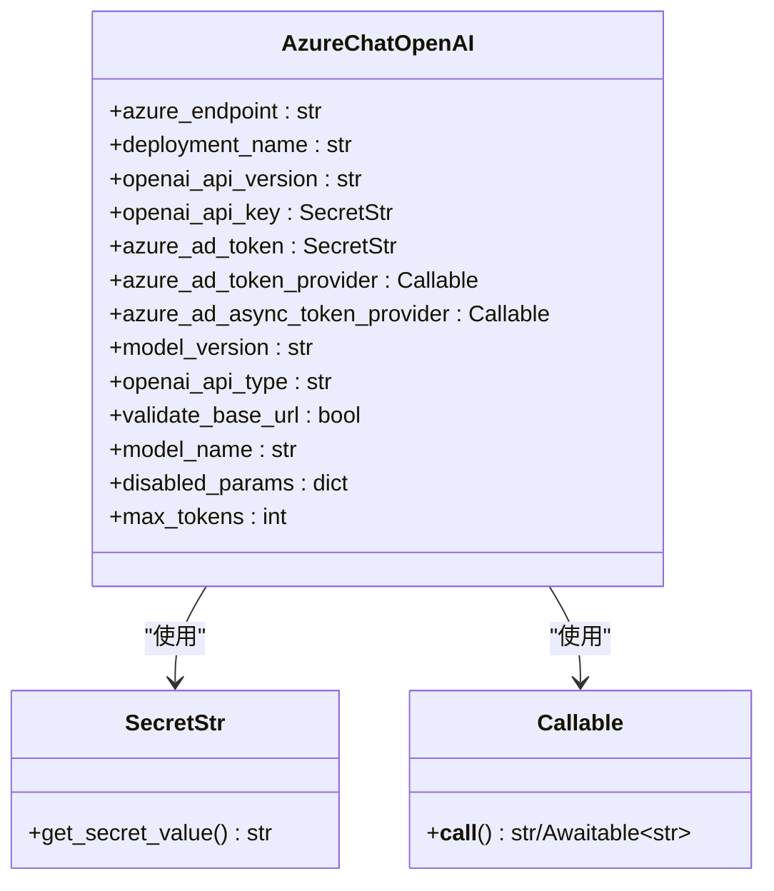

**图表来源**
- [azure.py](file://libs/partners/openai/langchain_openai/chat_models/azure.py#L460-L547)

#### 认证机制

AzureChatOpenAI支持多种认证方式，适应不同的企业安全需求：

1. **API密钥认证**：通过环境变量或直接参数传递
2. **Azure AD令牌认证**：支持静态令牌和动态令牌提供器
3. **混合认证**：同时使用API密钥和AD令牌

#### 客户端初始化流程

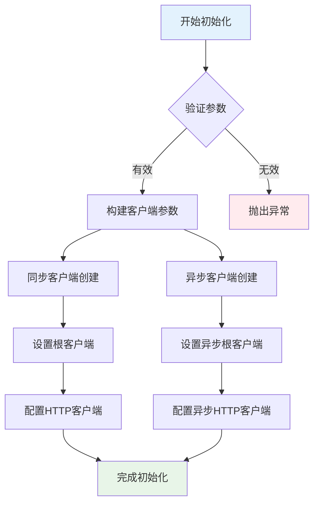

**图表来源**
- [azure.py](file://libs/partners/openai/langchain_openai/chat_models/azure.py#L655-L678)

**章节来源**
- [azure.py](file://libs/partners/openai/langchain_openai/chat_models/azure.py#L33-L343)

### 请求处理机制

AzureChatOpenAI实现了智能的请求路由机制，根据API版本和参数自动选择合适的Azure API：

#### API版本检测

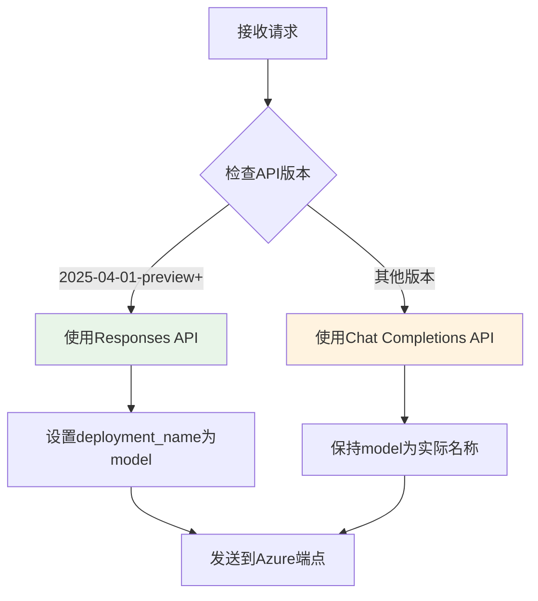

**图表来源**
- [azure.py](file://libs/partners/openai/langchain_openai/chat_models/azure.py#L784-L802)

**章节来源**
- [azure.py](file://libs/partners/openai/langchain_openai/chat_models/azure.py#L784-L802)

### 结构化输出支持

AzureChatOpenAI提供了强大的结构化输出功能，支持多种输出格式和验证机制：

#### 输出方法对比

| 方法 | 描述 | 支持模型 | 适用场景 |
|------|------|----------|----------|
| **json_schema** | 使用OpenAI结构化输出API | gpt-4o系列、o1系列 | 高精度数据提取 |
| **function_calling** | 工具调用方式 | 所有模型 | 复杂业务逻辑 |
| **json_mode** | JSON模式回答 | 所有模型 | 简单数据格式化 |

**章节来源**
- [azure.py](file://libs/partners/openai/langchain_openai/chat_models/azure.py#L821-L1190)

## 配置参数详解

### 必需参数

AzureChatOpenAI的核心配置参数确保了与Azure OpenAI服务的正确连接：

#### 基础连接参数

| 参数名 | 类型 | 默认值 | 描述 |
|--------|------|--------|------|
| `azure_endpoint` | str \| None | 从环境变量读取 | Azure OpenAI服务端点URL |
| `azure_deployment` | str \| None | None | Azure模型部署名称 |
| `api_version` | str \| None | 从环境变量读取 | Azure OpenAI API版本 |

#### 认证相关参数

| 参数名 | 类型 | 默认值 | 描述 |
|--------|------|--------|------|
| `api_key` | SecretStr \| None | 从环境变量读取 | Azure OpenAI API密钥 |
| `azure_ad_token` | SecretStr \| None | 从环境变量读取 | Azure Active Directory令牌 |
| `azure_ad_token_provider` | Callable \| None | None | 异步令牌提供函数 |
| `azure_ad_async_token_provider` | Callable \| None | None | 同步令牌提供函数 |

#### 高级配置参数

| 参数名 | 类型 | 默认值 | 描述 |
|--------|------|--------|------|
| `model` | str \| None | "gpt-3.5-turbo" | 底层OpenAI模型名称 |
| `model_version` | str | "" | 模型版本号 |
| `max_tokens` | int \| None | None | 最大生成token数 |
| `temperature` | float \| None | None | 采样温度 |
| `disabled_params` | dict \| None | None | 禁用的参数列表 |

### 参数验证规则

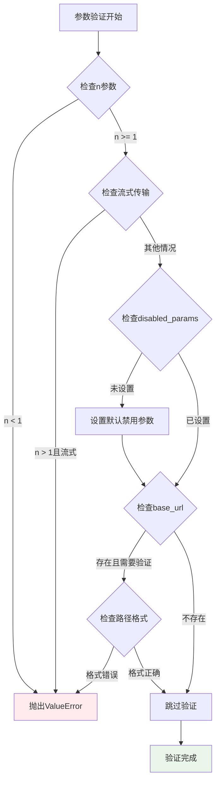

**图表来源**
- [azure.py](file://libs/partners/openai/langchain_openai/chat_models/azure.py#L591-L654)

**章节来源**
- [azure.py](file://libs/partners/openai/langchain_openai/chat_models/azure.py#L460-L547)

## 企业级应用场景

### 金融行业应用

在金融行业中，AzureChatOpenAI被广泛应用于风险评估、客户咨询和合规检查等场景：

#### 风险评估系统

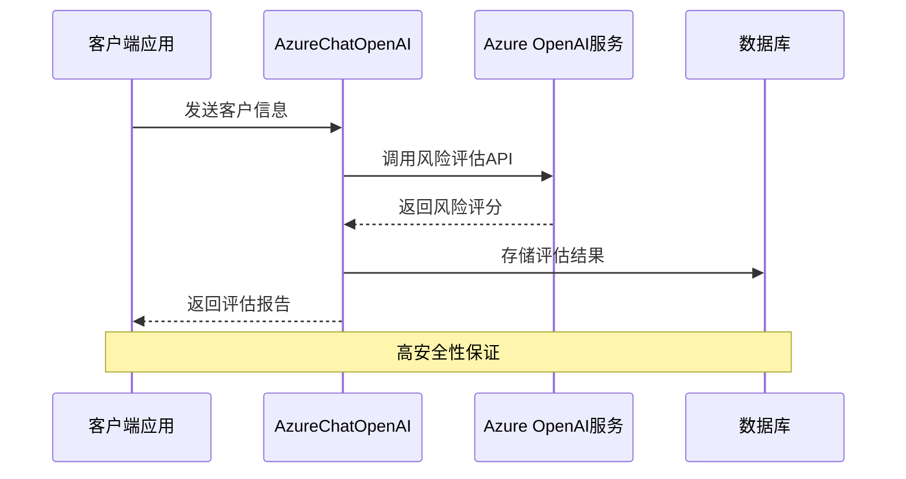

**图表来源**
- [azure.py](file://libs/partners/openai/langchain_openai/chat_models/azure.py#L655-L678)

### 医疗健康应用

医疗健康领域对数据安全和隐私保护有严格要求，AzureChatOpenAI提供了相应的解决方案：

#### 患者咨询系统

- **数据加密**：所有通信均采用端到端加密
- **访问控制**：基于角色的权限管理
- **审计日志**：完整的操作记录和追踪
- **合规认证**：符合HIPAA和FDA标准

### 制造业应用

在制造业中，AzureChatOpenAI用于质量控制、设备维护和供应链优化：

#### 智能质检系统

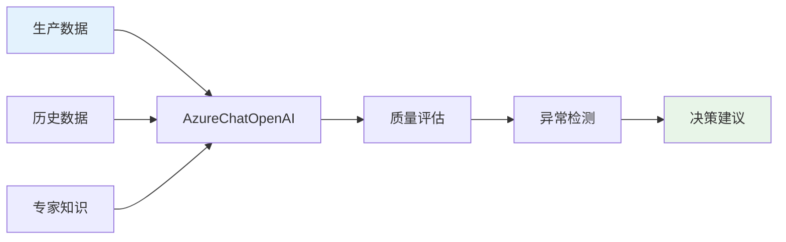

**图表来源**
- [azure.py](file://libs/partners/openai/langchain_openai/chat_models/azure.py#L821-L1190)

**章节来源**
- [azure.py](file://libs/partners/openai/langchain_openai/chat_models/azure.py#L1-L343)

## 安全性和合规性

### 认证和授权

AzureChatOpenAI提供了多层次的安全保障机制：

#### 多因素认证支持

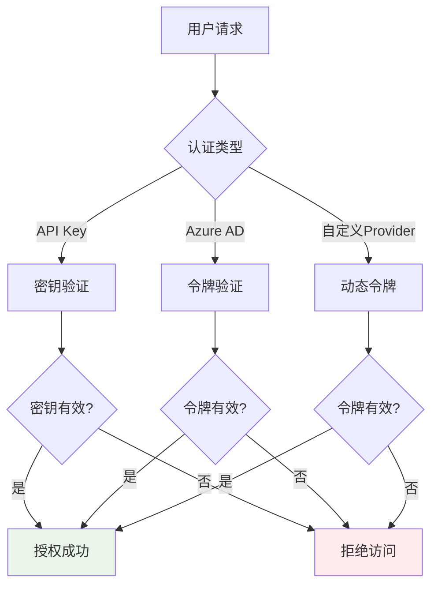

**图表来源**
- [azure.py](file://libs/partners/openai/langchain_openai/chat_models/azure.py#L485-L514)

#### 敏感数据保护

AzureChatOpenAI实现了完整的敏感数据保护机制：

1. **API密钥管理**：使用SecretStr类型确保密钥安全存储
2. **令牌轮换**：支持动态令牌提供器实现自动轮换
3. **访问审计**：记录所有API调用和访问行为
4. **数据隔离**：确保不同租户的数据完全隔离

### 合规性支持

#### GDPR合规

- **数据最小化**：只收集必要的数据
- **删除权**：支持数据删除请求
- **访问权**：允许用户访问其个人数据
- **转移权**：支持数据导出功能

#### 行业标准认证

AzureChatOpenAI支持多种行业标准认证：
- SOC 2 Type II
- ISO 27001
- HIPAA
- PCI DSS

**章节来源**
- [azure.py](file://libs/partners/openai/langchain_openai/chat_models/azure.py#L485-L514)
- [test_azure.py](file://libs/partners/openai/tests/unit_tests/chat_models/test_azure.py#L1-L50)

## 最佳实践

### 配置最佳实践

#### 环境变量管理

推荐使用环境变量管理敏感配置信息：

```bash
# 基础配置
export AZURE_OPENAI_ENDPOINT="https://your-resource.openai.azure.com/"
export AZURE_OPENAI_API_KEY="your-api-key-here"
export OPENAI_API_VERSION="2024-05-01-preview"

# 可选配置
export AZURE_OPENAI_AD_TOKEN="your-ad-token"
export OPENAI_ORG_ID="your-organization-id"
```

#### 错误处理策略

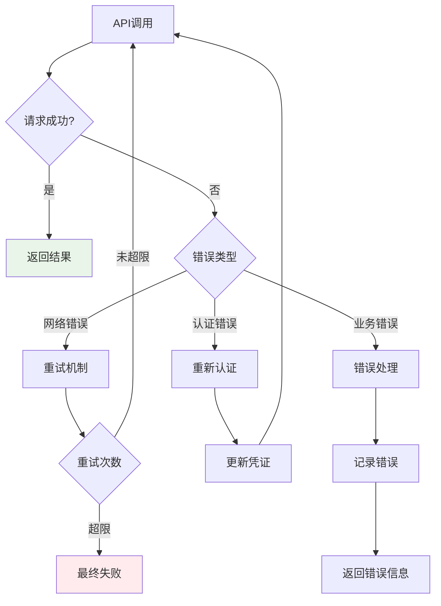

**图表来源**
- [azure.py](file://libs/partners/openai/langchain_openai/chat_models/azure.py#L591-L654)

### 性能优化

#### 连接池管理

合理配置连接池参数以提高性能：

| 参数 | 推荐值 | 说明 |
|------|--------|------|
| `max_retries` | 3 | 最大重试次数 |
| `timeout` | 30.0 | 请求超时时间（秒） |
| `request_timeout` | (5.0, 30.0) | 分段超时配置 |

#### 缓存策略

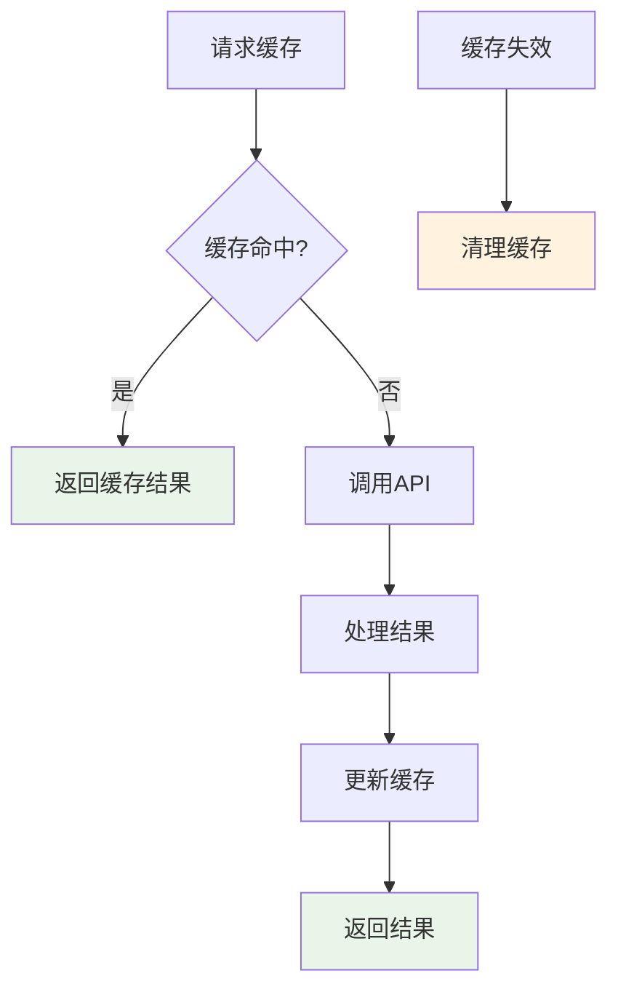

### 监控和日志

#### 关键指标监控

建议监控以下关键指标：
- API调用成功率
- 平均响应时间
- 错误率分布
- Token使用量统计
- 认证失败次数

#### 日志记录规范

```python
# 示例日志配置
import logging

logger = logging.getLogger("azure_openai")
logger.setLevel(logging.INFO)

formatter = logging.Formatter(
    '%(asctime)s - %(name)s - %(levelname)s - %(message)s'
)

handler = logging.StreamHandler()
handler.setFormatter(formatter)
logger.addHandler(handler)
```

**章节来源**
- [azure.py](file://libs/partners/openai/langchain_openai/chat_models/azure.py#L591-L654)

## 故障排除指南

### 常见问题及解决方案

#### 认证问题

| 问题 | 原因 | 解决方案 |
|------|------|----------|
| `AuthenticationError` | API密钥无效 | 检查AZURE_OPENAI_API_KEY环境变量 |
| `AuthorizationError` | 权限不足 | 确认订阅包含Azure OpenAI服务 |
| `TokenExpired` | AD令牌过期 | 实现令牌自动刷新机制 |

#### 网络连接问题

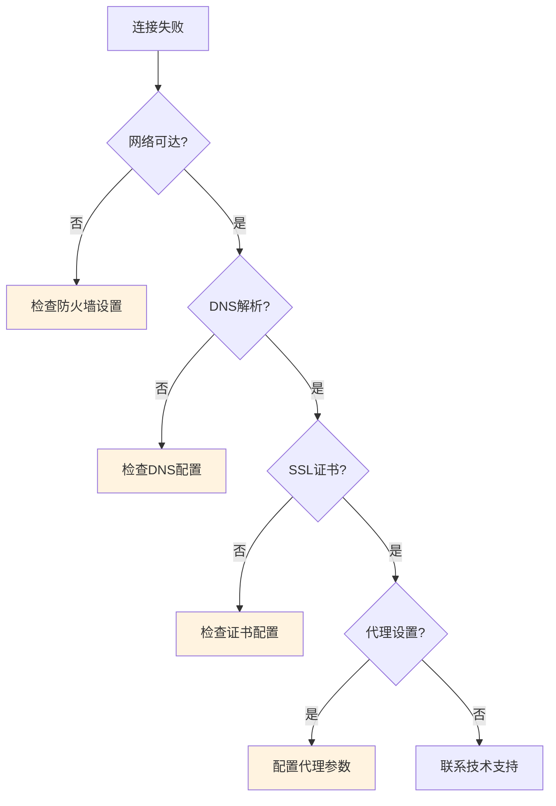

**图表来源**
- [azure.py](file://libs/partners/openai/langchain_openai/chat_models/azure.py#L655-L678)

#### 性能问题诊断

常见的性能问题及解决方法：

1. **响应时间过长**
   - 检查网络延迟
   - 优化请求负载
   - 考虑使用异步调用

2. **并发限制**
   - 增加并发连接数
   - 实现请求队列
   - 使用连接池

3. **内存泄漏**
   - 正确关闭客户端连接
   - 及时释放资源
   - 监控内存使用情况

### 调试工具

#### 启用详细日志

```python
import logging

# 启用OpenAI SDK日志
logging.getLogger("openai").setLevel(logging.DEBUG)

# 启用LangChain日志
logging.getLogger("langchain_openai").setLevel(logging.DEBUG)
```

#### 性能分析

```python
import time
from contextlib import contextmanager

@contextmanager
def timing():
    start = time.time()
    yield
    end = time.time()
    print(f"Operation took {end - start:.2f} seconds")

# 使用示例
with timing():
    result = model.invoke("Hello, world!")
```

**章节来源**
- [test_azure.py](file://libs/partners/openai/tests/unit_tests/chat_models/test_azure.py#L1-L50)

## 总结

Azure OpenAI 聊天模型（AzureChatOpenAI）作为LangChain框架的重要组成部分，为企业级应用提供了强大而灵活的AI服务接口。通过其独特的配置参数、认证机制和企业级特性，AzureChatOpenAI能够满足各种复杂场景的需求。

### 主要优势

1. **企业级安全**：支持多种认证方式和严格的访问控制
2. **合规性保障**：符合多项国际标准和行业规范
3. **高性能设计**：优化的客户端管理和连接池机制
4. **易用性**：简洁的API设计和丰富的功能支持
5. **可扩展性**：模块化的架构便于功能扩展

### 适用场景

- **金融行业**：风险评估、客户服务、合规检查
- **医疗健康**：患者咨询、诊断辅助、研究分析
- **制造业**：质量控制、设备维护、供应链优化
- **政府机构**：政策分析、公共服务、数据分析

### 发展趋势

随着人工智能技术的不断发展，AzureChatOpenAI将继续演进，为用户提供更加智能、安全和高效的服务体验。企业应该根据自身需求，合理选择和配置AzureChatOpenAI，以充分发挥其在数字化转型中的价值。