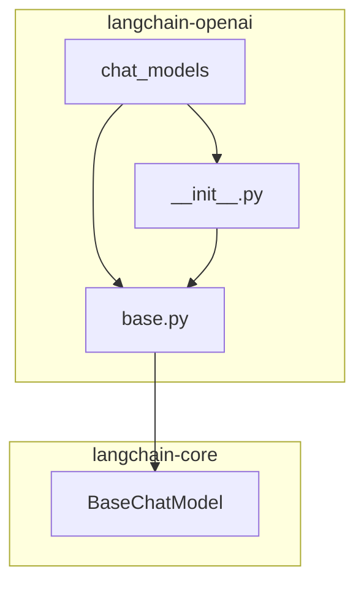
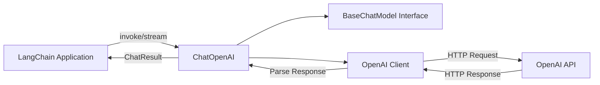
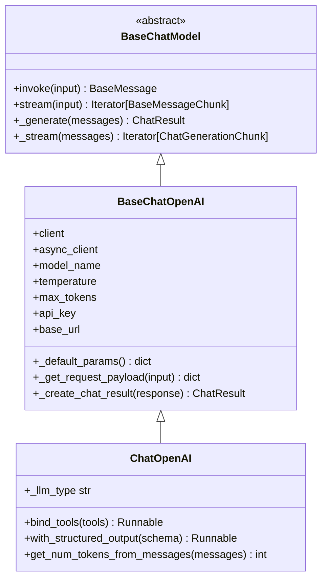
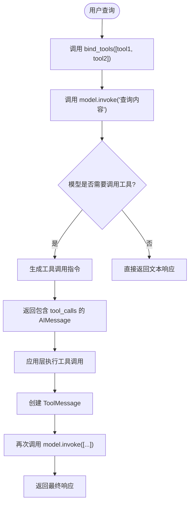
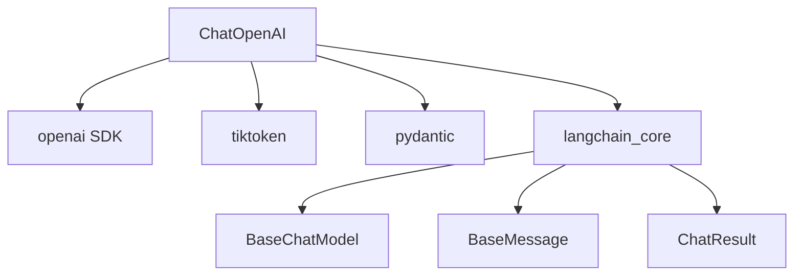

# 核心聊天模型 (ChatOpenAI)

<cite>
**本文档中引用的文件**  
- [base.py](file://libs/partners/openai/langchain_openai/chat_models/base.py)
- [chat_models.py](file://libs/core/langchain_core/language_models/chat_models.py)
- [__init__.py](file://libs/partners/openai/langchain_openai/chat_models/__init__.py)
</cite>

## 目录
1. [简介](#简介)
2. [项目结构](#项目结构)
3. [核心组件](#核心组件)
4. [架构概述](#架构概述)
5. [详细组件分析](#详细组件分析)
6. [依赖关系分析](#依赖关系分析)
7. [性能考虑](#性能考虑)
8. [故障排除指南](#故障排除指南)
9. [结论](#结论)
10. [附录](#附录)（如有必要）

## 简介
`ChatOpenAI` 是 LangChain 库中与 OpenAI 的 GPT-3.5 和 GPT-4 等主流聊天模型进行交互的主要接口。它提供了一个强大且灵活的抽象层，使开发者能够轻松地将 OpenAI 的先进语言模型集成到各种应用程序中。该类不仅封装了与 OpenAI API 通信的复杂性，还提供了丰富的功能，如函数调用、工具调用、结构化输出和流式响应，极大地简化了复杂 AI 应用的开发。`ChatOpenAI` 类的设计遵循了 LangChain 的模块化原则，可以无缝地与 `Runnable` 链、`Agent` 和 `Retriever` 等其他组件集成，构建出功能强大的对话式 AI 系统。

## 项目结构
`ChatOpenAI` 类的实现位于 LangChain 项目的 `libs/partners/openai/langchain_openai/chat_models/` 目录下。其核心逻辑在 `base.py` 文件中定义，该文件包含了 `ChatOpenAI` 类及其基类 `BaseChatOpenAI` 的完整实现。`__init__.py` 文件负责将 `ChatOpenAI` 类导出，使其可以被外部模块导入和使用。这个模块是 `langchain-openai` 包的一部分，专门用于处理与 OpenAI 服务的集成。`ChatOpenAI` 类继承自 `langchain_core` 包中的 `BaseChatModel` 抽象基类，确保了与 LangChain 核心框架的兼容性和一致性。

**Diagram sources**
- [base.py](file://libs/partners/openai/langchain_openai/chat_models/base.py)
- [__init__.py](file://libs/partners/openai/langchain_openai/chat_models/__init__.py)

**Section sources**
- [base.py](file://libs/partners/openai/langchain_openai/chat_models/base.py)
- [__init__.py](file://libs/partners/openai/langchain_openai/chat_models/__init__.py)

## 核心组件
`ChatOpenAI` 类的核心功能围绕着与 OpenAI API 的交互展开。它通过封装 `openai` Python SDK 的客户端，处理所有底层的 HTTP 请求、认证和错误处理。类的主要职责包括：管理 API 密钥和客户端实例、构建符合 OpenAI API 规范的请求负载、处理同步和异步的模型调用、解析 API 响应并将其转换为 LangChain 内部的消息对象（如 `AIMessage`）。此外，它还实现了 `BaseChatModel` 所要求的 `_generate` 和 `_stream` 等方法，为上层应用提供了统一的调用接口。其设计允许将任何未明确支持的参数直接传递给底层的 OpenAI API 调用，提供了极大的灵活性。

**Section sources**
- [base.py](file://libs/partners/openai/langchain_openai/chat_models/base.py#L2103-L3305)

## 架构概述
`ChatOpenAI` 的架构是一个典型的适配器模式，它位于 LangChain 的高级抽象层和 OpenAI 的底层 API 之间。在 LangChain 一侧，它实现了 `BaseChatModel` 接口，可以作为 `Runnable` 链的一部分，接收 `LanguageModelInput` 并产生 `ChatResult`。在 OpenAI 一侧，它使用 `openai.OpenAI` 客户端来执行实际的 API 调用。当用户调用 `invoke` 或 `stream` 方法时，`ChatOpenAI` 会将输入的消息列表转换为 OpenAI API 所需的字典格式，合并初始化参数和运行时参数，然后发起请求。收到响应后，它会将原始的 JSON 响应解析并转换回 LangChain 的消息对象，同时提取如 token 使用量等元数据。

**Diagram sources**
- [base.py](file://libs/partners/openai/langchain_openai/chat_models/base.py)
- [chat_models.py](file://libs/core/langchain_core/language_models/chat_models.py)

## 详细组件分析

### ChatOpenAI 类分析
`ChatOpenAI` 类是与 OpenAI 模型交互的入口点。它的实现基于 `BaseChatOpenAI` 基类，后者又继承自 `langchain_core` 中的 `BaseChatModel`。这种继承关系确保了 `ChatOpenAI` 具备所有标准聊天模型的功能，如 `invoke`、`stream` 和 `batch`。

#### 类图

**Diagram sources**
- [base.py](file://libs/partners/openai/langchain_openai/chat_models/base.py)
- [chat_models.py](file://libs/core/langchain_core/language_models/chat_models.py)

#### 构造函数参数
`ChatOpenAI` 的构造函数接受一系列参数来配置模型行为和客户端设置。

- **`model_name`**: 指定要使用的 OpenAI 模型名称，如 `"gpt-3.5-turbo"` 或 `"gpt-4"`。
- **`temperature`**: 控制输出的随机性。值越高，输出越随机；值越低，输出越确定。
- **`max_tokens`**: 生成的最大 token 数量。
- **`api_key`**: OpenAI API 密钥，可以从环境变量 `OPENAI_API_KEY` 自动读取。
- **`base_url`**: API 请求的基 URL，用于代理或服务模拟器。
- **`organization`**: OpenAI 组织 ID，用于多组织账户。
- **`timeout`**: 请求超时时间。
- **`max_retries`**: 最大重试次数。
- **`model_kwargs`**: 一个字典，用于传递任何未在类中显式定义的标准 OpenAI API 参数。
- **`extra_body`**: 一个字典，用于传递 OpenAI 兼容 API（如 vLLM、LM Studio）的自定义参数，这些参数会被嵌套在请求的 `extra_body` 字段中。

**Section sources**
- [base.py](file://libs/partners/openai/langchain_openai/chat_models/base.py#L2103-L2945)

### 函数调用和工具调用机制
`ChatOpenAI` 的核心优势之一是其强大的工具调用能力。这通过 `bind_tools` 方法实现，该方法允许将 Python 函数或 Pydantic 模型绑定为模型可以调用的“工具”。

#### 工具调用流程图

**Diagram sources**
- [base.py](file://libs/partners/openai/langchain_openai/chat_models/base.py#L2103-L2945)

当模型返回一个包含 `tool_calls` 的 `AIMessage` 时，应用层需要负责执行这些工具调用，并将结果作为 `ToolMessage` 传递回模型，以完成整个对话流程。`bind_tools` 方法还支持 `tool_choice` 参数来强制模型调用特定工具，以及 `parallel_tool_calls` 参数来控制是否并行调用多个工具。

**Section sources**
- [base.py](file://libs/partners/openai/langchain_openai/chat_models/base.py#L2103-L2945)

## 依赖关系分析
`ChatOpenAI` 类的实现依赖于多个外部库和内部模块。最主要的依赖是 `openai` Python SDK，它负责与 OpenAI 服务器进行实际通信。此外，它还依赖于 `tiktoken` 库来计算消息的 token 数量，这对于管理上下文窗口和成本控制至关重要。在内部，它深度依赖于 `langchain_core` 包中的 `BaseChatModel`、`BaseMessage` 和 `ChatResult` 等核心类和接口，确保了与 LangChain 生态系统的无缝集成。`pydantic` 库被用于数据验证和模型定义，特别是在处理结构化输出时。

**Diagram sources**
- [base.py](file://libs/partners/openai/langchain_openai/chat_models/base.py)
- [chat_models.py](file://libs/core/langchain_core/language_models/chat_models.py)

**Section sources**
- [base.py](file://libs/partners/openai/langchain_openai/chat_models/base.py)
- [chat_models.py](file://libs/core/langchain_core/language_models/chat_models.py)

## 性能考虑
在实际应用中，使用 `ChatOpenAI` 时需要考虑性能和成本。首先，应合理设置 `max_tokens` 和 `temperature` 等参数，以避免生成过长或不必要的响应。其次，利用流式响应（`stream`）可以改善用户体验，让用户感觉响应更快。对于高并发场景，应配置适当的 `max_retries` 和 `timeout`，并考虑使用 `BaseRateLimiter` 来避免超出 API 的速率限制。最后，监控 `usage_metadata` 可以帮助跟踪 token 消耗，这对于成本控制和性能优化至关重要。

## 故障排除指南
常见的问题包括 API 密钥错误、模型不支持特定参数、网络超时等。`ChatOpenAI` 会抛出相应的异常，如 `ValueError` 或 `openai.APIError`。调试时，应首先检查 `api_key` 是否正确设置。如果遇到参数错误，可以查阅 OpenAI API 文档确认该模型是否支持该参数。对于流式调用中的问题，可以检查 `stream_usage` 参数的设置。日志记录（通过 Python 的 `logging` 模块）是诊断问题的有力工具。

**Section sources**
- [base.py](file://libs/partners/openai/langchain_openai/chat_models/base.py)

## 结论
`ChatOpenAI` 是 LangChain 中一个功能强大且设计精良的核心组件。它通过提供一个简洁、一致的接口，极大地简化了与 OpenAI 先进语言模型的集成。其对函数调用、工具调用和结构化输出的支持，使其成为构建复杂、智能的 AI 应用的理想选择。通过深入理解其架构、参数和最佳实践，开发者可以有效地利用 `ChatOpenAI` 来创建高性能、高可靠性的对话式 AI 系统。