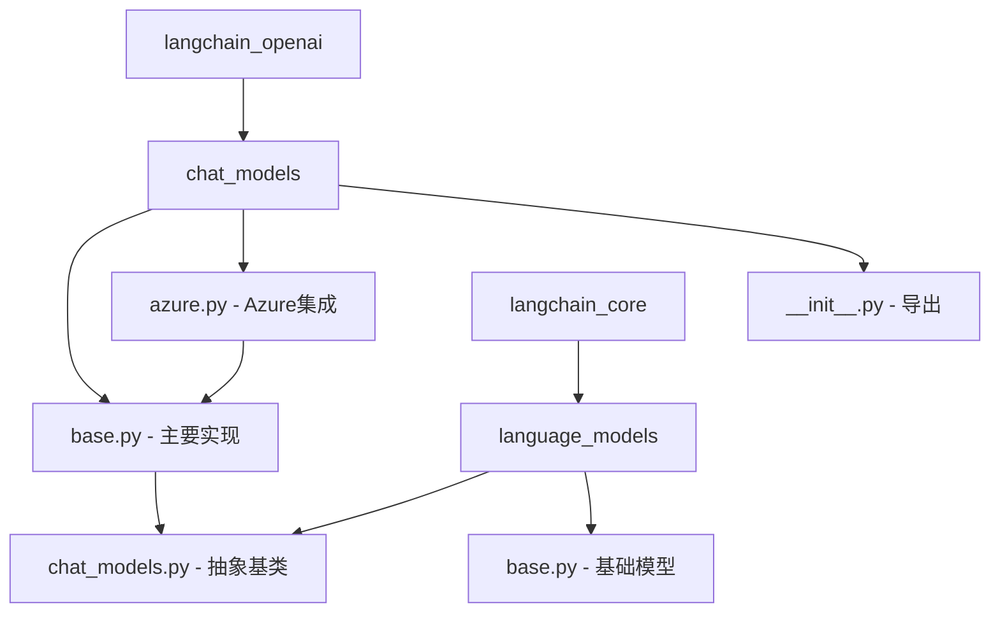
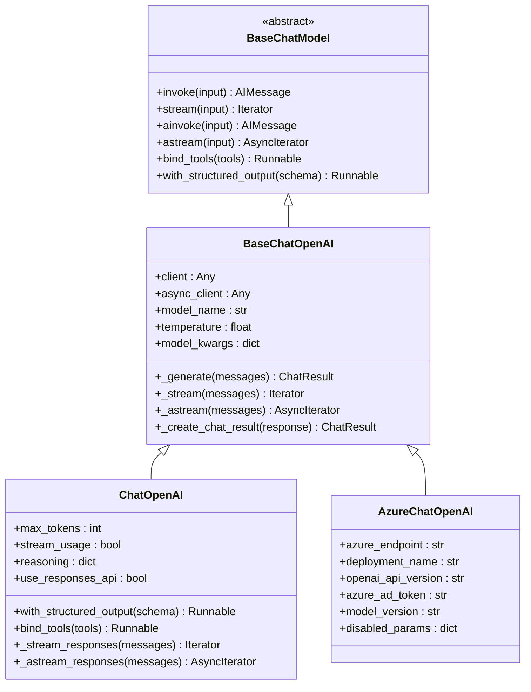
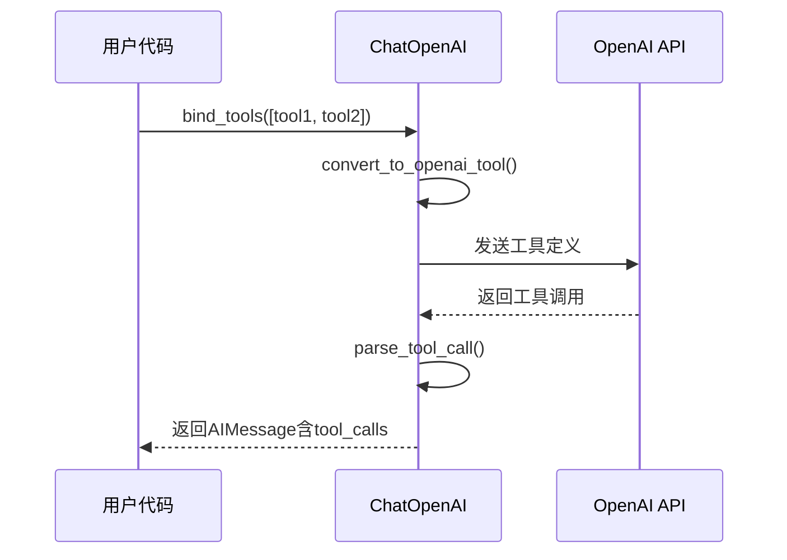
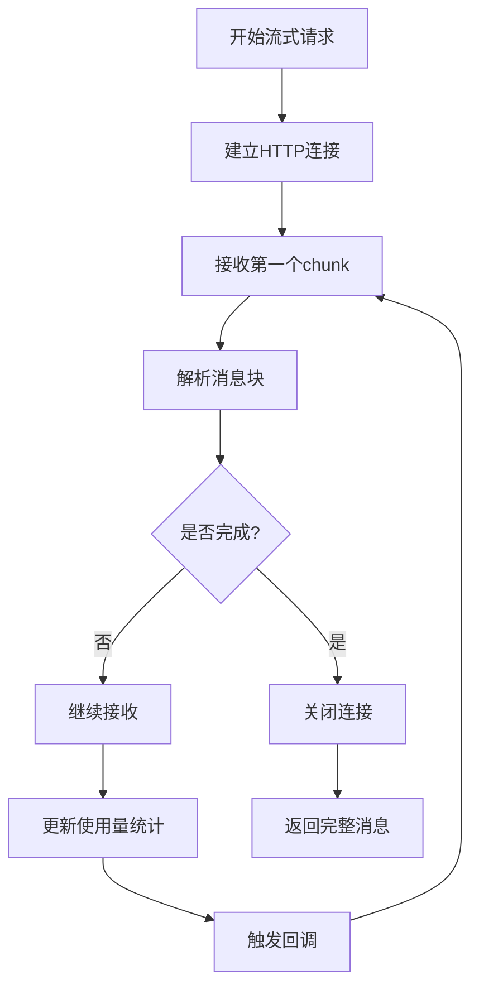
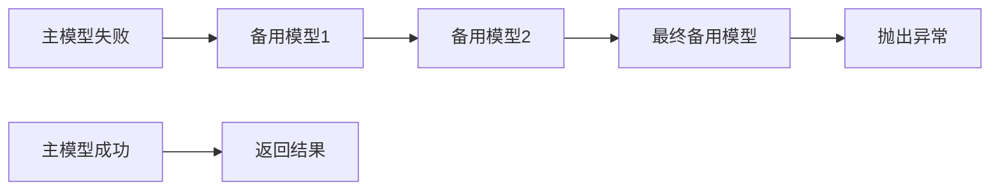
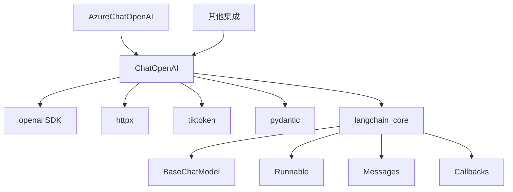
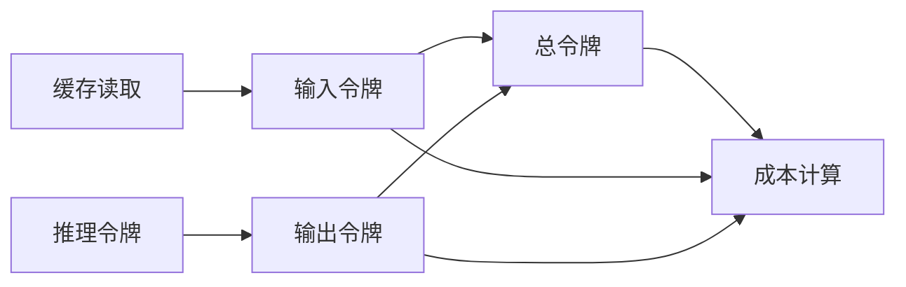

# 聊天模型 (ChatOpenAI)

<cite>
**本文档中引用的文件**
- [base.py](file://libs/partners/openai/langchain_openai/chat_models/base.py)
- [azure.py](file://libs/partners/openai/langchain_openai/chat_models/azure.py)
- [__init__.py](file://libs/partners/openai/langchain_openai/chat_models/__init__.py)
- [chat_models.py](file://libs/core/langchain_core/language_models/chat_models.py)
- [base.py](file://libs/core/langchain_core/language_models/base.py)
- [__init__.py](file://libs/partners/openai/langchain_openai/__init__.py)
</cite>

## 目录
1. [简介](#简介)
2. [项目结构](#项目结构)
3. [核心组件](#核心组件)
4. [架构概览](#架构概览)
5. [详细组件分析](#详细组件分析)
6. [依赖关系分析](#依赖关系分析)
7. [性能考虑](#性能考虑)
8. [故障排除指南](#故障排除指南)
9. [结论](#结论)

## 简介

ChatOpenAI是LangChain框架中与OpenAI聊天模型（如GPT-3.5和GPT-4）进行交互的主要接口。它提供了对OpenAI API的完整封装，支持多种高级功能，包括函数调用、工具调用、流式传输、结构化输出等。该组件设计为与`BaseChatModel`抽象基类兼容，确保了与其他LangChain组件的无缝集成。

## 项目结构

ChatOpenAI组件位于LangChain的OpenAI集成模块中，采用分层架构设计：

**图表来源**
- [base.py](file://libs/partners/openai/langchain_openai/chat_models/base.py#L1-L50)
- [azure.py](file://libs/partners/openai/langchain_openai/chat_models/azure.py#L1-L50)

**章节来源**
- [base.py](file://libs/partners/openai/langchain_openai/chat_models/base.py#L1-L100)
- [__init__.py](file://libs/partners/openai/langchain_openai/chat_models/__init__.py#L1-L7)

## 核心组件

### ChatOpenAI类

ChatOpenAI类是OpenAI聊天模型的核心实现，继承自`BaseChatOpenAI`，提供了完整的OpenAI API功能：

#### 主要特性
- **多模型支持**: 支持GPT-3.5、GPT-4系列及o1系列模型
- **灵活配置**: 通过参数系统支持各种OpenAI API选项
- **异步支持**: 提供同步和异步方法调用
- **流式传输**: 支持实时响应流处理
- **工具调用**: 内置函数调用和工具调用功能

#### 关键参数

| 参数 | 类型 | 描述 | 默认值 |
|------|------|------|--------|
| `model` | str | OpenAI模型名称 | "gpt-3.5-turbo" |
| `temperature` | float | 采样温度 | None |
| `max_tokens` | int \| None | 最大生成令牌数 | None |
| `api_key` | str \| None | OpenAI API密钥 | 从环境变量读取 |
| `base_url` | str \| None | API基础URL | None |
| `organization` | str \| None | OpenAI组织ID | None |
| `timeout` | float \| None | 请求超时时间 | None |
| `max_retries` | int \| None | 最大重试次数 | None |

**章节来源**
- [base.py](file://libs/partners/openai/langchain_openai/chat_models/base.py#L600-L700)

### AzureChatOpenAI类

AzureChatOpenAI专门用于Azure OpenAI服务的集成：

#### 特殊配置参数

| 参数 | 类型 | 描述 |
|------|------|------|
| `azure_endpoint` | str \| None | Azure端点URL |
| `azure_deployment` | str \| None | Azure部署名称 |
| `api_version` | str \| None | Azure API版本 |
| `azure_ad_token` | str \| None | Azure AD令牌 |
| `azure_ad_token_provider` | Callable \| None | Azure AD令牌提供者 |

**章节来源**
- [azure.py](file://libs/partners/openai/langchain_openai/chat_models/azure.py#L400-L500)

## 架构概览

ChatOpenAI采用多层架构设计，确保了灵活性和可扩展性：

**图表来源**
- [base.py](file://libs/partners/openai/langchain_openai/chat_models/base.py#L600-L800)
- [azure.py](file://libs/partners/openai/langchain_openai/chat_models/azure.py#L50-L150)

## 详细组件分析

### 函数调用和工具调用实现

ChatOpenAI提供了强大的函数调用和工具调用功能：

#### 工具绑定机制

**图表来源**
- [base.py](file://libs/partners/openai/langchain_openai/chat_models/base.py#L2103-L2945)

#### 结构化输出支持

ChatOpenAI支持多种结构化输出方法：

1. **函数调用方法**: 使用OpenAI的工具调用功能
2. **JSON模式**: 强制返回JSON格式
3. **JSON Schema**: 基于Schema的结构化输出

**章节来源**
- [base.py](file://libs/partners/openai/langchain_openai/chat_models/base.py#L2103-L2945)

### 流式传输实现

流式传输功能允许实时接收模型响应：

#### 同步流式处理

**图表来源**
- [base.py](file://libs/partners/openai/langchain_openai/chat_models/base.py#L1000-L1200)

#### 异步流式处理

异步流式处理提供了更好的并发性能，特别适用于高并发场景。

**章节来源**
- [base.py](file://libs/partners/openai/langchain_openai/chat_models/base.py#L1000-L1200)

### 备用模型配置

虽然ChatOpenAI本身不直接提供备用模型功能，但可以通过LangChain的`fallbacks`机制实现：

#### 备用模型链

**图表来源**
- [base.py](file://libs/partners/openai/langchain_openai/chat_models/base.py#L404-L429)

**章节来源**
- [base.py](file://libs/partners/openai/langchain_openai/chat_models/base.py#L404-L429)

### 与BaseChatModel的关系

ChatOpenAI完全遵循`BaseChatModel`接口规范：

#### 接口实现

| 方法 | 实现状态 | 描述 |
|------|----------|------|
| `_generate` | ✅ 完全实现 | 同步生成聊天结果 |
| `_stream` | ✅ 完全实现 | 流式生成支持 |
| `_agenerate` | ✅ 完全实现 | 异步生成支持 |
| `_astream` | ✅ 完全实现 | 异步流式支持 |
| `_llm_type` | ✅ 必需属性 | 模型类型标识 |
| `_identifying_params` | ✅ 可选属性 | 参数识别信息 |

**章节来源**
- [chat_models.py](file://libs/core/langchain_core/language_models/chat_models.py#L275-L289)

## 依赖关系分析

ChatOpenAI的依赖关系体现了其作为中间件的设计理念：

**图表来源**
- [base.py](file://libs/partners/openai/langchain_openai/chat_models/base.py#L1-L50)

### 核心依赖说明

1. **openai SDK**: 提供OpenAI API客户端功能
2. **httpx**: 异步HTTP客户端，支持流式传输
3. **tiktoken**: 令牌计数器，用于成本计算
4. **pydantic**: 数据验证和序列化
5. **langchain_core**: LangChain核心抽象和工具

**章节来源**
- [base.py](file://libs/partners/openai/langchain_openai/chat_models/base.py#L1-L50)

## 性能考虑

### 令牌使用优化

ChatOpenAI提供了详细的令牌使用跟踪功能：

#### 令牌使用统计

**图表来源**
- [base.py](file://libs/partners/openai/langchain_openai/chat_models/base.py#L3488-L3565)

#### 性能优化策略

1. **流式传输**: 减少用户等待时间
2. **令牌限制**: 控制成本和资源使用
3. **缓存机制**: 利用OpenAI的提示缓存
4. **批量处理**: 减少API调用次数

**章节来源**
- [base.py](file://libs/partners/openai/langchain_openai/chat_models/base.py#L3488-L3565)

### 成本控制策略

#### 成本监控指标

| 指标 | 描述 | 计算方式 |
|------|------|----------|
| 输入令牌数 | 输入消息的令牌数量 | tiktoken计数 |
| 输出令牌数 | 模型生成的令牌数量 | API返回 |
| 总令牌数 | 输入+输出令牌总数 | 自动计算 |
| 缓存节省 | 从缓存中读取的令牌数 | API返回 |

## 故障排除指南

### 常见问题及解决方案

#### API密钥问题
- **问题**: `AuthenticationError`或`PermissionDeniedError`
- **解决方案**: 检查`OPENAI_API_KEY`环境变量设置

#### 模型不可用
- **问题**: `RateLimitError`或`InternalServerError`
- **解决方案**: 实现重试机制和备用模型

#### 令牌限制
- **问题**: `ContextLengthExceededError`
- **解决方案**: 使用令牌计数器和消息截断

#### 流式传输问题
- **问题**: 连接中断或数据丢失
- **解决方案**: 启用`stream_usage`参数

**章节来源**
- [base.py](file://libs/partners/openai/langchain_openai/chat_models/base.py#L800-L900)

### 调试技巧

1. **启用详细日志**: 设置`logging.getLogger('langchain_openai').setLevel(logging.DEBUG)`
2. **检查响应元数据**: 分析`response_metadata`字段
3. **监控令牌使用**: 使用`usage_metadata`跟踪成本
4. **验证消息格式**: 确保消息符合OpenAI要求

## 结论

ChatOpenAI作为LangChain与OpenAI API之间的桥梁，提供了强大而灵活的聊天模型接口。其设计充分考虑了生产环境的需求，支持多种部署方式、高级功能和性能优化。通过合理配置和使用，可以构建高效、可靠的AI应用系统。

主要优势包括：
- **完整的OpenAI API支持**: 包含所有最新功能
- **灵活的配置选项**: 满足不同应用场景需求
- **优秀的性能表现**: 支持流式传输和异步操作
- **强大的工具集**: 支持函数调用和结构化输出
- **良好的扩展性**: 易于集成到现有系统中

对于开发者而言，理解ChatOpenAI的架构和最佳实践，能够更好地利用OpenAI的强大能力，构建高质量的AI应用程序。