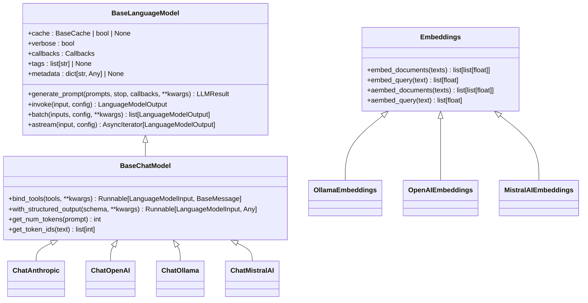
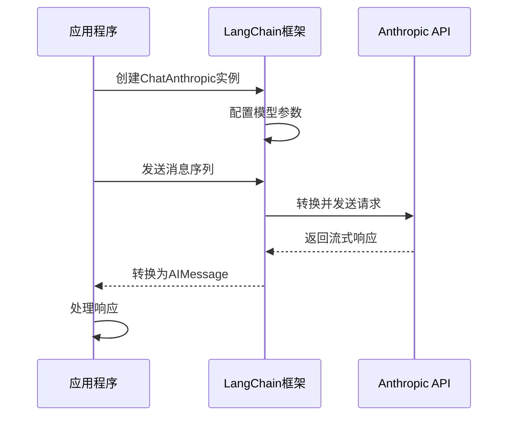
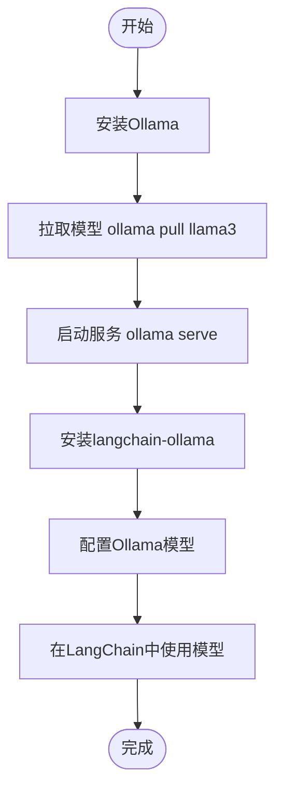
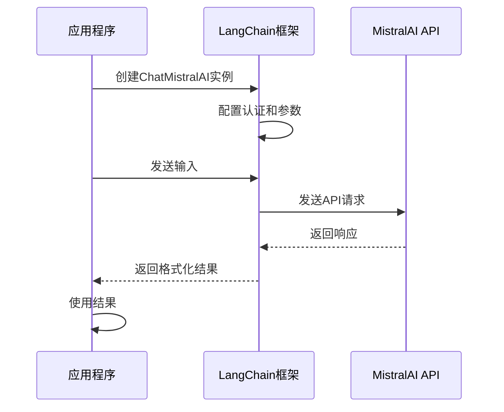

# 第三方集成

<cite>
**本文档中引用的文件**  
- [anthropic/__init__.py](file://libs/partners/anthropic/langchain_anthropic/__init__.py)
- [openai/__init__.py](file://libs/partners/openai/langchain_openai/__init__.py)
- [ollama/__init__.py](file://libs/partners/ollama/langchain_ollama/__init__.py)
- [mistralai/__init__.py](file://libs/partners/mistralai/langchain_mistralai/__init__.py)
- [anthropic/chat_models.py](file://libs/partners/anthropic/langchain_anthropic/chat_models.py)
- [ollama/chat_models.py](file://libs/partners/ollama/langchain_ollama/chat_models.py)
- [mistralai/chat_models.py](file://libs/partners/mistralai/langchain_mistralai/chat_models.py)
- [ollama/embeddings.py](file://libs/partners/ollama/langchain_ollama/embeddings.py)
- [mistralai/embeddings.py](file://libs/partners/mistralai/langchain_mistralai/embeddings.py)
- [base.py](file://libs/core/langchain_core/language_models/base.py)
- [chat_models.py](file://libs/core/langchain_core/language_models/chat_models.py)
</cite>

## 目录
1. [介绍](#介绍)
2. [核心架构与统一接口](#核心架构与统一接口)
3. [Anthropic集成](#anthropic集成)
4. [OpenAI集成](#openai集成)
5. [Ollama集成](#ollama集成)
6. [MistralAI集成](#mistralai集成)
7. [集成选择指南](#集成选择指南)
8. [认证与配置最佳实践](#认证与配置最佳实践)
9. [结论](#结论)

## 介绍

LangChain提供了一个模块化的架构，通过第三方集成包支持多种大型语言模型（LLM）提供商。这些集成允许开发者无缝地在不同模型提供商之间切换，同时保持一致的编程接口。本指南将详细介绍Anthropic、OpenAI、Ollama和MistralAI等关键集成，涵盖其功能、配置方法和使用场景。

## 核心架构与统一接口

LangChain的核心设计理念是通过统一的接口抽象不同模型提供商的差异。所有聊天模型和嵌入模型都遵循`langchain_core`中定义的基类，确保了跨集成的互操作性。



**图示来源**
- [base.py](file://libs/core/langchain_core/language_models/base.py)
- [chat_models.py](file://libs/core/langchain_core/language_models/chat_models.py)

**本节来源**
- [base.py](file://libs/core/langchain_core/language_models/base.py)
- [chat_models.py](file://libs/core/langchain_core/language_models/chat_models.py)

## Anthropic集成

Anthropic集成提供了对Claude系列模型的访问，包括强大的Claude Opus、Sonnet和Haiku模型。该集成支持聊天模型和基础LLM功能。

### 功能与配置

Anthropic集成支持以下主要功能：
- 聊天模型（ChatAnthropic）：用于对话式AI应用
- 基础LLM（AnthropicLLM）：用于文本生成任务
- 工具调用：支持函数调用和工具集成
- 流式响应：支持实时流式输出

配置Anthropic集成需要设置API密钥，可以通过环境变量或直接参数传递：

```python
from langchain_anthropic import ChatAnthropic

# 使用环境变量 ANTHROPIC_API_KEY
chat = ChatAnthropic(model="claude-3-5-sonnet-latest")

# 或直接传递API密钥
chat = ChatAnthropic(
    model="claude-3-5-sonnet-latest",
    anthropic_api_key="your-api-key"
)
```

### 使用场景

Anthropic集成特别适合需要高推理能力和长上下文窗口的应用场景：
- 复杂的推理任务
- 长文档分析和摘要
- 安全敏感的应用（Anthropic以安全性和对齐性著称）
- 需要高准确性的问答系统



**图示来源**
- [anthropic/chat_models.py](file://libs/partners/anthropic/langchain_anthropic/chat_models.py)
- [anthropic/__init__.py](file://libs/partners/anthropic/langchain_anthropic/__init__.py)

**本节来源**
- [anthropic/__init__.py](file://libs/partners/anthropic/langchain_anthropic/__init__.py)
- [anthropic/chat_models.py](file://libs/partners/anthropic/langchain_anthropic/chat_models.py)

## OpenAI集成

OpenAI集成是LangChain中最成熟和广泛使用的集成之一，提供了对GPT系列模型的全面支持。

### 功能与配置

OpenAI集成支持以下功能：
- 聊天模型（ChatOpenAI）：访问GPT-3.5、GPT-4等模型
- Azure OpenAI服务：企业级部署选项
- 嵌入模型（OpenAIEmbeddings）：文本嵌入生成
- 自定义工具：支持复杂的工具调用

配置OpenAI集成同样可以通过环境变量或直接参数：

```python
from langchain_openai import ChatOpenAI, OpenAIEmbeddings

# 聊天模型
chat = ChatOpenAI(model="gpt-4-turbo")

# 嵌入模型
embeddings = OpenAIEmbeddings(model="text-embedding-3-small")

# Azure OpenAI
azure_chat = AzureChatOpenAI(
    azure_deployment="gpt-4-deployment",
    azure_endpoint="https://your-resource.openai.azure.com"
)
```

### 使用场景

OpenAI集成适用于广泛的AI应用场景：
- 通用对话代理
- 内容生成和创意写作
- 代码生成和解释
- 知识密集型问答
- 多模态应用（结合视觉模型）

## Ollama集成

Ollama集成提供了对本地运行的开源大模型的访问，支持在本地设备上运行各种流行的开源模型。

### 功能与配置

Ollama集成的主要特点包括：
- 本地模型运行：支持在本地机器上运行模型
- 多模型支持：兼容Llama、Mistral、Gemma等开源模型
- 嵌入模型：支持本地嵌入生成
- 验证功能：`validate_model_on_init`参数可验证模型是否存在

```python
from langchain_ollama import ChatOllama, OllamaEmbeddings

# 聊天模型
chat = ChatOllama(
    model="llama3",
    temperature=0.7,
    validate_model_on_init=True
)

# 嵌入模型
embeddings = OllamaEmbeddings(model="nomic-embed-text")
```

### 使用场景

Ollama集成特别适合以下场景：
- 数据隐私要求高的应用
- 离线环境或网络受限环境
- 成本敏感的应用（避免API费用）
- 模型定制和微调需求
- 边缘计算和设备端AI



**图示来源**
- [ollama/chat_models.py](file://libs/partners/ollama/langchain_ollama/chat_models.py)
- [ollama/embeddings.py](file://libs/partners/ollama/langchain_ollama/embeddings.py)

**本节来源**
- [ollama/__init__.py](file://libs/partners/ollama/langchain_ollama/__init__.py)
- [ollama/chat_models.py](file://libs/partners/ollama/langchain_ollama/chat_models.py)
- [ollama/embeddings.py](file://libs/partners/ollama/langchain_ollama/embeddings.py)

## MistralAI集成

MistralAI集成提供了对Mistral系列高效模型的访问，特别适合需要高性能和成本效益平衡的应用。

### 功能与配置

MistralAI集成支持：
- 聊天模型（ChatMistralAI）：访问Mistral最新模型
- 嵌入模型（MistralAIEmbeddings）：高质量文本嵌入
- 异步支持：完整的异步API支持
- 批处理优化：针对批量嵌入进行了优化

```python
from langchain_mistralai import ChatMistralAI, MistralAIEmbeddings

# 聊天模型
chat = ChatMistralAI(model="mistral-large-latest")

# 嵌入模型
embeddings = MistralAIEmbeddings(model="mistral-embed")
```

### 使用场景

MistralAI集成适用于：
- 高性能推理需求
- 成本敏感但需要高质量输出的应用
- 批量处理任务
- 需要最新模型技术的应用
- 国际化和多语言支持



**图示来源**
- [mistralai/chat_models.py](file://libs/partners/mistralai/langchain_mistralai/chat_models.py)
- [mistralai/embeddings.py](file://libs/partners/mistralai/langchain_mistralai/embeddings.py)

**本节来源**
- [mistralai/__init__.py](file://libs/partners/mistralai/langchain_mistralai/__init__.py)
- [mistralai/chat_models.py](file://libs/partners/mistralai/langchain_mistralai/chat_models.py)
- [mistralai/embeddings.py](file://libs/partners/mistralai/langchain_mistralai/embeddings.py)

## 集成选择指南

选择合适的LangChain集成需要考虑多个因素：

| 考虑因素 | Anthropic | OpenAI | Ollama | MistralAI |
|---------|---------|--------|-------|---------|
| **性能** | 高推理能力，长上下文 | 通用性能优秀 | 依赖本地硬件 | 高效性能 |
| **成本** | 按使用量计费 | 按使用量计费 | 一次性硬件成本 | 按使用量计费 |
| **隐私** | 数据发送到云端 | 数据发送到云端 | 数据保留在本地 | 数据发送到云端 |
| **易用性** | 简单 | 非常简单 | 需要本地设置 | 简单 |
| **模型选择** | Claude系列 | GPT系列 | 开源模型 | Mistral系列 |
| **最佳场景** | 复杂推理，安全应用 | 通用应用，多模态 | 离线应用，隐私敏感 | 高性能，成本效益 |

**本节来源**
- [anthropic/__init__.py](file://libs/partners/anthropic/langchain_anthropic/__init__.py)
- [openai/__init__.py](file://libs/partners/openai/langchain_openai/__init__.py)
- [ollama/__init__.py](file://libs/partners/ollama/langchain_ollama/__init__.py)
- [mistralai/__init__.py](file://libs/partners/mistralai/langchain_mistralai/__init__.py)

## 认证与配置最佳实践

### 认证方法

所有云服务集成都支持多种认证方法：

1. **环境变量**（推荐）：
```python
# 设置环境变量
export ANTHROPIC_API_KEY="your-key"
export OPENAI_API_KEY="your-key"
export MISTRAL_API_KEY="your-key"
```

2. **直接参数传递**：
```python
chat = ChatAnthropic(anthropic_api_key="your-key")
```

3. **配置文件**：
```python
# 使用配置管理工具
from langchain_core.utils import get_from_env
api_key = get_from_env("api_key", "ANTHROPIC_API_KEY")
```

### 配置最佳实践

1. **使用环境变量管理密钥**：避免在代码中硬编码API密钥
2. **设置合理的超时**：根据应用需求配置超时参数
3. **启用缓存**：对于重复查询使用缓存提高性能
4. **错误处理**：实现重试机制和优雅的错误处理
5. **监控和日志**：集成回调系统进行监控和调试

```python
# 示例：带错误处理和重试的配置
from langchain_core.runnables import RunnableConfig
from langchain_core.runnables.retry import RetryConfig

config = RunnableConfig(
    retry_config=RetryConfig(max_attempts=3),
    callbacks=[...]
)
```

**本节来源**
- [anthropic/chat_models.py](file://libs/partners/anthropic/langchain_anthropic/chat_models.py)
- [openai/__init__.py](file://libs/partners/openai/langchain_openai/__init__.py)
- [ollama/chat_models.py](file://libs/partners/ollama/langchain_ollama/chat_models.py)
- [mistralai/chat_models.py](file://libs/partners/mistralai/langchain_mistralai/chat_models.py)

## 结论

LangChain的第三方集成提供了一个强大而灵活的框架，使开发者能够轻松地在不同LLM提供商之间切换。通过统一的接口设计，开发者可以专注于应用逻辑而不是底层实现细节。选择合适的集成需要权衡性能、成本、隐私和具体应用场景的需求。无论选择哪种集成，LangChain都提供了完整的工具链来构建复杂的AI应用。