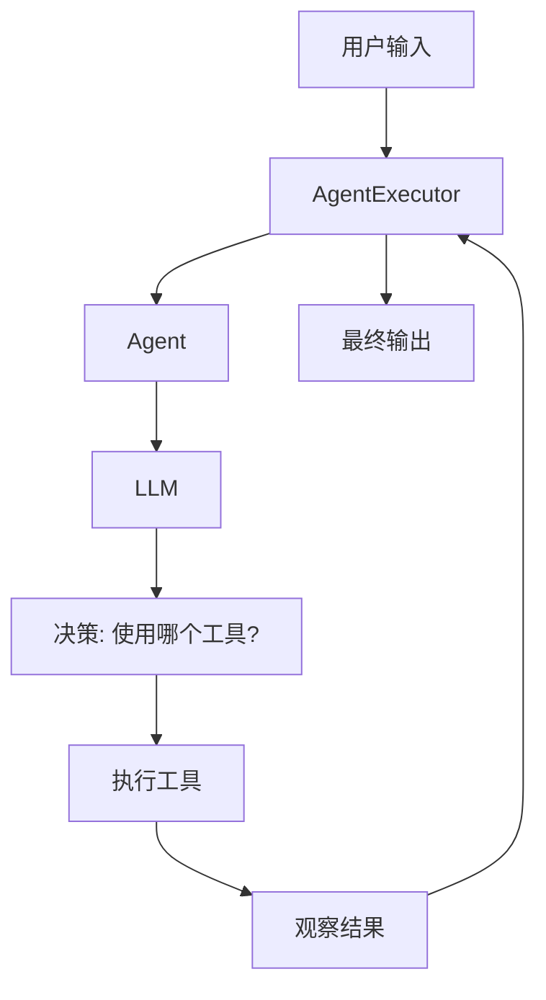
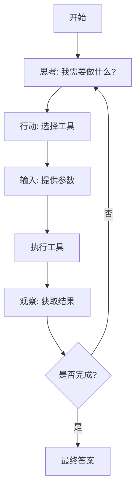
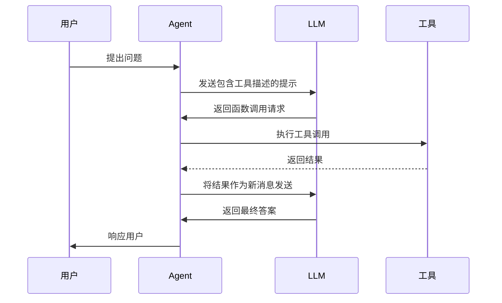

# Agents

<cite>
**本文档中引用的文件**   
- [agents.py](file://libs/core/langchain_core/agents.py)
- [react/agent.py](file://libs/langchain/langchain_classic/agents/react/agent.py)
- [openai_functions_agent/base.py](file://libs/langchain/langchain_classic/agents/openai_functions_agent/base.py)
- [agent_types.py](file://libs/langchain/langchain_classic/agents/agent_types.py)
</cite>

## 目录
1. [简介](#简介)
2. [核心架构](#核心架构)
3. [Agent类型](#agent类型)
4. [Agent与Tools的交互机制](#agent与tools的交互机制)
5. [Prompt工程](#prompt工程)
6. [配置选项与参数说明](#配置选项与参数说明)
7. [与其他组件的集成](#与其他组件的集成)
8. [常见问题与调试策略](#常见问题与调试策略)
9. [结论](#结论)

## 简介
LangChain Agents是自主智能体，能够通过推理和决策执行复杂任务。它们利用大型语言模型（LLM）作为"大脑"，通过规划、选择工具和生成响应来完成用户指定的目标。Agents的工作流程遵循一个循环：接收输入、使用LLM决定下一步行动、执行行动（通常是调用工具）、观察结果，并根据观察结果决定后续步骤，直到达到最终目标。

**Section sources**
- [agents.py](file://libs/core/langchain_core/agents.py#L1-L242)

## 核心架构
LangChain Agents的核心架构基于一个循环决策过程，该过程由LLM驱动。架构主要包括三个核心组件：Agent、Tools和AgentExecutor。Agent负责决策，决定使用哪个工具以及如何使用；Tools是可被调用的功能模块，如搜索、计算或数据库查询；AgentExecutor则管理整个执行流程，协调Agent和Tools之间的交互。

**Diagram sources **
- [agents.py](file://libs/core/langchain_core/agents.py#L1-L242)

**Section sources**
- [agents.py](file://libs/core/langchain_core/agents.py#L1-L242)

## Agent类型
LangChain提供了多种类型的Agents，每种都有其特定的应用场景和优势。

### ReAct Agent
ReAct Agent基于"推理与行动"（Reasoning and Acting）范式，通过交替进行推理（Thought）和行动（Action）来解决问题。它遵循一个明确的格式：先思考要做什么，然后选择一个工具并提供输入，观察结果后继续循环，直到得出最终答案。

**Diagram sources **
- [react/agent.py](file://libs/langchain/langchain_classic/agents/react/agent.py#L26-L51)

**Section sources**
- [react/agent.py](file://libs/langchain/langchain_classic/agents/react/agent.py#L26-L51)

### Structured Chat Agent
Structured Chat Agent专为聊天模型优化，能够处理具有多个输入参数的复杂工具。它使用结构化的消息格式与LLM进行交互，更适合现代聊天模型的输入输出模式。

### OpenAI Functions Agent
OpenAI Functions Agent利用OpenAI的函数调用功能，允许LLM直接以结构化格式（如JSON）返回工具调用请求。这种方式更高效，减少了对文本解析的依赖，特别适合与支持函数调用的LLM集成。

**Diagram sources **
- [openai_functions_agent/base.py](file://libs/langchain/langchain_classic/agents/openai_functions_agent/base.py#L259-L298)

**Section sources**
- [openai_functions_agent/base.py](file://libs/langchain/langchain_classic/agents/openai_functions_agent/base.py#L259-L298)
- [agent_types.py](file://libs/langchain/langchain_classic/agents/agent_types.py#L40-L56)

## Agent与Tools的交互机制
Agent与Tools的交互是通过标准化的协议进行的。当Agent决定调用一个工具时，它会创建一个`AgentAction`对象，该对象包含工具名称和输入参数。`AgentExecutor`接收到这个动作后，会执行相应的工具，并将结果作为"观察"（Observation）返回给Agent。这个过程在内部被转换为消息格式，以便LLM能够理解和处理。

**Section sources**
- [agents.py](file://libs/core/langchain_core/agents.py#L1-L242)

## Prompt工程
Prompt工程在Agents的行为中起着至关重要的作用。通过精心设计的提示，可以引导Agent遵循特定的思维模式和输出格式。例如，ReAct Agent的提示通常包含一个明确的指令模板，要求LLM按照"思考-行动-输入-观察"的循环进行响应。

**Section sources**
- [react/agent.py](file://libs/langchain/langchain_classic/agents/react/agent.py#L129-L146)

## 配置选项与参数说明
不同的Agent类型提供了多种配置选项来定制其行为。例如，`create_react_agent`函数允许指定LLM、工具列表、提示模板、输出解析器和停止序列。这些参数共同决定了Agent的工作方式和性能特征。

**Section sources**
- [react/agent.py](file://libs/langchain/langchain_classic/agents/react/agent.py#L26-L51)
- [openai_functions_agent/base.py](file://libs/langchain/langchain_classic/agents/openai_functions_agent/base.py#L259-L298)

## 与其他组件的集成
Agents可以与Memory、Callbacks等其他组件无缝集成。Memory组件允许Agent在对话中保持上下文，而Callbacks则提供了对Agent执行过程的监控和调试能力。

**Section sources**
- [openai_functions_agent/base.py](file://libs/langchain/langchain_classic/agents/openai_functions_agent/base.py#L259-L298)

## 常见问题与调试策略
使用Agents时可能会遇到一些常见问题，如无限循环或工具选择错误。为了避免无限循环，可以设置最大迭代次数或使用适当的停止序列。对于工具选择错误，可以通过改进提示工程或提供更多上下文信息来解决。

**Section sources**
- [react/agent.py](file://libs/langchain/langchain_classic/agents/react/agent.py#L26-L51)

## 结论
LangChain Agents提供了一个强大而灵活的框架，用于构建能够执行复杂任务的自主智能体。通过理解其核心架构、不同类型的特点以及与各种组件的集成方式，开发者可以构建出高效、可靠的AI应用。