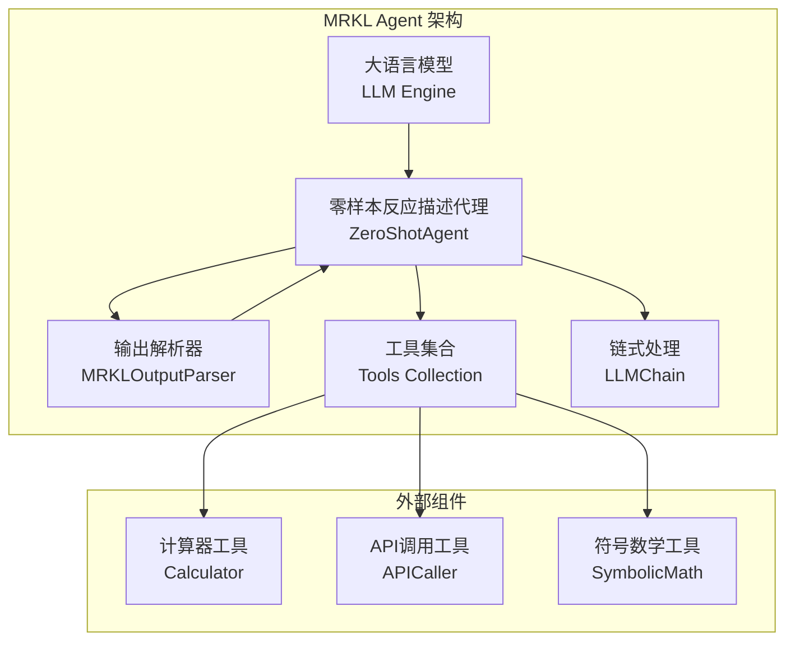
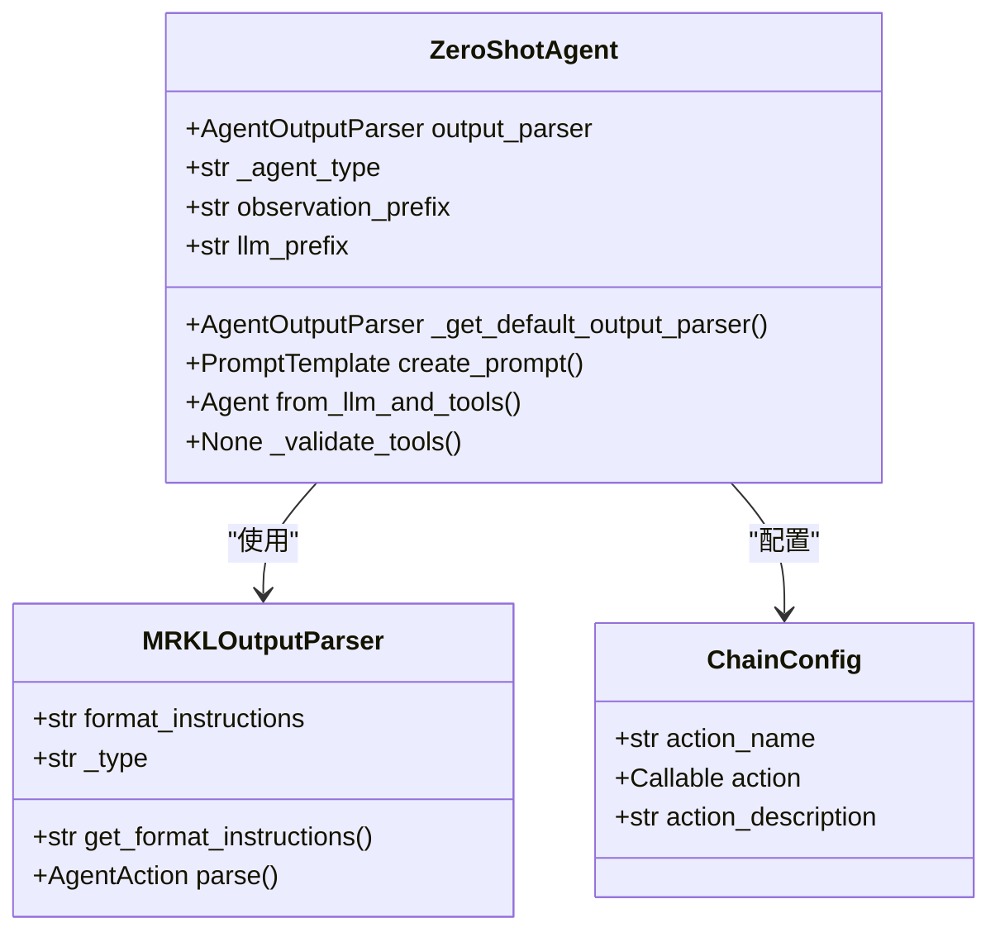
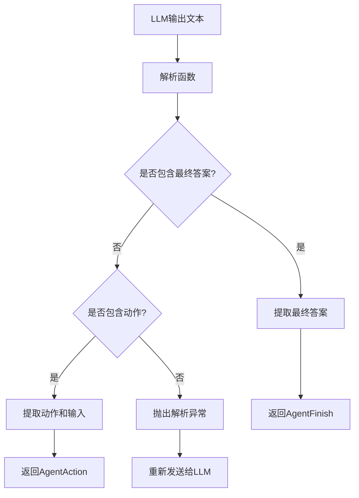
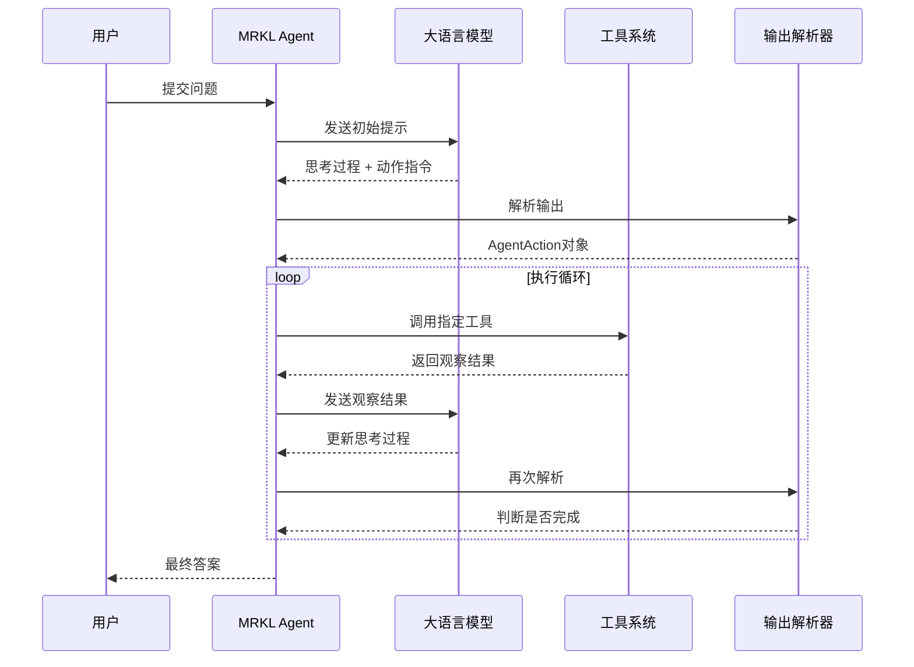
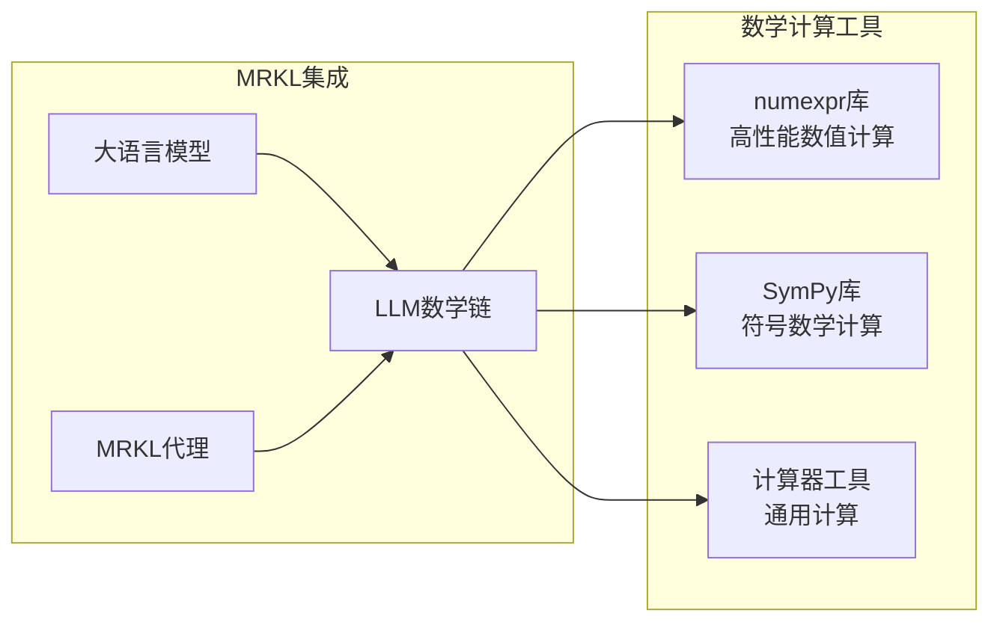
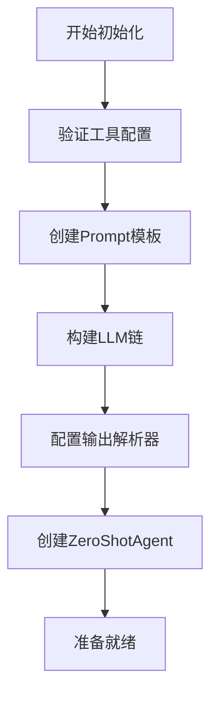

# MRKL Agent 详细技术文档

<cite>
**本文档中引用的文件**
- [libs/langchain/langchain_classic/agents/mrkl/__init__.py](file://libs/langchain/langchain_classic/agents/mrkl/__init__.py)
- [libs/langchain/langchain_classic/agents/mrkl/base.py](file://libs/langchain/langchain_classic/agents/mrkl/base.py)
- [libs/langchain/langchain_classic/agents/mrkl/prompt.py](file://libs/langchain/langchain_classic/agents/mrkl/prompt.py)
- [libs/langchain/langchain_classic/agents/mrkl/output_parser.py](file://libs/langchain/langchain_classic/agents/mrkl/output_parser.py)
- [libs/langchain/langchain_classic/agents/agent.py](file://libs/langchain/langchain_classic/agents/agent.py)
- [libs/langchain/langchain_classic/agents/agent_types.py](file://libs/langchain/langchain_classic/agents/agent_types.py)
- [libs/langchain/langchain_classic/chains/llm_math/base.py](file://libs/langchain/langchain_classic/chains/llm_math/base.py)
- [libs/langchain/tests/unit_tests/agents/test_mrkl.py](file://libs/langchain/tests/unit_tests/agents/test_mrkl.py)
</cite>

## 目录
1. [简介](#简介)
2. [MRKL架构设计原理](#mrkl架构设计原理)
3. [核心组件分析](#核心组件分析)
4. [思考-行动-观察循环机制](#思考-行动-观察循环机制)
5. [工具集成与数学计算能力](#工具集成与数学计算能力)
6. [Prompt模板结构](#prompt模板结构)
7. [执行流程详解](#执行流程详解)
8. [性能特点与局限性](#性能特点与局限性)
9. [最佳实践指南](#最佳实践指南)
10. [总结](#总结)

## 简介

MRKL（Model-Reasoning-Knowledge-Loop）Agent是基于论文《arxiv.org/pdf/2205.00445.pdf》设计的一种智能代理系统，它将大型语言模型（LLM）作为核心推理引擎，结合外部知识源和数学计算能力来解决复杂问题。MRKL Agent采用独特的"思考-行动-观察"循环机制，通过专门的工具（如计算器、API调用）处理数学运算和符号推理，为复杂的数学应用题、逻辑推理和需要精确计算的场景提供了强大的解决方案。

## MRKL架构设计原理

### 整体架构概览

MRKL Agent采用了模块化的架构设计，主要包含以下几个核心层次：

**图表来源**
- [libs/langchain/langchain_classic/agents/mrkl/base.py](file://libs/langchain/langchain_classic/agents/mrkl/base.py#L40-L216)
- [libs/langchain/langchain_classic/agents/agent.py](file://libs/langchain/langchain_classic/agents/agent.py#L1-L100)

### 设计哲学

MRKL Agent的设计遵循以下核心原则：

1. **模块化分离**：将推理、工具调用和输出解析功能分离到不同的组件中
2. **可扩展性**：支持动态添加新的工具和功能
3. **容错性**：具备错误处理和重试机制
4. **透明性**：提供清晰的思考过程记录

**章节来源**
- [libs/langchain/langchain_classic/agents/mrkl/base.py](file://libs/langchain/langchain_classic/agents/mrkl/base.py#L1-L36)

## 核心组件分析

### ZeroShotAgent类

ZeroShotAgent是MRKL系统的核心代理类，继承自基础Agent类，负责协调整个推理过程：

**图表来源**
- [libs/langchain/langchain_classic/agents/mrkl/base.py](file://libs/langchain/langchain_classic/agents/mrkl/base.py#L40-L216)
- [libs/langchain/langchain_classic/agents/mrkl/output_parser.py](file://libs/langchain/langchain_classic/agents/mrkl/output_parser.py#L20-L101)

### 输出解析器

MRKLOutputParser负责解析LLM的输出，将其转换为Agent可以理解的动作或完成状态：

**图表来源**
- [libs/langchain/langchain_classic/agents/mrkl/output_parser.py](file://libs/langchain/langchain_classic/agents/mrkl/output_parser.py#L30-L90)

**章节来源**
- [libs/langchain/langchain_classic/agents/mrkl/output_parser.py](file://libs/langchain/langchain_classic/agents/mrkl/output_parser.py#L1-L101)

## 思考-行动-观察循环机制

### 循环流程图

MRKL Agent的核心工作原理是基于"思考-行动-观察"的迭代循环：

**图表来源**
- [libs/langchain/langchain_classic/agents/mrkl/base.py](file://libs/langchain/langchain_classic/agents/mrkl/base.py#L80-L150)
- [libs/langchain/langchain_classic/agents/mrkl/prompt.py](file://libs/langchain/langchain_classic/agents/mrkl/prompt.py#L1-L15)

### 关键特性

1. **迭代推理**：通过多次思考-行动-观察循环逐步逼近解决方案
2. **动态决策**：根据当前上下文动态选择最合适的工具
3. **错误恢复**：具备处理工具调用失败的能力
4. **状态管理**：维护中间步骤的状态信息

**章节来源**
- [libs/langchain/langchain_classic/agents/mrkl/base.py](file://libs/langchain/langchain_classic/agents/mrkl/base.py#L80-L180)

## 工具集成与数学计算能力

### 数学计算工具链

MRKL Agent集成了多种数学计算工具，特别是LLMMathChain提供了强大的数值计算能力：

**图表来源**
- [libs/langchain/langchain_classic/chains/llm_math/base.py](file://libs/langchain/langchain_classic/chains/llm_math/base.py#L205-L225)

### 工具配置结构

MRKL Agent使用ChainConfig元组来配置工具：

| 配置项 | 类型 | 描述 |
|--------|------|------|
| action_name | str | 工具名称，用于识别和调用 |
| action | Callable | 实际的工具函数或方法 |
| action_description | str | 工具的功能描述，用于提示构建 |

**章节来源**
- [libs/langchain/langchain_classic/agents/mrkl/base.py](file://libs/langchain/langchain_classic/agents/mrkl/base.py#L25-L36)

## Prompt模板结构

### 标准Prompt格式

MRKL Agent使用标准化的Prompt模板来指导LLM的行为：

**图表来源**
- [libs/langchain/langchain_classic/agents/mrkl/prompt.py](file://libs/langchain/langchain_classic/agents/mrkl/prompt.py#L1-L15)

### Prompt模板内容

标准的MRKL Prompt模板包含以下关键元素：

1. **问题说明**：明确指示LLM需要解决的问题类型
2. **工具描述**：列出所有可用工具及其功能
3. **格式规范**：定义思考-行动-观察的标准格式
4. **起始标记**：提供对话的起点

**章节来源**
- [libs/langchain/langchain_classic/agents/mrkl/prompt.py](file://libs/langchain/langchain_classic/agents/mrkl/prompt.py#L1-L15)

## 执行流程详解

### 初始化流程

MRKL Agent的初始化涉及多个步骤：

**图表来源**
- [libs/langchain/langchain_classic/agents/mrkl/base.py](file://libs/langchain/langchain_classic/agents/mrkl/base.py#L100-L150)

### 运行时流程

在运行时，MRKL Agent按照以下流程处理请求：

1. **输入验证**：检查用户输入的有效性
2. **提示构建**：根据当前状态构建完整的提示
3. **LLM推理**：调用LLM生成思考过程和动作指令
4. **输出解析**：解析LLM输出并确定下一步操作
5. **工具调用**：执行相应的工具操作
6. **状态更新**：更新内部状态和历史记录
7. **终止判断**：判断是否达到终止条件

**章节来源**
- [libs/langchain/langchain_classic/agents/mrkl/base.py](file://libs/langchain/langchain_classic/agents/mrkl/base.py#L150-L216)

## 性能特点与局限性

### 性能优势

1. **精确计算**：通过专用数学工具提供高精度计算
2. **多轮推理**：支持复杂的多步推理过程
3. **工具丰富**：可集成多种类型的外部工具
4. **格式规范**：标准化的输出格式便于解析

### 局限性

1. **依赖LLM质量**：性能高度依赖于底层LLM的能力
2. **工具限制**：需要手动配置和维护工具
3. **复杂度较高**：相比简单代理具有更高的复杂度
4. **资源消耗**：需要较多的计算资源

### 适用场景

MRKL Agent特别适用于以下场景：
- 数学应用题求解
- 需要精确计算的问题
- 多步骤逻辑推理任务
- 需要访问外部数据源的应用

**章节来源**
- [libs/langchain/langchain_classic/chains/llm_math/base.py](file://libs/langchain/langchain_classic/chains/llm_math/base.py#L15-L50)

## 最佳实践指南

### 工具选择策略

1. **功能匹配**：选择与问题类型相匹配的工具
2. **性能考虑**：优先选择高性能的计算工具
3. **错误处理**：为每个工具提供适当的错误处理机制
4. **文档完善**：确保工具描述清晰准确

### Prompt优化技巧

1. **清晰描述**：提供明确的工具功能描述
2. **格式规范**：严格遵循标准的输出格式
3. **示例引导**：提供有用的示例来引导LLM行为
4. **上下文管理**：合理控制提示的上下文长度

### 错误处理策略

1. **重试机制**：为工具调用实现自动重试
2. **降级方案**：提供备用的解决方案
3. **监控告警**：建立完善的监控和告警机制
4. **日志记录**：详细记录执行过程和错误信息

**章节来源**
- [libs/langchain/tests/unit_tests/agents/test_mrkl.py](file://libs/langchain/tests/unit_tests/agents/test_mrkl.py#L1-L164)

## 总结

MRKL Agent代表了智能代理系统发展的重要方向，它通过将LLM推理能力与外部工具系统的有机结合，实现了复杂问题的高效解决。其独特的"思考-行动-观察"循环机制为解决需要精确计算和多步骤推理的任务提供了强有力的框架。

虽然MRKL Agent存在一定的局限性，但其模块化的设计理念、丰富的工具集成能力和标准化的接口设计，使其成为构建高级智能代理的理想选择。随着LLM技术和工具生态的不断发展，MRKL Agent有望在更多领域发挥重要作用，为人工智能应用带来新的可能性。

通过深入理解MRKL Agent的设计原理和实现细节，开发者可以更好地利用这一强大的工具来构建自己的智能应用，推动人工智能技术在实际场景中的落地和应用。