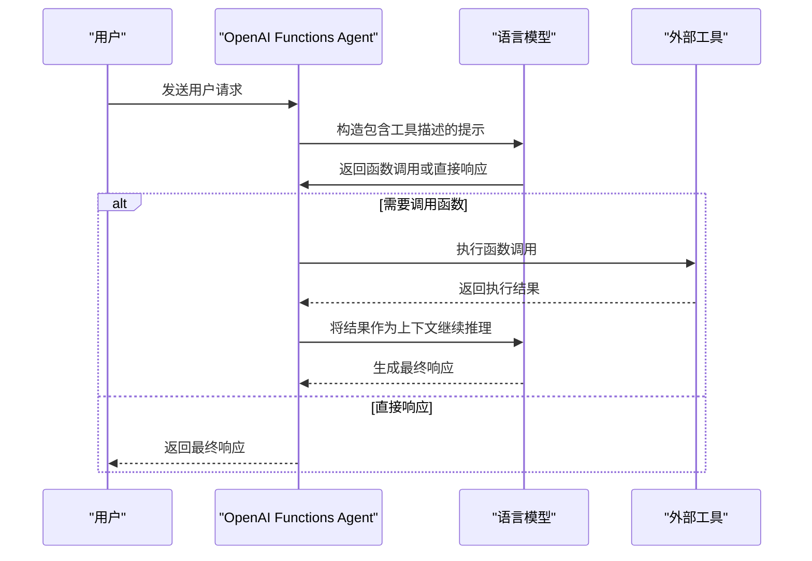
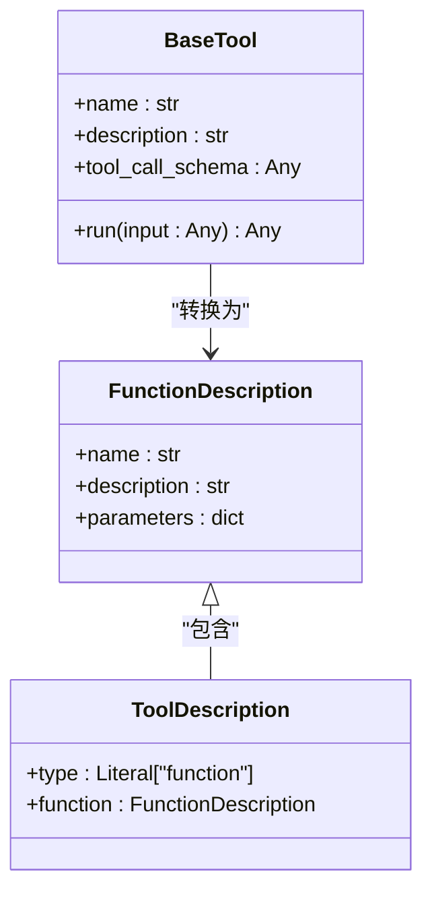
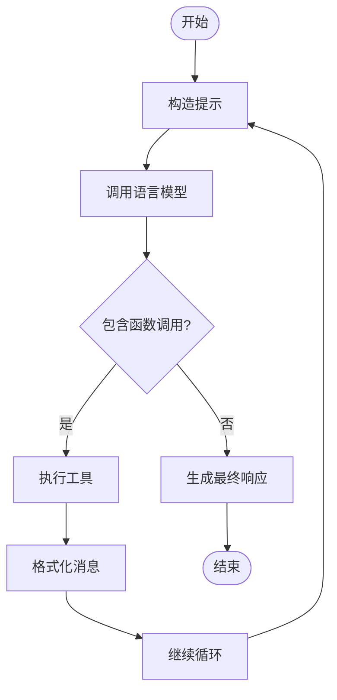

# OpenAI Functions Agent

<cite>
**本文档中引用的文件**   
- [base.py](file://libs/langchain/langchain_classic/agents/openai_functions_agent/base.py)
- [function_calling.py](file://libs/core/langchain_core/utils/function_calling.py)
- [openai_functions.py](file://libs/core/langchain_core/output_parsers/openai_functions.py)
- [openai_functions.py](file://libs/langchain/langchain_classic/agents/format_scratchpad/openai_functions.py)
- [openai_functions.py](file://libs/langchain/langchain_classic/agents/output_parsers/openai_functions.py)
</cite>

## 目录
1. [简介](#简介)
2. [核心架构与工作流程](#核心架构与工作流程)
3. [函数描述与模式定义](#函数描述与模式定义)
4. [代理初始化与配置](#代理初始化与配置)
5. [执行流程与消息格式化](#执行流程与消息格式化)
6. [输出解析机制](#输出解析机制)
7. [错误处理与异常情况](#错误处理与异常情况)
8. [性能与成本考量](#性能与成本考量)
9. [应用场景与集成](#应用场景与集成)
10. [结论](#结论)

## 简介

OpenAI Functions Agent 是 LangChain 框架中的一个核心组件，它利用 OpenAI API 的函数调用（function calling）能力，使大型语言模型能够与外部工具和 API 进行交互。该代理通过将用户请求与预定义的工具集相结合，实现了智能决策和自动化工作流。当模型需要调用外部功能时，它会生成符合函数签名的参数，并将结果返回给模型以生成最终响应。这种机制在构建智能助手、自动化任务和集成第三方服务方面具有强大功能。

**Section sources**
- [base.py](file://libs/langchain/langchain_classic/agents/openai_functions_agent/base.py#L0-L383)

## 核心架构与工作流程

OpenAI Functions Agent 的工作流程基于一系列协同工作的组件：代理本身、工具集、提示模板、输出解析器和消息格式化器。整个流程从用户输入开始，代理根据上下文决定是否调用函数，生成参数，执行调用，并将结果整合到后续的推理中。



**Diagram sources **
- [base.py](file://libs/langchain/langchain_classic/agents/openai_functions_agent/base.py#L0-L383)
- [openai_functions.py](file://libs/langchain/langchain_classic/agents/format_scratchpad/openai_functions.py#L0-L91)

**Section sources**
- [base.py](file://libs/langchain/langchain_classic/agents/openai_functions_agent/base.py#L0-L383)

## 函数描述与模式定义

函数描述（function schema）是 OpenAI Functions Agent 的核心，它定义了模型可以调用的外部工具的接口。这些描述遵循 OpenAI 的函数调用规范，包含名称、描述和参数的 JSON Schema。LangChain 提供了多种方式来定义这些模式，包括从 Pydantic 模型、Python 函数和 TypedDict 自动转换。



**Diagram sources **
- [function_calling.py](file://libs/core/langchain_core/utils/function_calling.py#L0-L763)
- [base.py](file://libs/langchain/langchain_classic/agents/openai_functions_agent/base.py#L0-L383)

**Section sources**
- [function_calling.py](file://libs/core/langchain_core/utils/function_calling.py#L0-L763)

## 代理初始化与配置

OpenAI Functions Agent 可以通过 `create_openai_functions_agent` 工厂函数进行初始化。该函数接受语言模型、工具列表和提示模板作为参数，并返回一个可执行的 Runnable 序列。代理的配置包括系统消息、额外的提示消息和回调管理器，这些都可以在创建时进行定制。

```python
# 代码示例路径
# libs/langchain/langchain_classic/agents/openai_functions_agent/base.py
# create_openai_functions_agent 函数
```

**Section sources**
- [base.py](file://libs/langchain/langchain_classic/agents/openai_functions_agent/base.py#L286-L383)

## 执行流程与消息格式化

代理的执行流程由 `plan` 方法驱动，该方法负责构造提示、调用模型并解析响应。关键的一步是将中间步骤（intermediate steps）格式化为适合模型理解的消息序列。`format_to_openai_function_messages` 函数将代理动作和工具输出转换为 FunctionMessage，这些消息被添加到对话历史中，作为模型下一步决策的上下文。



**Diagram sources **
- [openai_functions.py](file://libs/langchain/langchain_classic/agents/format_scratchpad/openai_functions.py#L0-L91)
- [base.py](file://libs/langchain/langchain_classic/agents/openai_functions_agent/base.py#L0-L383)

**Section sources**
- [openai_functions.py](file://libs/langchain/langchain_classic/agents/format_scratchpad/openai_functions.py#L0-L91)

## 输出解析机制

输出解析是 OpenAI Functions Agent 的关键环节，由 `OpenAIFunctionsAgentOutputParser` 负责。该解析器从模型的响应中提取 `function_call` 参数，解析函数名称和参数，并将其转换为 `AgentAction` 或 `AgentFinish` 对象。如果模型返回的是直接响应而非函数调用，则解析器会生成一个 `AgentFinish` 对象，表示代理已完成任务。

```python
# 代码示例路径
# libs/langchain/langchain_classic/agents/output_parsers/openai_functions.py
# OpenAIFunctionsAgentOutputParser 类
```

**Section sources**
- [openai_functions.py](file://libs/langchain/langchain_classic/agents/output_parsers/openai_functions.py#L0-L99)

## 错误处理与异常情况

OpenAI Functions Agent 具有完善的错误处理机制。当模型返回的参数不是有效 JSON 时，解析器会抛出 `OutputParserException`。此外，代理还支持早期停止方法（early_stopping_method），当达到最大迭代次数或时间限制时，可以强制返回或生成最终响应。对于工具执行过程中的错误，可以通过回调机制进行捕获和处理。

**Section sources**
- [base.py](file://libs/langchain/langchain_classic/agents/openai_functions_agent/base.py#L0-L383)
- [openai_functions.py](file://libs/langchain/langchain_classic/agents/output_parsers/openai_functions.py#L0-L99)

## 性能与成本考量

使用 OpenAI Functions Agent 时，性能和成本是需要考虑的重要因素。每次函数调用都会产生额外的 API 调用，这会增加延迟和成本。为了优化性能，建议合理设计工具集，避免不必要的函数调用。同时，可以利用缓存机制来存储频繁访问的数据，减少对外部 API 的依赖。监控和分析代理的执行日志有助于识别性能瓶颈和优化机会。

**Section sources**
- [base.py](file://libs/langchain/langchain_classic/agents/openai_functions_agent/base.py#L0-L383)

## 应用场景与集成

OpenAI Functions Agent 在多种应用场景中表现出色，包括智能助手、自动化工作流和第三方服务集成。例如，可以构建一个能够查询天气、发送邮件和管理日历的个人助理。通过将不同的工具组合在一起，代理可以执行复杂的多步骤任务。此外，它还可以与数据库、搜索引擎和企业系统集成，实现智能化的数据处理和业务自动化。

**Section sources**
- [base.py](file://libs/langchain/langchain_classic/agents/openai_functions_agent/base.py#L0-L383)

## 结论

OpenAI Functions Agent 是一个功能强大的工具，它通过函数调用机制将大型语言模型与外部世界连接起来。通过深入理解其架构、工作流程和配置选项，开发者可以构建出更加智能和实用的应用程序。尽管存在性能和成本方面的挑战，但通过合理的优化和设计，可以充分发挥其潜力，实现复杂的自动化任务和智能交互。