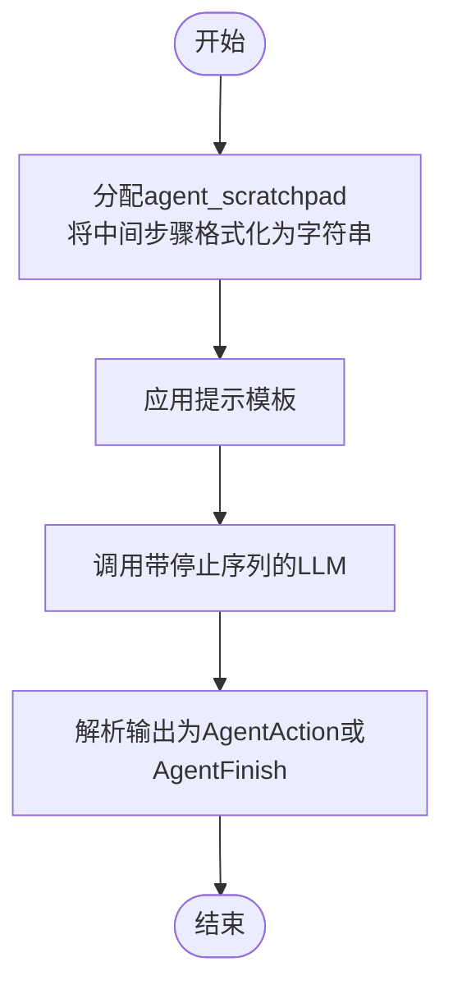
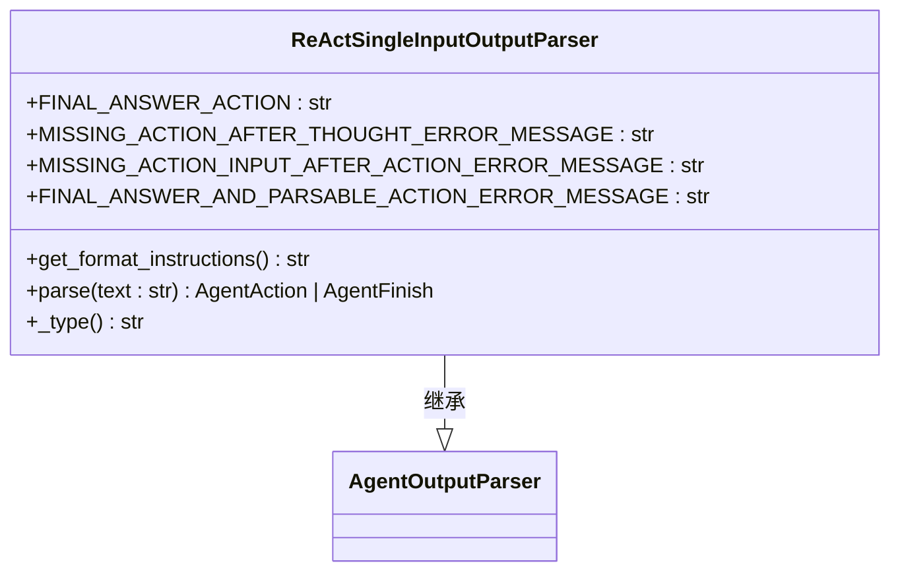
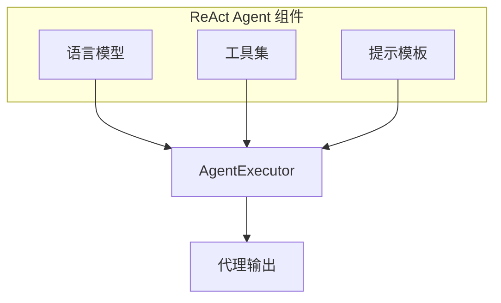

# ReAct Agent

<cite>
**本文档中引用的文件**   
- [agent.py](file://libs/langchain/langchain_classic/agents/react/agent.py)
- [base.py](file://libs/langchain/langchain_classic/agents/react/base.py)
- [react_single_input.py](file://libs/langchain/langchain_classic/agents/output_parsers/react_single_input.py)
- [wiki_prompt.py](file://libs/langchain/langchain_classic/agents/react/wiki_prompt.py)
- [textworld_prompt.py](file://libs/langchain/langchain_classic/agents/react/textworld_prompt.py)
- [render.py](file://libs/core/langchain_core/tools/render.py)
- [utils.py](file://libs/langchain/langchain_classic/agents/utils.py)
</cite>

## 目录
1. [简介](#简介)
2. [核心思想与工作流程](#核心思想与工作流程)
3. [核心组件分析](#核心组件分析)
4. [配置与实现](#配置与实现)
5. [应用案例](#应用案例)
6. [性能优势与调试技巧](#性能优势与调试技巧)
7. [结论](#结论)

## 简介
ReAct Agent是一种基于"推理与行动"（Reasoning & Acting）框架的智能代理系统，其核心思想源自论文《ReAct: Synergizing Reasoning and Acting in Language Models》。该框架通过交替进行推理（Thought）和行动（Action）来解决复杂任务，使语言模型能够像人类一样进行思考和决策。在LangChain框架中，ReAct Agent通过`create_react_agent`函数实现，结合了语言模型、工具集和特定的提示模板，形成了一个能够自主完成多步骤任务的智能系统。

## 核心思想与工作流程
ReAct框架的核心在于将复杂的任务分解为一系列交替的推理和行动步骤。其工作流程遵循一个明确的循环模式：首先进行推理（Thought），决定下一步行动；然后执行行动（Action），调用适当的工具；接着观察结果（Observation），获取行动的反馈；最后基于观察结果进行新的推理，决定后续步骤。这个循环持续进行，直到得出最终答案。

该工作流程的关键在于其结构化的交互模式，通常表现为以下格式：
```
问题：原始输入问题
思考：你应该始终思考要做什么
行动：要采取的行动，应该是[{tool_names}]中的一个
行动输入：行动的输入
观察：行动的结果
...（此思考/行动/行动输入/观察可重复N次）
思考：我现在知道最终答案
最终答案：对原始输入问题的最终答案
```

这种模式使得代理能够系统性地解决问题，通过中间步骤的积累和反思，逐步接近最终答案。

**Section sources**
- [agent.py](file://libs/langchain/langchain_classic/agents/react/agent.py#L50-L86)
- [base.py](file://libs/langchain/langchain_classic/agents/react/base.py#L38-L80)

## 核心组件分析

### ReAct代理创建函数
`create_react_agent`函数是ReAct Agent的核心构建函数，负责将语言模型、工具集和提示模板组合成一个可执行的代理。该函数接受多个参数，包括LLM、工具集、提示模板、输出解析器等，返回一个Runnable序列，代表了代理的执行流程。



**Diagram sources**
- [agent.py](file://libs/langchain/langchain_classic/agents/react/agent.py#L129-L146)

**Section sources**
- [agent.py](file://libs/langchain/langchain_classic/agents/react/agent.py#L0-L147)

### 输出解析器
ReActSingleInputOutputParser负责解析LLM的输出，将其转换为结构化的代理动作。该解析器能够识别两种主要格式：一种是包含"Action:"和"Action Input:"的可执行动作，另一种是包含"Final Answer:"的最终答案。解析器通过正则表达式匹配文本模式，确保输出符合预期格式，并在格式错误时抛出异常。



**Diagram sources**
- [react_single_input.py](file://libs/langchain/langchain_classic/agents/output_parsers/react_single_input.py#L0-L101)

**Section sources**
- [react_single_input.py](file://libs/langchain/langchain_classic/agents/output_parsers/react_single_input.py#L0-L101)

### 提示模板
ReAct Agent依赖于精心设计的提示模板来引导LLM的输出。模板必须包含三个关键输入变量：`tools`（工具描述）、`tool_names`（工具名称列表）和`agent_scratchpad`（代理工作区，包含之前的行动和观察结果）。WIKI_PROMPT和TEXTWORLD_PROMPT是两个典型的默认提示模板，它们为代理提供了清晰的指令和格式要求。

**Section sources**
- [wiki_prompt.py](file://libs/langchain/langchain_classic/agents/react/wiki_prompt.py)
- [textworld_prompt.py](file://libs/langchain/langchain_classic/agents/react/textworld_prompt.py)

## 配置与实现

### 代理配置
配置ReAct Agent需要三个主要组件：语言模型（LLM）、工具集（Tools）和提示模板（Prompt）。LLM作为代理的"大脑"，负责生成推理和决策；工具集提供了代理与外部世界交互的能力；提示模板则定义了代理的行为模式和输出格式。



**Diagram sources**
- [agent.py](file://libs/langchain/langchain_classic/agents/react/agent.py#L0-L147)

**Section sources**
- [agent.py](file://libs/langchain/langchain_classic/agents/react/agent.py#L0-L147)

### 工具集成
工具集成通过`render_text_description`函数实现，该函数将工具列表转换为文本描述，然后注入到提示模板中。每个工具的描述包括其名称、参数签名和功能描述，使LLM能够理解如何使用这些工具。

**Section sources**
- [render.py](file://libs/core/langchain_core/tools/render.py#L0-L49)
- [utils.py](file://libs/langchain/langchain_classic/agents/utils.py#L0-L19)

## 应用案例
ReAct Agent在多种场景下都有广泛应用。在问答系统中，它可以通过搜索和查找工具获取外部知识来回答复杂问题。在信息检索中，它能够通过多步骤查询和验证来提高检索的准确性和可靠性。在多步骤任务自动化中，它能够协调多个工具完成复杂的业务流程，如数据收集、处理和报告生成。

## 性能优势与调试技巧
ReAct Agent的主要性能优势在于其系统性和可解释性。通过明确的推理-行动循环，代理的决策过程变得透明，便于调试和优化。常见的调试技巧包括检查输出格式是否符合要求、验证工具调用是否正确、以及分析代理在特定问题上的失败模式。此外，通过调整提示模板和工具集，可以显著提高代理的性能。

**Section sources**
- [base.py](file://libs/langchain/langchain_classic/agents/react/base.py#L38-L80)
- [react_single_input.py](file://libs/langchain/langchain_classic/agents/output_parsers/react_single_input.py#L0-L101)

## 结论
ReAct Agent通过将推理和行动相结合，为复杂任务的解决提供了一个强大而灵活的框架。尽管当前实现被标记为较旧且不适合生产应用，但它为理解代理系统的工作原理提供了宝贵的见解。对于生产环境，建议使用LangGraph库中的`create_react_agent`函数，以获得更健壮和功能丰富的实现。