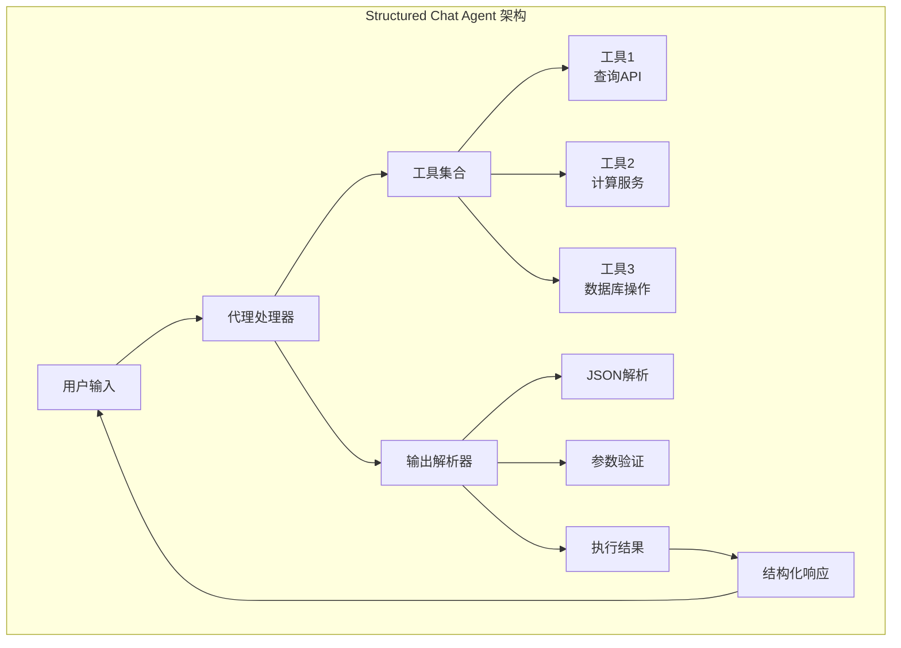
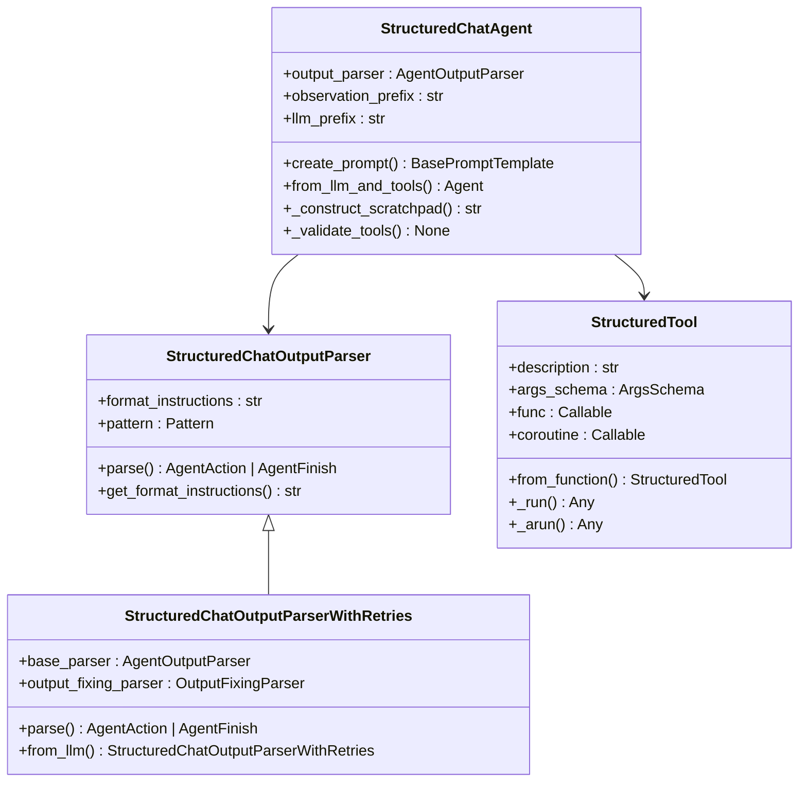
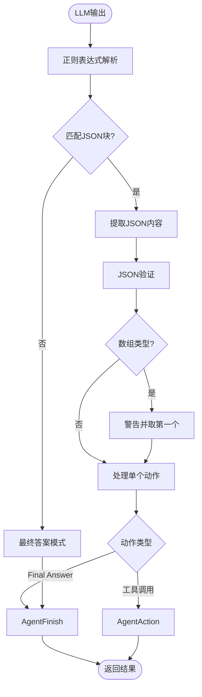
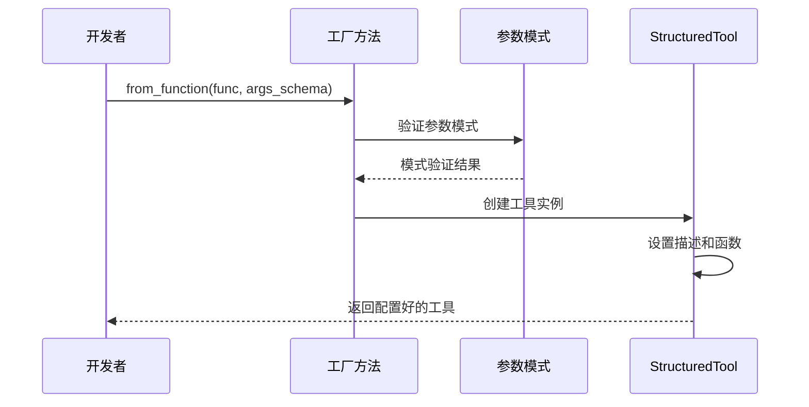
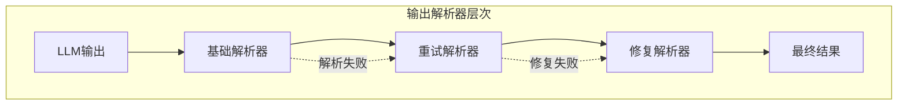
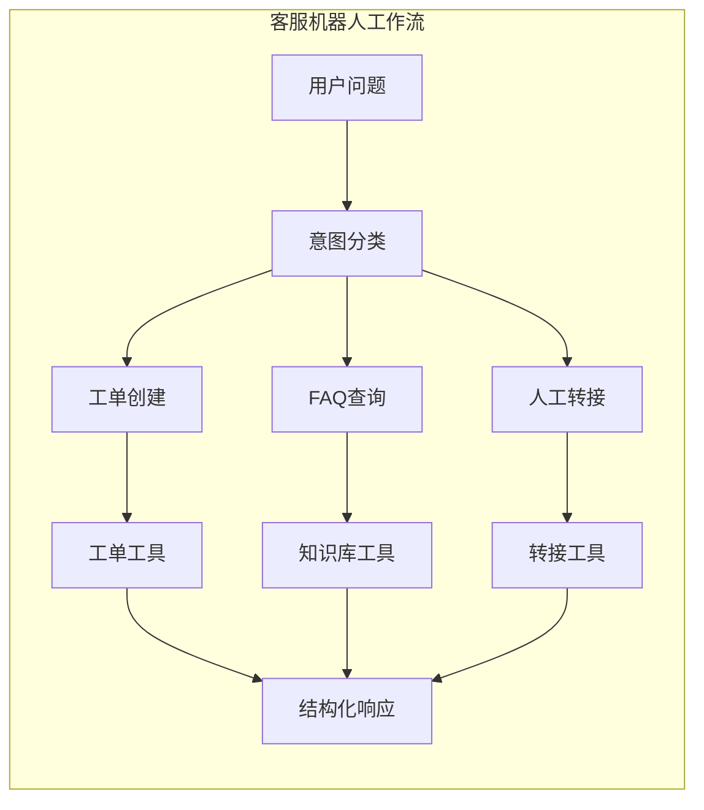

# Structured Chat Agent

<cite>
**本文档中引用的文件**
- [base.py](file://libs/langchain/langchain_classic/agents/structured_chat/base.py)
- [output_parser.py](file://libs/langchain/langchain_classic/agents/structured_chat/output_parser.py)
- [prompt.py](file://libs/langchain/langchain_classic/agents/structured_chat/prompt.py)
- [structured.py](file://libs/core/langchain_core/tools/structured.py)
- [test_structured_chat.py](file://libs/langchain/tests/unit_tests/agents/test_structured_chat.py)
- [render.py](file://libs/core/langchain_core/tools/render.py)
</cite>

## 目录
1. [简介](#简介)
2. [设计目标与核心概念](#设计目标与核心概念)
3. [架构概览](#架构概览)
4. [核心组件分析](#核心组件分析)
5. [工具系统与模式定义](#工具系统与模式定义)
6. [输出解析机制](#输出解析机制)
7. [实现指南与最佳实践](#实现指南与最佳实践)
8. [应用场景与配置选项](#应用场景与配置选项)
9. [故障排除指南](#故障排除指南)
10. [总结](#总结)

## 简介

Structured Chat Agent是LangChain框架中专为处理需要结构化输入和输出的对话场景而设计的智能代理。它通过预定义的模式（schema）或工具描述来引导对话，确保输出的格式化和一致性，特别适用于客服机器人、表单填写助手和需要严格数据格式交互的应用场景。

该代理的核心优势在于：
- **结构化对话管理**：强制使用预定义的工具调用模式
- **格式化输出保证**：确保所有响应都符合预期的JSON格式
- **错误恢复能力**：内置重试机制和输出修复功能
- **灵活的工具集成**：支持多种类型的工具和参数验证

## 设计目标与核心概念

### 设计目标

Structured Chat Agent的设计遵循以下核心原则：

1. **确定性输出**：确保每次对话都有明确的结构化输出
2. **工具导向**：通过预定义工具集合引导用户交互
3. **格式一致性**：强制使用JSON blob格式进行工具调用
4. **错误容错**：提供重试和修复机制处理解析错误

### 核心概念



**图表来源**
- [base.py](file://libs/langchain/langchain_classic/agents/structured_chat/base.py#L37-L88)
- [output_parser.py](file://libs/langchain/langchain_classic/agents/structured_chat/output_parser.py#L20-L58)

## 架构概览

Structured Chat Agent采用模块化架构，主要包含以下几个层次：



**图表来源**
- [base.py](file://libs/langchain/langchain_classic/agents/structured_chat/base.py#L37-L162)
- [output_parser.py](file://libs/langchain/langchain_classic/agents/structured_chat/output_parser.py#L20-L112)
- [structured.py](file://libs/core/langchain_core/tools/structured.py#L30-L248)

**章节来源**
- [base.py](file://libs/langchain/langchain_classic/agents/structured_chat/base.py#L1-L318)
- [output_parser.py](file://libs/langchain/langchain_classic/agents/structured_chat/output_parser.py#L1-L113)

## 核心组件分析

### StructuredChatAgent类

StructuredChatAgent是整个系统的核心控制器，负责协调LLM、工具和输出解析器之间的交互。

#### 主要特性

1. **输出解析器配置**：默认使用带有重试功能的输出解析器
2. **前缀管理**：自定义观察和LLM输出的前缀
3. **草稿板构建**：处理中间步骤的状态管理
4. **工具验证**：确保工具集合的有效性

#### 关键方法

- `create_prompt()`: 创建包含工具描述的系统提示
- `from_llm_and_tools()`: 基于LLM和工具集合创建代理实例
- `_construct_scratchpad()`: 构建对话历史的文本表示

### 输出解析机制

输出解析器是Structured Chat Agent的关键组件，负责将LLM的自然语言输出转换为结构化的动作指令。



**图表来源**
- [output_parser.py](file://libs/langchain/langchain_classic/agents/structured_chat/output_parser.py#L35-L58)

**章节来源**
- [base.py](file://libs/langchain/langchain_classic/agents/structured_chat/base.py#L37-L162)
- [output_parser.py](file://libs/langchain/langchain_classic/agents/structured_chat/output_parser.py#L20-L112)

## 工具系统与模式定义

### StructuredTool架构

StructuredTool提供了强大的工具定义能力，支持复杂的参数验证和异步执行。

#### 工具创建流程



**图表来源**
- [structured.py](file://libs/core/langchain_core/tools/structured.py#L130-L248)

#### 工具渲染系统

工具渲染器负责将工具集合转换为LLM可理解的文本格式：

| 渲染器类型 | 输出格式 | 适用场景 |
|-----------|---------|---------|
| `render_text_description` | 工具名称 + 描述 | 简单工具列表 |
| `render_text_description_and_args` | 工具名称 + 描述 + 参数 | 复杂工具配置 |

**章节来源**
- [structured.py](file://libs/core/langchain_core/tools/structured.py#L1-L249)
- [render.py](file://libs/core/langchain_core/tools/render.py#L1-L66)

## 输出解析机制

### 解析器层次结构

Structured Chat Agent采用了多层输出解析机制，确保高可靠性和容错能力：



**图表来源**
- [output_parser.py](file://libs/langchain/langchain_classic/agents/structured_chat/output_parser.py#L60-L112)

### 错误处理策略

1. **正则表达式匹配**：使用灵活的模式匹配JSON块
2. **多重解析尝试**：支持数组形式的多个动作
3. **输出修复**：自动修正常见的格式错误
4. **异常传播**：清晰的错误信息和堆栈跟踪

**章节来源**
- [output_parser.py](file://libs/langchain/langchain_classic/agents/structured_chat/output_parser.py#L20-L112)

## 实现指南与最佳实践

### 基本配置示例

以下是使用Structured Chat Agent的基本配置模式：

```python
# 基本配置示例路径
# 参考: [base.py](file://libs/langchain/langchain_classic/agents/structured_chat/base.py#L194-L237)
```

### 工具定义最佳实践

1. **明确的参数模式**：使用Pydantic模型定义复杂参数
2. **完整的文档字符串**：提供清晰的工具描述和参数说明
3. **适当的错误处理**：在工具函数中处理异常情况
4. **异步支持**：为网络请求等操作提供异步版本

### 提示模板优化

推荐的提示模板结构包含以下要素：

| 组件 | 功能 | 示例 |
|------|------|------|
| 系统消息前缀 | 定义代理角色和行为准则 | "你是一个有用的助手..." |
| 工具描述 | 列出可用工具及其参数 | "search(query: str) - 搜索..." |
| 格式说明 | 指导JSON blob格式 | "使用JSON blob指定工具..." |
| 对话格式 | 规范化对话流程 | "思考 -> 动作 -> 观察..." |
| 结束指令 | 强制格式要求 | "始终以有效的JSON blob响应..." |

**章节来源**
- [base.py](file://libs/langchain/langchain_classic/agents/structured_chat/base.py#L194-L280)
- [prompt.py](file://libs/langchain/langchain_classic/agents/structured_chat/prompt.py#L1-L35)

## 应用场景与配置选项

### 客服机器人应用

Structured Chat Agent特别适合构建智能客服系统：



### 表单填写助手

用于自动化表单收集和验证：

1. **字段识别**：自动识别需要填写的表单字段
2. **数据验证**：使用工具验证输入数据的格式
3. **进度跟踪**：维护填写进度状态
4. **错误纠正**：提供友好的错误反馈

### 配置选项详解

| 配置项 | 类型 | 默认值 | 说明 |
|--------|------|--------|------|
| `stop_sequence` | bool/list | True | 是否添加停止序列 |
| `tools_renderer` | callable | render_text_description_and_args | 工具渲染函数 |
| `format_instructions` | str | 内置模板 | 格式说明模板 |
| `memory_prompts` | list | None | 记忆提示模板 |

**章节来源**
- [base.py](file://libs/langchain/langchain_classic/agents/structured_chat/base.py#L160-L192)

## 故障排除指南

### 常见问题与解决方案

#### 解析错误

**问题**：输出解析失败
**原因**：JSON格式不正确或缺少必要的字段
**解决方案**：
1. 检查工具渲染器的输出格式
2. 验证提示模板中的格式说明
3. 使用调试模式查看原始LLM输出

#### 工具调用失败

**问题**：工具参数验证失败
**原因**：提供的参数不符合工具的参数模式
**解决方案**：
1. 检查工具的args_schema定义
2. 验证用户输入的数据类型
3. 添加适当的参数转换逻辑

#### 性能优化

**问题**：响应时间过长
**原因**：工具调用或LLM推理耗时较长
**解决方案**：
1. 实现工具缓存机制
2. 优化提示模板长度
3. 使用更高效的LLM模型

**章节来源**
- [test_structured_chat.py](file://libs/langchain/tests/unit_tests/agents/test_structured_chat.py#L1-L252)

## 总结

Structured Chat Agent代表了LangChain框架中对话系统设计的重要进步，通过引入结构化约束和工具导向的方法，显著提升了对话系统的可靠性和可预测性。其核心优势包括：

1. **确定性行为**：通过预定义模式确保一致的输出格式
2. **强大的工具集成**：支持复杂的参数验证和异步操作
3. **容错机制**：内置重试和修复功能提高系统稳定性
4. **灵活配置**：提供丰富的配置选项适应不同应用场景

对于开发者而言，Structured Chat Agent不仅是一个技术工具，更是构建高质量AI对话系统的重要基础设施。通过合理配置工具集合、优化提示模板和实施适当的错误处理策略，可以创建出既智能又可靠的对话体验。

随着AI对话技术的不断发展，Structured Chat Agent的设计理念将继续演进，为构建更加智能和人性化的AI助手提供坚实的技术基础。