# 工具执行机制

<cite>
**本文档引用的文件**
- [base.py](file://libs/core/langchain_core/tools/base.py)
- [base.py](file://libs/core/langchain_core/runnables/base.py)
- [agent.py](file://libs/langchain/langchain_classic/agents/agent.py)
- [tools.py](file://libs/langchain/langchain_classic/agents/output_parsers/tools.py)
- [tool_node.py](file://libs/langchain_v1/langchain/tools/tool_node.py)
- [tool_retry.py](file://libs/langchain_v1/langchain/agents/middleware/tool_retry.py)
- [test_tool_node.py](file://libs/langchain_v1/tests/unit_tests/agents/test_tool_node.py)
- [test_on_tool_call.py](file://libs/langchain_v1/tests/unit_tests/tools/test_on_tool_call.py)
</cite>

## 目录
1. [概述](#概述)
2. [核心架构](#核心架构)
3. [工具解析与识别](#工具解析与识别)
4. [工具调用调度](#工具调用调度)
5. [执行上下文管理](#执行上下文管理)
6. [并发执行机制](#并发执行机制)
7. [错误处理与重试](#错误处理与重试)
8. [生命周期管理](#生命周期管理)
9. [性能优化](#性能优化)
10. [最佳实践](#最佳实践)

## 概述

LangChain的工具执行机制是一个复杂而精密的系统，负责将LLM的输出解析为具体的工具调用，并协调这些工具的执行。该机制涵盖了从工具识别、参数提取、执行调度到结果聚合的完整流程，支持同步和异步两种执行模式，并提供了强大的错误处理和重试机制。

## 核心架构

### 系统架构概览

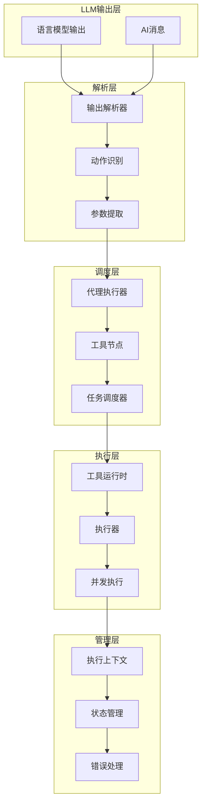

**图表来源**
- [agent.py](file://libs/langchain/langchain_classic/agents/agent.py#L1020-L1200)
- [tools.py](file://libs/langchain/langchain_classic/agents/output_parsers/tools.py#L0-L116)

### 核心组件关系

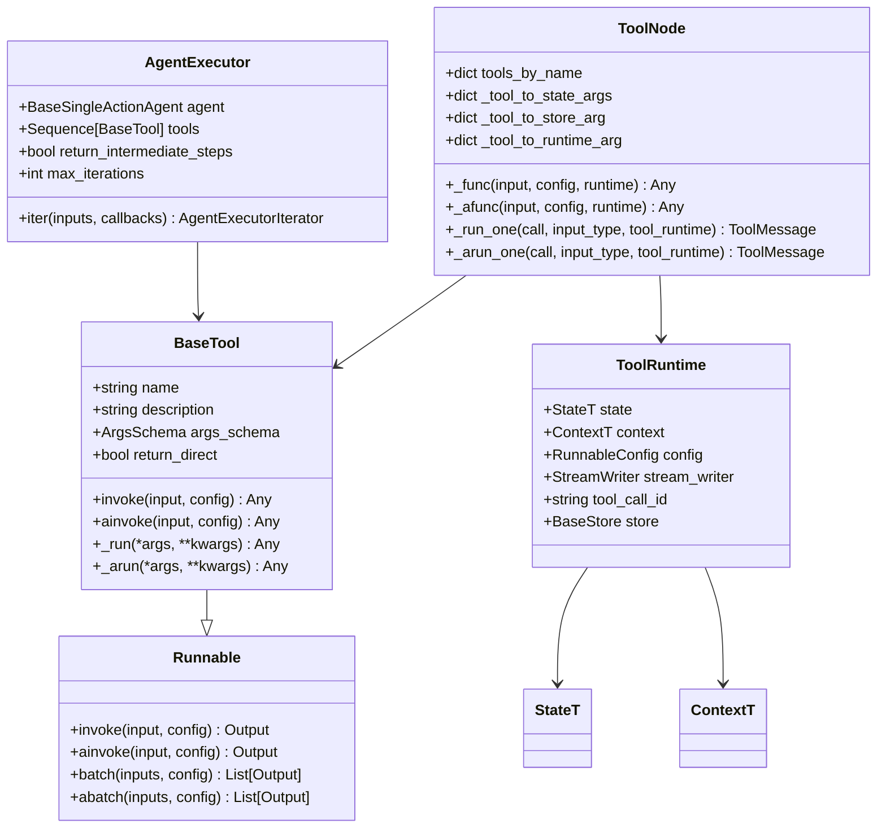

**图表来源**
- [base.py](file://libs/core/langchain_core/tools/base.py#L389-L972)
- [base.py](file://libs/core/langchain_core/runnables/base.py#L121-L2531)
- [tool_node.py](file://libs/langchain_v1/langchain/tools/tool_node.py#L517-L1353)

**章节来源**
- [base.py](file://libs/core/langchain_core/tools/base.py#L389-L972)
- [base.py](file://libs/core/langchain_core/runnables/base.py#L121-L320)
- [agent.py](file://libs/langchain/langchain_classic/agents/agent.py#L1020-L1219)

## 工具解析与识别

### LLM输出解析流程

LangChain使用专门的输出解析器将LLM的响应转换为可执行的工具调用。解析过程包含以下关键步骤：

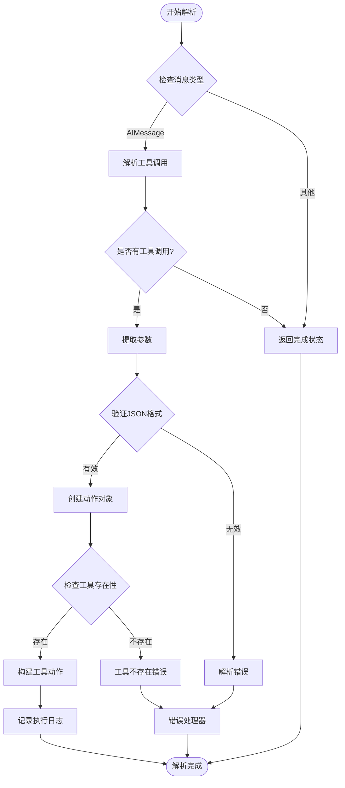

**图表来源**
- [tools.py](file://libs/langchain/langchain_classic/agents/output_parsers/tools.py#L20-L116)

### 参数提取与验证

工具参数的提取和验证是确保安全执行的关键环节：

| 验证阶段 | 处理内容 | 错误类型 | 处理方式 |
|---------|---------|---------|---------|
| 类型检查 | 参数类型匹配 | TypeError | 抛出异常或转换 |
| 架构验证 | JSON Schema验证 | ValidationError | 返回错误消息 |
| 必需字段 | 必填参数检查 | MissingRequiredField | 使用默认值或报错 |
| 范围限制 | 数值范围检查 | ValueOutOfRange | 截断或舍入 |
| 格式验证 | 字符串格式检查 | InvalidFormat | 格式化或拒绝 |

**章节来源**
- [tools.py](file://libs/langchain/langchain_classic/agents/output_parsers/tools.py#L20-L116)

## 工具调用调度

### 同步执行调度

同步执行采用线程池模式，支持批量处理多个工具调用：

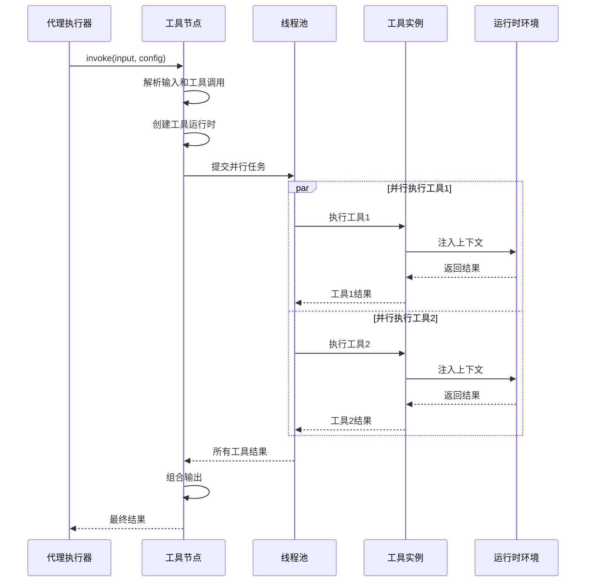

**图表来源**
- [tool_node.py](file://libs/langchain_v1/langchain/tools/tool_node.py#L661-L703)

### 异步并发执行

异步执行利用Python的asyncio库实现真正的并发：

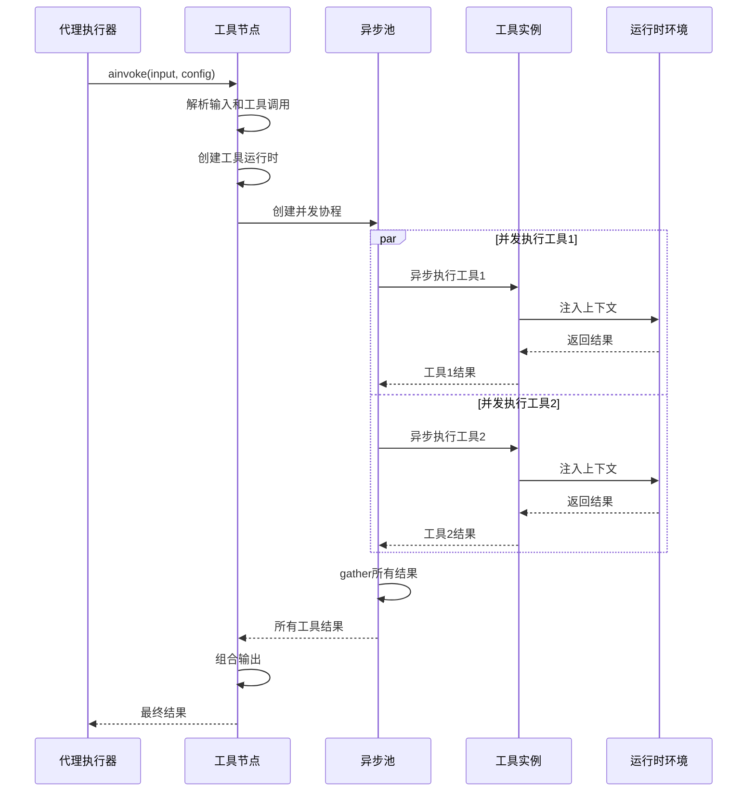

**图表来源**
- [tool_node.py](file://libs/langchain_v1/langchain/tools/tool_node.py#L705-L740)

### 批处理模式

批处理模式支持高效的大规模工具调用：

| 批处理类型 | 执行方式 | 适用场景 | 性能特点 |
|-----------|---------|---------|---------|
| 同步批处理 | 线程池并发 | I/O密集型工具 | 高吞吐量 |
| 异步批处理 | 协程并发 | 网络请求工具 | 低延迟 |
| 分片批处理 | 分段执行 | 大数据集处理 | 内存友好 |
| 流水线批处理 | 顺序分批 | 复杂依赖场景 | 可控性高 |

**章节来源**
- [tool_node.py](file://libs/langchain_v1/langchain/tools/tool_node.py#L661-L740)

## 执行上下文管理

### 上下文注入机制

工具执行需要访问多种上下文信息，包括状态、配置、存储等：

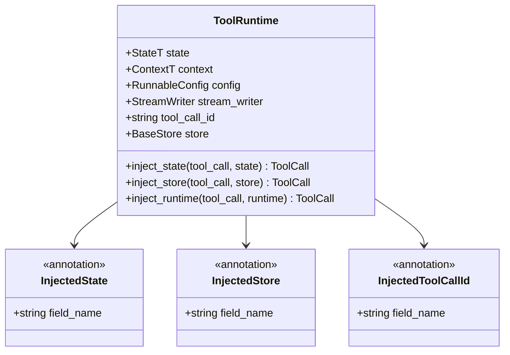

**图表来源**
- [tool_node.py](file://libs/langchain_v1/langchain/tools/tool_node.py#L1438-L1494)

### 状态跟踪机制

状态跟踪确保工具执行的一致性和可追溯性：

| 跟踪维度 | 实现方式 | 数据结构 | 用途 |
|---------|---------|---------|-----|
| 执行历史 | 时间戳序列 | List[ExecutionRecord] | 回溯和审计 |
| 工具链路 | 调用栈信息 | Stack[ToolCall] | 依赖分析 |
| 中间状态 | 快照保存 | StateSnapshot | 恢复点 |
| 性能指标 | 计时统计 | TimingMetrics | 优化参考 |

**章节来源**
- [tool_node.py](file://libs/langchain_v1/langchain/tools/tool_node.py#L1162-L1281)

## 并发执行机制

### 并发控制策略

LangChain提供了多层次的并发控制机制：

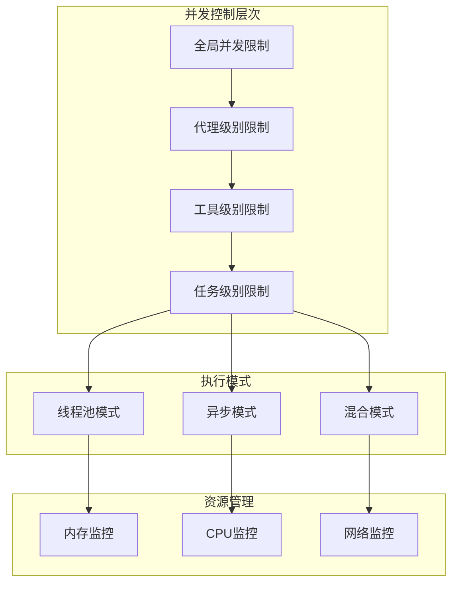

**图表来源**
- [base.py](file://libs/core/langchain_core/runnables/base.py#L850-L1014)

### 并发执行优化

| 优化技术 | 实现方式 | 性能提升 | 适用场景 |
|---------|---------|---------|---------|
| 连接池复用 | HTTP连接池 | 30-50% | 网络工具 |
| 结果缓存 | LRU缓存 | 60-80% | 重复查询 |
| 预热启动 | 延迟预加载 | 20-30% | 关键路径 |
| 动态调度 | 自适应负载均衡 | 40-60% | 高峰期 |

**章节来源**
- [base.py](file://libs/core/langchain_core/runnables/base.py#L850-L1014)

## 错误处理与重试

### 重试策略框架

LangChain提供了灵活的重试机制，支持多种重试策略：

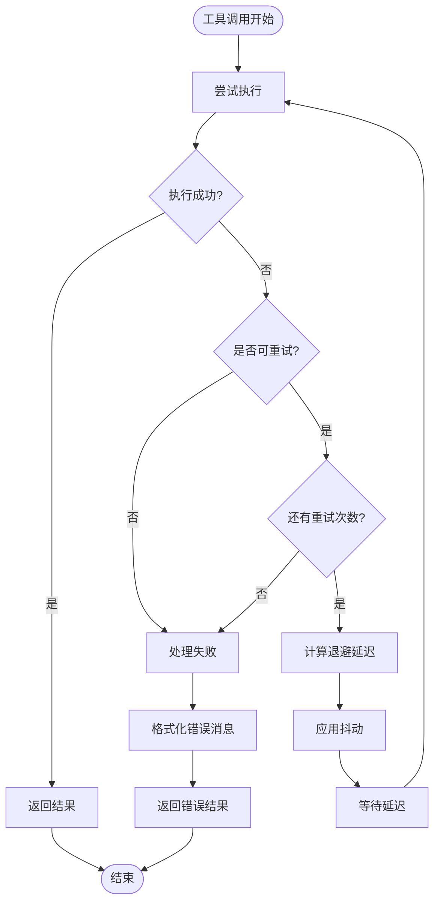

**图表来源**
- [tool_retry.py](file://libs/langchain_v1/langchain/agents/middleware/tool_retry.py#L275-L383)

### 错误分类与处理

| 错误类型 | 检测方法 | 重试条件 | 处理策略 |
|---------|---------|---------|---------|
| 网络超时 | 超时异常 | 指数退避 | 逐步增加延迟 |
| 服务不可用 | HTTP 5xx | 指数退避 | 服务恢复检测 |
| 认证失败 | 401/403异常 | 不重试 | 凭据更新 |
| 参数错误 | 验证异常 | 不重试 | 参数修正 |
| 资源限制 | 429异常 | 指数退避 | 限流控制 |

**章节来源**
- [tool_retry.py](file://libs/langchain_v1/langchain/agents/middleware/tool_retry.py#L0-L384)

## 生命周期管理

### 工具执行生命周期

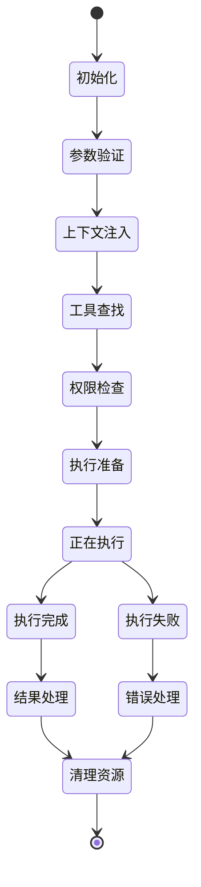

### 资源管理策略

| 资源类型 | 管理策略 | 生命周期 | 清理时机 |
|---------|---------|---------|---------|
| 内存资源 | 引用计数 | 请求级 | 执行完成后 |
| 文件句柄 | 上下文管理器 | 会话级 | 会话结束时 |
| 网络连接 | 连接池 | 应用级 | 应用关闭时 |
| 数据库连接 | 事务管理 | 事务级 | 事务提交后 |
| 缓存数据 | LRU淘汰 | 全局级 | 内存压力时 |

**章节来源**
- [tool_node.py](file://libs/langchain_v1/langchain/tools/tool_node.py#L886-L1183)

## 性能优化

### 执行性能监控

LangChain提供了全面的性能监控机制：

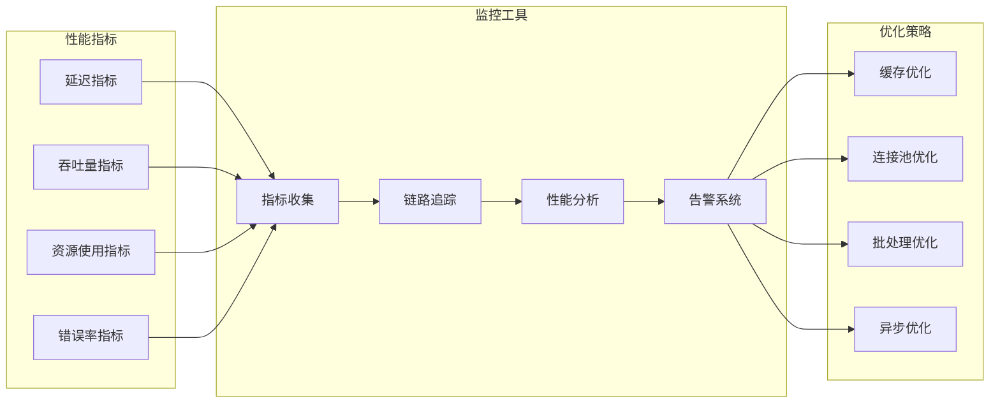

### 性能优化建议

| 优化领域 | 具体措施 | 预期收益 | 实施难度 |
|---------|---------|---------|---------|
| 网络优化 | 连接池、压缩传输 | 20-40% | 中等 |
| 内存优化 | 对象池、垃圾回收 | 15-30% | 较高 |
| CPU优化 | 算法优化、并行化 | 25-50% | 高 |
| 存储优化 | 缓存策略、索引 | 30-60% | 中等 |

## 最佳实践

### 工具设计原则

1. **单一职责**: 每个工具只负责一个明确的功能
2. **幂等性**: 工具调用应该具有幂等性
3. **错误处理**: 完善的错误处理和用户友好的错误信息
4. **性能考虑**: 避免长时间阻塞操作
5. **安全性**: 输入验证和权限控制

### 调试和监控

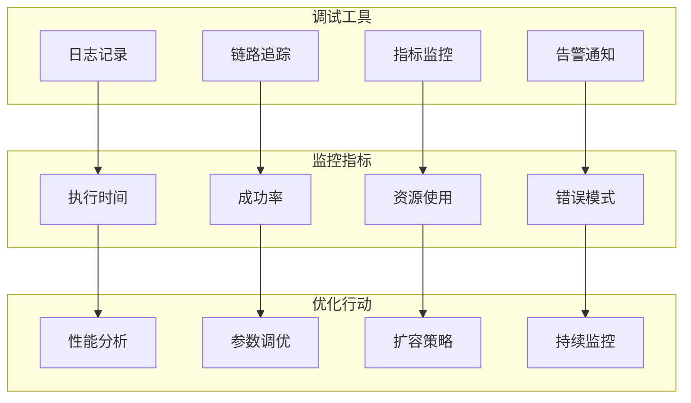

### 故障排除指南

| 问题类型 | 常见原因 | 排查方法 | 解决方案 |
|---------|---------|---------|---------|
| 工具调用失败 | 参数错误 | 检查输入格式 | 验证参数类型 |
| 执行超时 | 网络延迟 | 检查网络状况 | 增加超时时间 |
| 内存泄漏 | 资源未释放 | 内存分析工具 | 修复资源管理 |
| 并发冲突 | 竞态条件 | 日志分析 | 添加同步机制 |

通过遵循这些最佳实践和理解LangChain工具执行机制的深层原理，开发者可以构建更加稳定、高效的智能代理系统。