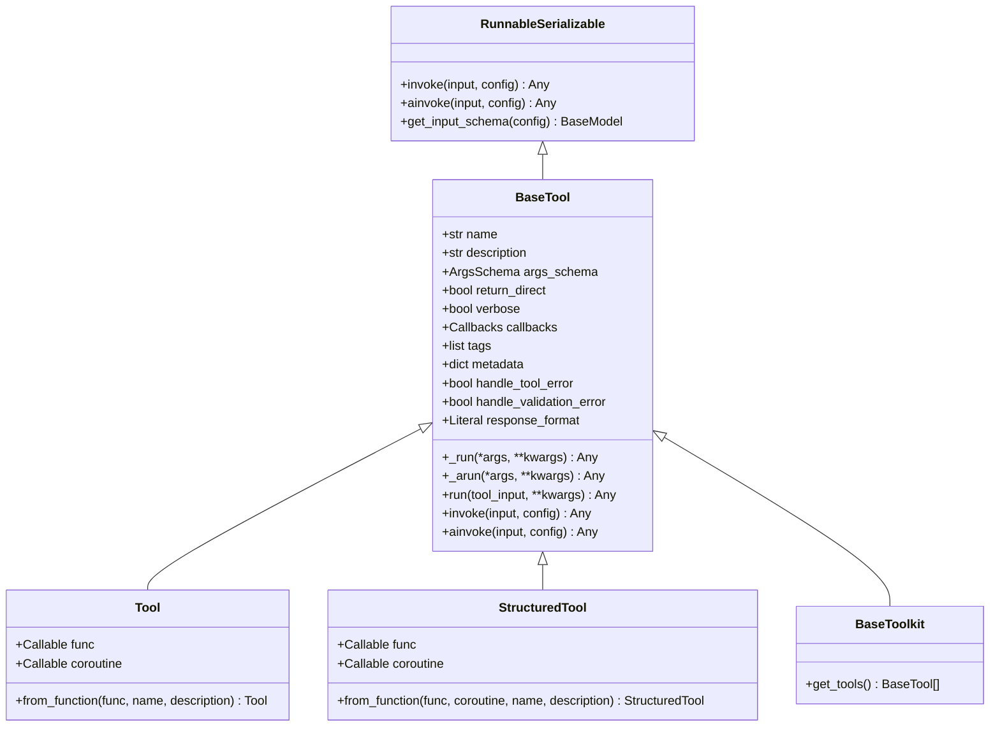
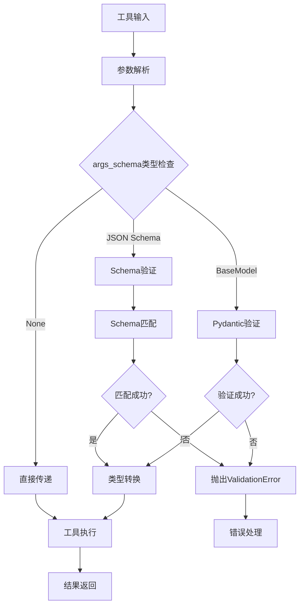
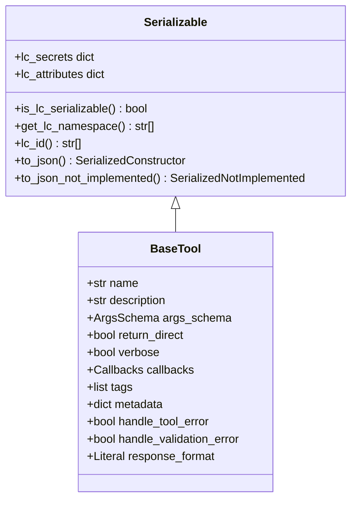
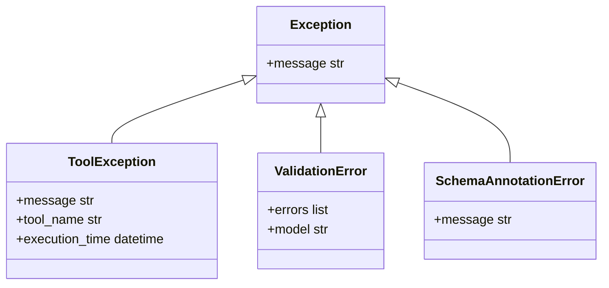

# 工具抽象

<cite>
**本文档中引用的文件**
- [base.py](file://libs/core/langchain_core/tools/base.py)
- [simple.py](file://libs/core/langchain_core/tools/simple.py)
- [structured.py](file://libs/core/langchain_core/tools/structured.py)
- [render.py](file://libs/core/langchain_core/tools/render.py)
- [retriever.py](file://libs/core/langchain_core/tools/retriever.py)
- [serializable.py](file://libs/core/langchain_core/load/serializable.py)
- [test_tools.py](file://libs/core/tests/unit_tests/test_tools.py)
</cite>

## 目录
1. [简介](#简介)
2. [Tool抽象接口设计原理](#tool抽象接口设计原理)
3. [核心属性详解](#核心属性详解)
4. [Pydantic模型验证机制](#pydantic模型验证机制)
5. [序列化与反序列化](#序列化与反序列化)
6. [Tool类型层次结构](#tool类型层次结构)
7. [错误处理策略](#错误处理策略)
8. [性能优化建议](#性能优化建议)
9. [创建示例](#创建示例)
10. [最佳实践](#最佳实践)

## 简介

LangChain中的Tool抽象接口是构建智能代理系统的核心组件，它定义了所有工具必须遵循的标准接口。Tool作为Agent执行特定任务的基本单元，提供了统一的调用模式、参数验证、错误处理和序列化机制。

Tool抽象接口的设计体现了LangChain架构的模块化思想，通过标准化的接口定义，使得不同的工具可以无缝集成到Agent系统中，同时保持良好的可扩展性和可维护性。

## Tool抽象接口设计原理

### 架构设计理念

Tool抽象接口基于以下核心设计原则：

1. **统一接口规范**：所有Tool都必须实现相同的基础接口
2. **类型安全**：通过Pydantic模型确保输入输出的类型安全
3. **异步支持**：原生支持同步和异步两种调用模式
4. **可序列化**：支持工具的持久化和传输
5. **错误隔离**：工具执行错误不会影响Agent的整体运行

### 继承关系图



**图表来源**
- [base.py](file://libs/core/langchain_core/tools/base.py#L377-L407)
- [simple.py](file://libs/core/langchain_core/tools/simple.py#L25-L50)
- [structured.py](file://libs/core/langchain_core/tools/structured.py#L25-L50)

## 核心属性详解

### name属性

`name`属性是Tool的唯一标识符，用于明确传达工具的目的和功能。

**特性：**
- 必须唯一且具有描述性
- 通常采用小写字母和下划线命名
- 在Agent与工具交互时作为识别依据

**约束：**
- 长度限制合理范围
- 不包含特殊字符（除下划线外）
- 具有语义化的含义

### description属性

`description`属性用于指导模型何时、如何以及为什么使用该工具。

**特性：**
- 提供工具的功能描述
- 可包含少量shot示例
- 应该清晰易懂
- 支持多语言描述

**最佳实践：**
- 描述工具的主要功能
- 说明适用场景
- 包含使用示例
- 避免过于技术性的术语

### args_schema属性

`args_schema`属性定义了工具的输入参数结构，通过Pydantic模型实现类型验证和参数解析。

**支持的格式：**
1. **Pydantic BaseModel子类**：推荐的类型安全方式
2. **JSON Schema字典**：灵活的结构定义
3. **None**：无参数或动态参数

**验证机制：**
- 自动类型转换
- 必填参数检查
- 参数范围验证
- 复杂类型支持

### func和coroutine属性

这两个属性分别定义了工具的同步和异步执行函数。

**func属性：**
- 同步执行函数
- 接受预定义的参数结构
- 返回工具执行结果

**coroutine属性：**
- 异步执行函数
- 支持并发操作
- 适用于I/O密集型任务

### 其他重要属性

**return_direct属性：**
- 控制是否直接返回结果
- 设置为True时停止Agent循环
- 适用于最终结果输出工具

**verbose属性：**
- 控制工具执行过程的日志记录
- 便于调试和监控

**tags和metadata属性：**
- 提供工具的分类信息
- 支持自定义元数据存储
- 用于过滤和查询

**响应格式控制：**
- `content`：标准内容格式
- `content_and_artifact`：包含额外信息的格式

**节来源**
- [base.py](file://libs/core/langchain_core/tools/base.py#L407-L511)

## Pydantic模型验证机制

### 类型验证流程

LangChain使用Pydantic模型进行参数验证，确保工具调用的安全性和可靠性。



**图表来源**
- [base.py](file://libs/core/langchain_core/tools/base.py#L600-L700)

### 验证器类型

**内置验证器：**
- 基础类型验证（str, int, float, bool）
- 复合类型验证（list, dict, tuple）
- 枚举类型验证
- 正则表达式验证

**自定义验证器：**
- 字段级验证器
- 模型级验证器
- 条件验证器

### 错误处理机制

当参数验证失败时，系统会触发相应的错误处理机制：

1. **ValidationError**：参数格式错误
2. **TypeError**：类型不匹配
3. **ValueError**：值不在有效范围内

**节来源**
- [base.py](file://libs/core/langchain_core/tools/base.py#L511-L600)

## 序列化与反序列化

### Serializable基类

所有Tool都继承自`RunnableSerializable`，提供了完整的序列化支持。



**图表来源**
- [serializable.py](file://libs/core/langchain_core/load/serializable.py#L70-L120)

### 序列化过程

**序列化步骤：**
1. 检查类的可序列化性
2. 获取类的命名空间信息
3. 收集构造函数参数
4. 处理敏感信息（secrets）
5. 生成JSON表示

**反序列化过程：**
1. 解析JSON数据
2. 查找对应的类
3. 验证版本兼容性
4. 创建实例并初始化

### 序列化格式

**标准格式：**
```json
{
    "lc": 1,
    "type": "constructor",
    "id": ["langchain", "tools", "my_tool"],
    "kwargs": {
        "name": "my_tool",
        "description": "My tool description",
        "args_schema": {...}
    }
}
```

**节来源**
- [serializable.py](file://libs/core/langchain_core/load/serializable.py#L150-L250)

## Tool类型层次结构

### BaseTool抽象类

`BaseTool`是所有Tool的基础抽象类，定义了核心接口和通用行为。

**主要特性：**
- 抽象方法定义
- 通用验证逻辑
- 回调管理
- 错误处理框架

### Tool类（简单工具）

`Tool`类适用于简单的单输入工具，通常包装现有的Python函数。

**特点：**
- 支持函数装饰器语法
- 自动参数推断
- 简单的错误处理
- 适合快速原型开发

### StructuredTool类（结构化工具）

`StructuredTool`类专为复杂的多参数工具设计，提供完整的参数验证和文档支持。

**特点：**
- 完整的参数验证
- 文档自动生成
- 支持复杂类型
- 更强的类型安全性

### ToolKit类（工具包）

`BaseToolkit`允许将多个相关的工具组织在一起，形成工具集合。

**特点：**
- 工具分组管理
- 批量操作支持
- 统一的生命周期管理

**节来源**
- [base.py](file://libs/core/langchain_core/tools/base.py#L377-L407)
- [simple.py](file://libs/core/langchain_core/tools/simple.py#L25-L50)
- [structured.py](file://libs/core/langchain_core/tools/structured.py#L25-L50)

## 错误处理策略

### ToolException异常体系

LangChain定义了专门的异常处理机制来管理工具执行过程中的错误。



**图表来源**
- [base.py](file://libs/core/langchain_core/tools/base.py#L377-L407)

### 错误处理配置

**handle_tool_error配置：**
- `False`：抛出异常
- `True`：使用默认错误消息
- `str`：使用自定义错误消息
- `Callable`：使用自定义处理函数

**handle_validation_error配置：**
- 类似于handle_tool_error
- 专门处理参数验证错误

### 错误恢复策略

**重试机制：**
- 指数退避算法
- 最大重试次数限制
- 退避因子配置

**降级处理：**
- 备用执行路径
- 缓存回退
- 服务降级

**节来源**
- [base.py](file://libs/core/langchain_core/tools/base.py#L473-L511)

## 性能优化建议

### 异步执行优化

**异步工具设计：**
- 使用`asyncio`避免阻塞
- 实现连接池管理
- 支持并发请求处理

**性能监控：**
- 执行时间统计
- 资源使用监控
- 错误率跟踪

### 内存管理

**对象复用：**
- 连接对象缓存
- 模型实例共享
- 减少对象创建开销

**垃圾回收优化：**
- 及时释放资源
- 避免循环引用
- 使用弱引用

### 缓存策略

**结果缓存：**
- 查询结果缓存
- 计算结果缓存
- 配置信息缓存

**缓存失效：**
- 时间戳失效
- 版本控制失效
- 主动刷新机制

## 创建示例

### 基础Tool创建

**简单函数包装：**
```python
# 使用装饰器语法
@tool
def search(query: str) -> str:
    """搜索指定关键词的结果"""
    return f"搜索结果: {query}"

# 手动创建
tool = Tool(
    name="search",
    func=lambda query: f"搜索结果: {query}",
    description="搜索指定关键词的结果"
)
```

### 结构化Tool创建

**带参数验证：**
```python
class CalculatorInput(BaseModel):
    """计算器输入参数"""
    num1: float = Field(description="第一个数字")
    num2: float = Field(description="第二个数字")
    operation: Literal["add", "subtract", "multiply", "divide"] = Field(
        description="运算类型"
    )

@tool(args_schema=CalculatorInput)
def calculator(num1: float, num2: float, operation: str) -> float:
    """执行基本数学运算"""
    if operation == "add":
        return num1 + num2
    elif operation == "subtract":
        return num1 - num2
    elif operation == "multiply":
        return num1 * num2
    elif operation == "divide":
        return num1 / num2 if num2 != 0 else float('inf')
```

### 异步Tool创建

**异步函数支持：**
```python
@tool
async def async_search(query: str) -> str:
    """异步搜索工具"""
    # 模拟异步网络请求
    await asyncio.sleep(0.1)
    return f"异步搜索结果: {query}"

# 手动创建异步工具
async def async_processor(text: str) -> str:
    await asyncio.sleep(0.05)
    return text.upper()

tool = Tool(
    name="async_processor",
    func=lambda text: text.lower(),
    coroutine=async_processor,
    description="异步文本处理器"
)
```

### 复杂Tool创建

**带回调和配置：**
```python
@tool
def complex_tool(
    data: str,
    config: dict = None,
    callbacks: Callbacks = None
) -> dict:
    """复杂的工具，支持配置和回调"""
    if callbacks:
        for callback in callbacks:
            callback.on_tool_start(
                {"name": "complex_tool", "description": "复杂工具"},
                data
            )
    
    result = {
        "processed": data.upper(),
        "config": config or {},
        "timestamp": datetime.now()
    }
    
    if callbacks:
        for callback in callbacks:
            callback.on_tool_end(result)
    
    return result
```

**节来源**
- [test_tools.py](file://libs/core/tests/unit_tests/test_tools.py#L50-L150)

## 最佳实践

### 设计原则

**单一职责：**
- 每个工具应该只做一件事
- 功能边界清晰
- 易于测试和维护

**接口一致性：**
- 统一的参数命名
- 一致的返回格式
- 标准化的错误处理

**文档完整性：**
- 清晰的函数签名
- 详细的参数说明
- 使用示例

### 安全考虑

**输入验证：**
- 严格的参数类型检查
- 输入长度限制
- 特殊字符过滤

**权限控制：**
- 最小权限原则
- 访问日志记录
- 操作审计追踪

### 测试策略

**单元测试：**
- 边界条件测试
- 错误情况测试
- 性能基准测试

**集成测试：**
- 工具链集成测试
- Agent工作流测试
- 端到端测试

### 监控和调试

**日志记录：**
- 结构化日志格式
- 关键指标监控
- 错误堆栈跟踪

**性能监控：**
- 执行时间统计
- 资源使用监控
- 吞吐量测量

通过遵循这些最佳实践，可以构建高质量、可靠且易于维护的LangChain工具，为智能代理系统的稳定运行提供坚实基础。