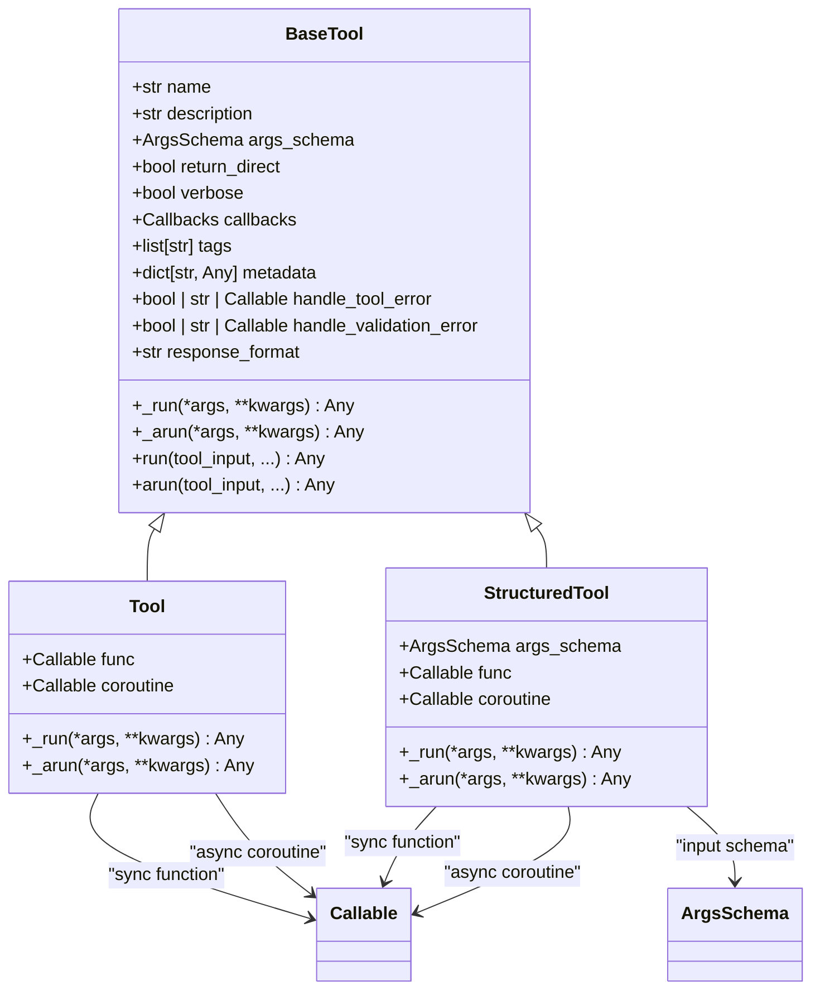
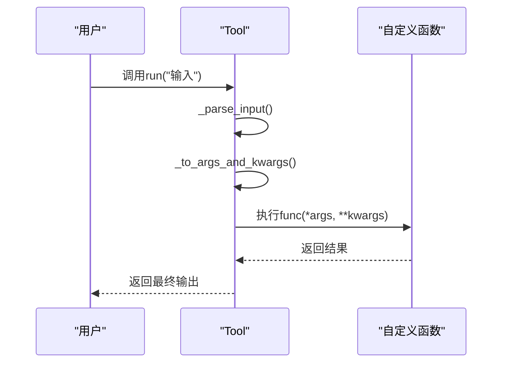
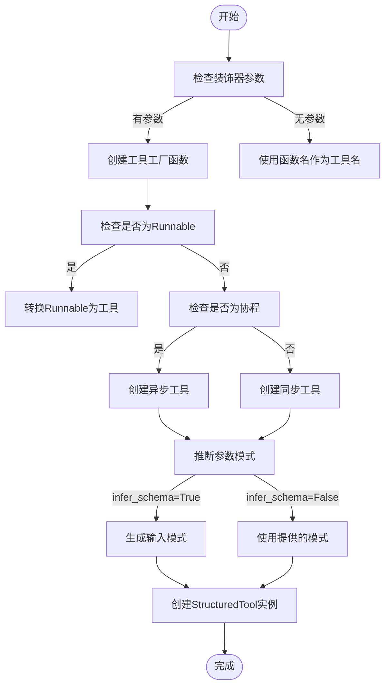
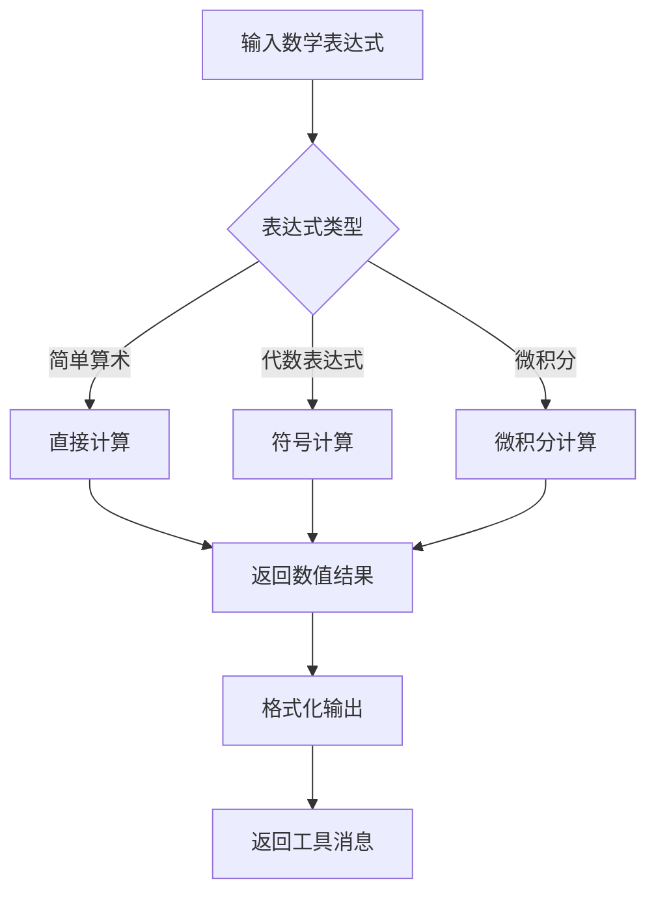
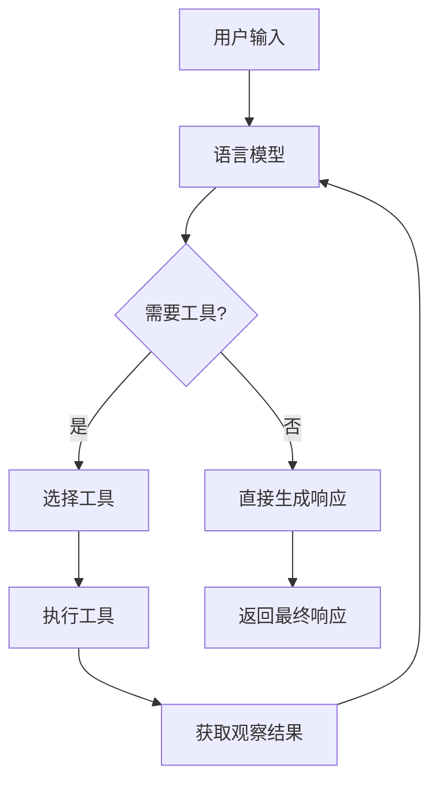
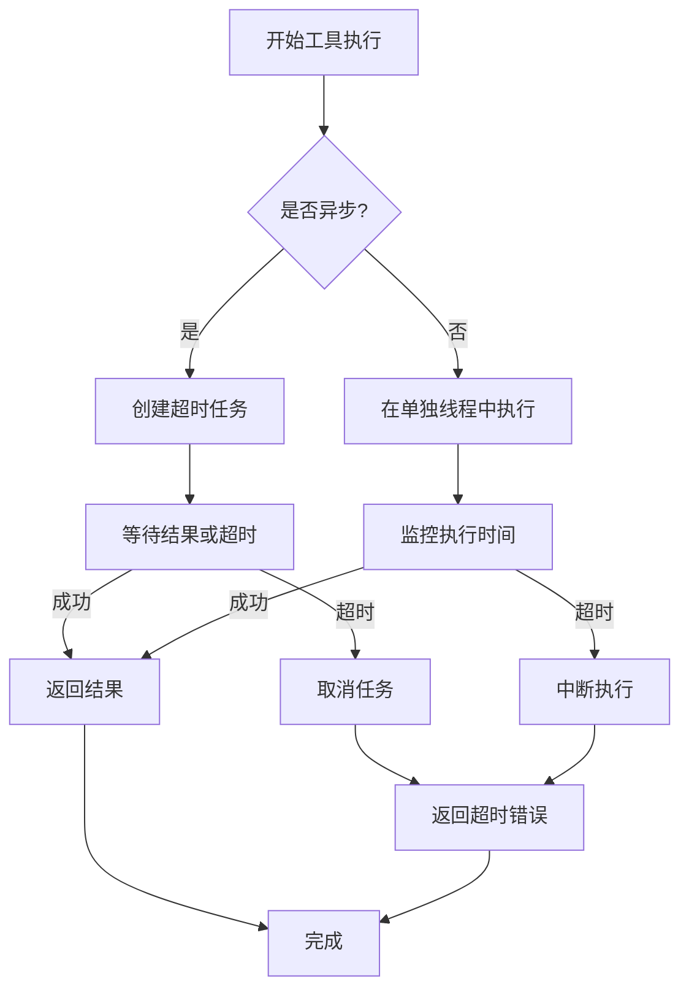

# 工具集成

<cite>
**本文档中引用的文件**  
- [base.py](file://libs/core/langchain_core/tools/base.py)
- [simple.py](file://libs/core/langchain_core/tools/simple.py)
- [structured.py](file://libs/core/langchain_core/tools/structured.py)
- [retriever.py](file://libs/core/langchain_core/tools/retriever.py)
- [convert.py](file://libs/core/langchain_core/tools/convert.py)
- [render.py](file://libs/core/langchain_core/tools/render.py)
- [agents.py](file://libs/core/langchain_core/agents.py)
</cite>

## 目录
1. [简介](#简介)
2. [工具抽象接口设计](#工具抽象接口设计)
3. [自定义函数封装为工具](#自定义函数封装为工具)
4. [预构建工具使用](#预构建工具使用)
5. [工具注册与发现机制](#工具注册与发现机制)
6. [Agent工具选择机制](#agent工具选择机制)
7. [同步与异步工具实现](#同步与异步工具实现)
8. [错误处理与超时配置](#错误处理与超时配置)
9. [参数验证与外部API集成](#参数验证与外部api集成)
10. [最佳实践](#最佳实践)

## 简介
LangChain中的工具（Tools）是代理（Agent）用来与外部世界交互的核心组件。每个工具都有一个描述，代理使用这个描述来选择合适的工具执行任务。工具系统提供了灵活的抽象接口，支持从简单函数到复杂结构化输入的各种集成方式。本文档将深入探讨工具集成的各个方面，包括接口设计、自定义封装、预构建工具使用、注册发现机制以及代理如何根据任务需求选择合适的工具。

## 工具抽象接口设计

LangChain的工具系统基于`BaseTool`抽象基类，定义了所有工具必须实现的接口。核心属性包括`name`、`description`、`func`等，这些属性共同构成了工具的元数据和行为定义。



**图表来源**  
- [base.py](file://libs/core/langchain_core/tools/base.py#L150-L300)
- [simple.py](file://libs/core/langchain_core/tools/simple.py#L15-L50)
- [structured.py](file://libs/core/langchain_core/tools/structured.py#L15-L50)

**章节来源**  
- [base.py](file://libs/core/langchain_core/tools/base.py#L1-L500)

### 核心属性详解

`BaseTool`类定义了工具的核心属性，这些属性共同决定了工具的行为和元数据：

- **name**: 工具的唯一标识符，用于在代理决策过程中识别工具
- **description**: 工具的描述文本，用于指导代理理解何时以及如何使用该工具
- **args_schema**: 用于验证和解析工具输入参数的Pydantic模型类
- **return_direct**: 布尔值，指示是否在工具调用后直接返回结果，停止代理循环
- **verbose**: 是否记录工具执行进度
- **callbacks**: 工具执行期间调用的回调函数
- **tags**: 与工具关联的可选标签列表
- **metadata**: 与工具关联的可选元数据
- **handle_tool_error**: 处理工具执行异常的方式
- **handle_validation_error**: 处理参数验证异常的方式
- **response_format**: 工具响应格式，可以是"content"或"content_and_artifact"

这些属性通过Pydantic的`Field`装饰器进行定义，确保了类型安全和配置的灵活性。

## 自定义函数封装为工具

LangChain提供了多种方式将自定义函数封装为工具，从简单的字符串输入到复杂的结构化输入，系统提供了相应的封装机制。

### 简单工具封装

对于接受单个字符串输入的简单函数，可以使用`Tool`类进行封装。这种封装方式适用于不需要复杂输入验证的场景。



**图表来源**  
- [simple.py](file://libs/core/langchain_core/tools/simple.py#L50-L100)
- [base.py](file://libs/core/langchain_core/tools/base.py#L300-L400)

**章节来源**  
- [simple.py](file://libs/core/langchain_core/tools/simple.py#L1-L200)

### 结构化工具封装

对于需要复杂输入参数的函数，可以使用`StructuredTool`类进行封装。这种封装方式支持完整的Pydantic模型验证，确保输入数据的完整性和正确性。

```python
from pydantic import BaseModel, Field
from langchain_core.tools import StructuredTool

class SearchInput(BaseModel):
    query: str = Field(description="要搜索的查询字符串")
    max_results: int = Field(default=10, description="最大返回结果数")

def search_api(query: str, max_results: int = 10) -> dict:
    """搜索API实现"""
    # 实现搜索逻辑
    pass

search_tool = StructuredTool.from_function(
    func=search_api,
    name="search_api",
    description="通过API搜索信息",
    args_schema=SearchInput
)
```

结构化工具的创建过程包括：
1. 定义输入参数的Pydantic模型
2. 实现具体的业务逻辑函数
3. 使用`from_function`类方法创建工具实例
4. 系统自动处理输入验证和参数解析

### 装饰器方式创建工具

LangChain还提供了`@tool`装饰器，可以更简洁地将函数转换为工具。这种方式支持多种参数配置，提供了极大的灵活性。



**图表来源**  
- [convert.py](file://libs/core/langchain_core/tools/convert.py#L50-L200)
- [structured.py](file://libs/core/langchain_core/tools/structured.py#L100-L150)

**章节来源**  
- [convert.py](file://libs/core/langchain_core/tools/convert.py#L1-L400)

## 预构建工具使用

LangChain提供了多种预构建工具，涵盖了常见的使用场景，如搜索、计算、数据库操作等。这些工具经过优化和测试，可以直接集成到应用中。

### 检索器工具

检索器工具（Retriever Tool）是专门用于文档检索的预构建工具。它将检索器与工具系统集成，使得代理可以执行基于内容的搜索。

```python
from langchain_core.tools import create_retriever_tool
from langchain_core.retrievers import BaseRetriever

# 创建检索器工具
retriever_tool = create_retriever_tool(
    retriever=my_retriever,
    name="document_search",
    description="在文档数据库中搜索相关信息",
    document_prompt=my_prompt,
    document_separator="\n\n"
)
```

检索器工具的工作流程：
1. 接收查询字符串作为输入
2. 调用底层检索器执行搜索
3. 格式化检索到的文档
4. 返回格式化的搜索结果

### 计算工具

计算工具用于执行数学运算和表达式求值。这类工具通常与符号数学库集成，支持复杂的数学表达式解析和计算。



**图表来源**  
- [retriever.py](file://libs/core/langchain_core/tools/retriever.py#L1-L50)
- [simple.py](file://libs/core/langchain_core/tools/simple.py#L100-L150)

**章节来源**  
- [retriever.py](file://libs/core/langchain_core/tools/retriever.py#L1-L120)

## 工具注册与发现机制

LangChain的工具注册与发现机制基于Python的动态导入系统，允许在运行时动态加载和注册工具。

### 动态导入系统

工具模块使用`__getattr__`和`__dir__`方法实现动态导入，这使得工具可以在需要时才被加载，提高了系统的启动性能和内存效率。

```python
_dynamic_imports = {
    "FILTERED_ARGS": "base",
    "ArgsSchema": "base",
    "BaseTool": "base",
    "Tool": "simple",
    "StructuredTool": "structured",
    "create_retriever_tool": "retriever",
    "tool": "convert",
}

def __getattr__(attr_name: str) -> object:
    module_name = _dynamic_imports.get(attr_name)
    result = import_attr(attr_name, module_name, __spec__.parent)
    globals()[attr_name] = result
    return result

def __dir__() -> list[str]:
    return list(__all__)
```

这种设计模式的优点：
- **延迟加载**：工具只在首次使用时才被导入
- **内存效率**：未使用的工具不会占用内存
- **扩展性**：易于添加新的工具类型
- **兼容性**：保持了向后兼容的API

### 工具渲染

工具渲染器（ToolsRenderer）负责将工具列表转换为适合语言模型理解的文本格式。这对于代理选择合适的工具至关重要。

```python
from langchain_core.tools import render_text_description

# 渲染工具描述
tool_descriptions = render_text_description([tool1, tool2, tool3])
print(tool_descriptions)
# 输出:
# tool1_name - tool1_description
# tool2_name - tool2_description
# tool3_name - tool3_description
```

两种主要的渲染方式：
- `render_text_description`: 仅渲染工具名称和描述
- `render_text_description_and_args`: 渲染工具名称、描述和参数模式

**章节来源**  
- [__init__.py](file://libs/core/langchain_core/tools/__init__.py#L50-L100)
- [render.py](file://libs/core/langchain_core/tools/render.py#L1-L70)

## Agent工具选择机制

代理（Agent）的工具选择机制是整个系统的核心，它决定了代理如何根据任务需求选择合适的工具。

### 决策流程

代理的决策流程遵循以下步骤：
1. 接收用户输入和上下文
2. 使用语言模型生成行动请求
3. 选择合适的工具执行行动
4. 执行工具并获取观察结果
5. 将观察结果返回给语言模型
6. 重复过程直到达到停止条件



**图表来源**  
- [agents.py](file://libs/core/langchain_core/agents.py#L1-L50)
- [base.py](file://libs/core/langchain_core/tools/base.py#L100-L150)

### 行动表示

代理使用`AgentAction`类来表示要执行的行动，这个类包含了执行工具所需的所有信息：

```python
class AgentAction(Serializable):
    tool: str
    tool_input: str | dict
    log: str
    type: Literal["AgentAction"] = "AgentAction"
```

- **tool**: 要执行的工具名称
- **tool_input**: 传递给工具的输入
- **log**: 关于行动的额外日志信息
- **type**: 序列化类型标识

代理通过分析工具的描述和参数模式，结合当前上下文，决定调用哪个工具以及如何构造输入参数。

**章节来源**  
- [agents.py](file://libs/core/langchain_core/agents.py#L50-L150)

## 同步与异步工具实现

LangChain的工具系统同时支持同步和异步实现，这使得工具可以适应不同的使用场景和性能需求。

### 同步工具

同步工具使用`_run`方法实现，这是最基本的工具执行方式。当调用工具的`run`方法时，系统会调用`_run`方法执行实际的业务逻辑。

```python
def _run(
    self,
    *args: Any,
    config: RunnableConfig,
    run_manager: CallbackManagerForToolRun | None = None,
    **kwargs: Any,
) -> Any:
    """使用工具。
    
    Args:
        *args: 传递给工具的位置参数
        config: 运行配置
        run_manager: 可选的回调管理器
        **kwargs: 传递给工具的关键字参数
        
    Returns:
        工具执行结果
    """
    if self.func:
        if run_manager and signature(self.func).parameters.get("callbacks"):
            kwargs["callbacks"] = run_manager.get_child()
        if config_param := _get_runnable_config_param(self.func):
            kwargs[config_param] = config
        return self.func(*args, **kwargs)
    msg = "工具不支持同步调用。"
    raise NotImplementedError(msg)
```

### 异步工具

异步工具使用`_arun`方法实现，支持非阻塞的工具执行。这对于I/O密集型操作特别有用，可以显著提高系统的整体性能。

```python
async def _arun(
    self,
    *args: Any,
    config: RunnableConfig,
    run_manager: AsyncCallbackManagerForToolRun | None = None,
    **kwargs: Any,
) -> Any:
    """异步使用工具。
    
    Args:
        *args: 传递给工具的位置参数
        config: 运行配置
        run_manager: 可选的异步回调管理器
        **kwargs: 传递给工具的关键字参数
        
    Returns:
        工具执行结果
    """
    if self.coroutine:
        if run_manager and signature(self.coroutine).parameters.get("callbacks"):
            kwargs["callbacks"] = run_manager.get_child()
        if config_param := _get_runnable_config_param(self.coroutine):
            kwargs[config_param] = config
        return await self.coroutine(*args, **kwargs)
    
    # 如果没有协程实现，则在执行器中运行同步方法
    return await super()._arun(
        *args, config=config, run_manager=run_manager, **kwargs
    )
```

异步工具的优势：
- **非阻塞执行**：不会阻塞事件循环
- **更好的资源利用率**：可以同时处理多个I/O操作
- **更高的吞吐量**：特别适合网络请求等I/O密集型任务

**章节来源**  
- [simple.py](file://libs/core/langchain_core/tools/simple.py#L100-L150)
- [structured.py](file://libs/core/langchain_core/tools/structured.py#L100-L150)

## 错误处理与超时配置

工具系统的错误处理机制是确保系统稳定性和可靠性的关键组成部分。

### 工具异常

`ToolException`是工具执行过程中抛出的异常，它允许工具在不中断代理的情况下报告错误。代理可以根据配置处理这些异常，将错误结果作为观察返回。

```python
class ToolException(Exception):
    """工具执行错误时抛出的异常。
    
    此异常允许工具在不中断代理的情况下报告错误。
    错误会根据工具的handle_tool_error设置进行处理，
    结果将作为观察返回给代理。
    """
```

### 错误处理策略

工具提供了多种错误处理策略，通过`handle_tool_error`和`handle_validation_error`属性进行配置：

- **布尔值**：`True`表示返回默认错误消息，`False`表示重新抛出异常
- **字符串**：直接返回指定的错误消息
- **可调用对象**：调用指定的函数处理异常，返回处理后的消息

```python
# 示例：不同的错误处理配置
tool1 = Tool(
    name="tool1",
    func=my_func,
    description="示例工具",
    handle_tool_error=True  # 返回默认错误消息
)

tool2 = Tool(
    name="tool2",
    func=my_func,
    description="示例工具",
    handle_tool_error="执行失败，请重试"  # 返回指定错误消息
)

tool3 = Tool(
    name="tool3",
    func=my_func,
    description="示例工具",
    handle_tool_error=lambda e: f"错误: {str(e)}"  # 自定义错误处理函数
)
```

### 超时配置

虽然代码中没有直接的超时配置，但可以通过回调管理器和运行配置实现超时控制。建议在工具实现中使用异步超时机制来防止长时间运行的操作。



**图表来源**  
- [base.py](file://libs/core/langchain_core/tools/base.py#L100-L150)
- [simple.py](file://libs/core/langchain_core/tools/simple.py#L150-L200)

**章节来源**  
- [base.py](file://libs/core/langchain_core/tools/base.py#L100-L200)

## 参数验证与外部API集成

工具系统的参数验证机制基于Pydantic模型，提供了强大的数据验证和序列化功能。

### 参数模式创建

`create_schema_from_function`函数从函数签名创建Pydantic模式，自动推断参数类型和描述：

```python
def create_schema_from_function(
    model_name: str,
    func: Callable,
    *,
    filter_args: Sequence[str] | None = None,
    parse_docstring: bool = False,
    error_on_invalid_docstring: bool = False,
    include_injected: bool = True,
) -> type[BaseModel]:
    """从函数签名创建Pydantic模式。"""
```

参数模式创建过程：
1. 解析函数签名
2. 检查Pydantic版本兼容性
3. 提取参数描述（从docstring或类型注解）
4. 创建子集模型
5. 返回验证后的Pydantic模型

### 外部API集成

集成外部API的最佳实践包括：

1. **错误处理**：捕获网络异常并转换为`ToolException`
2. **重试机制**：实现指数退避重试策略
3. **速率限制**：遵守API的速率限制策略
4. **缓存**：对频繁请求的结果进行缓存
5. **认证**：安全地管理API密钥

```python
@tool
def external_api_call(endpoint: str, params: dict) -> dict:
    """调用外部API。
    
    Args:
        endpoint: API端点
        params: 请求参数
        
    Returns:
        API响应
        
    Raises:
        ToolException: 如果API调用失败
    """
    try:
        # 实现API调用逻辑
        response = requests.get(f"https://api.example.com/{endpoint}", params=params)
        response.raise_for_status()
        return response.json()
    except requests.RequestException as e:
        raise ToolException(f"API调用失败: {str(e)}") from e
```

**章节来源**  
- [base.py](file://libs/core/langchain_core/tools/base.py#L500-L700)
- [convert.py](file://libs/core/langchain_core/tools/convert.py#L300-L400)

## 最佳实践

### 工具设计原则

1. **单一职责**：每个工具应该只做一件事，并做好
2. **清晰命名**：工具名称应该清晰地表达其功能
3. **详细描述**：提供足够的描述信息，帮助代理理解何时使用该工具
4. **输入验证**：使用Pydantic模式验证输入参数
5. **错误处理**：提供有意义的错误信息

### 性能优化

1. **异步实现**：对于I/O密集型操作，优先使用异步实现
2. **缓存结果**：对可缓存的操作实现结果缓存
3. **批量处理**：对于支持批量操作的API，使用批量请求减少网络开销
4. **连接池**：复用网络连接，减少连接建立开销

### 安全考虑

1. **输入验证**：严格验证所有输入，防止注入攻击
2. **认证管理**：安全地存储和访问API密钥
3. **速率限制**：遵守API的速率限制，避免被封禁
4. **日志记录**：记录关键操作，便于审计和调试

### 监控与调试

1. **回调系统**：充分利用回调系统监控工具执行
2. **指标收集**：收集执行时间、成功率等关键指标
3. **分布式追踪**：集成分布式追踪系统，跟踪跨服务调用
4. **错误报告**：建立完善的错误报告和告警机制

**章节来源**  
- [base.py](file://libs/core/langchain_core/tools/base.py#L1-L1000)
- [simple.py](file://libs/core/langchain_core/tools/simple.py#L1-L200)
- [structured.py](file://libs/core/langchain_core/tools/structured.py#L1-L250)
- [convert.py](file://libs/core/langchain_core/tools/convert.py#L1-L440)
- [render.py](file://libs/core/langchain_core/tools/render.py#L1-L70)
- [agents.py](file://libs/core/langchain_core/agents.py#L1-L250)