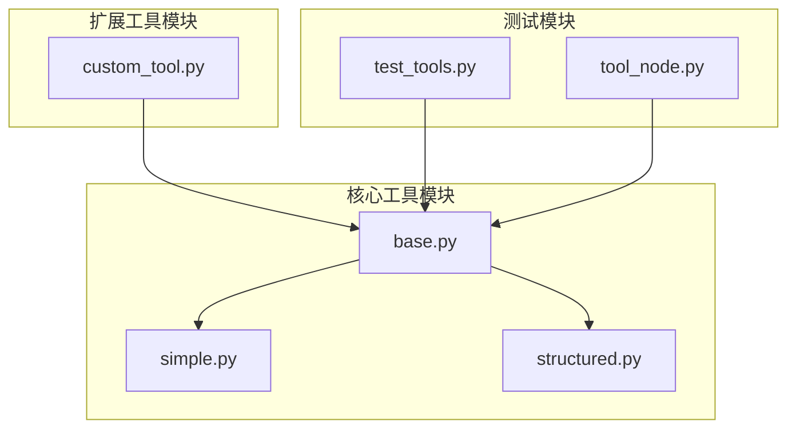
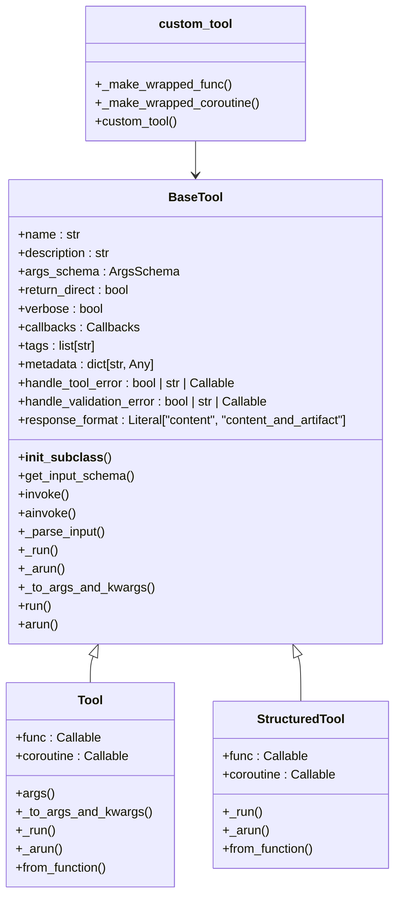
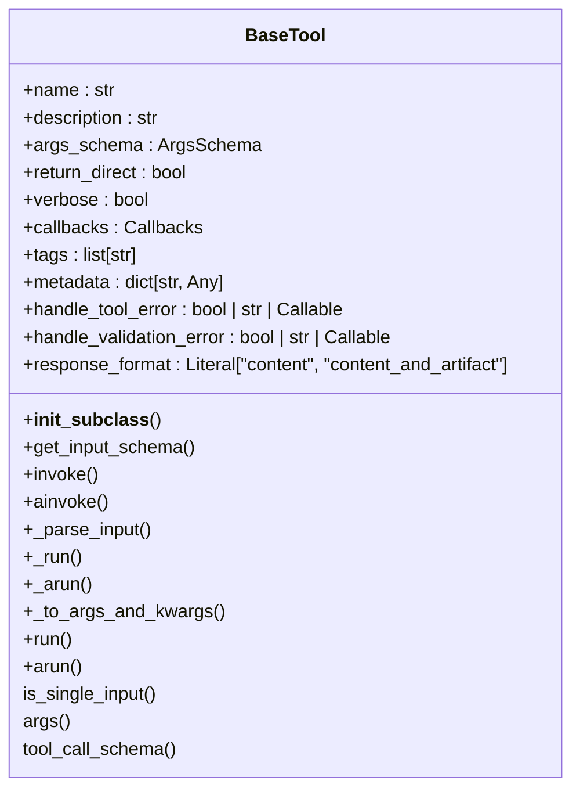
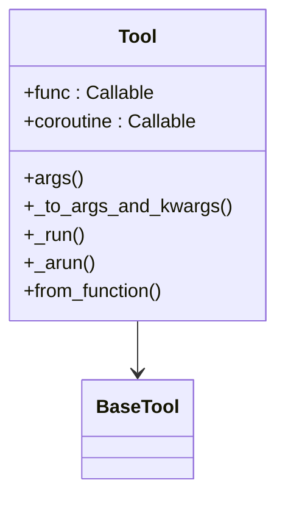
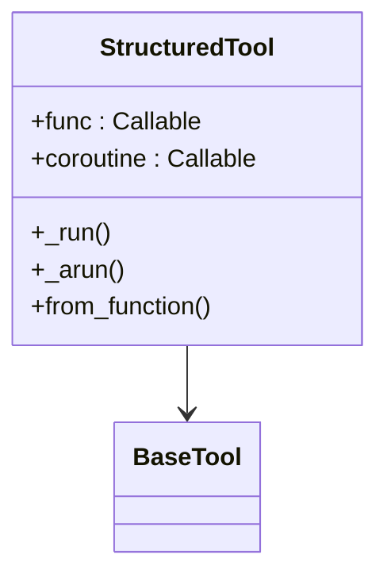
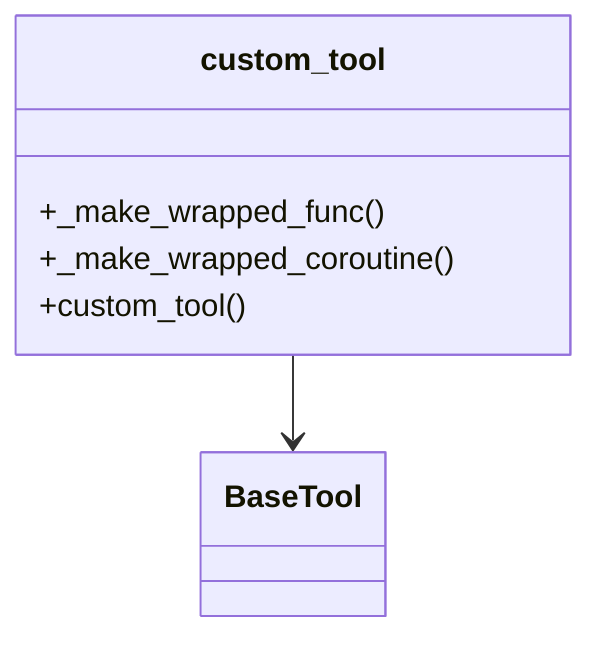
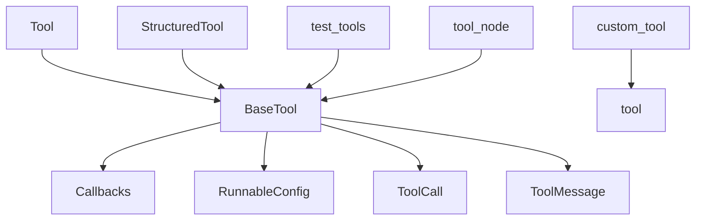

# 自定义工具开发

<cite>
**本文档中引用的文件**  
- [base.py](file://libs/core/langchain_core/tools/base.py)
- [simple.py](file://libs/core/langchain_core/tools/simple.py)
- [structured.py](file://libs/core/langchain_core/tools/structured.py)
- [custom_tool.py](file://libs/partners/openai/langchain_openai/tools/custom_tool.py)
- [test_tools.py](file://libs/core/tests/unit_tests/test_tools.py)
- [tool_node.py](file://libs/langchain_v1/langchain/tools/tool_node.py)
</cite>

## 目录
1. [简介](#简介)
2. [项目结构](#项目结构)
3. [核心组件](#核心组件)
4. [架构概述](#架构概述)
5. [详细组件分析](#详细组件分析)
6. [依赖分析](#依赖分析)
7. [性能考虑](#性能考虑)
8. [故障排除指南](#故障排除指南)
9. [结论](#结论)

## 简介
本文档提供关于如何在LangChain框架中开发自定义工具的详细指导。涵盖从简单函数封装到复杂类工具的完整开发流程，包括定义工具签名、处理输入输出类型、实现异步支持以及添加元数据。通过实际代码示例展示如何创建数学计算工具、API调用工具和数据处理工具，并包括测试自定义工具的最佳实践、调试技巧和集成到Agent工作流中的方法。同时强调安全性考虑，如输入验证、权限控制和错误边界处理。

## 项目结构
LangChain工具系统采用分层架构设计，主要包含核心工具基类、简单工具、结构化工具和自定义工具扩展。工具功能分布在多个模块中，核心功能位于`langchain_core`包中，而特定平台的扩展（如OpenAI）则位于`partners`目录下。

**图源**  
- [base.py](file://libs/core/langchain_core/tools/base.py)
- [simple.py](file://libs/core/langchain_core/tools/simple.py)
- [structured.py](file://libs/core/langchain_core/tools/structured.py)
- [custom_tool.py](file://libs/partners/openai/langchain_openai/tools/custom_tool.py)

**本节来源**  
- [base.py](file://libs/core/langchain_core/tools/base.py#L0-L799)
- [simple.py](file://libs/core/langchain_core/tools/simple.py#L0-L201)
- [structured.py](file://libs/core/langchain_core/tools/structured.py#L0-L248)

## 核心组件
LangChain工具系统的核心组件包括`BaseTool`基类、`Tool`简单工具类、`StructuredTool`结构化工具类和`custom_tool`装饰器。这些组件共同构成了工具开发的基础框架。

**本节来源**  
- [base.py](file://libs/core/langchain_core/tools/base.py#L0-L799)
- [simple.py](file://libs/core/langchain_core/tools/simple.py#L0-L201)
- [structured.py](file://libs/core/langchain_core/tools/structured.py#L0-L248)

## 架构概述
LangChain工具系统的架构基于面向对象设计模式，通过继承和组合实现功能扩展。系统采用分层设计，底层是`BaseTool`基类，提供基本的工具功能和接口定义；中层是`Tool`和`StructuredTool`类，实现具体的功能封装；上层是各种装饰器和扩展，提供特定平台的功能支持。

**图源**  
- [base.py](file://libs/core/langchain_core/tools/base.py#L0-L799)
- [simple.py](file://libs/core/langchain_core/tools/simple.py#L0-L201)
- [structured.py](file://libs/core/langchain_core/tools/structured.py#L0-L248)
- [custom_tool.py](file://libs/partners/openai/langchain_openai/tools/custom_tool.py#L0-L111)

## 详细组件分析

### 工具基类分析
`BaseTool`是所有LangChain工具的基类，定义了工具的基本接口和功能。它继承自`RunnableSerializable`，提供了序列化和运行能力。

**图源**  
- [base.py](file://libs/core/langchain_core/tools/base.py#L0-L799)

**本节来源**  
- [base.py](file://libs/core/langchain_core/tools/base.py#L0-L799)

### 简单工具分析
`Tool`类用于封装简单的函数或协程，适用于输入参数较少的场景。它通过`from_function`类方法提供便捷的工具创建方式。

**图源**  
- [simple.py](file://libs/core/langchain_core/tools/simple.py#L0-L201)

**本节来源**  
- [simple.py](file://libs/core/langchain_core/tools/simple.py#L0-L201)

### 结构化工具分析
`StructuredTool`类用于处理复杂的输入参数结构，支持Pydantic模型作为参数类型。它通过`from_function`类方法自动推断函数签名并创建相应的参数模式。

**图源**  
- [structured.py](file://libs/core/langchain_core/tools/structured.py#L0-L248)

**本节来源**  
- [structured.py](file://libs/core/langchain_core/tools/structured.py#L0-L248)

### 自定义工具分析
`custom_tool`装饰器用于创建OpenAI自定义工具，支持自由格式的字符串输入。它通过包装函数和协程，将输出转换为特定格式的字典列表。

**图源**  
- [custom_tool.py](file://libs/partners/openai/langchain_openai/tools/custom_tool.py#L0-L111)

**本节来源**  
- [custom_tool.py](file://libs/partners/openai/langchain_openai/tools/custom_tool.py#L0-L111)

## 依赖分析
LangChain工具系统依赖于多个核心模块，包括回调管理、运行时配置、消息处理和序列化功能。这些依赖关系确保了工具的可扩展性和灵活性。

**图源**  
- [base.py](file://libs/core/langchain_core/tools/base.py#L0-L799)
- [simple.py](file://libs/core/langchain_core/tools/simple.py#L0-L201)
- [structured.py](file://libs/core/langchain_core/tools/structured.py#L0-L248)
- [custom_tool.py](file://libs/partners/openai/langchain_openai/tools/custom_tool.py#L0-L111)

**本节来源**  
- [base.py](file://libs/core/langchain_core/tools/base.py#L0-L799)
- [simple.py](file://libs/core/langchain_core/tools/simple.py#L0-L201)
- [structured.py](file://libs/core/langchain_core/tools/structured.py#L0-L248)
- [custom_tool.py](file://libs/partners/openai/langchain_openai/tools/custom_tool.py#L0-L111)

## 性能考虑
在开发自定义工具时，需要考虑性能优化。异步支持是提高性能的关键，通过`_arun`方法实现非阻塞操作。此外，输入验证和错误处理也会影响性能，应尽量减少不必要的验证开销。

[无来源，因为本节提供一般性指导]

## 故障排除指南
工具开发中常见的问题包括输入验证错误、异步调用失败和回调管理问题。通过适当的错误处理和日志记录，可以快速定位和解决问题。

**本节来源**  
- [base.py](file://libs/core/langchain_core/tools/base.py#L998-L1048)
- [test_tools.py](file://libs/core/tests/unit_tests/test_tools.py#L880-L963)
- [tool_node.py](file://libs/langchain_v1/langchain/tools/tool_node.py#L459-L485)

## 结论
本文档详细介绍了LangChain自定义工具的开发流程，从基础概念到高级特性，涵盖了工具开发的各个方面。通过理解这些核心组件和设计模式，开发者可以创建高效、可靠和安全的自定义工具，满足各种应用场景的需求。

[无来源，因为本节总结无特定文件分析]