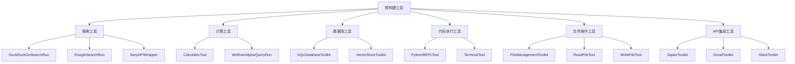
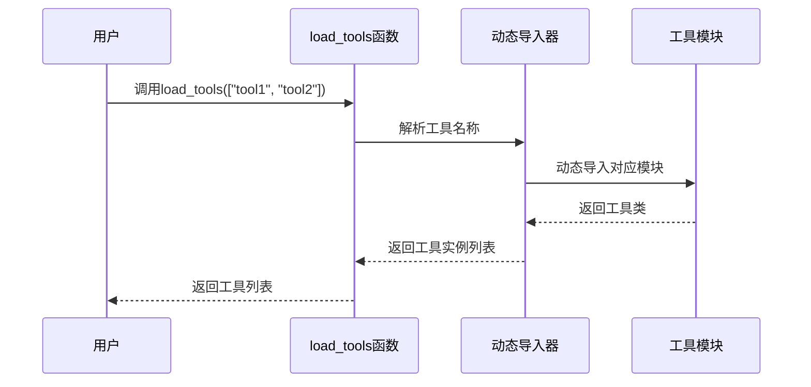
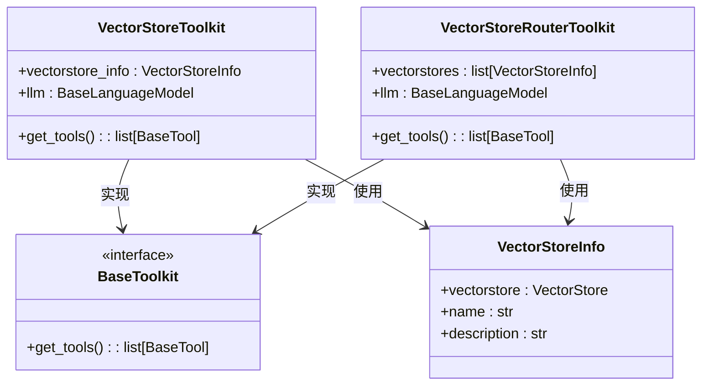
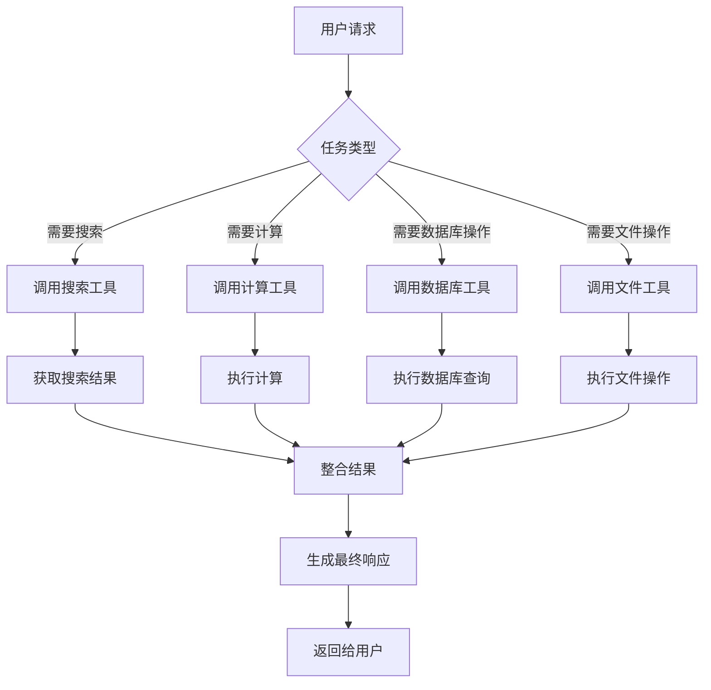

# 预构建工具

<cite>
**本文档中引用的文件**  
- [load_tools.py](file://libs/langchain/langchain_classic/agents/load_tools.py)
- [tools.py](file://libs/langchain/langchain_classic/agents/tools.py)
- [agent_toolkits/__init__.py](file://libs/langchain/langchain_classic/agents/agent_toolkits/__init__.py)
- [vectorstore/toolkit.py](file://libs/langchain/langchain_classic/agents/agent_toolkits/vectorstore/toolkit.py)
- [sql/toolkit.py](file://libs/langchain/langchain_classic/agents/agent_toolkits/sql/toolkit.py)
- [json/toolkit.py](file://libs/langchain/langchain_classic/agents/agent_toolkits/json/toolkit.py)
- [base.py](file://libs/core/langchain_core/tools/base.py)
- [simple.py](file://libs/core/langchain_core/tools/simple.py)
- [render.py](file://libs/core/langchain_core/tools/render.py)
</cite>

## 目录
1. [简介](#简介)
2. [预构建工具分类](#预构建工具分类)
3. [工具加载机制](#工具加载机制)
4. [核心工具功能详解](#核心工具功能详解)
5. [工具参数配置](#工具参数配置)
6. [多工具组合使用](#多工具组合使用)
7. [依赖关系与使用限制](#依赖关系与使用限制)
8. [结论](#结论)

## 简介
LangChain 提供了一套丰富的预构建工具集，旨在简化大型语言模型（LLM）与外部系统和数据源的集成。这些工具允许代理（Agent）执行各种任务，如搜索、计算、数据库查询和代码执行等。本文档系统性地介绍这些预构建工具的功能、使用方法、配置选项以及组合应用方式。

**Section sources**
- [agent_toolkits/__init__.py](file://libs/langchain/langchain_classic/agents/agent_toolkits/__init__.py#L1-L167)

## 预构建工具分类
LangChain 的预构建工具按功能可分为以下几类：

### 搜索工具
用于执行网络搜索，包括：
- **DuckDuckGoSearchRun**：通过 DuckDuckGo 搜索引擎获取信息
- **GoogleSearchRun**：通过 Google 搜索引擎获取信息
- **SerpAPIWrapper**：使用 SerpAPI 提供的 Google 搜索服务

### 计算工具
用于执行数学计算：
- **CalculatorTool**：执行基本数学运算
- **WolframAlphaQueryRun**：通过 Wolfram Alpha 执行复杂数学和科学计算

### 数据库工具
用于与数据库交互：
- **SQLDatabaseToolkit**：提供与 SQL 数据库交互的工具集
- **VectorStoreToolkit**：提供与向量数据库交互的工具集

### 代码执行工具
用于执行代码：
- **PythonREPLTool**：在 Python 环境中执行代码
- **TerminalTool**：在系统终端中执行命令

### 文件操作工具
用于文件系统操作：
- **FileManagementToolkit**：提供文件读写、创建、删除等操作
- **ReadFileTool**：读取文件内容
- **WriteFileTool**：写入文件内容

### API 集成工具
用于与各种第三方服务集成：
- **ZapierToolkit**：与 Zapier 集成，自动化工作流
- **GmailToolkit**：与 Gmail 集成，发送和读取邮件
- **SlackToolkit**：与 Slack 集成，发送消息



**Diagram sources**
- [agent_toolkits/__init__.py](file://libs/langchain/langchain_classic/agents/agent_toolkits/__init__.py#L1-L167)
- [sql/toolkit.py](file://libs/langchain/langchain_classic/agents/agent_toolkits/sql/toolkit.py#L1-L26)
- [vectorstore/toolkit.py](file://libs/langchain/langchain_classic/agents/agent_toolkits/vectorstore/toolkit.py#L1-L98)

**Section sources**
- [agent_toolkits/__init__.py](file://libs/langchain/langchain_classic/agents/agent_toolkits/__init__.py#L1-L167)

## 工具加载机制
LangChain 提供了 `load_tools` 函数来按名称加载预构建工具。该函数通过动态导入机制实现工具的按需加载。

```python
from langchain.agents import load_tools

# 加载多个工具
tools = load_tools(["serpapi", "llm-math"], llm=llm)
```

`load_tools` 函数的核心实现位于 `load_tools.py` 文件中，它使用了动态导入模式来加载指定的工具集。



**Diagram sources**
- [load_tools.py](file://libs/langchain/langchain_classic/agents/load_tools.py#L1-L14)

**Section sources**
- [load_tools.py](file://libs/langchain/langchain_classic/agents/load_tools.py#L1-L14)

## 核心工具功能详解

### VectorStoreToolkit
`VectorStoreToolkit` 提供了与向量数据库交互的工具，主要用于基于向量相似度的问答系统。

```python
from langchain.agents.agent_toolkits import VectorStoreToolkit
from langchain.vectorstores import Chroma

# 创建向量存储工具包
toolkit = VectorStoreToolkit(
    vectorstore_info=VectorStoreInfo(
        name="文档知识库",
        description="包含公司文档的向量数据库",
        vectorstore=vectorstore
    ),
    llm=llm
)
```

该工具包会生成两个主要工具：
- **VectorStoreQATool**：基于向量检索的问答工具
- **VectorStoreQAWithSourcesTool**：带来源引用的问答工具

### SQLDatabaseToolkit
`SQLDatabaseToolkit` 提供了与 SQL 数据库交互的工具，允许代理执行数据库查询。

```python
from langchain.agents.agent_toolkits import SQLDatabaseToolkit
from langchain.sql_database import SQLDatabase

# 创建数据库工具包
db = SQLDatabase.from_uri("sqlite:///database.db")
toolkit = SQLDatabaseToolkit(db=db, llm=llm)
```

### JsonToolkit
`JsonToolkit` 提供了处理 JSON 数据的工具，包括解析、查询和转换 JSON 数据。

```python
from langchain.agents.agent_toolkits import JsonToolkit

# 创建JSON工具包
toolkit = JsonToolkit()
```



**Diagram sources**
- [vectorstore/toolkit.py](file://libs/langchain/langchain_classic/agents/agent_toolkits/vectorstore/toolkit.py#L1-L98)
- [base.py](file://libs/core/langchain_core/tools/base.py#L1-L100)

**Section sources**
- [vectorstore/toolkit.py](file://libs/langchain/langchain_classic/agents/agent_toolkits/vectorstore/toolkit.py#L1-L98)
- [sql/toolkit.py](file://libs/langchain/langchain_classic/agents/agent_toolkits/sql/toolkit.py#L1-L26)
- [json/toolkit.py](file://libs/langchain/langchain_classic/agents/agent_toolkits/json/toolkit.py#L1-L24)

## 工具参数配置
预构建工具通常支持多种配置选项，以满足不同的使用需求。

### 基本配置
大多数工具都支持以下基本配置参数：
- **name**：工具的名称，用于在提示中识别
- **description**：工具的描述，用于指导代理何时使用该工具
- **return_direct**：是否直接返回工具结果，而不经过 LLM 处理

### 特定工具配置
不同类型的工具还支持特定的配置参数：

#### 搜索工具配置
```python
from langchain.utilities import SerpAPIWrapper

search = SerpAPIWrapper(
    serpapi_api_key="your-api-key",
    engine="google",
    num=10,
    timeout=10
)
```

#### 数据库工具配置
```python
from langchain.sql_database import SQLDatabase
from langchain.agents.agent_toolkits import SQLDatabaseToolkit

db = SQLDatabase.from_uri(
    "sqlite:///database.db",
    include_tables=["users", "orders"],
    sample_rows_in_table_info=3
)

toolkit = SQLDatabaseToolkit(
    db=db,
    llm=llm,
    use_query_checker=True
)
```

#### 向量存储工具配置
```python
from langchain.agents.agent_toolkits import VectorStoreToolkit
from langchain.vectorstores import Chroma

toolkit = VectorStoreToolkit(
    vectorstore_info=VectorStoreInfo(
        name="文档知识库",
        description="包含公司文档的向量数据库",
        vectorstore=vectorstore
    ),
    llm=llm,
    search_kwargs={"k": 5}
)
```

**Section sources**
- [vectorstore/toolkit.py](file://libs/langchain/langchain_classic/agents/agent_toolkits/vectorstore/toolkit.py#L1-L98)
- [sql/toolkit.py](file://libs/langchain/langchain_classic/agents/agent_toolkits/sql/toolkit.py#L1-L26)

## 多工具组合使用
LangChain 支持将多个预构建工具组合使用，以处理复杂的任务。

### 组合搜索与计算工具
```python
from langchain.agents import load_tools, initialize_agent
from langchain.llms import OpenAI

# 加载搜索和计算工具
tools = load_tools(
    ["serpapi", "llm-math"],
    llm=llm
)

# 初始化代理
agent = initialize_agent(
    tools,
    llm,
    agent="zero-shot-react-description",
    verbose=True
)

# 执行复杂查询
result = agent.run("2023年特斯拉的股价最高是多少美元？这个价格相当于多少欧元？")
```

### 组合数据库与文件工具
```python
from langchain.agents.agent_toolkits import SQLDatabaseToolkit, FileManagementToolkit
from langchain.sql_database import SQLDatabase

# 创建数据库工具包
db_toolkit = SQLDatabaseToolkit(db=db, llm=llm)

# 创建文件管理工具包
file_toolkit = FileManagementToolkit()

# 组合所有工具
all_tools = db_toolkit.get_tools() + file_toolkit.get_tools()

# 初始化代理
agent = initialize_agent(
    all_tools,
    llm,
    agent="conversational-react-description",
    verbose=True
)

# 执行跨系统任务
result = agent.run("从数据库中查询上季度销售数据，并将结果保存到sales_report.csv文件中")
```



**Diagram sources**
- [load_tools.py](file://libs/langchain/langchain_classic/agents/load_tools.py#L1-L14)
- [vectorstore/toolkit.py](file://libs/langchain/langchain_classic/agents/agent_toolkits/vectorstore/toolkit.py#L1-L98)

**Section sources**
- [load_tools.py](file://libs/langchain/langchain_classic/agents/load_tools.py#L1-L14)
- [vectorstore/toolkit.py](file://libs/langchain/langchain_classic/agents/agent_toolkits/vectorstore/toolkit.py#L1-L98)

## 依赖关系与使用限制

### 依赖关系
不同的预构建工具依赖于不同的外部库和API：

| 工具类型 | 主要依赖 | 安装命令 |
|---------|--------|--------|
| 搜索工具 | serpapi | pip install google-search-results |
| 数据库工具 | sqlalchemy | pip install sqlalchemy |
| 向量存储工具 | langchain-community | pip install langchain-community |
| API集成工具 | 各服务SDK | 根据具体服务安装 |

### 使用限制
#### 搜索工具限制
- **DuckDuckGoSearchRun**：可能受到速率限制，不适合高频调用
- **GoogleSearchRun**：需要有效的 Google API 密钥
- **SerpAPIWrapper**：商业服务，有调用次数限制

#### 计算工具限制
- **CalculatorTool**：仅支持基本数学运算
- **WolframAlphaQueryRun**：需要 Wolfram Alpha API 密钥，有调用限制

#### 数据库工具限制
- **SQLDatabaseToolkit**：需要适当的数据库连接权限
- **VectorStoreToolkit**：需要安装 langchain-community 包

#### 安全限制
- **PythonREPLTool**：执行任意代码存在安全风险，应在受控环境中使用
- **TerminalTool**：执行系统命令存在安全风险，应限制权限

### 性能考虑
- **网络延迟**：搜索和API工具受网络延迟影响
- **计算开销**：复杂计算和向量搜索可能消耗较多资源
- **缓存策略**：建议对频繁查询的结果进行缓存

**Section sources**
- [agent_toolkits/__init__.py](file://libs/langchain/langchain_classic/agents/agent_toolkits/__init__.py#L1-L167)
- [vectorstore/toolkit.py](file://libs/langchain/langchain_classic/agents/agent_toolkits/vectorstore/toolkit.py#L1-L98)

## 结论
LangChain 的预构建工具集为开发智能代理提供了强大的基础。通过合理选择和配置这些工具，可以构建出能够与外部世界交互的复杂应用。关键要点包括：

1. **工具分类清晰**：搜索、计算、数据库、代码执行等工具覆盖了常见需求
2. **加载机制灵活**：`load_tools` 函数支持按需加载，减少资源消耗
3. **配置选项丰富**：每个工具都提供了多种配置参数，满足不同场景需求
4. **组合能力强大**：多个工具可以协同工作，处理复杂任务
5. **依赖管理明确**：不同工具的依赖关系清晰，便于环境配置

在实际应用中，应根据具体需求选择合适的工具组合，并注意安全性和性能方面的限制。