# 执行流程与状态管理

<cite>
**本文档中引用的文件**
- [agent.py](file://libs/langchain/langchain_classic/agents/agent.py)
- [agent_iterator.py](file://libs/langchain/langchain_classic/agents/agent_iterator.py)
- [agents.py](file://libs/core/langchain_core/agents.py)
- [test_agent_iterator.py](file://libs/langchain/tests/unit_tests/agents/test_agent_iterator.py)
- [test_agent.py](file://libs/langchain/tests/unit_tests/agents/test_agent.py)
</cite>

## 目录
1. [简介](#简介)
2. [核心架构概览](#核心架构概览)
3. [Agent执行器详解](#agent执行器详解)
4. [迭代执行循环](#迭代执行循环)
5. [状态管理系统](#状态管理系统)
6. [工具调用与观察处理](#工具调用与观察处理)
7. [错误处理与超时机制](#错误处理与超时机制)
8. [回调系统与监控](#回调系统与监控)
9. [性能优化策略](#性能优化策略)
10. [自定义执行逻辑](#自定义执行逻辑)
11. [故障排除指南](#故障排除指南)
12. [总结](#总结)

## 简介

LangChain Agent执行流程是一个高度协调的迭代系统，它通过LLM推理、工具调用、观察收集和状态管理的循环来完成复杂的任务。本文档深入探讨了Agent的执行机制，包括其内部状态管理、错误恢复、性能优化以及可扩展性设计。

## 核心架构概览

LangChain Agent系统采用分层架构设计，主要包含以下核心组件：

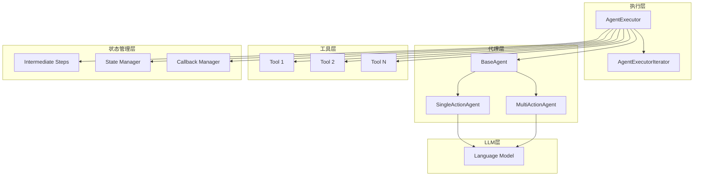
```mermaid
graph TB
subgraph "执行层"
AE[AgentExecutor]
AEI[AgentExecutorIterator]
end
subgraph "代理层"
BA[BaseAgent]
SA[SingleActionAgent]
MA[MultiActionAgent]
end
subgraph "工具层"
T1[Tool 1]
T2[Tool 2]
TN[Tool N]
end
subgraph "LLM层"
LLM[Language Model]
end
subgraph "状态管理层"
IS[Intermediate Steps]
SM[State Manager]
CB[Callback Manager]
end
AE --> AEI
AE --> BA
BA --> SA
BA --> MA
SA --> LLM
MA --> LLM
AE --> T1
AE --> T2
AE --> TN
AE --> IS
AE --> SM
AE --> CB
```

**图表来源**
- [agent.py](file://libs/langchain/langchain_classic/agents/agent.py#L1020-L1806)
- [agent_iterator.py](file://libs/langchain/langchain_classic/agents/agent_iterator.py#L39-L431)

**章节来源**
- [agent.py](file://libs/langchain/langchain_classic/agents/agent.py#L1-L100)
- [agents.py](file://libs/core/langchain_core/agents.py#L1-L50)

## Agent执行器详解

### AgentExecutor核心功能

AgentExecutor是整个执行流程的核心协调器，负责管理Agent与工具之间的交互，控制执行循环，并维护中间状态。

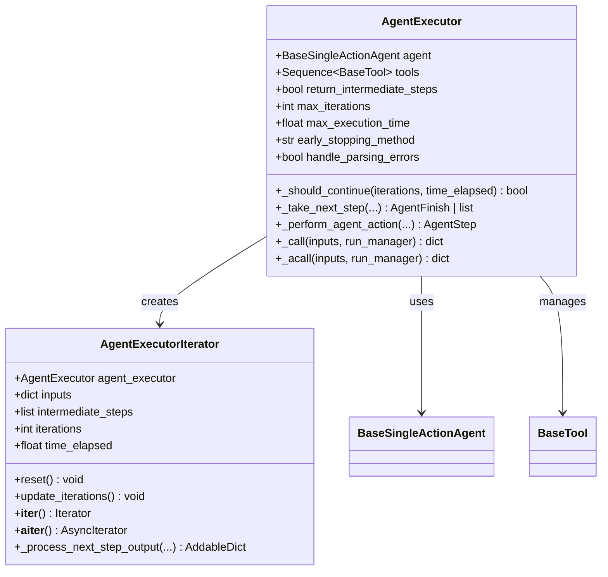
```mermaid
classDiagram
class AgentExecutor {
+BaseSingleActionAgent agent
+Sequence~BaseTool~ tools
+bool return_intermediate_steps
+int max_iterations
+float max_execution_time
+str early_stopping_method
+bool handle_parsing_errors
+_should_continue(iterations, time_elapsed) bool
+_take_next_step(...) AgentFinish | list
+_perform_agent_action(...) AgentStep
+_call(inputs, run_manager) dict
+_acall(inputs, run_manager) dict
}
class AgentExecutorIterator {
+AgentExecutor agent_executor
+dict inputs
+list intermediate_steps
+int iterations
+float time_elapsed
+reset() void
+update_iterations() void
+__iter__() Iterator
+__aiter__() AsyncIterator
+_process_next_step_output(...) AddableDict
}
AgentExecutor --> AgentExecutorIterator : creates
AgentExecutor --> BaseSingleActionAgent : uses
AgentExecutor --> BaseTool : manages
```

**图表来源**
- [agent.py](file://libs/langchain/langchain_classic/agents/agent.py#L1020-L1200)
- [agent_iterator.py](file://libs/langchain/langchain_classic/agents/agent_iterator.py#L39-L150)

### 配置参数详解

AgentExecutor提供了丰富的配置选项来控制执行行为：

| 参数 | 类型 | 默认值 | 描述 |
|------|------|--------|------|
| `max_iterations` | int \| None | 15 | 最大执行轮次，None表示无限制 |
| `max_execution_time` | float \| None | None | 最大执行时间（秒），None表示无限制 |
| `early_stopping_method` | str | "force" | 早期停止方法：'force'或'generate' |
| `return_intermediate_steps` | bool | False | 是否返回中间步骤 |
| `handle_parsing_errors` | bool \| str \| Callable | False | 输出解析错误处理方式 |

**章节来源**
- [agent.py](file://libs/langchain/langchain_classic/agents/agent.py#L1020-L1100)

## 迭代执行循环

### 执行循环流程

Agent的执行循环遵循经典的"思考-行动-观察"模式，每个循环包含以下步骤：

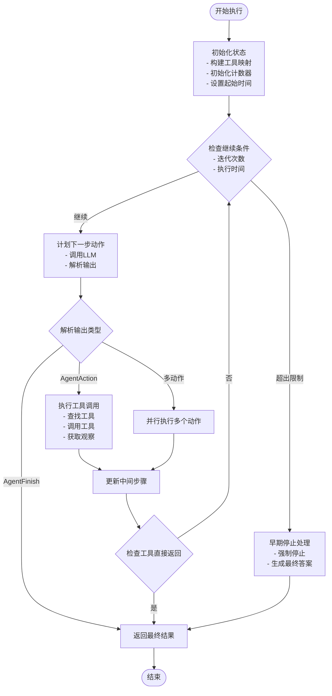
```mermaid
flowchart TD
Start([开始执行]) --> InitState["初始化状态<br/>- 构建工具映射<br/>- 初始化计数器<br/>- 设置起始时间"]
InitState --> CheckLimit{"检查继续条件<br/>- 迭代次数<br/>- 执行时间"}
CheckLimit --> |超出限制| EarlyStop["早期停止处理<br/>- 强制停止<br/>- 生成最终答案"]
CheckLimit --> |继续| PlanAction["计划下一步动作<br/>- 调用LLM<br/>- 解析输出"]
PlanAction --> ParseOutput{"解析输出类型"}
ParseOutput --> |AgentFinish| FinalReturn["返回最终结果"]
ParseOutput --> |AgentAction| ExecuteTool["执行工具调用<br/>- 查找工具<br/>- 调用工具<br/>- 获取观察"]
ParseOutput --> |多动作| ParallelExec["并行执行多个动作"]
ExecuteTool --> UpdateSteps["更新中间步骤"]
ParallelExec --> UpdateSteps
UpdateSteps --> CheckToolReturn{"检查工具直接返回"}
CheckToolReturn --> |是| FinalReturn
CheckToolReturn --> |否| CheckLimit
EarlyStop --> FinalReturn
FinalReturn --> End([结束])
```

**图表来源**
- [agent.py](file://libs/langchain/langchain_classic/agents/agent.py#L1584-L1672)
- [agent.py](file://libs/langchain/langchain_classic/agents/agent.py#L1674-L1710)

### 同步执行流程

同步执行使用传统的`while`循环来控制执行过程：

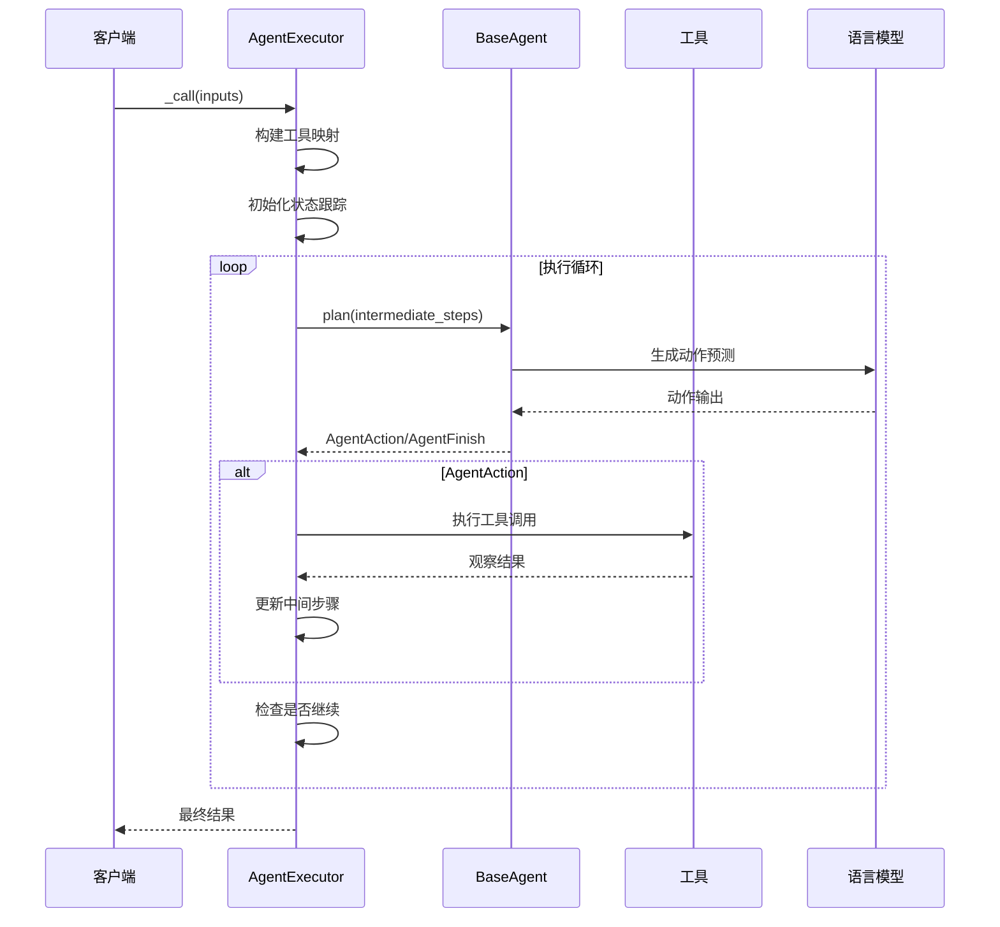
```mermaid
sequenceDiagram
participant Client as 客户端
participant AE as AgentExecutor
participant Agent as BaseAgent
participant Tool as 工具
participant LLM as 语言模型
Client->>AE : _call(inputs)
AE->>AE : 构建工具映射
AE->>AE : 初始化状态跟踪
loop 执行循环
AE->>Agent : plan(intermediate_steps)
Agent->>LLM : 生成动作预测
LLM-->>Agent : 动作输出
Agent-->>AE : AgentAction/AgentFinish
alt AgentAction
AE->>Tool : 执行工具调用
Tool-->>AE : 观察结果
AE->>AE : 更新中间步骤
end
AE->>AE : 检查是否继续
end
AE-->>Client : 最终结果
```

**图表来源**
- [agent.py](file://libs/langchain/langchain_classic/agents/agent.py#L1584-L1616)

### 异步执行流程

异步执行提供了并发能力，可以同时执行多个工具调用：

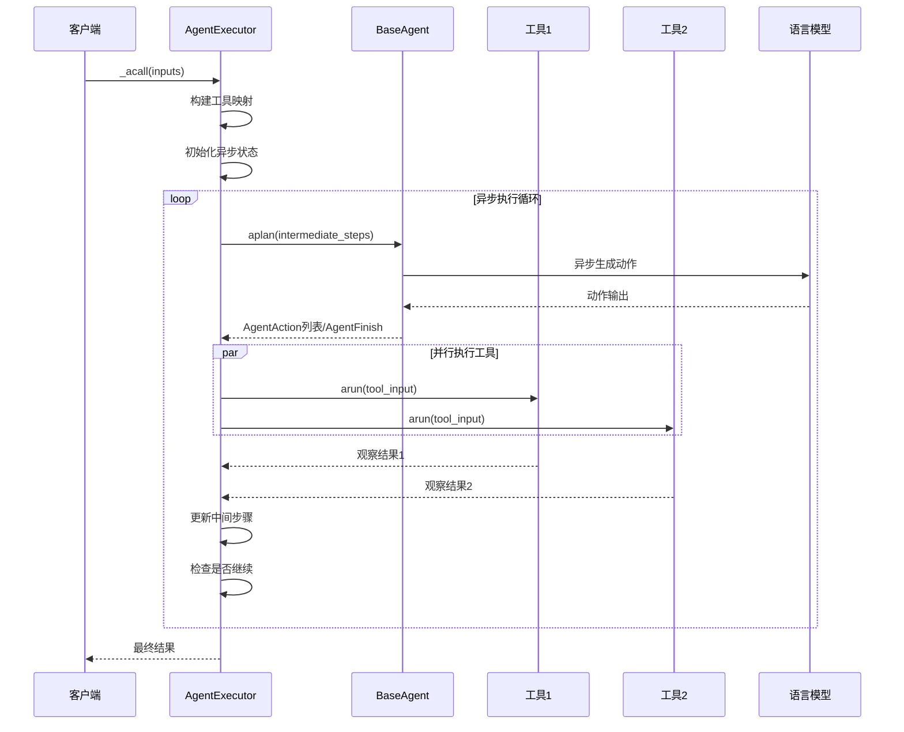
```mermaid
sequenceDiagram
participant Client as 客户端
participant AE as AgentExecutor
participant Agent as BaseAgent
participant Tool1 as 工具1
participant Tool2 as 工具2
participant LLM as 语言模型
Client->>AE : _acall(inputs)
AE->>AE : 构建工具映射
AE->>AE : 初始化异步状态
loop 异步执行循环
AE->>Agent : aplan(intermediate_steps)
Agent->>LLM : 异步生成动作
LLM-->>Agent : 动作输出
Agent-->>AE : AgentAction列表/AgentFinish
par 并行执行工具
AE->>Tool1 : arun(tool_input)
AE->>Tool2 : arun(tool_input)
end
Tool1-->>AE : 观察结果1
Tool2-->>AE : 观察结果2
AE->>AE : 更新中间步骤
AE->>AE : 检查是否继续
end
AE-->>Client : 最终结果
```

**图表来源**
- [agent.py](file://libs/langchain/langchain_classic/agents/agent.py#L1638-L1672)

**章节来源**
- [agent.py](file://libs/langchain/langchain_classic/agents/agent.py#L1433-L1539)
- [agent.py](file://libs/langchain/langchain_classic/agents/agent.py#L1541-L1672)

## 状态管理系统

### 中间步骤存储

中间步骤是Agent执行历史的核心，包含了所有动作和对应的观察结果：

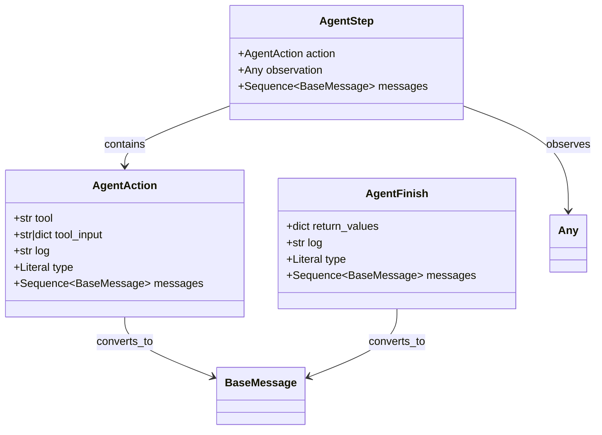
```mermaid
classDiagram
class AgentStep {
+AgentAction action
+Any observation
+Sequence~BaseMessage~ messages
}
class AgentAction {
+str tool
+str|dict tool_input
+str log
+Literal type
+Sequence~BaseMessage~ messages
}
class AgentFinish {
+dict return_values
+str log
+Literal type
+Sequence~BaseMessage~ messages
}
AgentStep --> AgentAction : contains
AgentStep --> Any : observes
AgentAction --> BaseMessage : converts_to
AgentFinish --> BaseMessage : converts_to
```

**图表来源**
- [agents.py](file://libs/core/langchain_core/agents.py#L40-L139)

### 状态跟踪机制

AgentExecutor维护以下状态信息：

| 状态项 | 类型 | 描述 |
|--------|------|------|
| `intermediate_steps` | list[tuple[AgentAction, str]] | 存储所有动作-观察对 |
| `iterations` | int | 当前执行轮次计数 |
| `time_elapsed` | float | 已消耗的总时间（秒） |
| `start_time` | float | 执行开始时间戳 |
| `name_to_tool_map` | dict[str, BaseTool] | 工具名称到工具对象的映射 |
| `color_mapping` | dict[str, str] | 工具名称到颜色的映射（用于日志） |

### 状态修剪策略

为了控制内存使用，Agent提供了多种状态修剪策略：

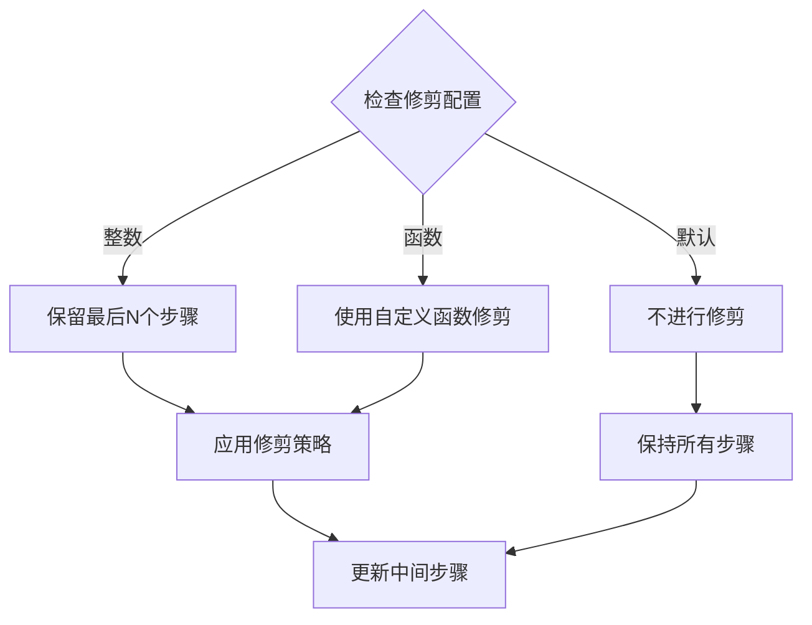
```mermaid
flowchart TD
CheckTrim{"检查修剪配置"}
CheckTrim --> |整数| TrimByCount["保留最后N个步骤"]
CheckTrim --> |函数| TrimByFunc["使用自定义函数修剪"]
CheckTrim --> |默认| NoTrim["不进行修剪"]
TrimByCount --> ApplyTrim["应用修剪策略"]
TrimByFunc --> ApplyTrim
NoTrim --> KeepAll["保持所有步骤"]
ApplyTrim --> UpdateSteps["更新中间步骤"]
KeepAll --> UpdateSteps
```

**图表来源**
- [agent.py](file://libs/langchain/langchain_classic/agents/agent.py#L1711-L1725)

**章节来源**
- [agents.py](file://libs/core/langchain_core/agents.py#L107-L139)
- [agent.py](file://libs/langchain/langchain_classic/agents/agent.py#L1711-L1725)

## 工具调用与观察处理

### 工具查找与验证

Agent在执行工具调用前会进行严格的工具验证：

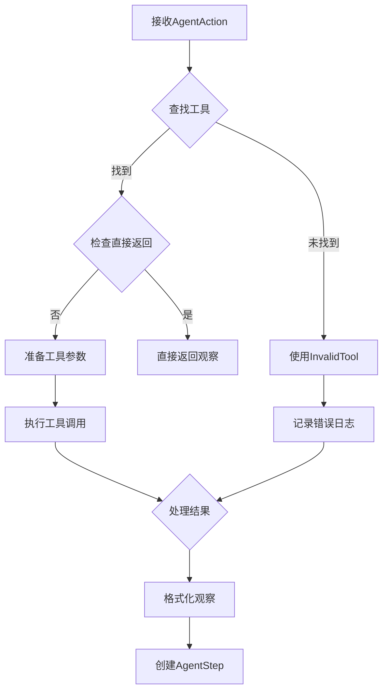
```mermaid
flowchart TD
ReceiveAction["接收AgentAction"] --> LookupTool{"查找工具"}
LookupTool --> |找到| CheckDirect{"检查直接返回"}
LookupTool --> |未找到| InvalidTool["使用InvalidTool"]
CheckDirect --> |是| DirectReturn["直接返回观察"]
CheckDirect --> |否| PrepareArgs["准备工具参数"]
PrepareArgs --> ExecuteTool["执行工具调用"]
InvalidTool --> LogError["记录错误日志"]
ExecuteTool --> HandleResult{"处理结果"}
LogError --> HandleResult
HandleResult --> FormatObservation["格式化观察"]
FormatObservation --> CreateStep["创建AgentStep"]
```

**图表来源**
- [agent.py](file://libs/langchain/langchain_classic/agents/agent.py#L1394-L1431)
- [agent.py](file://libs/langchain/langchain_classic/agents/agent.py#L1497-L1539)

### 并行工具执行

对于多动作场景，Agent支持并行执行多个工具调用以提高效率：

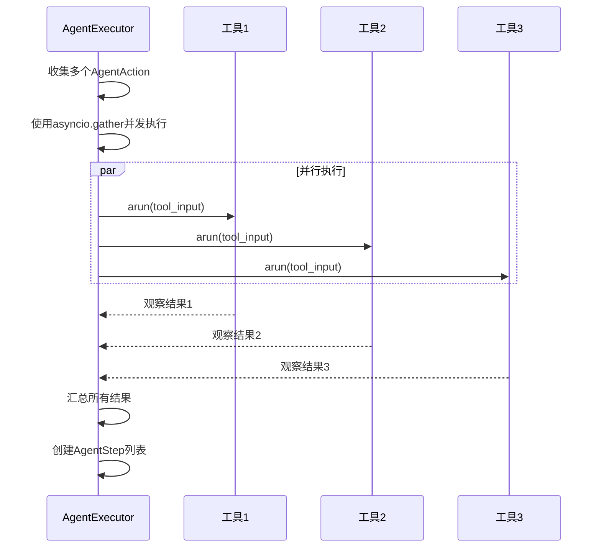
```mermaid
sequenceDiagram
participant AE as AgentExecutor
participant Tool1 as 工具1
participant Tool2 as 工具2
participant Tool3 as 工具3
AE->>AE : 收集多个AgentAction
AE->>AE : 使用asyncio.gather并发执行
par 并行执行
AE->>Tool1 : arun(tool_input)
AE->>Tool2 : arun(tool_input)
AE->>Tool3 : arun(tool_input)
end
Tool1-->>AE : 观察结果1
Tool2-->>AE : 观察结果2
Tool3-->>AE : 观察结果3
AE->>AE : 汇总所有结果
AE->>AE : 创建AgentStep列表
```

**图表来源**
- [agent.py](file://libs/langchain/langchain_classic/agents/agent.py#L1520-L1539)

### 观察结果处理

Agent将工具调用的结果转换为标准化的观察格式：

| 输入类型 | 处理方式 | 输出消息类型 |
|----------|----------|--------------|
| 字符串 | 直接使用 | HumanMessage |
| JSON可序列化对象 | JSON序列化 | HumanMessage(content=json.dumps) |
| 其他类型 | 转换为字符串 | HumanMessage(content=str) |
| 函数调用消息 | 创建FunctionMessage | FunctionMessage |

**章节来源**
- [agent.py](file://libs/langchain/langchain_classic/agents/agent.py#L1394-L1431)
- [agent.py](file://libs/langchain/langchain_classic/agents/agent.py#L1541-L1616)

## 错误处理与超时机制

### 输出解析错误处理

Agent提供了灵活的输出解析错误处理机制：

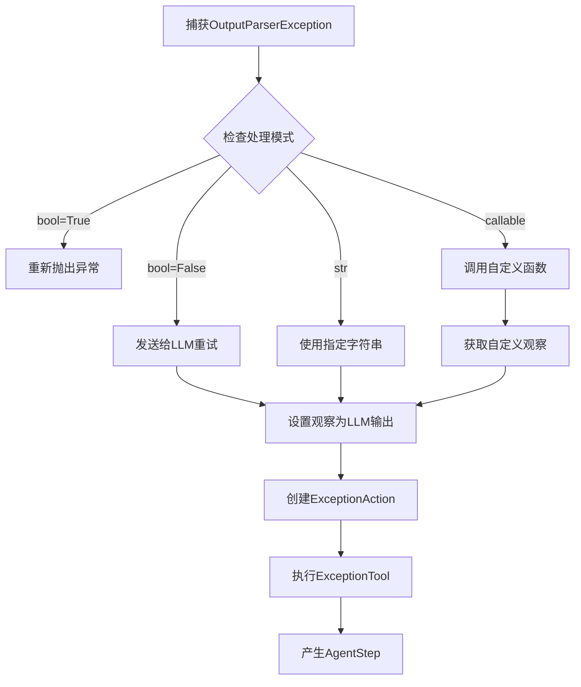
```mermaid
flowchart TD
ParseError["捕获OutputParserException"] --> CheckMode{"检查处理模式"}
CheckMode --> |bool=True| RaiseError["重新抛出异常"]
CheckMode --> |bool=False| SendToLLM["发送给LLM重试"]
CheckMode --> |str| UseString["使用指定字符串"]
CheckMode --> |callable| CallFunction["调用自定义函数"]
SendToLLM --> SetObservation["设置观察为LLM输出"]
UseString --> SetObservation
CallFunction --> GetCustomObs["获取自定义观察"]
GetCustomObs --> SetObservation
SetObservation --> CreateExceptionAction["创建ExceptionAction"]
CreateExceptionAction --> ExecuteExceptionTool["执行ExceptionTool"]
ExecuteExceptionTool --> YieldStep["产生AgentStep"]
```

**图表来源**
- [agent.py](file://libs/langchain/langchain_classic/agents/agent.py#L1330-L1360)

### 超时控制机制

Agent支持两种类型的超时控制：

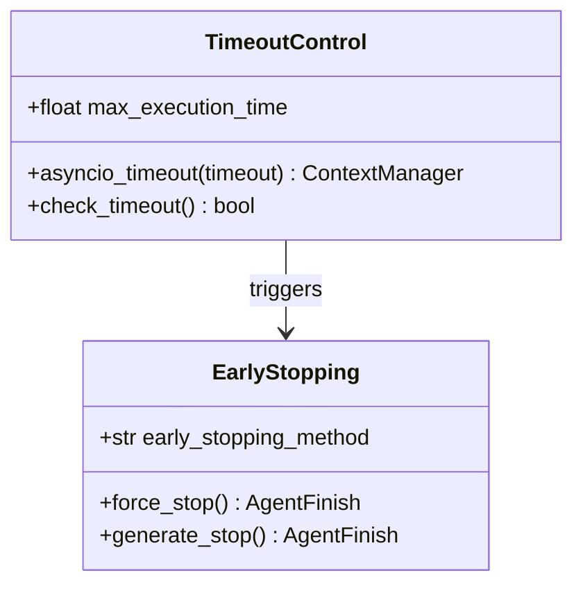
```mermaid
classDiagram
class TimeoutControl {
+float max_execution_time
+asyncio_timeout(timeout) ContextManager
+check_timeout() bool
}
class EarlyStopping {
+str early_stopping_method
+force_stop() AgentFinish
+generate_stop() AgentFinish
}
TimeoutControl --> EarlyStopping : triggers
```

**图表来源**
- [agent.py](file://libs/langchain/langchain_classic/agents/agent.py#L1638-L1672)

### 早期停止策略

Agent提供了两种早期停止策略：

| 策略 | 行为 | 适用场景 |
|------|------|----------|
| `force` | 返回固定停止消息 | 快速失败场景 |
| `generate` | 调用LLM生成最终答案 | 需要完整上下文的场景 |

**章节来源**
- [agent.py](file://libs/langchain/langchain_classic/agents/agent.py#L1330-L1360)
- [agent.py](file://libs/langchain/langchain_classic/agents/agent.py#L1638-L1672)

## 回调系统与监控

### 回调管理器架构

Agent使用分层回调系统来跟踪执行过程：

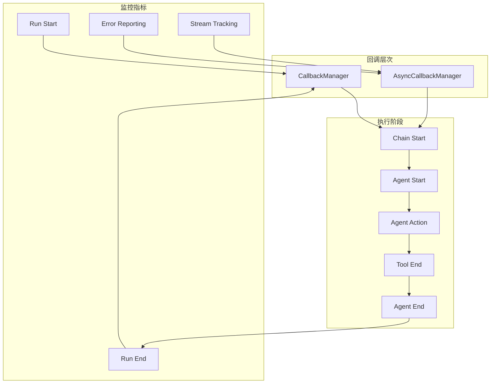
```mermaid
graph TB
subgraph "回调层次"
CM[CallbackManager]
AC[AsyncCallbackManager]
end
subgraph "执行阶段"
CS[Chain Start]
AS[Agent Start]
AR[Agent Action]
AE[Agent End]
TE[Tool End]
end
subgraph "监控指标"
RS[Run Start]
RE[Run End]
ER[Error Reporting]
ST[Stream Tracking]
end
CM --> CS
AC --> CS
CS --> AS
AS --> AR
AR --> TE
TE --> AE
AE --> RE
RS --> CM
RE --> CM
ER --> AC
ST --> AC
```

**图表来源**
- [agent_iterator.py](file://libs/langchain/langchain_classic/agents/agent_iterator.py#L172-L205)

### 监控指标收集

Agent执行过程中的关键监控指标：

| 指标类别 | 具体指标 | 描述 |
|----------|----------|------|
| 执行统计 | 迭代次数、执行时间 | 性能监控 |
| 工具使用 | 工具调用次数、成功率 | 工具有效性 |
| 错误统计 | 解析错误、超时次数 | 系统稳定性 |
| 流量监控 | 消息数量、流式传输 | 实时性能 |

**章节来源**
- [agent_iterator.py](file://libs/langchain/langchain_classic/agents/agent_iterator.py#L172-L205)
- [agent_iterator.py](file://libs/langchain/langchain_classic/agents/agent_iterator.py#L239-L270)

## 性能优化策略

### 并发执行优化

Agent支持多种并发优化策略：

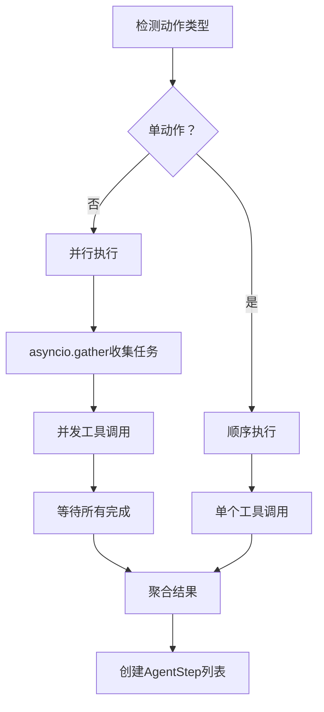
```mermaid
flowchart TD
DetectActions["检测动作类型"] --> SingleAction{"单动作？"}
SingleAction --> |是| SequentialExec["顺序执行"]
SingleAction --> |否| ParallelExec["并行执行"]
ParallelExec --> GatherTasks["asyncio.gather收集任务"]
GatherTasks --> ConcurrentTool["并发工具调用"]
ConcurrentTool --> WaitCompletion["等待所有完成"]
SequentialExec --> SingleTool["单个工具调用"]
WaitCompletion --> AggregateResults["聚合结果"]
SingleTool --> AggregateResults
AggregateResults --> CreateSteps["创建AgentStep列表"]
```

**图表来源**
- [agent.py](file://libs/langchain/langchain_classic/agents/agent.py#L1520-L1539)

### 内存优化策略

| 优化技术 | 实现方式 | 效果 |
|----------|----------|------|
| 状态修剪 | 配置trim_intermediate_steps | 控制内存使用 |
| 流式处理 | 使用yield机制 | 减少内存峰值 |
| 工具缓存 | name_to_tool_map | 提高查找效率 |
| 日志控制 | 可配置verbose级别 | 减少IO开销 |

### 执行时间优化

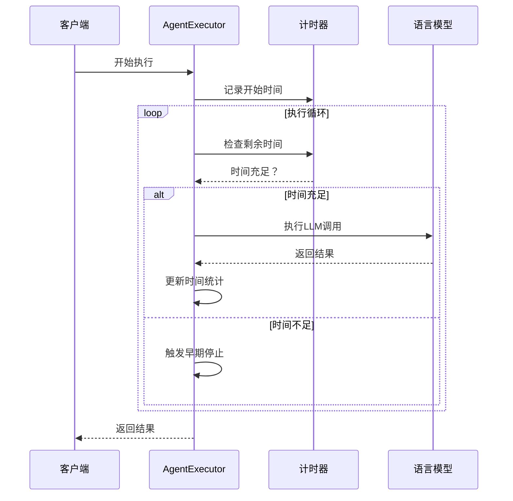
```mermaid
sequenceDiagram
participant Client as 客户端
participant AE as AgentExecutor
participant Timer as 计时器
participant LLM as 语言模型
Client->>AE : 开始执行
AE->>Timer : 记录开始时间
loop 执行循环
AE->>Timer : 检查剩余时间
Timer-->>AE : 时间充足？
alt 时间充足
AE->>LLM : 执行LLM调用
LLM-->>AE : 返回结果
AE->>AE : 更新时间统计
else 时间不足
AE->>AE : 触发早期停止
end
end
AE-->>Client : 返回结果
```

**图表来源**
- [agent.py](file://libs/langchain/langchain_classic/agents/agent.py#L1638-L1672)

**章节来源**
- [agent.py](file://libs/langchain/langchain_classic/agents/agent.py#L1520-L1539)
- [agent.py](file://libs/langchain/langchain_classic/agents/agent.py#L1638-L1672)

## 自定义执行逻辑

### AgentExecutor自定义

开发者可以通过继承和重写关键方法来自定义执行逻辑：

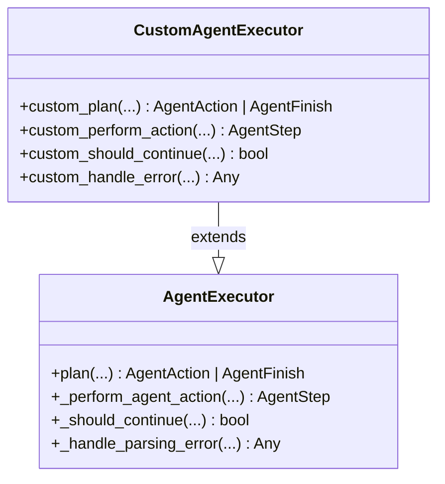
```mermaid
classDiagram
class CustomAgentExecutor {
+custom_plan(...) AgentAction | AgentFinish
+custom_perform_action(...) AgentStep
+custom_should_continue(...) bool
+custom_handle_error(...) Any
}
class AgentExecutor {
+plan(...) AgentAction | AgentFinish
+_perform_agent_action(...) AgentStep
+_should_continue(...) bool
+_handle_parsing_error(...) Any
}
CustomAgentExecutor --|> AgentExecutor : extends
```

### 执行器迭代器定制

AgentExecutorIterator提供了灵活的迭代控制：

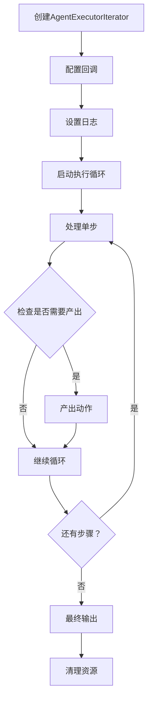
```mermaid
flowchart TD
CreateIterator["创建AgentExecutorIterator"] --> ConfigureCallbacks["配置回调"]
ConfigureCallbacks --> SetupLogging["设置日志"]
SetupLogging --> StartLoop["启动执行循环"]
StartLoop --> ProcessStep["处理单步"]
ProcessStep --> CheckYield{"检查是否需要产出"}
CheckYield --> |是| YieldAction["产出动作"]
CheckYield --> |否| ContinueLoop["继续循环"]
YieldAction --> ContinueLoop
ContinueLoop --> MoreSteps{"还有步骤？"}
MoreSteps --> |是| ProcessStep
MoreSteps --> |否| FinalOutput["最终输出"]
FinalOutput --> Cleanup["清理资源"]
```

**图表来源**
- [agent_iterator.py](file://libs/langchain/langchain_classic/agents/agent_iterator.py#L172-L205)

### 流式执行支持

Agent支持流式执行，允许实时获取中间结果：

| 执行模式 | 输出时机 | 适用场景 |
|----------|----------|----------|
| 同步流式 | 每个步骤完成后立即返回 | 实时反馈 |
| 异步流式 | 并行步骤完成后返回 | 高并发场景 |
| 批量执行 | 完成后一次性返回 | 简单场景 |

**章节来源**
- [agent_iterator.py](file://libs/langchain/langchain_classic/agents/agent_iterator.py#L39-L150)
- [agent.py](file://libs/langchain/langchain_classic/agents/agent.py#L1785-L1806)

## 故障排除指南

### 常见问题诊断

| 问题类型 | 症状 | 排查方法 | 解决方案 |
|----------|------|----------|----------|
| 执行超时 | 任务长时间无响应 | 检查max_execution_time设置 | 增加超时时间或优化逻辑 |
| 工具调用失败 | InvalidTool错误 | 验证工具注册 | 正确注册所需工具 |
| 输出解析错误 | OutputParserException | 检查提示模板 | 修正输出格式要求 |
| 内存泄漏 | 内存持续增长 | 监控intermediate_steps | 启用状态修剪 |

### 调试技巧

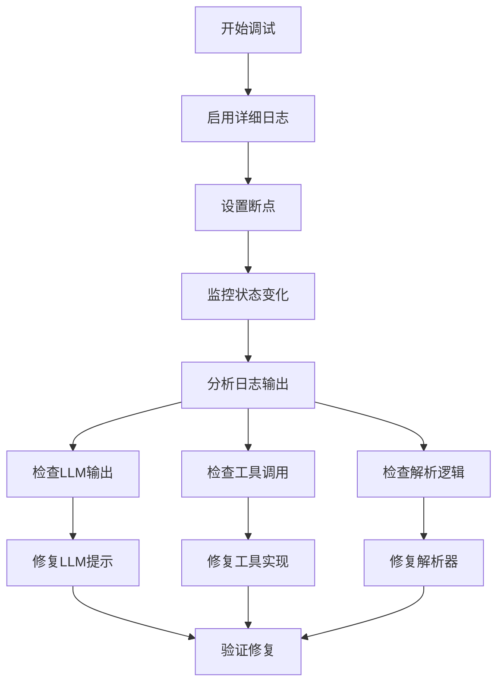
```mermaid
flowchart TD
DebugStart["开始调试"] --> EnableVerbose["启用详细日志"]
EnableVerbose --> SetBreakpoints["设置断点"]
SetBreakpoints --> MonitorState["监控状态变化"]
MonitorState --> AnalyzeLogs["分析日志输出"]
AnalyzeLogs --> CheckLLM["检查LLM输出"]
AnalyzeLogs --> CheckTools["检查工具调用"]
AnalyzeLogs --> CheckParsing["检查解析逻辑"]
CheckLLM --> FixLLM["修复LLM提示"]
CheckTools --> FixTools["修复工具实现"]
CheckParsing --> FixParsing["修复解析器"]
FixLLM --> VerifyFix["验证修复"]
FixTools --> VerifyFix
FixParsing --> VerifyFix
```

### 性能监控

关键性能指标监控：

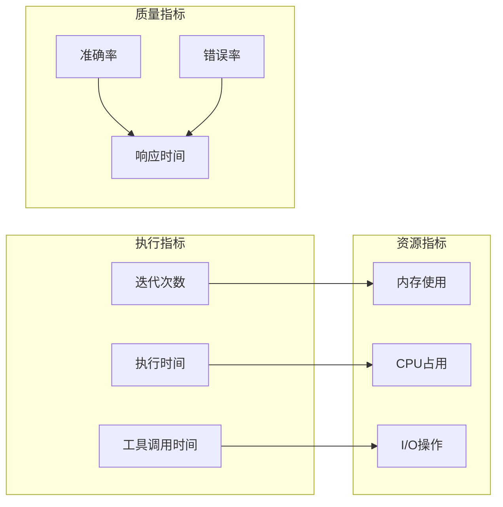
```mermaid
graph LR
subgraph "执行指标"
IT[迭代次数]
ET[执行时间]
TT[工具调用时间]
end
subgraph "资源指标"
MEM[内存使用]
CPU[CPU占用]
IO[I/O操作]
end
subgraph "质量指标"
ACC[准确率]
ERR[错误率]
RT[响应时间]
end
IT --> MEM
ET --> CPU
TT --> IO
ACC --> RT
ERR --> RT
```

**章节来源**
- [test_agent_iterator.py](file://libs/langchain/tests/unit_tests/agents/test_agent_iterator.py#L15-L50)
- [test_agent.py](file://libs/langchain/tests/unit_tests/agents/test_agent.py#L715-L756)

## 总结

LangChain Agent执行流程是一个精心设计的复杂系统，它通过以下核心特性实现了高效的智能代理执行：

### 关键优势

1. **模块化架构**：清晰的分层设计使得各组件职责明确，易于维护和扩展
2. **灵活的执行模式**：支持同步、异步和流式执行，适应不同应用场景
3. **强大的状态管理**：完善的中间步骤存储和状态跟踪机制
4. **健壮的错误处理**：多层次的错误恢复和超时控制机制
5. **可观测性**：全面的回调系统和监控指标收集

### 最佳实践建议

1. **合理配置超时参数**：根据任务复杂度设置合适的max_execution_time
2. **启用状态修剪**：对于长时间运行的任务，启用中间步骤修剪
3. **使用流式执行**：在需要实时反馈的场景下使用流式接口
4. **完善错误处理**：针对可能的解析错误和工具调用失败制定处理策略
5. **监控执行指标**：建立完善的监控体系来跟踪Agent性能

### 未来发展方向

随着AI技术的发展，LangChain Agent执行流程将继续演进，重点关注：
- 更智能的执行策略自适应
- 更高效的并发执行机制
- 更精细的状态管理和优化
- 更强大的错误预测和恢复能力

通过深入理解和正确使用这些机制，开发者可以构建出更加智能、可靠和高效的AI代理系统。