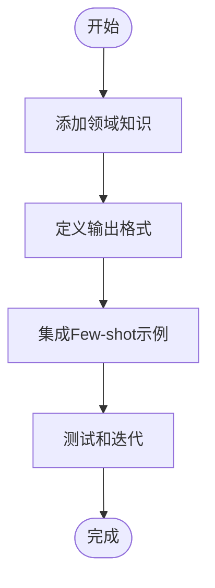

# 提示工程

<cite>
**本文档中引用的文件**  
- [react/agent.py](file://libs/langchain/langchain_classic/agents/react/agent.py)
- [mrkl/prompt.py](file://libs/langchain/langchain_classic/agents/mrkl/prompt.py)
- [react/__init__.py](file://libs/langchain/langchain_classic/agents/react/__init__.py)
- [mrkl/output_parser.py](file://libs/langchain/langchain_classic/agents/mrkl/output_parser.py)
- [output_parsers/react_single_input.py](file://libs/langchain/langchain_classic/agents/output_parsers/react_single_input.py)
- [format_scratchpad/log.py](file://libs/langchain/langchain_classic/agents/format_scratchpad/log.py)
- [prompts/chat.py](file://libs/core/langchain_core/prompts/chat.py)
- [prompts/base.py](file://libs/core/langchain_core/prompts/base.py)
- [prompts/string.py](file://libs/core/langchain_core/prompts/string.py)
- [prompts/few_shot.py](file://libs/core/langchain_core/prompts/few_shot.py)
- [prompts/few_shot_with_templates.py](file://libs/core/langchain_core/prompts/few_shot_with_templates.py)
</cite>

## 目录
1. [引言](#引言)
2. [提示在Agent行为中的核心作用](#提示在agent行为中的核心作用)
3. [不同Agent类型的提示模板结构](#不同agent类型的提示模板结构)
4. [通过提示工程约束Agent行为](#通过提示工程约束agent行为)
5. [修改和自定义提示的实践指南](#修改和自定义提示的实践指南)
6. [最佳实践和常见陷阱](#最佳实践和常见陷阱)

## 引言
提示工程在LangChain Agents中扮演着至关重要的角色，它决定了Agent如何进行推理和决策。通过精心设计的系统提示，可以引导Agent按照预期的方式与工具交互、处理任务并生成响应。本文档深入探讨了提示工程的核心概念，包括ReAct等Agent类型使用的"思考-行动-观察"模板结构，以及如何通过提示设计来提高工具选择的准确性和防止无效循环。

## 提示在Agent行为中的核心作用
提示在LangChain Agents中是引导Agent推理和决策过程的核心机制。它不仅定义了Agent与用户交互的方式，还决定了Agent如何调用工具、处理中间结果以及生成最终响应。系统提示通过提供明确的指令和格式要求，确保Agent的行为符合预期。

在ReAct Agent中，提示通过`prompt.partial()`方法将可用工具和工具名称注入到提示模板中，从而让Agent了解其可用的功能。提示还通过设置停止序列（如"Observation:"）来控制LLM的生成过程，避免产生不相关的输出。这种机制确保了Agent的输出遵循"思考-行动-观察"的循环模式，使推理过程更加可控和可预测。

**Section sources**
- [react/agent.py](file://libs/langchain/langchain_classic/agents/react/agent.py#L129-L146)

## 不同Agent类型的提示模板结构
### ReAct Agent的"思考-行动-观察"模板
ReAct Agent基于论文"ReAct: Synergizing Reasoning and Acting in Language Models"实现，采用"思考-行动-观察"的循环模式。这种模板结构要求Agent首先进行思考（Thought），然后决定采取什么行动（Action），执行行动后观察结果（Observation），并根据观察结果进行下一步思考。

该模板通过在提示中添加停止序列"Observation:"来确保LLM在生成行动后停止，等待实际的观察结果。这种设计避免了LLM在没有实际执行工具的情况下虚构观察结果，提高了Agent行为的可靠性。

**Section sources**
- [react/__init__.py](file://libs/langchain/langchain_classic/agents/react/__init__.py#L0-L0)
- [react/agent.py](file://libs/langchain/langchain_classic/agents/react/agent.py#L26-L51)

### MRKL Agent的提示结构
MRKL Agent（由Thought, Action, Action Input, Final Answer组成）采用不同的提示结构。其提示模板包含明确的格式指令，要求LLM在响应时遵循特定的格式。例如，当需要使用工具时，必须以"Action:"开头，后跟工具名称；当需要提供最终答案时，必须以"Final Answer:"开头。

这种结构通过正则表达式解析器（如MRKLOutputParser）来验证和解析LLM的输出，确保输出符合预期格式。如果LLM的输出缺少必要的部分（如缺少Action或Action Input），解析器会抛出异常并要求重新生成。

**Section sources**
- [mrkl/prompt.py](file://libs/langchain/langchain_classic/agents/mrkl/prompt.py#L0-L11)
- [mrkl/output_parser.py](file://libs/langchain/langchain_classic/agents/mrkl/output_parser.py#L0-L37)

## 通过提示工程约束Agent行为
### 提高工具选择的准确性
通过在提示中清晰地描述每个工具的功能和适用场景，可以显著提高Agent选择正确工具的准确性。例如，在ReAct Agent中，工具渲染器（tools_renderer）将工具列表转换为字符串并注入到提示中，使Agent能够根据工具描述做出决策。

此外，通过在提示中设置停止序列，可以防止LLM在未完成当前步骤的情况下继续生成后续内容。例如，设置"Observation:"作为停止序列，确保LLM在生成行动后停止，等待实际的观察结果，而不是虚构观察。

### 防止无效循环
无效循环是Agent系统中的常见问题，通常发生在Agent反复尝试相同的行动而无法取得进展时。通过在提示中加入循环检测和终止机制，可以有效防止这种情况。

例如，可以在提示中明确要求Agent在发现重复模式时改变策略，或者设置最大迭代次数。此外，通过分析中间步骤的历史记录，可以在提示中提醒Agent避免重复之前的错误。

**Section sources**
- [react/agent.py](file://libs/langchain/langchain_classic/agents/react/agent.py#L26-L51)
- [format_scratchpad/log.py](file://libs/langchain/langchain_classic/agents/format_scratchpad/log.py#L0-L22)

## 修改和自定义提示的实践指南
### 添加领域知识
在提示中添加领域特定的知识可以显著提高Agent在特定任务上的表现。这可以通过在系统提示中包含相关背景信息、术语定义和最佳实践来实现。例如，在医疗领域的应用中，可以在提示中包含医学术语的定义和诊断流程的指导原则。

### 定义输出格式
明确的输出格式要求对于确保Agent生成一致且可解析的响应至关重要。这可以通过在提示中包含详细的格式说明来实现，例如要求使用特定的JSON结构或Markdown格式。LangChain提供了多种输出解析器（如ReActSingleInputOutputParser），可以根据提示中的格式要求来验证和解析LLM的输出。

### 集成Few-shot示例
Few-shot示例是提高Agent性能的有效方法。通过在提示中包含几个输入-输出示例，可以引导Agent学习期望的行为模式。LangChain的FewShotPromptTemplate支持在提示中动态插入示例，使Agent能够从少量示例中学习。

**Diagram sources**
- [prompts/few_shot.py](file://libs/core/langchain_core/prompts/few_shot.py#L175-L204)
- [prompts/few_shot_with_templates.py](file://libs/core/langchain_core/prompts/few_shot_with_templates.py#L146-L165)

**Section sources**
- [prompts/few_shot.py](file://libs/core/langchain_core/prompts/few_shot.py#L175-L204)
- [prompts/few_shot_with_templates.py](file://libs/core/langchain_core/prompts/few_shot_with_templates.py#L146-L165)

## 最佳实践和常见陷阱
### 最佳实践
1. **保持提示简洁明了**：避免在提示中包含不必要的信息，确保关键指令突出。
2. **使用清晰的分隔符**：使用明确的分隔符（如"Thought:", "Action:"）来区分不同的部分，便于解析。
3. **提供足够的上下文**：确保提示中包含足够的上下文信息，使Agent能够做出明智的决策。
4. **测试和迭代**：不断测试提示的效果，并根据结果进行迭代优化。

### 常见陷阱
1. **过度约束**：过于严格的格式要求可能会限制LLM的创造力，导致无法处理意外情况。
2. **忽略错误处理**：未在提示中考虑错误情况可能导致Agent在遇到问题时陷入无限循环。
3. **缺乏灵活性**：固定的提示结构可能无法适应不同的任务需求，需要根据具体场景进行调整。

**Section sources**
- [output_parsers/react_single_input.py](file://libs/langchain/langchain_classic/agents/output_parsers/react_single_input.py#L40-L73)
- [prompts/base.py](file://libs/core/langchain_core/prompts/base.py#L0-L461)
- [prompts/string.py](file://libs/core/langchain_core/prompts/string.py#L0-L344)