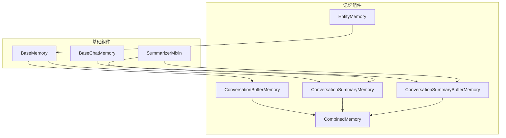
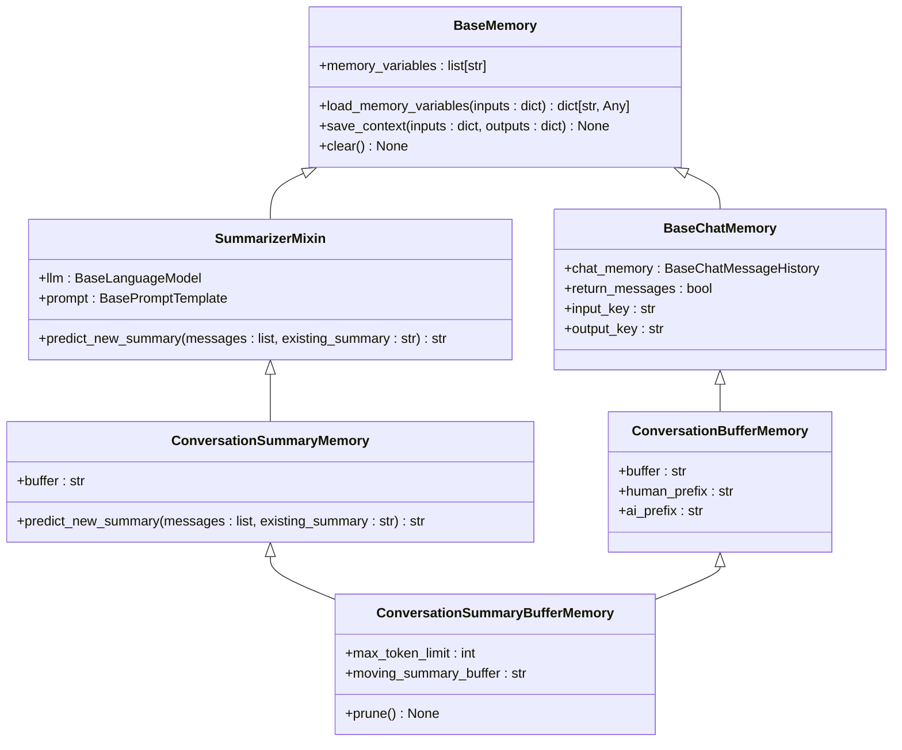
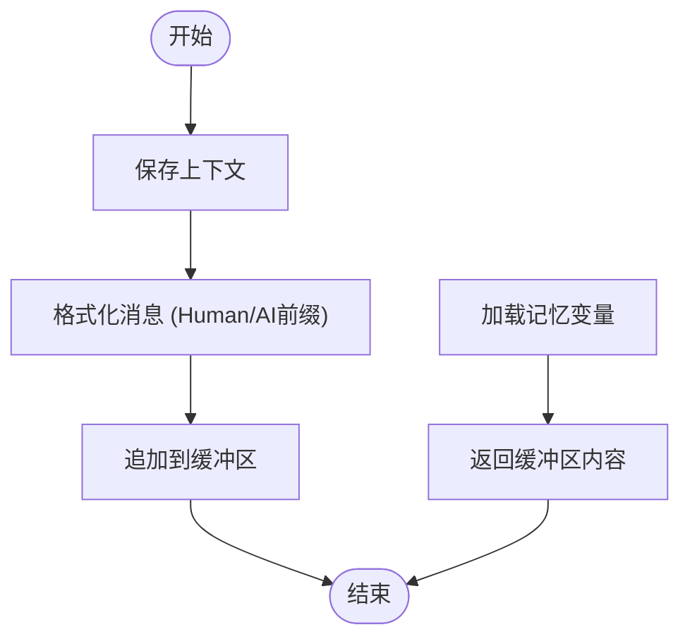
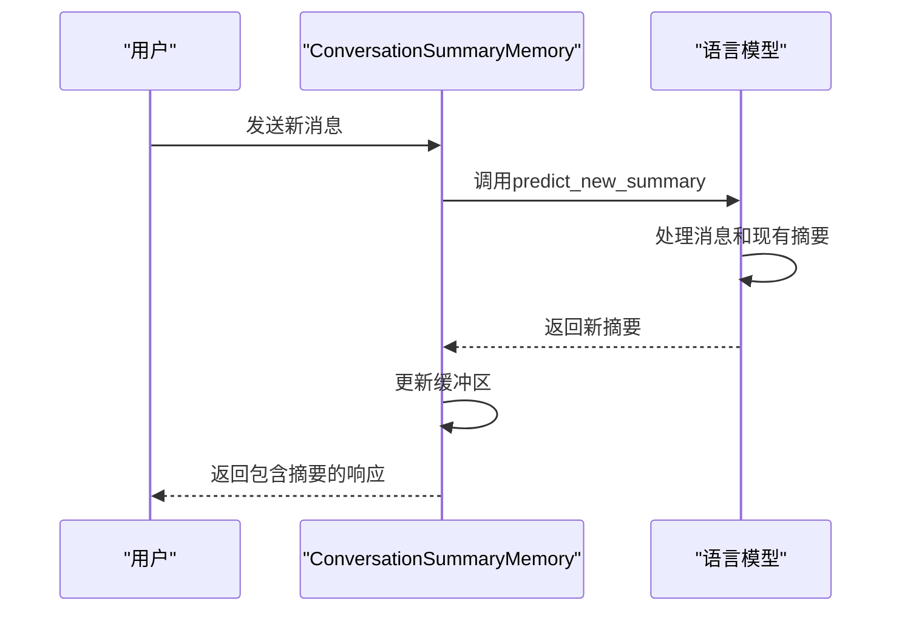
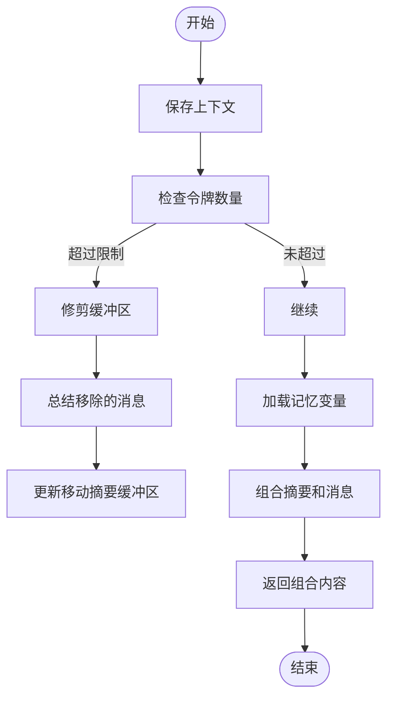
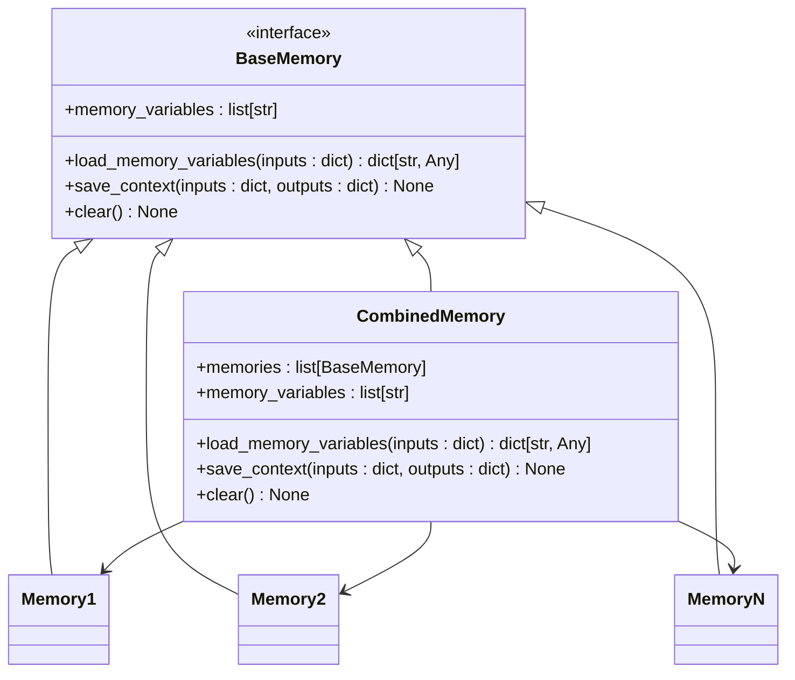
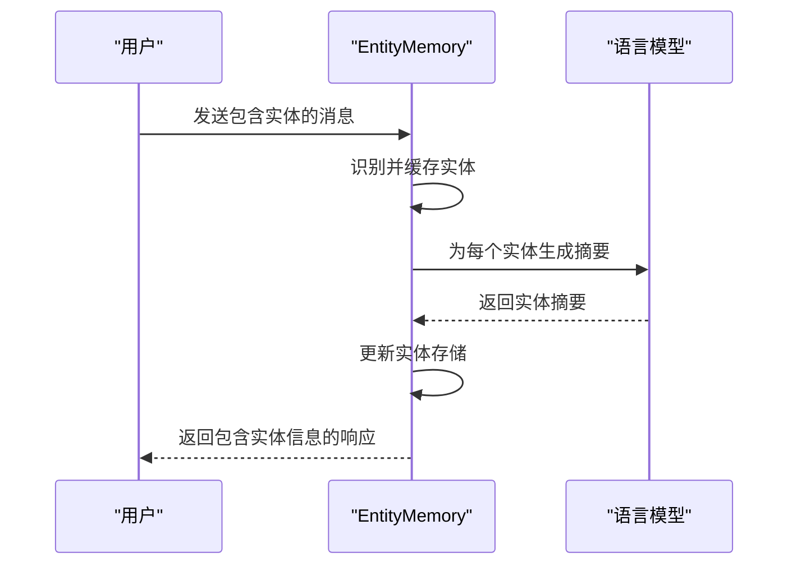
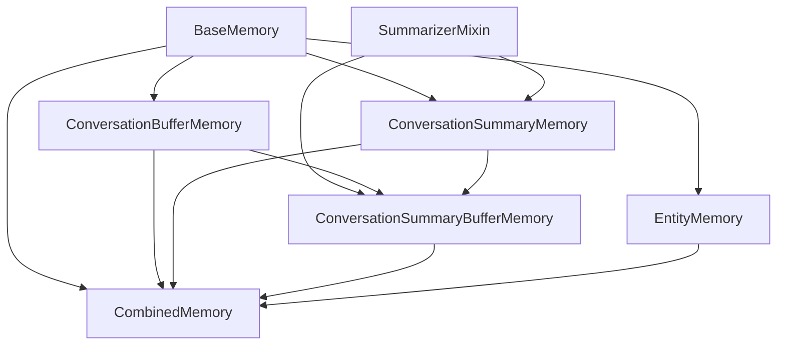

# 记忆管理

<cite>
**本文档中引用的文件**  
- [base_memory.py](file://libs/langchain/langchain_classic/base_memory.py)
- [buffer.py](file://libs/langchain/langchain_classic/memory/buffer.py)
- [summary.py](file://libs/langchain/langchain_classic/memory/summary.py)
- [summary_buffer.py](file://libs/langchain/langchain_classic/memory/summary_buffer.py)
- [combined.py](file://libs/langchain/langchain_classic/memory/combined.py)
- [entity.py](file://libs/langchain/langchain_classic/memory/entity.py)
</cite>

## 目录
1. [简介](#简介)
2. [项目结构](#项目结构)
3. [核心组件](#核心组件)
4. [架构概述](#架构概述)
5. [详细组件分析](#详细组件分析)
6. [依赖分析](#依赖分析)
7. [性能考虑](#性能考虑)
8. [故障排除指南](#故障排除指南)
9. [结论](#结论)

## 简介
LangChain Agents的记忆管理系统为智能体提供了长期和短期记忆能力，使其能够进行多轮对话和上下文感知的任务执行。记忆组件通过存储和管理对话历史、实体信息和上下文摘要，使Agent能够基于先前的交互做出更明智的决策。本文档深入探讨了各种记忆类型（如ConversationBufferMemory、SummaryMemory）的实现和集成方式，以及它们如何影响Agent的决策过程。

## 项目结构
LangChain的记忆管理功能主要位于`libs/langchain/langchain_classic/memory`目录下，包含多种记忆实现和工具。这些组件被设计为可插拔的模块，可以灵活地集成到不同的Agent和链式结构中。

**Diagram sources**
- [base_memory.py](file://libs/langchain/langchain_classic/base_memory.py)
- [buffer.py](file://libs/langchain/langchain_classic/memory/buffer.py)
- [summary.py](file://libs/langchain/langchain_classic/memory/summary.py)
- [summary_buffer.py](file://libs/langchain/langchain_classic/memory/summary_buffer.py)
- [combined.py](file://libs/langchain/langchain_classic/memory/combined.py)
- [entity.py](file://libs/langchain/langchain_classic/memory/entity.py)

**Section sources**
- [base_memory.py](file://libs/langchain/langchain_classic/base_memory.py)
- [buffer.py](file://libs/langchain/langchain_classic/memory/buffer.py)

## 核心组件
LangChain的记忆系统基于`BaseMemory`抽象基类构建，提供了统一的接口用于保存和加载上下文信息。核心组件包括缓冲记忆、摘要记忆和组合记忆，每种类型都针对不同的使用场景进行了优化。

**Section sources**
- [base_memory.py](file://libs/langchain/langchain_classic/base_memory.py)
- [buffer.py](file://libs/langchain/langchain_classic/memory/buffer.py)
- [summary.py](file://libs/langchain/langchain_classic/memory/summary.py)

## 架构概述
LangChain的记忆架构采用分层设计，从基础的`BaseMemory`类到具体的记忆实现，形成了一个灵活且可扩展的系统。记忆组件通过与语言模型和提示模板的集成，实现了对话历史的动态管理和上下文感知。

**Diagram sources**
- [base_memory.py](file://libs/langchain/langchain_classic/base_memory.py)
- [buffer.py](file://libs/langchain/langchain_classic/memory/buffer.py)
- [summary.py](file://libs/langchain/langchain_classic/memory/summary.py)
- [summary_buffer.py](file://libs/langchain/langchain_classic/memory/summary_buffer.py)

## 详细组件分析

### 缓冲记忆分析
`ConversationBufferMemory`是最基本的记忆实现，它简单地将整个对话历史存储在内存中。这种记忆类型适用于对话历史较短的场景，但当历史过长时可能会超出模型的上下文窗口限制。

**Diagram sources**
- [buffer.py](file://libs/langchain/langchain_classic/memory/buffer.py)

**Section sources**
- [buffer.py](file://libs/langchain/langchain_classic/memory/buffer.py)

### 摘要记忆分析
`ConversationSummaryMemory`通过持续总结对话历史来提供长期记忆能力。每次对话轮次后，系统都会使用语言模型生成一个新的摘要，将之前的摘要与新消息结合，从而保持对整个对话的宏观理解。

**Diagram sources**
- [summary.py](file://libs/langchain/langchain_classic/memory/summary.py)

**Section sources**
- [summary.py](file://libs/langchain/langchain_classic/memory/summary.py)

### 摘要缓冲记忆分析
`ConversationSummaryBufferMemory`结合了缓冲记忆和摘要记忆的优点，提供了一种平衡的解决方案。它维护一个"移动摘要缓冲区"，当对话历史超过指定的令牌限制时，会将较早的消息总结并移入摘要缓冲区，同时保留最近的消息在缓冲区中。

**Diagram sources**
- [summary_buffer.py](file://libs/langchain/langchain_classic/memory/summary_buffer.py)

**Section sources**
- [summary_buffer.py](file://libs/langchain/langchain_classic/memory/summary_buffer.py)

### 组合记忆分析
`CombinedMemory`允许将多个记忆组件组合在一起，为Agent提供多维度的记忆能力。例如，可以同时使用缓冲记忆来保留最近的对话和摘要记忆来保持长期上下文。

**Diagram sources**
- [combined.py](file://libs/langchain/langchain_classic/memory/combined.py)

**Section sources**
- [combined.py](file://libs/langchain/langchain_classic/memory/combined.py)

### 实体记忆分析
`EntityMemory`专注于跟踪和总结对话中提到的实体信息。它能够识别对话中的关键实体，并为每个实体维护一个动态更新的摘要，使Agent能够基于实体的完整历史进行推理。

**Diagram sources**
- [entity.py](file://libs/langchain/langchain_classic/memory/entity.py)

**Section sources**
- [entity.py](file://libs/langchain/langchain_classic/memory/entity.py)

## 依赖分析
LangChain的记忆系统依赖于多个核心组件和抽象，形成了一个复杂的依赖网络。`BaseMemory`作为所有记忆实现的基类，定义了统一的接口。`SummarizerMixin`提供了摘要生成功能，被摘要相关的记忆类型所继承。

**Diagram sources**
- [base_memory.py](file://libs/langchain/langchain_classic/base_memory.py)
- [buffer.py](file://libs/langchain/langchain_classic/memory/buffer.py)
- [summary.py](file://libs/langchain/langchain_classic/memory/summary.py)
- [summary_buffer.py](file://libs/langchain/langchain_classic/memory/summary_buffer.py)
- [combined.py](file://libs/langchain/langchain_classic/memory/combined.py)
- [entity.py](file://libs/langchain/langchain_classic/memory/entity.py)

**Section sources**
- [base_memory.py](file://libs/langchain/langchain_classic/base_memory.py)
- [buffer.py](file://libs/langchain/langchain_classic/memory/buffer.py)
- [summary.py](file://libs/langchain/langchain_classic/memory/summary.py)
- [summary_buffer.py](file://libs/langchain/langchain_classic/memory/summary_buffer.py)
- [combined.py](file://libs/langchain/langchain_classic/memory/combined.py)

## 性能考虑
记忆管理对Agent的性能有重要影响。简单的缓冲记忆虽然快速但内存消耗大；摘要记忆需要额外的LLM调用来生成摘要，增加了延迟但减少了上下文长度。在实际应用中，需要根据具体场景权衡这些因素。

- **令牌效率**：`ConversationSummaryBufferMemory`通过总结旧消息来优化令牌使用
- **延迟**：摘要生成需要额外的LLM调用，增加了响应时间
- **内存使用**：组合记忆会增加内存开销，因为需要维护多个记忆实例
- **持久化**：长期记忆需要考虑持久化策略，如数据库存储

## 故障排除指南
在使用LangChain记忆系统时，可能会遇到一些常见问题：

1. **上下文过长**：当对话历史超过模型限制时，考虑使用`ConversationSummaryBufferMemory`或实现自定义的修剪策略
2. **摘要质量**：如果摘要不够准确，可以调整摘要提示模板或使用更强大的语言模型
3. **实体识别**：确保实体记忆的输入键设置正确，以便正确提取上下文信息
4. **组合冲突**：在使用`CombinedMemory`时，确保各个子记忆的变量名不冲突

**Section sources**
- [base_memory.py](file://libs/langchain/langchain_classic/base_memory.py)
- [buffer.py](file://libs/langchain/langchain_classic/memory/buffer.py)
- [summary.py](file://libs/langchain/langchain_classic/memory/summary.py)
- [summary_buffer.py](file://libs/langchain/langchain_classic/memory/summary_buffer.py)
- [combined.py](file://libs/langchain/langchain_classic/memory/combined.py)

## 结论
LangChain的记忆管理系统为Agent提供了强大的上下文管理能力，使其能够进行复杂的多轮对话和任务执行。通过合理选择和配置不同的记忆类型，可以为各种应用场景构建高效且智能的Agent系统。未来的发展方向可能包括更智能的上下文修剪策略、跨会话记忆共享以及与其他知识管理系统的深度集成。