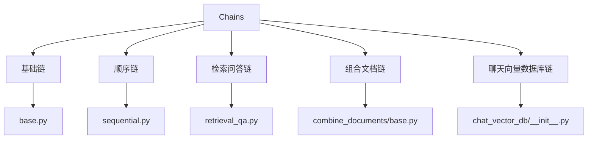
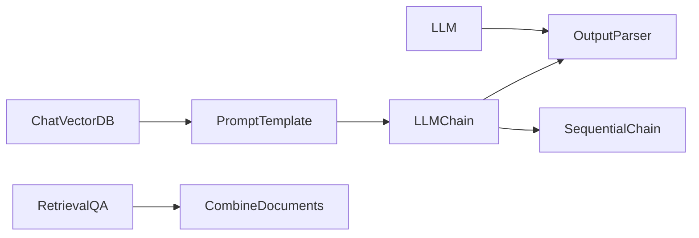
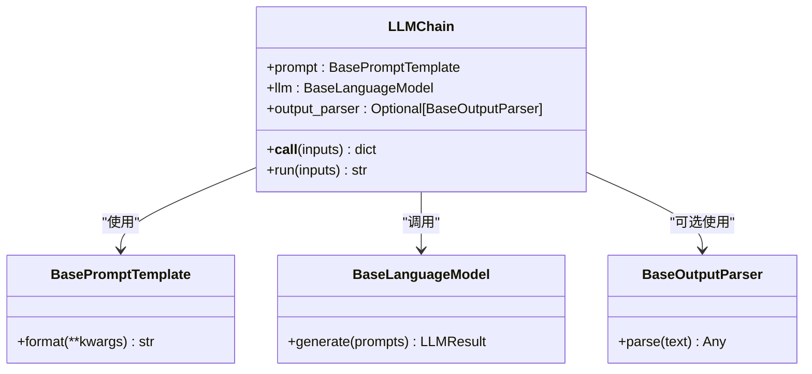
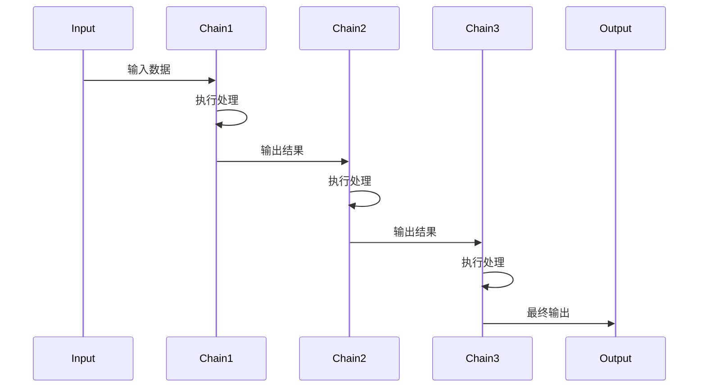
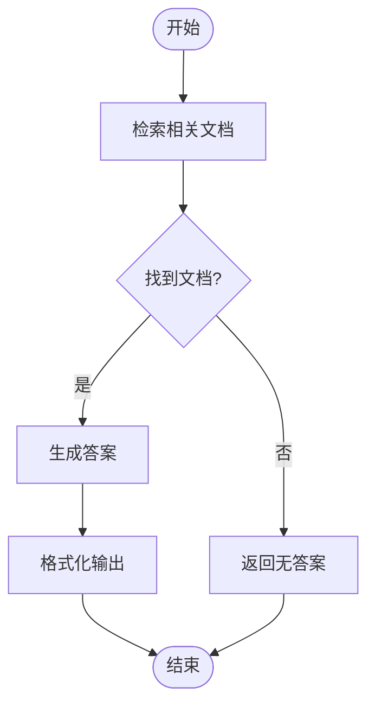
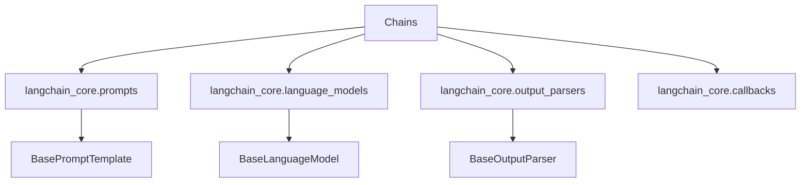

# Chains

<cite>
**本文档中引用的文件**  
- [base.py](file://libs/langchain/langchain_classic/chains/base.py)
- [llm.py](file://libs/langchain/langchain_classic/chains/llm.py)
- [sequential.py](file://libs/langchain/langchain_classic/chains/sequential.py)
- [retrieval_qa.py](file://libs/langchain/langchain_classic/chains/retrieval_qa.py)
- [combine_documents/base.py](file://libs/langchain/langchain_classic/chains/combine_documents/base.py)
- [chat_vector_db/__init__.py](file://libs/langchain/langchain_classic/chains/chat_vector_db/__init__.py)
- [prompts.py](file://libs/langchain/langchain_classic/chains/chat_vector_db/prompts.py)
- [output_parsers/base.py](file://libs/core/langchain_core/output_parsers/base.py)
- [prompts/base.py](file://libs/core/langchain_core/prompts/base.py)
- [language_models/base.py](file://libs/core/langchain_core/language_models/base.py)
</cite>

## 目录
1. [引言](#引言)
2. [项目结构](#项目结构)
3. [核心组件](#核心组件)
4. [架构概述](#架构概述)
5. [详细组件分析](#详细组件分析)
6. [依赖分析](#依赖分析)
7. [性能考虑](#性能考虑)
8. [故障排除指南](#故障排除指南)
9. [结论](#结论)

## 引言
LangChain中的Chains提供了一种将多个组件（如语言模型、提示模板、输出解析器和检索器）串联起来执行的机制。通过组合简单的组件，开发者可以构建复杂的逻辑流程，实现从数据输入到智能输出的自动化处理。本文档将深入探讨Chains的设计理念、核心类型、使用方法以及扩展性。

## 项目结构
LangChain的Chains功能主要分布在`libs/langchain/langchain_classic/chains`目录下，该目录包含了各种预定义的Chain实现。每个子模块对应一种特定类型的Chain，例如`llm`、`sequential`、`retrieval_qa`等。这种模块化设计使得代码组织清晰，易于维护和扩展。

**Diagram sources**
- [base.py](file://libs/langchain/langchain_classic/chains/base.py)
- [sequential.py](file://libs/langchain/langchain_classic/chains/sequential.py)
- [retrieval_qa.py](file://libs/langchain/langchain_classic/chains/retrieval_qa.py)

**Section sources**
- [base.py](file://libs/langchain/langchain_classic/chains/base.py)
- [retrieval_qa.py](file://libs/langchain/langchain_classic/chains/retrieval_qa.py)

## 核心组件
Chains的核心在于其组件化设计，允许将LLM、提示模板、输出解析器等独立组件按需组合。`Chain`基类定义了所有链的通用接口，包括输入/输出模式、执行方法和调用逻辑。通过继承和组合，不同类型的Chain实现了特定的业务逻辑。

**Section sources**
- [base.py](file://libs/langchain/langchain_classic/chains/base.py)
- [language_models/base.py](file://libs/core/langchain_core/language_models/base.py)

## 架构概述
LangChain Chains的架构基于可组合性和可扩展性原则。各组件通过标准化接口进行通信，形成一个有序的数据处理流水线。这种设计不仅提高了代码复用率，还便于调试和测试。

**Diagram sources**
- [prompts/base.py](file://libs/core/langchain_core/prompts/base.py)
- [llm.py](file://libs/langchain/langchain_classic/chains/llm.py)
- [output_parsers/base.py](file://libs/core/langchain_core/output_parsers/base.py)

## 详细组件分析

### LLMChain 分析
LLMChain是最基本的链类型，它将提示模板与语言模型结合，自动填充输入变量并调用LLM生成响应。

**Diagram sources**
- [llm.py](file://libs/langchain/langchain_classic/chains/llm.py)
- [prompts/base.py](file://libs/core/langchain_core/prompts/base.py)
- [language_models/base.py](file://libs/core/langchain_core/language_models/base.py)

**Section sources**
- [llm.py](file://libs/langchain/langchain_classic/chains/llm.py)
- [prompts/base.py](file://libs/core/langchain_core/prompts/base.py)

### SequentialChain 分析
SequentialChain允许将多个子链按顺序执行，前一个链的输出作为后一个链的输入，适用于多步骤推理任务。

**Diagram sources**
- [sequential.py](file://libs/langchain/langchain_classic/chains/sequential.py)
- [base.py](file://libs/langchain/langchain_classic/chains/base.py)

**Section sources**
- [sequential.py](file://libs/langchain/langchain_classic/chains/sequential.py)

### RetrievalQAChain 分析
RetrievalQAChain结合了文档检索和问答能力，首先从向量数据库中检索相关文档，然后利用这些文档作为上下文生成答案。

**Diagram sources**
- [retrieval_qa.py](file://libs/langchain/langchain_classic/chains/retrieval_qa.py)
- [combine_documents/base.py](file://libs/langchain/langchain_classic/chains/combine_documents/base.py)

**Section sources**
- [retrieval_qa.py](file://libs/langchain/langchain_classic/chains/retrieval_qa.py)

## 依赖分析
Chains组件依赖于LangChain Core中的多个核心模块，包括提示模板、语言模型接口和输出解析器。这些依赖关系通过抽象基类定义，确保了组件间的松耦合。

**Diagram sources**
- [base.py](file://libs/langchain/langchain_classic/chains/base.py)
- [prompts/base.py](file://libs/core/langchain_core/prompts/base.py)
- [language_models/base.py](file://libs/core/langchain_core/language_models/base.py)
- [output_parsers/base.py](file://libs/core/langchain_core/output_parsers/base.py)

**Section sources**
- [base.py](file://libs/langchain/langchain_classic/chains/base.py)

## 性能考虑
为了提高Chain的执行效率，可以采用缓存机制避免重复计算，或使用异步执行实现并行处理。此外，合理配置提示模板和选择合适的输出解析器也能显著影响性能。

## 故障排除指南
当Chain执行失败时，应首先检查输入数据格式是否符合预期，然后验证各组件的配置是否正确。利用回调系统可以监控执行过程中的每一步，有助于定位问题根源。

**Section sources**
- [callbacks/base.py](file://libs/core/langchain_core/callbacks/base.py)
- [base.py](file://libs/langchain/langchain_classic/chains/base.py)

## 结论
LangChain Chains通过组件化设计实现了复杂AI流程的构建。其灵活的架构支持多种应用场景，从简单的问答到复杂的多步骤推理。通过深入理解各类Chain的工作原理，开发者可以更有效地利用这一强大工具构建智能应用。