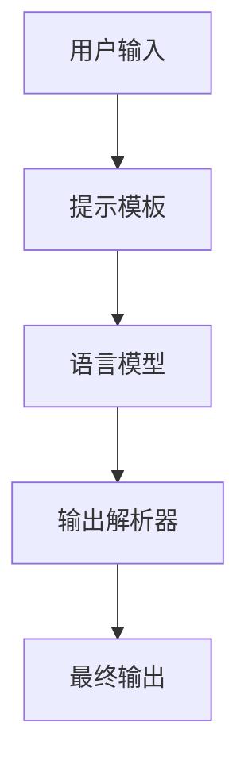
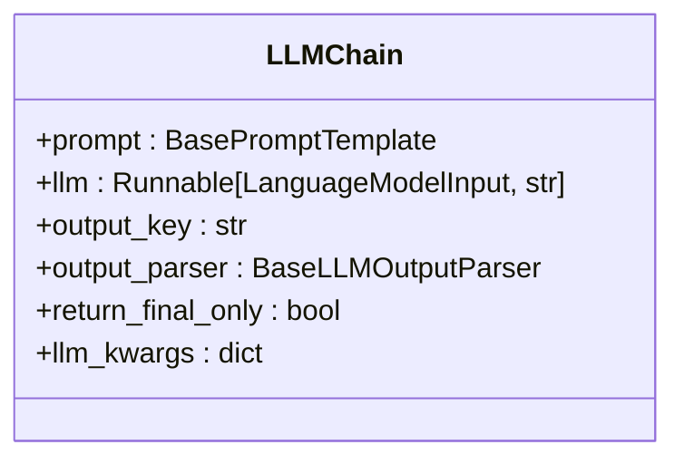
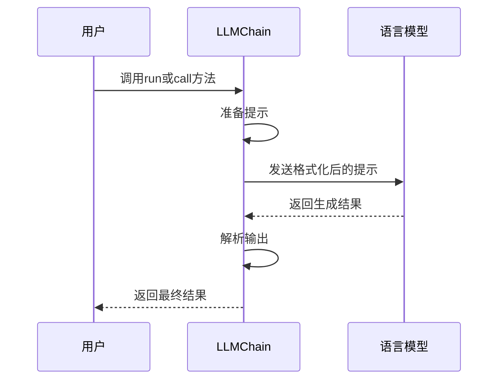
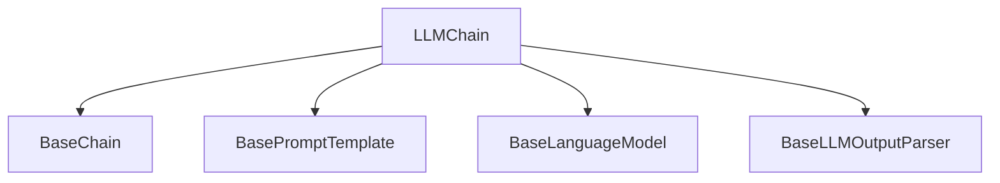

# LLMChain

<cite>
**本文档中引用的文件**   
- [llm.py](file://libs/langchain/langchain_classic/chains/llm.py)
- [base.py](file://libs/langchain/langchain_classic/chains/base.py)
- [loading.py](file://libs/langchain/langchain_classic/chains/loading.py)
</cite>

## 目录
1. [简介](#简介)
2. [核心组件](#核心组件)
3. [架构概述](#架构概述)
4. [详细组件分析](#详细组件分析)
5. [依赖分析](#依赖分析)
6. [性能考虑](#性能考虑)
7. [故障排除指南](#故障排除指南)
8. [结论](#结论)

## 简介
LLMChain是LangChain框架中最基础的链类型，它将一个语言模型（LLM）与一个提示模板（PromptTemplate）结合，形成一个简单的输入-处理-输出流程。尽管该类已被标记为弃用，但它仍然是理解LangChain中链式结构工作原理的重要基础。LLMChain通过将用户输入与提示模板结合，然后传递给语言模型进行处理，最终返回生成的结果。这种模式为更复杂的链式结构提供了基础。

## 核心组件

LLMChain的核心组件包括语言模型（LLM）、提示模板（PromptTemplate）和输出解析器（OutputParser）。这些组件共同工作，实现从输入到输出的完整流程。LLMChain作为Chain类的子类，继承了其基本功能，并添加了特定于语言模型调用的特性。

**Section sources**
- [llm.py](file://libs/langchain/langchain_classic/chains/llm.py#L44-L437)
- [base.py](file://libs/langchain/langchain_classic/chains/base.py#L0-L199)

## 架构概述

LLMChain的架构基于简单的输入-处理-输出模式。它接收用户输入，将其与预定义的提示模板结合，然后传递给语言模型进行处理。处理结果经过输出解析器后返回给用户。这种架构使得开发者可以轻松地创建和管理复杂的语言模型应用。

**Diagram sources **
- [llm.py](file://libs/langchain/langchain_classic/chains/llm.py#L44-L437)

## 详细组件分析

### LLMChain构造函数分析
LLMChain的构造函数接受两个主要参数：`llm`和`prompt`。`llm`参数指定要使用的语言模型，而`prompt`参数指定提示模板。此外，还可以通过`output_key`参数自定义输出键名，通过`output_parser`参数指定输出解析器。

#### 构造函数参数

**Diagram sources **
- [llm.py](file://libs/langchain/langchain_classic/chains/llm.py#L44-L437)

### 执行方法分析
LLMChain提供了多种执行方法，包括`run`、`call`、`predict`等。这些方法允许用户以不同的方式调用链，并获取结果。

#### 执行流程

**Diagram sources **
- [llm.py](file://libs/langchain/langchain_classic/chains/llm.py#L44-L437)

## 依赖分析

LLMChain依赖于多个核心组件，包括BaseChain、BasePromptTemplate和BaseLanguageModel。这些依赖关系确保了LLMChain能够正确地处理输入、调用语言模型并返回结果。

**Diagram sources **
- [llm.py](file://libs/langchain/langchain_classic/chains/llm.py#L44-L437)
- [base.py](file://libs/langchain/langchain_classic/chains/base.py#L0-L199)

## 性能考虑
在使用LLMChain时，需要注意其性能影响。由于每次调用都需要与语言模型进行交互，因此可能会产生较高的延迟。为了优化性能，可以考虑使用异步方法（如`arun`或`acall`）来并行处理多个请求。此外，合理设置`return_final_only`参数可以减少不必要的数据传输。

## 故障排除指南
在使用LLMChain时，可能会遇到一些常见问题。例如，如果提示模板中的变量与输入不匹配，会导致错误。此外，如果语言模型返回的格式不符合预期，输出解析器可能无法正确解析结果。在这种情况下，检查提示模板和输出解析器的配置是解决问题的关键。

**Section sources**
- [llm.py](file://libs/langchain/langchain_classic/chains/llm.py#L44-L437)
- [loading.py](file://libs/langchain/langchain_classic/chains/loading.py#L82-L114)

## 结论
LLMChain作为LangChain框架中最基础的链类型，为开发者提供了一个简单而强大的工具来与语言模型交互。尽管它已被标记为弃用，但其设计理念和实现方式仍然对理解更复杂的链式结构具有重要价值。通过合理使用LLMChain，开发者可以快速构建出功能丰富的语言模型应用。