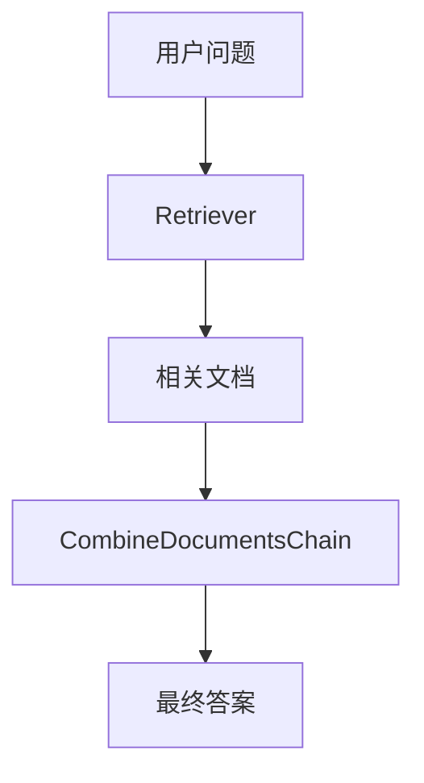
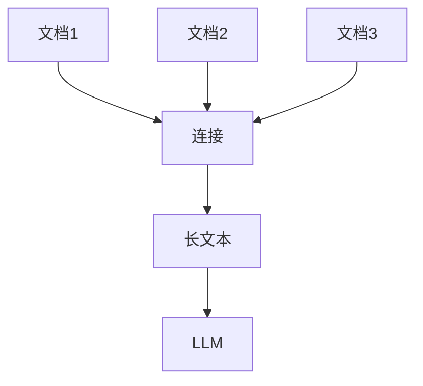
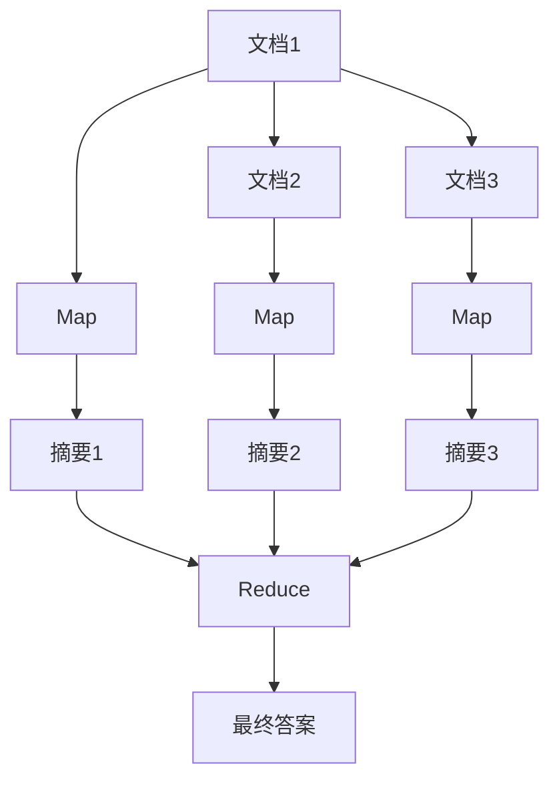
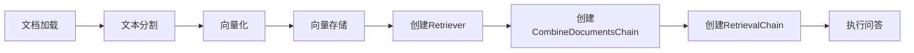

# RetrievalQAChain

<cite>
**本文档中引用的文件**  
- [retrieval_qa/base.py](file://libs/langchain/langchain_classic/chains/retrieval_qa/base.py)
- [retrieval.py](file://libs/langchain/langchain_classic/chains/retrieval.py)
- [question_answering/chain.py](file://libs/langchain/langchain_classic/chains/question_answering/chain.py)
- [combine_documents/stuff.py](file://libs/langchain/langchain_classic/chains/combine_documents/stuff.py)
- [combine_documents/map_reduce.py](file://libs/langchain/langchain_classic/chains/combine_documents/map_reduce.py)
- [combine_documents/map_rerank.py](file://libs/langchain/langchain_classic/chains/combine_documents/map_rerank.py)
- [combine_documents/refine.py](file://libs/langchain/langchain_classic/chains/combine_documents/refine.py)
</cite>

## 目录
1. [简介](#简介)
2. [核心组件](#核心组件)
3. [工作流程](#工作流程)
4. [文档组合链类型](#文档组合链类型)
5. [配置与使用](#配置与使用)
6. [端到端示例](#端到端示例)
7. [知识库问答系统中的作用](#知识库问答系统中的作用)
8. [结论](#结论)

## 简介

RetrievalQAChain 是 LangChain 框架中用于构建基于知识库的问答系统的核心组件。它通过将文档检索（Retrieval）和问答（QA）两个步骤有机结合，实现了对特定知识库的高效查询。该链首先使用 `retriever` 从向量数据库中查找与问题相关的文档，然后将这些文档和原始问题一起传递给一个 `combine_documents_chain`（通常是 LLMChain）来生成最终答案。尽管该类已被标记为弃用，推荐使用 `create_retrieval_chain` 构造函数，但理解其内部机制对于掌握 RAG（检索增强生成）技术至关重要。

## 核心组件

RetrievalQAChain 的核心由两个主要组件构成：`retriever` 和 `combine_documents_chain`。

**Section sources**
- [retrieval_qa/base.py](file://libs/langchain/langchain_classic/chains/retrieval_qa/base.py#L102-L142)

## 工作流程

RetrievalQAChain 的工作流程分为两个清晰的阶段：检索阶段和问答阶段。

**Diagram sources**
- [retrieval_qa/base.py](file://libs/langchain/langchain_classic/chains/retrieval_qa/base.py#L141-L176)
- [retrieval.py](file://libs/langchain/langchain_classic/chains/retrieval.py#L32-L67)

### 检索阶段

在检索阶段，`retriever` 负责从向量数据库中查找与用户问题最相关的文档。`retriever` 通常由向量数据库（如 FAISS、Chroma）创建，它会将用户问题转换为向量，并在向量空间中进行相似性搜索，返回一组最相关的文档。在 `RetrievalQA` 类中，`_get_docs` 方法调用了 `retriever.invoke` 来执行此操作。

### 问答阶段

在问答阶段，检索到的相关文档和原始问题被传递给 `combine_documents_chain`。这个链是一个专门设计用于处理文档列表的 `BaseCombineDocumentsChain` 实例。它的任务是将文档内容和问题整合，形成一个完整的提示（prompt），然后提交给大型语言模型（LLM）进行处理，最终生成一个连贯的答案。

## 文档组合链类型

`combine_documents_chain` 有多种实现方式，每种方式都对应不同的文档处理策略。通过 `load_qa_chain` 函数可以加载不同类型的链。

### Stuff 链

Stuff 链是最简单直接的方法。它将所有检索到的文档内容连接成一个长字符串，然后与问题一起放入提示中，一次性发送给 LLM。这种方法适用于文档数量少、内容简短的场景。

**Diagram sources**
- [combine_documents/stuff.py](file://libs/langchain/langchain_classic/chains/combine_documents/stuff.py#L36-L71)

### Map-Reduce 链

Map-Reduce 链适用于处理大量文档。它分为两个步骤：首先，对每个文档应用一个“map”链（通常是一个 LLMChain），生成一个摘要或答案片段；然后，将所有这些摘要或片段作为输入，通过一个“reduce”链（通常是 StuffDocumentsChain）进行整合，生成最终答案。

**Diagram sources**
- [combine_documents/map_reduce.py](file://libs/langchain/langchain_classic/chains/combine_documents/map_reduce.py#L34-L46)

### Refine 链

Refine 链采用迭代式的方法。它首先对第一个文档生成一个初步答案，然后依次将后续文档的内容与当前答案进行整合，不断“提炼”和改进答案。这种方法可以生成更全面、更精确的答案。

### Map-Rerank 链

Map-Rerank 链在“map”步骤中，不仅要求 LLM 生成答案，还要求其生成一个置信度分数。在“reduce”步骤中，系统会根据这些分数对所有答案进行排序，并选择分数最高的答案作为最终输出。这种方法可以提高答案的可靠性。

## 配置与使用

配置 RetrievalQAChain 主要涉及两个方面：`retriever` 的配置和 `combine_documents_chain` 的选择。

### 配置 Retriever

`retriever` 通常通过向量数据库的 `as_retriever` 方法创建，可以配置搜索类型（如 "similarity" 或 "mmr"）和搜索参数（如返回的文档数量 k）。

### 选择 CombineDocumentsChain

通过 `from_chain_type` 类方法可以方便地创建不同类型的 `combine_documents_chain`。`chain_type` 参数可以设置为 "stuff"、"map_reduce"、"refine" 或 "map_rerank"。

**Section sources**
- [retrieval_qa/base.py](file://libs/langchain/langchain_classic/chains/retrieval_qa/base.py#L102-L142)
- [question_answering/chain.py](file://libs/langchain/langchain_classic/chains/question_answering/chain.py#L263-L283)

## 端到端示例

以下是一个完整的端到端示例，展示了如何从文档加载、向量化到执行问答。

**Diagram sources**
- [retrieval.py](file://libs/langchain/langchain_classic/chains/retrieval.py#L32-L67)
- [combine_documents/stuff.py](file://libs/langchain/langchain_classic/chains/combine_documents/stuff.py#L36-L71)

## 知识库问答系统中的作用

RetrievalQAChain 在构建知识库问答系统中扮演着核心角色。它通过将外部知识库与强大的语言模型相结合，解决了传统语言模型在知识更新和事实准确性方面的局限性。系统能够从最新的、特定领域的知识库中检索信息，并利用 LLM 的语言理解与生成能力，提供准确、连贯且上下文相关的回答。这种架构是现代 RAG 系统的基础。

## 结论

尽管 RetrievalQAChain 已被标记为弃用，但其背后的设计理念——将检索与生成分离并有机结合——仍然是构建高效问答系统的最佳实践。理解其内部工作原理，特别是各种 `combine_documents_chain` 的优缺点，对于选择和实现更现代的 `create_retrieval_chain` 方案至关重要。开发者应根据知识库的大小、文档的复杂性以及对答案质量的要求，选择合适的文档处理策略。