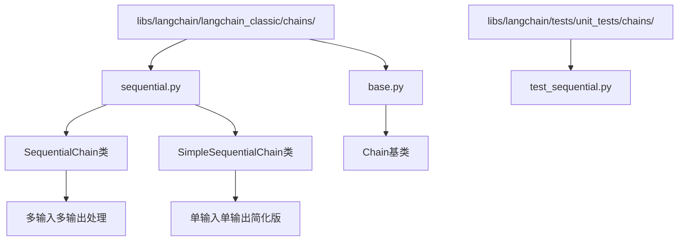
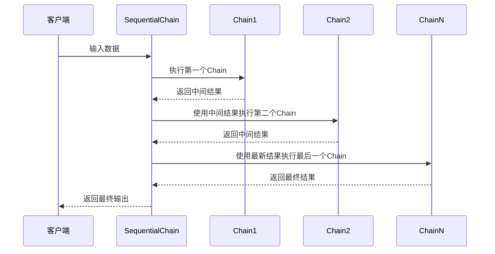
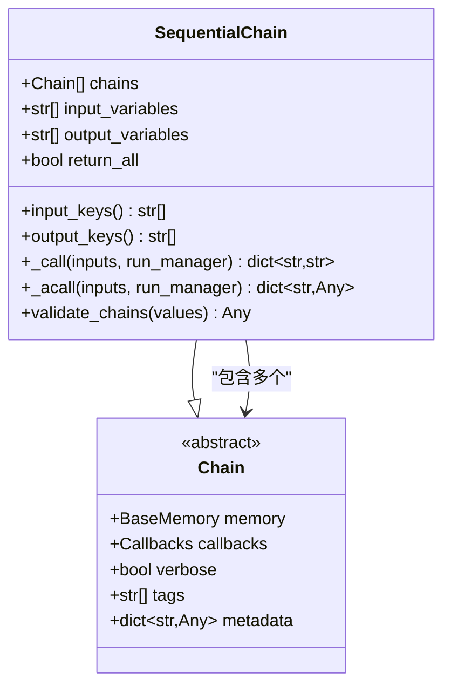
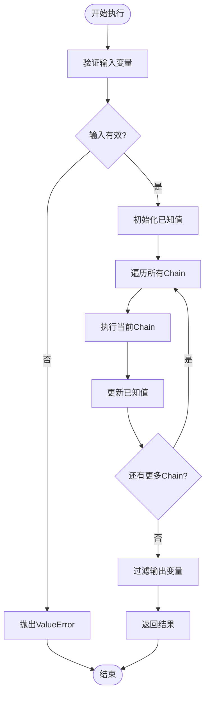
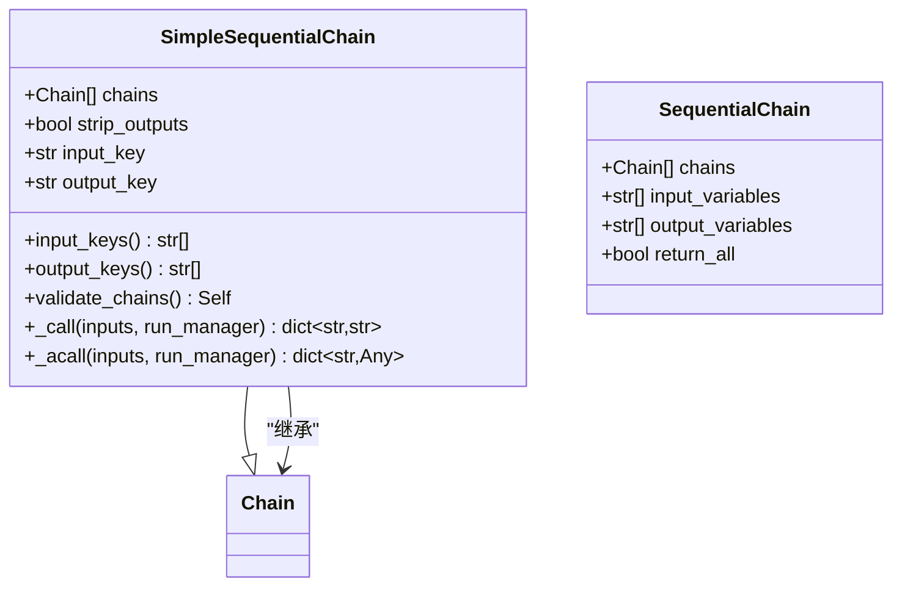
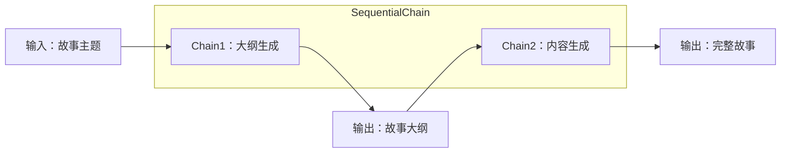
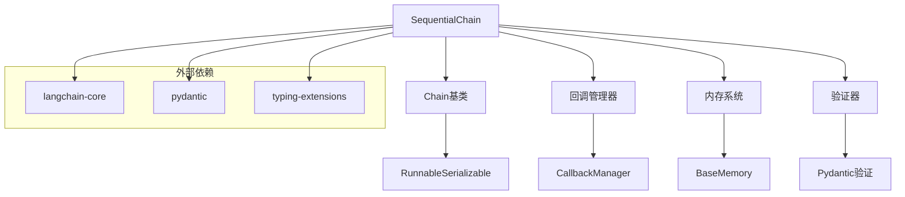

# SequentialChain

<cite>
**本文档中引用的文件**
- [sequential.py](file://libs/langchain/langchain_classic/chains/sequential.py)
- [test_sequential.py](file://libs/langchain/tests/unit_tests/chains/test_sequential.py)
- [base.py](file://libs/langchain/langchain_classic/chains/base.py)
- [llm_summarization_checker/base.py](file://libs/langchain/langchain_classic/chains/llm_summarization_checker/base.py)
- [__init__.py](file://libs/langchain/langchain_classic/chains/sequential.py)
</cite>

## 目录
1. [简介](#简介)
2. [项目结构](#项目结构)
3. [核心组件](#核心组件)
4. [架构概览](#架构概览)
5. [详细组件分析](#详细组件分析)
6. [依赖关系分析](#依赖关系分析)
7. [性能考虑](#性能考虑)
8. [故障排除指南](#故障排除指南)
9. [结论](#结论)

## 简介

SequentialChain是LangChain框架中的一个重要组件，它允许将多个独立的Chain按顺序连接起来，形成一个工作流。在这种模式下，前一个Chain的输出会自动作为后一个Chain的输入，从而实现复杂的多步骤处理流程。

SequentialChain特别适用于需要多个处理阶段的场景，例如：
- 文本生成流水线：先生成大纲，再生成完整内容
- 数据处理管道：数据清洗、转换、分析等多个步骤
- 多轮对话系统：上下文理解、意图识别、响应生成等

## 项目结构

SequentialChain位于LangChain的经典链模块中，其文件组织结构如下：



**图表来源**
- [sequential.py](file://libs/langchain/langchain_classic/chains/sequential.py#L1-L221)
- [base.py](file://libs/langchain/langchain_classic/chains/base.py#L1-L199)

**章节来源**
- [sequential.py](file://libs/langchain/langchain_classic/chains/sequential.py#L1-L221)
- [base.py](file://libs/langchain/langchain_classic/chains/base.py#L1-L199)

## 核心组件

SequentialChain的核心功能围绕三个主要参数展开：

### 主要参数

| 参数名 | 类型 | 描述 | 必需性 |
|--------|------|------|--------|
| `chains` | `list[Chain]` | 要连接的Chain列表，按执行顺序排列 | 必需 |
| `input_variables` | `list[str]` | 输入变量名称列表 | 必需 |
| `output_variables` | `list[str]` | 输出变量名称列表 | 可选 |
| `return_all` | `bool` | 是否返回所有中间变量 | 可选 |

### 工作原理

SequentialChain的工作机制可以概括为以下步骤：

1. **输入验证**：检查所有Chain的输入需求是否得到满足
2. **变量传播**：将前一个Chain的输出作为下一个Chain的输入
3. **结果收集**：收集最终的输出变量并返回

**章节来源**
- [sequential.py](file://libs/langchain/langchain_classic/chains/sequential.py#L15-L125)

## 架构概览

SequentialChain采用链式调用模式，支持同步和异步两种执行方式：



**图表来源**
- [sequential.py](file://libs/langchain/langchain_classic/chains/sequential.py#L95-L125)

## 详细组件分析

### SequentialChain类分析

SequentialChain是主要的实现类，提供了完整的多Chain连接功能：

#### 核心特性



**图表来源**
- [sequential.py](file://libs/langchain/langchain_classic/chains/sequential.py#L15-L125)
- [base.py](file://libs/langchain/langchain_classic/chains/base.py#L50-L150)

#### 验证机制

SequentialChain实现了严格的输入输出验证：

1. **输入变量验证**：确保所有Chain所需的输入变量都已提供
2. **输出冲突检测**：防止Chain之间产生重复的输出键
3. **内存兼容性检查**：确保内存变量与输入变量不冲突

#### 执行流程



**图表来源**
- [sequential.py](file://libs/langchain/langchain_classic/chains/sequential.py#L95-L125)

**章节来源**
- [sequential.py](file://libs/langchain/langchain_classic/chains/sequential.py#L15-L125)

### SimpleSequentialChain类分析

SimpleSequentialChain是SequentialChain的简化版本，专为单输入单输出的简单场景设计：

#### 设计特点



**图表来源**
- [sequential.py](file://libs/langchain/langchain_classic/chains/sequential.py#L128-L221)

#### 限制与优势

| 特性 | SequentialChain | SimpleSequentialChain |
|------|----------------|---------------------|
| 输入数量 | 支持多个输入变量 | 仅支持单个输入 |
| 输出数量 | 支持多个输出变量 | 仅支持单个输出 |
| 复杂度 | 更灵活但更复杂 | 简单易用 |
| 性能 | 更高效 | 稍低效 |
| 使用场景 | 复杂多步骤流程 | 简单线性流程 |

**章节来源**
- [sequential.py](file://libs/langchain/langchain_classic/chains/sequential.py#L128-L221)

### 实际应用示例

#### 故事生成流水线示例

假设我们需要构建一个故事生成流水线，分为两个步骤：

1. **故事大纲生成**：根据主题生成故事结构
2. **完整故事生成**：基于大纲生成详细内容



**图表来源**
- [test_sequential.py](file://libs/langchain/tests/unit_tests/chains/test_sequential.py#L46-L80)

#### 具体实现步骤

1. **定义Chain1（大纲生成）**：
   - 输入：故事主题
   - 输出：故事大纲结构

2. **定义Chain2（内容生成）**：
   - 输入：故事大纲
   - 输出：完整故事内容

3. **创建SequentialChain**：
   ```python
   # 创建SequentialChain实例
   story_chain = SequentialChain(
       chains=[outline_chain, content_chain],
       input_variables=["story_topic"],
       output_variables=["full_story"]
   )
   ```

**章节来源**
- [test_sequential.py](file://libs/langchain/tests/unit_tests/chains/test_sequential.py#L46-L80)

## 依赖关系分析

SequentialChain的依赖关系体现了LangChain的整体架构设计：



**图表来源**
- [sequential.py](file://libs/langchain/langchain_classic/chains/sequential.py#L1-L15)
- [base.py](file://libs/langchain/langchain_classic/chains/base.py#L1-L50)

**章节来源**
- [sequential.py](file://libs/langchain/langchain_classic/chains/sequential.py#L1-L15)
- [base.py](file://libs/langchain/langchain_classic/chains/base.py#L1-L50)

## 性能考虑

### 性能优势

1. **串行执行优化**：SequentialChain采用串行执行模式，避免了并行处理的复杂性
2. **内存效率**：只保留必要的中间变量，减少内存占用
3. **错误隔离**：每个Chain独立执行，错误不会影响其他Chain

### 潜在性能瓶颈

1. **链式延迟累积**：每个Chain的执行时间会累积
2. **网络I/O等待**：如果Chain涉及外部API调用，网络延迟会影响整体性能
3. **内存限制**：大量中间数据可能导致内存压力

### 优化建议

1. **并行化非依赖Chain**：对于无依赖的Chain可以考虑并行执行
2. **缓存中间结果**：对重复计算的结果进行缓存
3. **异步执行**：利用异步方法提高I/O密集型操作的效率

## 故障排除指南

### 常见错误及解决方案

#### 1. 输入变量缺失错误

**错误信息**：`Value error, Missing required input keys: {'variable_name'}`

**原因**：Chain所需的输入变量未提供

**解决方案**：
- 检查`input_variables`参数是否包含所有必需变量
- 确保输入字典包含所有必需的键

#### 2. 输出变量冲突错误

**错误信息**：`Value error, Chain returned keys that already exist`

**原因**：多个Chain产生了相同的输出键

**解决方案**：
- 重命名Chain的输出变量
- 使用不同的输出键名

#### 3. 内存变量冲突

**错误信息**：`Value error, The input key(s) xxx are found in the Memory keys`

**原因**：输入变量与内存变量重叠

**解决方案**：
- 修改输入变量名称
- 调整内存变量配置

**章节来源**
- [test_sequential.py](file://libs/langchain/tests/unit_tests/chains/test_sequential.py#L142-L169)
- [sequential.py](file://libs/langchain/langchain_classic/chains/sequential.py#L40-L95)

## 结论

SequentialChain是LangChain框架中实现复杂工作流的重要工具。它通过将多个独立的Chain按顺序连接，为开发者提供了构建多步骤处理流程的强大能力。

### 主要优势

1. **灵活性**：支持多种输入输出组合
2. **可扩展性**：可以轻松添加新的处理步骤
3. **可靠性**：完善的错误处理和验证机制
4. **可观测性**：支持回调和监控

### 适用场景

- 文本生成流水线
- 数据处理管道
- 多轮对话系统
- 复杂业务流程

### 最佳实践

1. **合理设计Chain边界**：每个Chain应有明确的职责
2. **适当的错误处理**：为每个Chain实现错误恢复机制
3. **性能监控**：关注每个Chain的执行时间和资源消耗
4. **测试覆盖**：为整个流水线编写全面的测试用例

SequentialChain的设计体现了LangChain框架的核心理念：通过简单的组合构建复杂的系统。无论是简单的线性流程还是复杂的多分支工作流，SequentialChain都能提供可靠的解决方案。