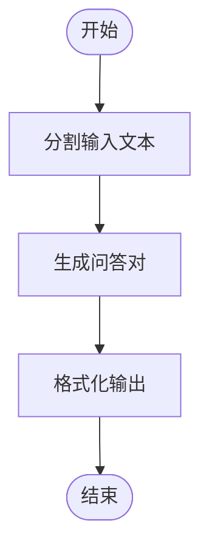
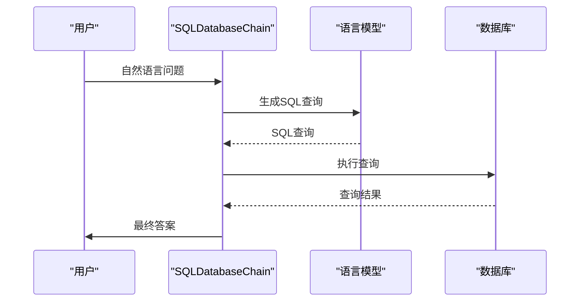
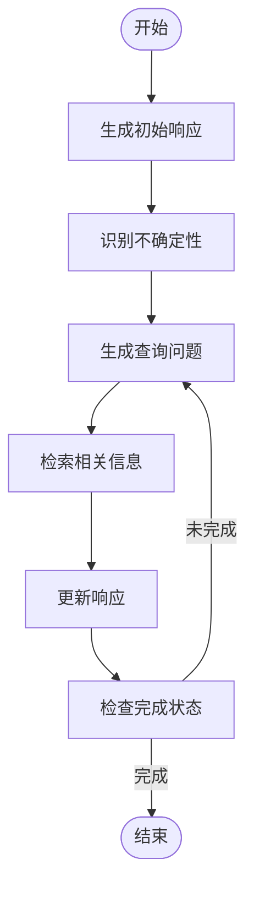
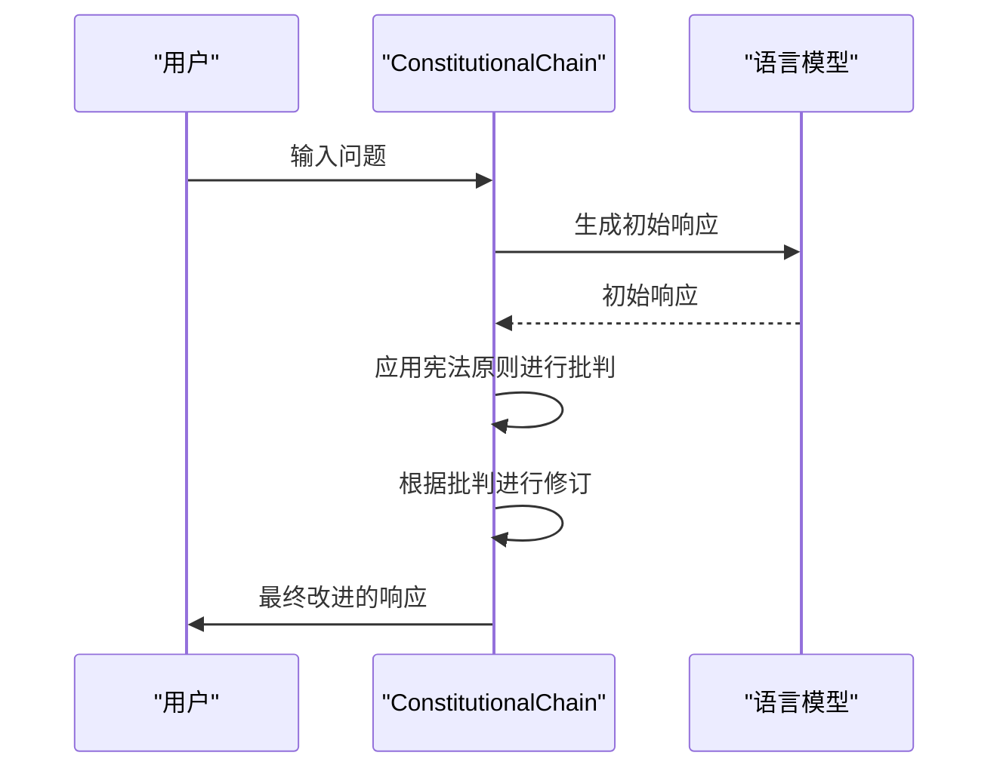
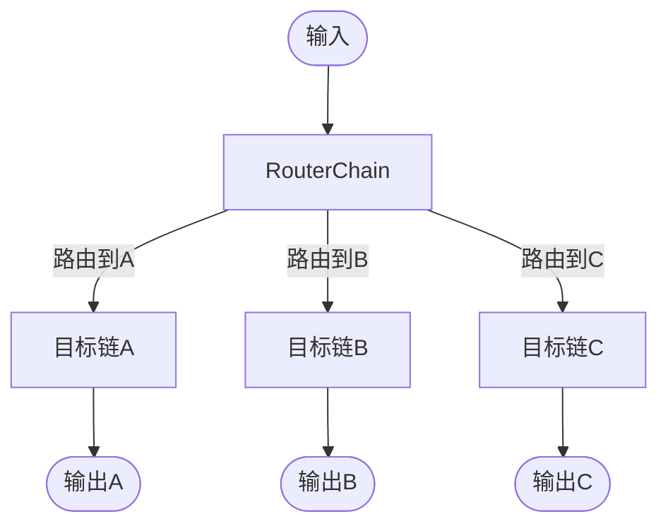
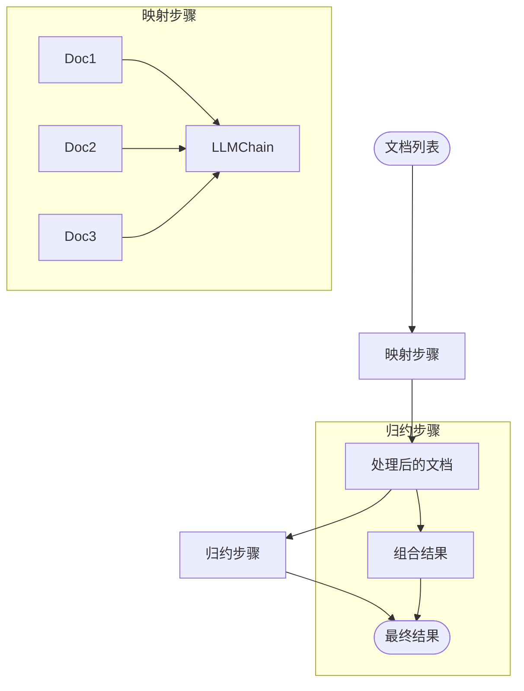

# 其他Chains

<cite>
**本文档中引用的文件**  
- [conversation/__init__.py](file://libs/langchain/langchain_classic/chains/conversation/__init__.py)
- [qa_generation/base.py](file://libs/langchain/langchain_classic/chains/qa_generation/base.py)
- [sql_database/query.py](file://libs/langchain/langchain_classic/chains/sql_database/query.py)
- [transform.py](file://libs/langchain/langchain_classic/chains/transform.py)
- [flare/base.py](file://libs/langchain/langchain_classic/chains/flare/base.py)
- [constitutional_ai/base.py](file://libs/langchain/langchain_classic/chains/constitutional_ai/base.py)
- [router/base.py](file://libs/langchain/langchain_classic/chains/router/base.py)
- [combine_documents/map_reduce.py](file://libs/langchain/langchain_classic/chains/combine_documents/map_reduce.py)
</cite>

## 目录
1. [引言](#引言)
2. [ConversationChain](#conversationchain)
3. [QAGenerationChain](#qagenerationchain)
4. [SQLDatabaseChain](#sqldatabasechain)
5. [TransformChain](#transformchain)
6. [FlareChain](#flarechain)
7. [ConstitutionalChain](#constitutionalchain)
8. [RouterChain](#routerchain)
9. [MapReduceDocumentsChain](#mapreducedocumentschain)
10. [总结](#总结)

## 引言
LangChain提供了多种专用Chains来解决特定的自然语言处理任务。除了常见的LLMChain、SequentialChain和RetrievalQAChain之外，还有许多其他Chains可以处理对话管理、问答生成、数据库查询等复杂场景。本文档将详细介绍这些重要的Chains，包括它们的定义、应用场景和实现原理，帮助开发者根据具体需求选择合适的工具。

## ConversationChain

`ConversationChain`是一种用于管理对话历史的Chain，它能够维护和利用对话上下文来生成更连贯和上下文相关的响应。该Chain通过将对话历史作为输入的一部分，使语言模型能够理解对话的上下文，从而产生更自然的对话体验。

**典型应用场景**：
- 聊天机器人和虚拟助手
- 客户服务对话系统
- 多轮对话交互应用

**核心组件**：
- LLM：用于生成对话响应的语言模型
- 内存：用于存储和管理对话历史
- 提示模板：定义如何将对话历史整合到输入中

**Section sources**
- [conversation/__init__.py](file://libs/langchain/langchain_classic/chains/conversation/__init__.py)

## QAGenerationChain

`QAGenerationChain`是一种用于自动生成问答对的Chain，它可以从给定的文本内容中生成相关的问答对。该Chain特别适用于创建教育内容、测试题库或知识库的自动化构建。

**典型应用场景**：
- 教育内容自动化生成
- 知识库构建和维护
- 测试题库创建

**核心组件**：
- LLMChain：用于生成问答对的核心链
- TextSplitter：用于将长文本分割成可处理的块
- PromptTemplate：定义生成问答对的提示格式

**Diagram sources**
- [qa_generation/base.py](file://libs/langchain/langchain_classic/chains/qa_generation/base.py)

**Section sources**
- [qa_generation/base.py](file://libs/langchain/langchain_classic/chains/qa_generation/base.py)

## SQLDatabaseChain

`SQLDatabaseChain`是一种将自然语言问题转换为SQL查询并执行的Chain，它能够连接到数据库并执行生成的SQL查询来获取答案。该Chain通过将自然语言理解与数据库查询相结合，实现了自然语言到数据库查询的无缝转换。

**典型应用场景**：
- 自然语言数据库查询接口
- 商业智能和数据分析
- 数据库管理工具

**核心组件**：
- BaseLanguageModel：用于生成SQL查询的语言模型
- SQLDatabase：数据库连接和操作接口
- BasePromptTemplate：定义SQL生成的提示模板

**Diagram sources**
- [sql_database/query.py](file://libs/langchain/langchain_classic/chains/sql_database/query.py)

**Section sources**
- [sql_database/query.py](file://libs/langchain/langchain_classic/chains/sql_database/query.py)

## TransformChain

`TransformChain`是一种运行任意Python函数的Chain，它允许开发者将自定义的转换逻辑集成到LangChain的工作流中。该Chain通过提供一个灵活的接口，使开发者能够实现各种数据转换和处理功能。

**典型应用场景**：
- 数据预处理和清洗
- 自定义数据转换逻辑
- 集成现有Python函数到工作流

**核心组件**：
- transform_cb：同步转换函数回调
- atransform_cb：异步转换函数回调
- input_variables：输入变量列表
- output_variables：输出变量列表

**Diagram sources**
- [transform.py](file://libs/langchain/langchain_classic/chains/transform.py)

**Section sources**
- [transform.py](file://libs/langchain/langchain_classic/chains/transform.py)

## FlareChain

`FlareChain`是一种结合了检索器、问题生成器和响应生成器的Chain，它基于主动检索增强生成（Active Retrieval Augmented Generation）方法。该Chain通过识别响应中的低置信度部分并生成相关问题来检索更多信息，从而提高回答的准确性和完整性。

**典型应用场景**：
- 复杂问题回答系统
- 知识密集型问答
- 需要高准确性的信息检索

**核心组件**：
- retriever：用于检索相关文档的检索器
- question_generator_chain：生成查询问题的链
- response_chain：生成最终响应的链
- output_parser：解析输出并确定是否完成

**Diagram sources**
- [flare/base.py](file://libs/langchain/langchain_classic/chains/flare/base.py)

**Section sources**
- [flare/base.py](file://libs/langchain/langchain_classic/chains/flare/base.py)

## ConstitutionalChain

`ConstitutionalChain`是一种基于宪法AI方法的Chain，它通过自我批判来改进语言模型的输出。该Chain运行自我批判，根据宪法原则对初始响应进行评估和修订，从而提高输出的质量和安全性。

**典型应用场景**：
- 提高AI输出的安全性
- 减少有害或不道德内容
- 改进回答质量

**核心组件**：
- chain：基础LLMChain用于生成初始响应
- constitutional_principles：宪法原则列表
- critique_chain：用于生成批判的链
- revision_chain：用于修订响应的链

**Diagram sources**
- [constitutional_ai/base.py](file://libs/langchain/langchain_classic/chains/constitutional_ai/base.py)

**Section sources**
- [constitutional_ai/base.py](file://libs/langchain/langchain_classic/chains/constitutional_ai/base.py)

## RouterChain

`RouterChain`是一种用于链路由的基础类，它能够根据输入将请求路由到不同的目标链。该Chain通过一个路由机制，将输入分配给最适合处理该输入的特定链，实现了灵活的请求分发。

**典型应用场景**：
- 多任务处理系统
- 智能路由和分发
- 模块化AI系统

**核心组件**：
- RouterChain：基础路由链
- MultiRouteChain：多路由链实现
- Route：路由结果命名元组
- destination_chains：目标链映射

**Diagram sources**
- [router/base.py](file://libs/langchain/langchain_classic/chains/router/base.py)

**Section sources**
- [router/base.py](file://libs/langchain/langchain_classic/chains/router/base.py)

## MapReduceDocumentsChain

`MapReduceDocumentsChain`是一种通过先映射后归约的方式组合文档的Chain，它首先对每个文档应用一个链（映射步骤），然后将结果组合起来（归约步骤）。该Chain特别适用于处理大量文档的摘要和信息提取任务。

**典型应用场景**：
- 大规模文档摘要
- 信息聚合和提取
- 分布式数据处理

**核心组件**：
- llm_chain：应用于每个文档的链
- reduce_documents_chain：用于归约结果的链
- document_variable_name：文档变量名
- return_intermediate_steps：是否返回中间步骤

**Diagram sources**
- [combine_documents/map_reduce.py](file://libs/langchain/langchain_classic/chains/combine_documents/map_reduce.py)

**Section sources**
- [combine_documents/map_reduce.py](file://libs/langchain/langchain_classic/chains/combine_documents/map_reduce.py)

## 总结
LangChain提供了丰富的专用Chains来满足不同的应用场景需求。从对话管理到问答生成，从数据库查询到文档处理，这些Chains利用LangChain的核心组件（如LLM、内存、工具）解决了特定的问题。开发者可以根据具体需求选择合适的Chain，构建高效和智能的应用系统。通过理解和掌握这些Chains的特性和应用场景，可以更好地利用LangChain框架开发复杂的自然语言处理应用。