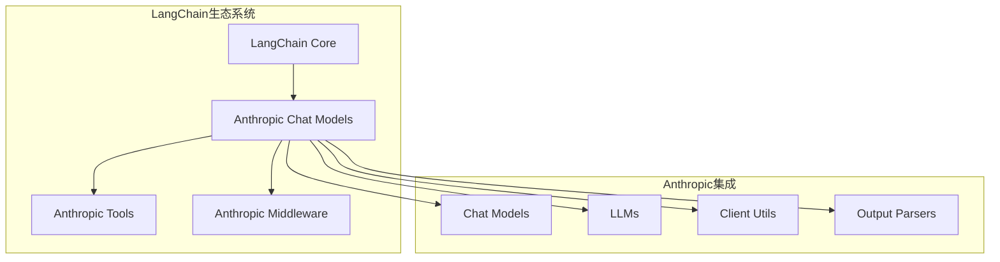
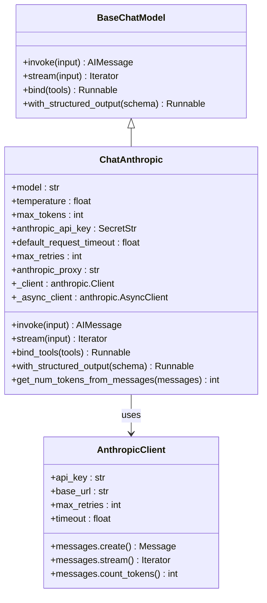
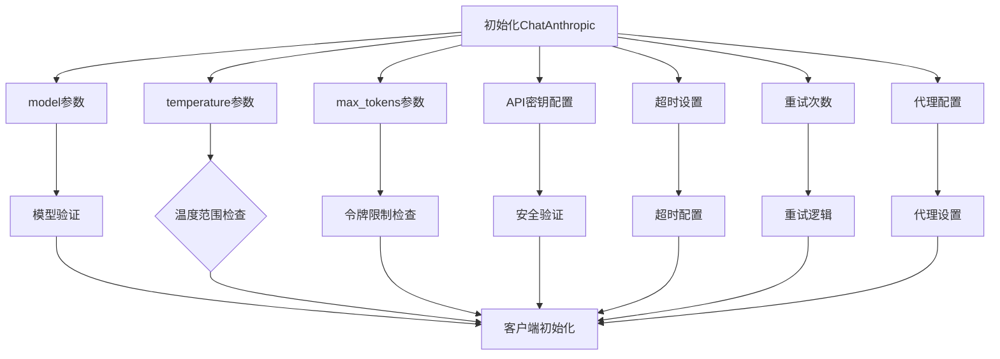
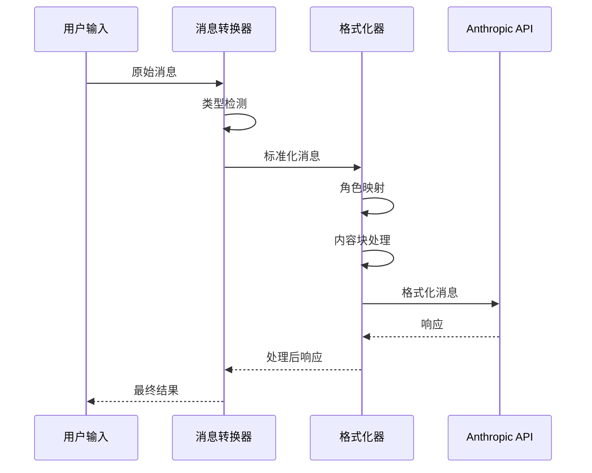
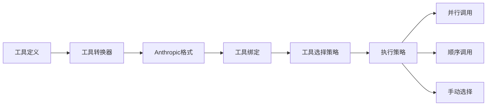
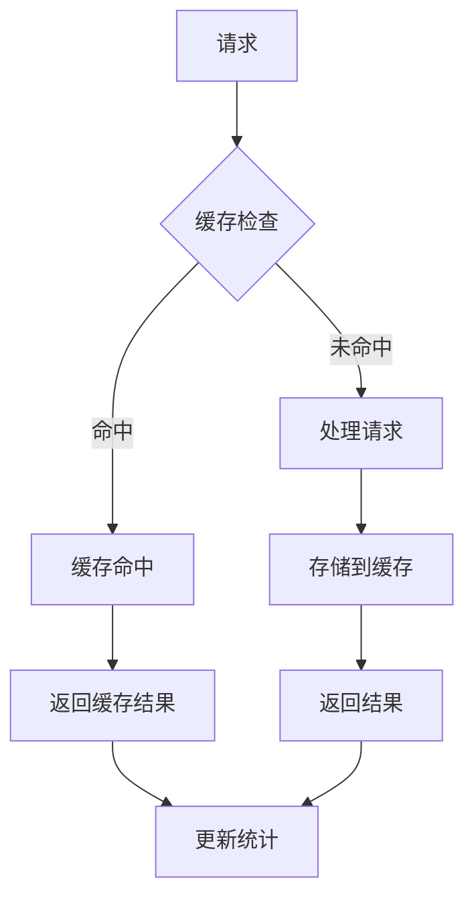
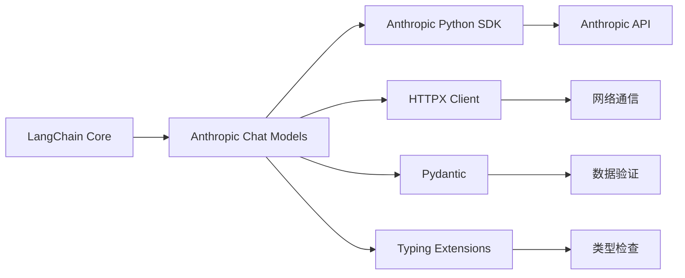
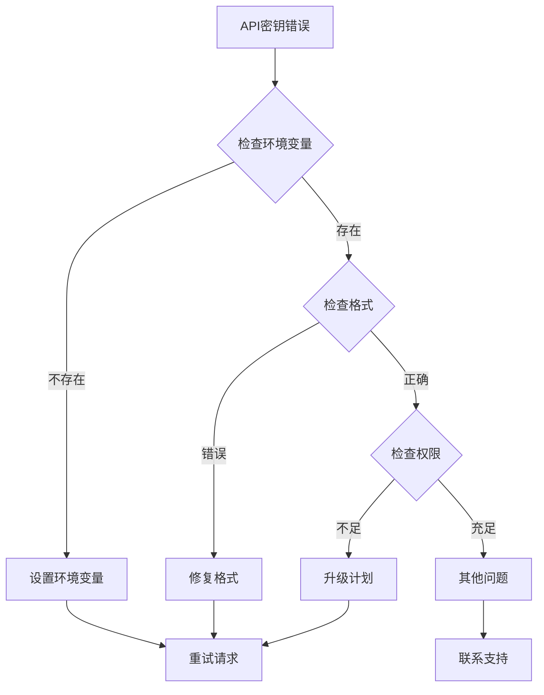

# Anthropic Chat Model

<cite>
**本文档中引用的文件**
- [chat_models.py](file://libs/partners/anthropic/langchain_anthropic/chat_models.py)
- [test_chat_models.py](file://libs/partners/anthropic/tests/unit_tests/test_chat_models.py)
- [README.md](file://libs/partners/anthropic/README.md)
- [llms.py](file://libs/partners/anthropic/langchain_anthropic/llms.py)
- [_client_utils.py](file://libs/partners/anthropic/langchain_anthropic/_client_utils.py)
- [rate_limiters.py](file://libs/core/langchain_core/rate_limiters.py)
</cite>

## 目录
1. [简介](#简介)
2. [项目结构](#项目结构)
3. [核心组件](#核心组件)
4. [架构概览](#架构概览)
5. [详细组件分析](#详细组件分析)
6. [依赖关系分析](#依赖关系分析)
7. [性能考虑](#性能考虑)
8. [故障排除指南](#故障排除指南)
9. [结论](#结论)

## 简介

LangChain中的Anthropic Chat Model是一个强大的集成模块，允许开发者通过`langchain.chat_models.Anthropic`类与Anthropic的Claude系列大语言模型进行无缝交互。该模块提供了完整的API封装，支持多种Claude模型，包括最新的Claude-3.7、Claude-3.5和Claude-4系列。

该集成不仅支持基本的文本对话功能，还提供了先进的特性如工具调用、结构化输出、流式响应、提示缓存、扩展思考模式和引用功能。通过精心设计的架构，它能够处理复杂的多模态输入（文本、图像、PDF文件）并提供详细的使用统计信息。

## 项目结构

Anthropic Chat Model在LangChain生态系统中的组织结构体现了模块化设计原则：

**图表来源**
- [chat_models.py](file://libs/partners/anthropic/langchain_anthropic/chat_models.py#L1-L50)
- [llms.py](file://libs/partners/anthropic/langchain_anthropic/llms.py#L1-L30)

**章节来源**
- [README.md](file://libs/partners/anthropic/README.md#L1-L23)

## 核心组件

### ChatAnthropic类

`ChatAnthropic`是Anthropic集成的核心类，继承自`BaseChatModel`，提供了与Claude模型交互的完整接口。该类的设计遵循LangChain的统一接口标准，确保了与其他模型提供商的一致性体验。

主要特性包括：
- **模型选择**：支持所有Claude系列模型，从Claude-3-Haiku到最新的Claude-4系列
- **配置灵活性**：提供丰富的初始化参数，包括温度控制、最大令牌数、超时设置等
- **认证安全**：支持环境变量和显式API密钥配置，使用`SecretStr`保护敏感信息
- **异步支持**：同时支持同步和异步操作模式

### 模型映射系统

系统内置了智能的模型默认值映射，根据模型名称自动确定合适的最大输出令牌数：

| 模型系列 | 默认最大令牌数 |
|---------|---------------|
| Claude-4 Opus | 32,000 |
| Claude-4 Sonnet | 64,000 |
| Claude-3.7 Sonnet | 64,000 |
| Claude-3.5 Sonnet | 8,192 |
| Claude-3.5 Haiku | 8,192 |
| Claude-3 Haiku | 4,096 |

**章节来源**
- [chat_models.py](file://libs/partners/anthropic/langchain_anthropic/chat_models.py#L87-L110)

## 架构概览

Anthropic Chat Model采用分层架构设计，确保了可扩展性和维护性：

**图表来源**
- [chat_models.py](file://libs/partners/anthropic/langchain_anthropic/chat_models.py#L565-L600)
- [chat_models.py](file://libs/partners/anthropic/langchain_anthropic/chat_models.py#L1591-L1620)

## 详细组件分析

### 初始化参数配置

#### 基础配置参数

ChatAnthropic类提供了丰富的初始化参数来满足不同的使用场景：

**图表来源**
- [chat_models.py](file://libs/partners/anthropic/langchain_anthropic/chat_models.py#L565-L600)
- [test_chat_models.py](file://libs/partners/anthropic/tests/unit_tests/test_chat_models.py#L25-L50)

#### API密钥认证机制

系统支持多种API密钥配置方式，确保了安全性和便利性：

1. **环境变量配置**：推荐方式，使用`ANTHROPIC_API_KEY`环境变量
2. **显式参数传递**：通过`anthropic_api_key`参数直接传入
3. **SecretStr类型保护**：使用`SecretStr`包装API密钥，防止意外泄露

#### 超时和重试机制

系统实现了智能的超时和重试策略：

- **默认超时**：无默认超时，可根据需要设置
- **最大重试次数**：可配置，默认为2次
- **指数退避**：实现指数退避算法处理网络问题

**章节来源**
- [chat_models.py](file://libs/partners/anthropic/langchain_anthropic/chat_models.py#L1591-L1620)
- [test_chat_models.py](file://libs/partners/anthropic/tests/unit_tests/test_chat_models.py#L25-L50)

### 对话消息处理

#### 消息格式转换

系统提供了强大的消息格式转换功能，支持多种输入格式：

**图表来源**
- [chat_models.py](file://libs/partners/anthropic/langchain_anthropic/chat_models.py#L150-L200)

#### 流式响应处理

系统支持高效的流式响应处理，提供实时的响应生成体验：

- **增量内容传输**：支持文本、工具调用、思考过程等不同类型的内容
- **使用统计更新**：在流式过程中实时更新令牌使用情况
- **错误处理**：完善的错误捕获和恢复机制

**章节来源**
- [chat_models.py](file://libs/partners/anthropic/langchain_anthropic/chat_models.py#L652-L686)

### 工具调用功能

#### 工具绑定机制

ChatAnthropic提供了灵活的工具调用功能：

**图表来源**
- [chat_models.py](file://libs/partners/anthropic/langchain_anthropic/chat_models.py#L2000-L2100)

#### 结构化输出支持

系统支持多种结构化输出格式：

- **Pydantic模型**：自动验证和类型检查
- **JSON模式**：灵活的JSON Schema支持
- **OpenAI函数格式**：兼容OpenAI的函数调用格式

**章节来源**
- [chat_models.py](file://libs/partners/anthropic/langchain_anthropic/chat_models.py#L2100-L2300)

### 高级功能特性

#### 提示缓存机制

为了提高效率和降低成本，系统实现了智能的提示缓存：

**图表来源**
- [chat_models.py](file://libs/partners/anthropic/langchain_anthropic/chat_models.py#L1134-L1180)

#### 扩展思考模式

某些Claude模型支持扩展思考功能，可以输出推理过程：

- **思考预算**：可配置的思考令牌预算
- **推理跟踪**：完整的推理步骤记录
- **版本兼容性**：不同模型版本的差异处理

**章节来源**
- [chat_models.py](file://libs/partners/anthropic/langchain_anthropic/chat_models.py#L951-L985)

#### 引用功能

系统支持引用功能，允许Claude基于提供的文档生成引用：

- **文档嵌入**：支持多种文档格式
- **引用生成**：自动生成准确的引用标记
- **上下文管理**：智能的上下文处理

**章节来源**
- [chat_models.py](file://libs/partners/anthropic/langchain_anthropic/chat_models.py#L985-L1020)

### 多模态输入支持

#### 图像输入处理

系统支持多种图像输入格式：

- **Base64编码**：支持Base64格式的图像数据
- **URL链接**：直接使用图像URL
- **文件上传**：通过Anthropic的文件API

#### PDF文档处理

对于PDF文档，系统提供了专门的处理流程：

- **内容提取**：自动提取PDF文本内容
- **格式保持**：保留原始文档格式信息
- **大小限制**：合理的文件大小限制

**章节来源**
- [chat_models.py](file://libs/partners/anthropic/langchain_anthropic/chat_models.py#L738-L800)

## 依赖关系分析

### 外部依赖

Anthropic Chat Model依赖于多个关键库：

**图表来源**
- [chat_models.py](file://libs/partners/anthropic/langchain_anthropic/chat_models.py#L1-L30)
- [_client_utils.py](file://libs/partners/anthropic/langchain_anthropic/_client_utils.py#L1-L20)

### 内部模块依赖

系统内部模块之间存在清晰的职责分离：

- **客户端工具**：负责HTTP客户端的创建和配置
- **消息格式化**：处理消息格式转换
- **错误处理**：统一的异常处理机制
- **输出解析**：结果格式化和解析

**章节来源**
- [chat_models.py](file://libs/partners/anthropic/langchain_anthropic/chat_models.py#L1-L50)

## 性能考虑

### 缓存策略

系统实现了多层次的缓存策略：

1. **客户端缓存**：HTTP客户端实例缓存
2. **请求缓存**：相同请求的结果缓存
3. **提示缓存**：重复提示的令牌缓存

### 并发处理

- **异步支持**：完全支持异步操作
- **连接池**：HTTP连接复用
- **并发限制**：可配置的并发请求限制

### 成本优化

- **令牌计数**：精确的令牌使用统计
- **缓存利用**：最大化缓存命中率
- **批量处理**：支持批量请求处理

## 故障排除指南

### 常见错误处理

#### API密钥问题

**图表来源**
- [chat_models.py](file://libs/partners/anthropic/langchain_anthropic/chat_models.py#L540-L560)

#### 网络连接问题

系统实现了智能的重试机制：

- **指数退避**：避免频繁重试导致的服务器压力
- **超时处理**：合理的超时设置
- **连接池管理**：高效的连接复用

#### 模型可用性问题

- **模型检查**：在初始化时验证模型可用性
- **降级策略**：备用模型的自动切换
- **错误报告**：详细的错误信息和建议

**章节来源**
- [chat_models.py](file://libs/partners/anthropic/langchain_anthropic/chat_models.py#L1847-L1873)

### 监控和调试

#### 使用统计

系统提供了详细的使用统计信息：

- **令牌使用**：输入、输出和总令牌数
- **缓存统计**：缓存命中率和节省的令牌数
- **响应时间**：请求处理时间和成功率

#### 日志记录

- **请求日志**：记录所有API请求
- **错误日志**：详细的错误信息
- **性能日志**：性能指标和瓶颈分析

## 结论

LangChain中的Anthropic Chat Model提供了一个功能强大且易于使用的接口，用于与Claude系列模型进行交互。通过其精心设计的架构，该模块不仅支持基本的对话功能，还提供了先进的特性如工具调用、结构化输出、流式响应和提示缓存。

该集成的主要优势包括：

1. **全面的功能覆盖**：从基础对话到高级特性如工具调用和结构化输出
2. **优秀的性能表现**：智能缓存和优化的网络处理
3. **强大的错误处理**：完善的异常管理和恢复机制
4. **灵活的配置选项**：丰富的初始化参数和运行时配置
5. **良好的扩展性**：模块化设计便于功能扩展和定制

对于开发者而言，这个集成提供了一个可靠、高效且功能丰富的解决方案，能够满足各种复杂的应用场景需求。无论是简单的文本对话还是复杂的多模态应用，Anthropic Chat Model都能够提供稳定而高性能的服务。

随着Claude模型的不断演进，这个集成也将持续更新以支持新的特性和优化，确保用户始终能够享受到最新的AI能力。