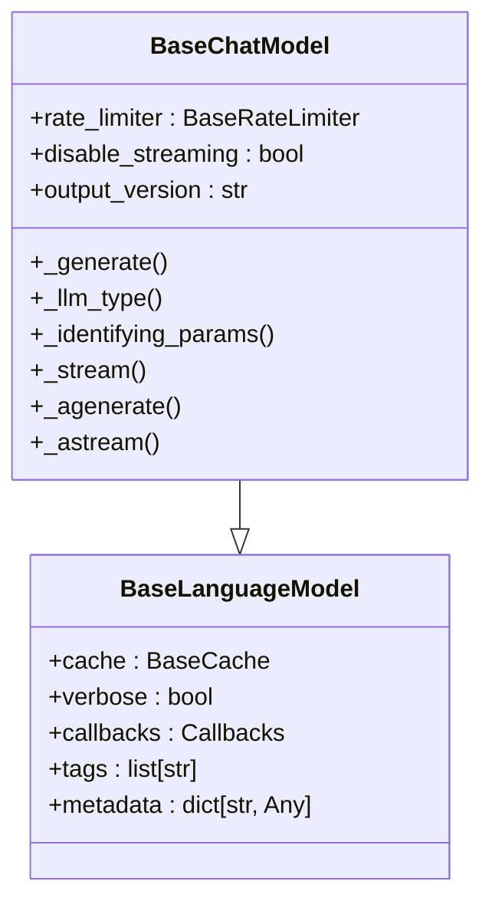
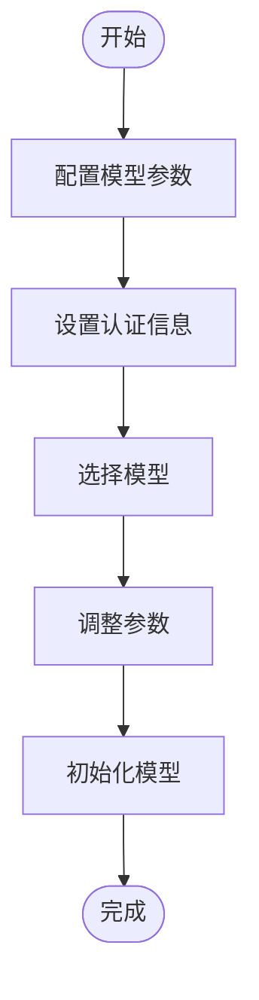
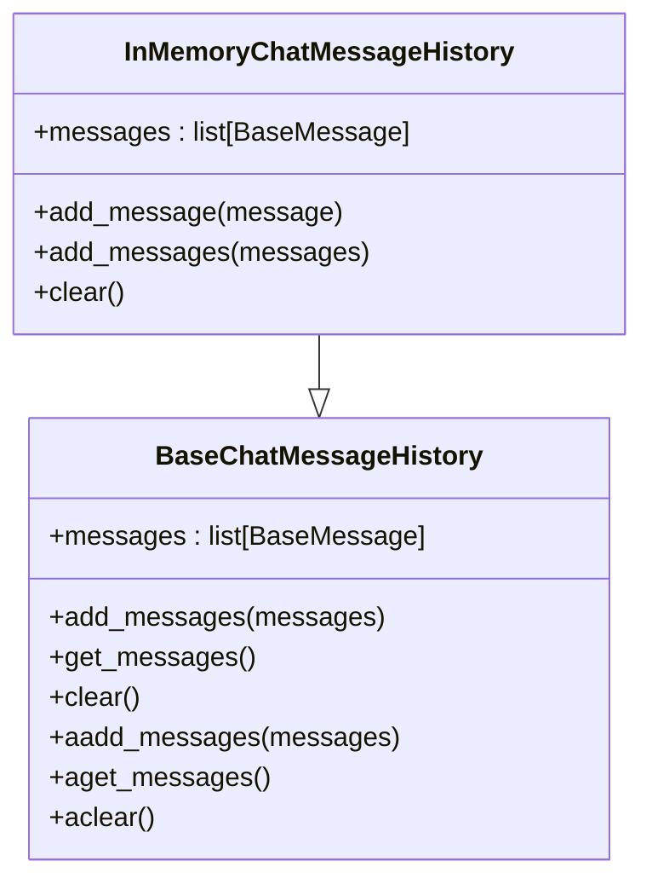
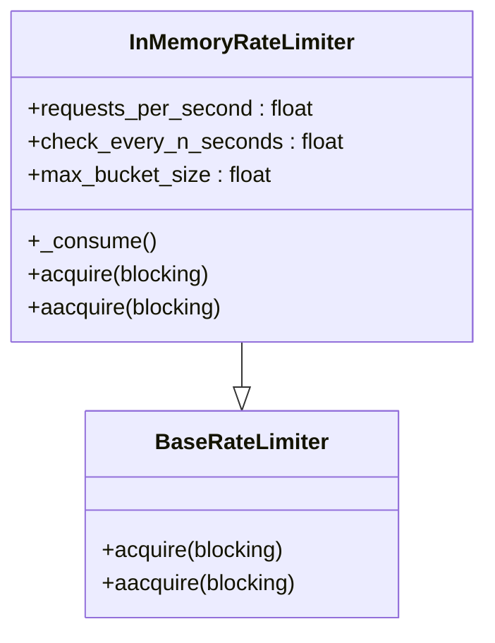

# Chat Models

<cite>
**本文档中引用的文件**
- [chat_models.py](file://libs/core/langchain_core/language_models/chat_models.py)
- [base.py](file://libs/core/langchain_core/language_models/base.py)
- [anthropic.py](file://libs/partners/anthropic/langchain_anthropic/chat_models.py)
- [rate_limiters.py](file://libs/core/langchain_core/rate_limiters.py)
- [chat_history.py](file://libs/core/langchain_core/chat_history.py)
</cite>

## 目录
1. [介绍](#介绍)
2. [核心功能](#核心功能)
3. [模型配置与初始化](#模型配置与初始化)
4. [消息历史管理](#消息历史管理)
5. [流式响应](#流式响应)
6. [系统提示设置](#系统提示设置)
7. [不同模型特性比较](#不同模型特性比较)
8. [错误处理与速率限制](#错误处理与速率限制)
9. [最佳实践](#最佳实践)

## 介绍

LangChain的Chat Models提供了一个统一的接口来封装各种大语言模型API，使得开发者能够以一致的方式进行对话式交互。这些模型不仅支持基本的文本生成，还提供了丰富的功能来管理对话上下文、处理流式响应以及配置系统级提示。通过Chat Models，开发者可以轻松地集成OpenAI、Anthropic、VertexAI等多种不同的大语言模型服务。

**Section sources**
- [chat_models.py](file://libs/core/langchain_core/language_models/chat_models.py#L1-L50)

## 核心功能

Chat Models的核心功能包括统一的API接口、消息历史管理、流式响应支持和系统提示设置。这些功能共同构成了一个强大而灵活的对话系统框架。`BaseChatModel`类作为所有具体实现的基础，定义了关键的抽象方法和属性，确保了不同模型之间的一致性。通过继承这个基类，具体的模型实现可以专注于特定API的细节，同时保持对外接口的统一。

**Diagram sources**
- [chat_models.py](file://libs/core/langchain_core/language_models/chat_models.py#L100-L200)
- [base.py](file://libs/core/langchain_core/language_models/base.py#L100-L150)

**Section sources**
- [chat_models.py](file://libs/core/langchain_core/language_models/chat_models.py#L1-L200)

## 模型配置与初始化

配置和初始化各种Chat Models是使用LangChain进行对话式AI开发的关键步骤。对于不同的模型提供商，如OpenAI、Anthropic和VertexAI，需要提供相应的认证信息、选择合适的模型并调整参数。例如，在初始化Anthropic模型时，可以通过环境变量或直接传递API密钥来进行身份验证。此外，还可以设置温度、最大输出令牌数等参数来控制生成文本的随机性和长度。

**Diagram sources**
- [anthropic.py](file://libs/partners/anthropic/langchain_anthropic/chat_models.py#L50-L100)
- [chat_models.py](file://libs/core/langchain_core/language_models/chat_models.py#L200-L250)

**Section sources**
- [anthropic.py](file://libs/partners/anthropic/langchain_anthropic/chat_models.py#L1-L150)

## 消息历史管理

有效的消息历史管理对于构建连贯的对话至关重要。LangChain提供了`BaseChatMessageHistory`抽象基类，允许开发者根据需求实现自定义的消息存储策略。`InMemoryChatMessageHistory`是一个简单的内存实现，适用于测试和开发环境。通过`add_messages`和`get_messages`方法，可以方便地添加和检索对话历史。此外，异步版本的方法（如`aget_messages`）也支持非阻塞操作，提高了应用的响应性能。

**Diagram sources**
- [chat_history.py](file://libs/core/langchain_core/chat_history.py#L50-L100)

**Section sources**
- [chat_history.py](file://libs/core/langchain_core/chat_history.py#L1-L150)

## 流式响应

流式响应功能允许客户端实时接收模型生成的内容，而不是等待整个响应完成。这在处理长文本生成时特别有用，因为它可以立即向用户展示部分内容，提高用户体验。`BaseChatModel`中的`stream`和`astream`方法分别提供了同步和异步的流式接口。通过检查回调处理器中是否存在`_StreamingCallbackHandler`，模型可以自动决定是否启用流式模式。此外，`disable_streaming`参数可以用来显式地禁用流式功能。

**Section sources**
- [chat_models.py](file://libs/core/langchain_core/language_models/chat_models.py#L500-L600)

## 系统提示设置

系统提示（System Prompt）是指导模型行为的重要机制。通过设置系统提示，可以定义模型的角色、语气和行为准则。在LangChain中，系统提示通常作为对话的初始消息被包含在消息序列中。例如，可以设置一个系统提示来指示模型扮演某个特定角色或遵循特定的格式要求。这种灵活性使得开发者能够精确控制模型的输出风格和内容。

**Section sources**
- [chat_models.py](file://libs/core/langchain_core/language_models/chat_models.py#L300-L350)

## 不同模型特性比较

不同的大语言模型具有各自独特的特性和优势。例如，Anthropic的Claude系列模型以其强大的推理能力和长上下文支持著称；而OpenAI的GPT系列则在广泛的任务上表现出色。成本考量也是选择模型时的重要因素，通常更复杂的模型会带来更高的计算开销和费用。开发者应根据具体应用场景的需求权衡性能、成本和可用性，选择最适合的模型。

**Section sources**
- [anthropic.py](file://libs/partners/anthropic/langchain_anthropic/chat_models.py#L200-L250)

## 错误处理与速率限制

健壮的错误处理和速率限制机制对于保证应用的稳定运行至关重要。LangChain通过`BaseRateLimiter`接口提供了灵活的速率控制方案。`InMemoryRateLimiter`是一个基于令牌桶算法的内存实现，可以在多线程环境中安全使用。当请求超过速率限制时，`acquire`方法可以选择阻塞直到有足够的令牌可用，或者立即返回失败状态。此外，异常处理机制能够捕获并记录API调用中的错误，便于后续分析和调试。

**Diagram sources**
- [rate_limiters.py](file://libs/core/langchain_core/rate_limiters.py#L50-L100)

**Section sources**
- [rate_limiters.py](file://libs/core/langchain_core/rate_limiters.py#L1-L150)

## 最佳实践

在使用LangChain的Chat Models时，遵循一些最佳实践可以帮助开发者构建更高效、可靠的应用。首先，合理利用缓存可以显著减少重复请求带来的延迟和成本。其次，通过配置适当的超时和重试策略，可以提高系统的容错能力。最后，监控和日志记录对于及时发现和解决问题至关重要。建议定期审查API使用情况和性能指标，以优化资源配置和提升用户体验。

**Section sources**
- [chat_models.py](file://libs/core/langchain_core/language_models/chat_models.py#L600-L700)
- [rate_limiters.py](file://libs/core/langchain_core/rate_limiters.py#L150-L200)