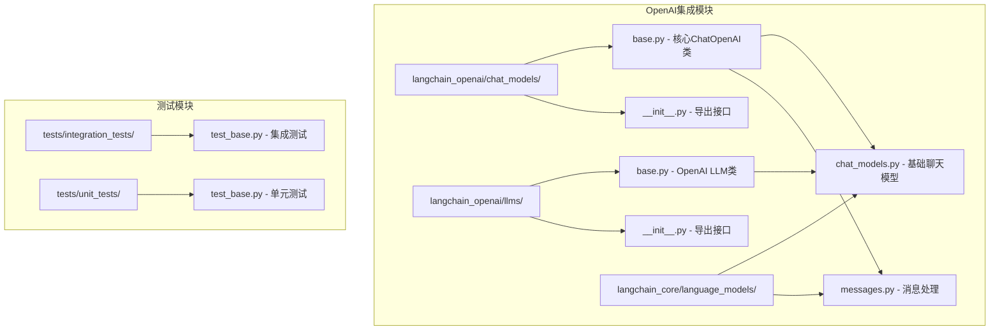
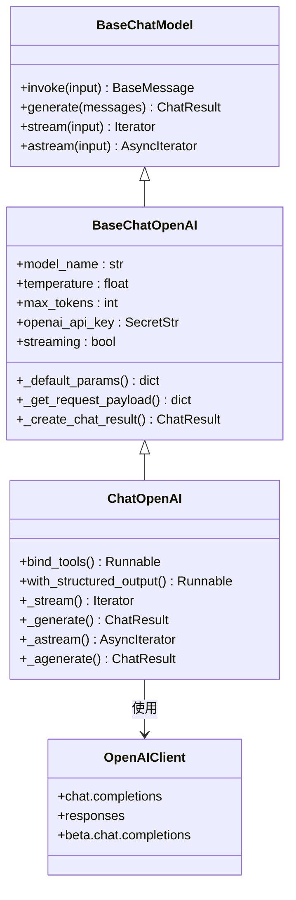
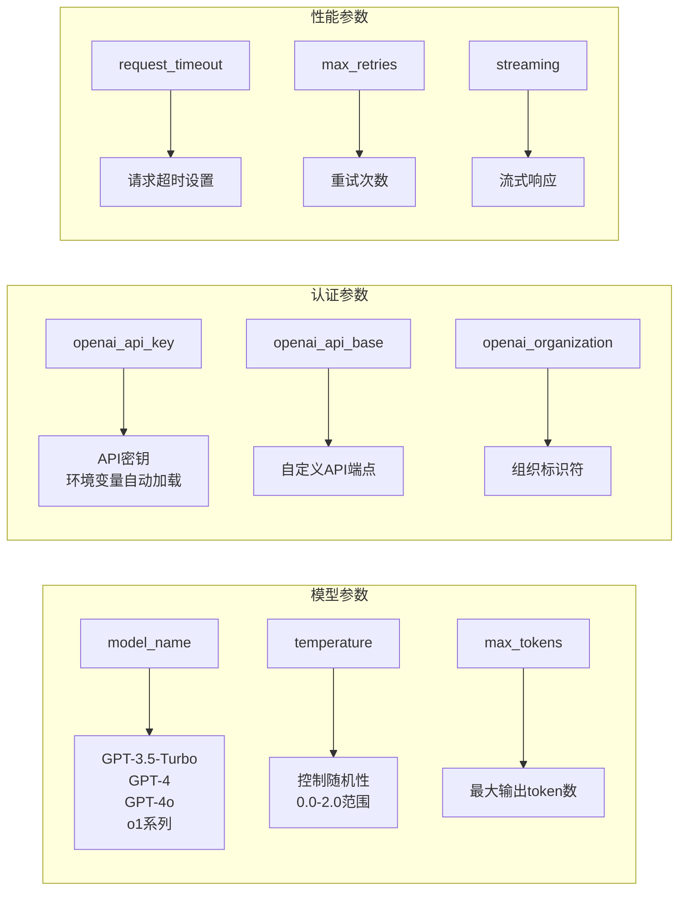
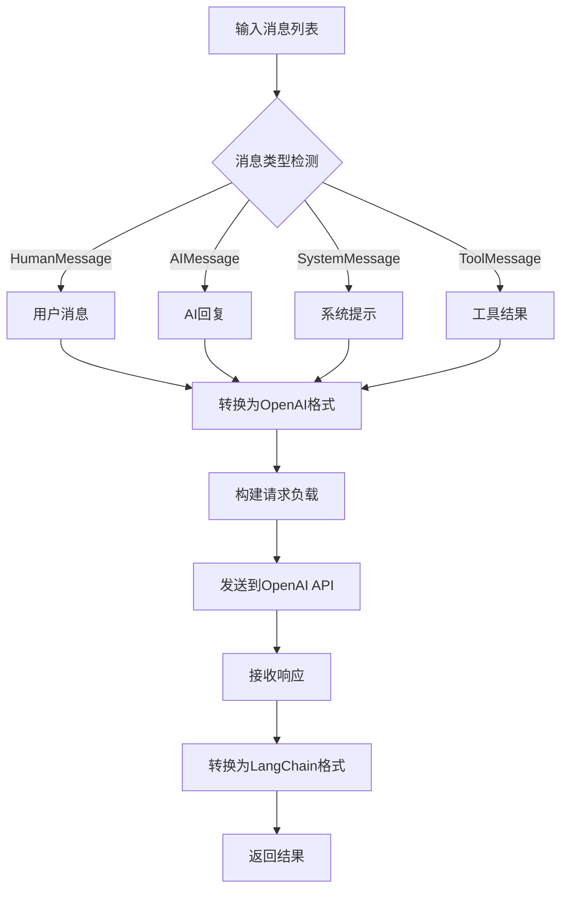
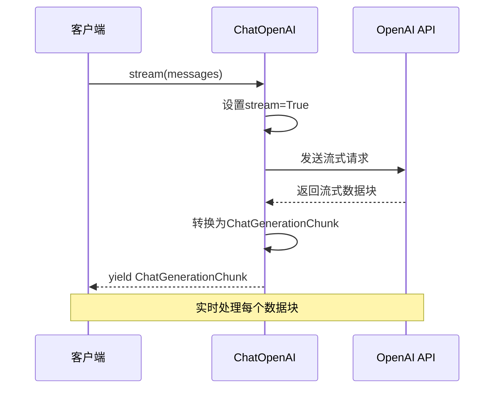
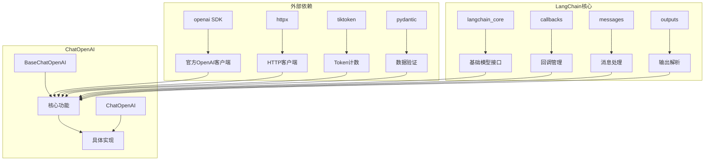
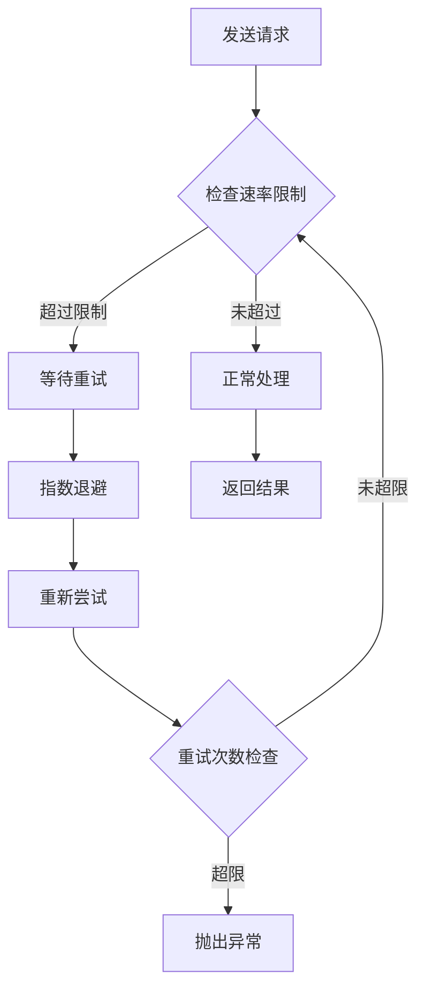

# OpenAI Chat Model

<cite>
**本文档中引用的文件**
- [base.py](file://libs/partners/openai/langchain_openai/chat_models/base.py)
- [__init__.py](file://libs/partners/openai/langchain_openai/chat_models/__init__.py)
- [test_base.py](file://libs/partners/openai/tests/integration_tests/chat_models/test_base.py)
- [test_base.py](file://libs/partners/openai/tests/unit_tests/chat_models/test_base.py)
- [rate_limiters.py](file://libs/core/langchain_core/rate_limiters.py)
</cite>

## 目录
1. [简介](#简介)
2. [项目结构](#项目结构)
3. [核心组件](#核心组件)
4. [架构概览](#架构概览)
5. [详细组件分析](#详细组件分析)
6. [依赖关系分析](#依赖关系分析)
7. [性能考虑](#性能考虑)
8. [故障排除指南](#故障排除指南)
9. [结论](#结论)

## 简介

LangChain中的OpenAI Chat Model是一个强大的集成模块，允许开发者通过`ChatOpenAI`类与OpenAI的GPT-3.5和GPT-4等大型语言模型进行交互。该模块提供了完整的聊天功能，支持多轮对话、流式响应、系统提示、工具调用等多种高级特性。

本文档将深入探讨`langchain.chat_models.OpenAI`类的各个方面，包括初始化参数配置、API密钥认证、错误处理机制、性能优化策略以及最佳实践。

## 项目结构

LangChain的OpenAI集成采用模块化设计，主要包含以下关键组件：



**图表来源**
- [base.py](file://libs/partners/openai/langchain_openai/chat_models/base.py#L1-L50)
- [__init__.py](file://libs/partners/openai/langchain_openai/chat_models/__init__.py#L1-L10)

**章节来源**
- [base.py](file://libs/partners/openai/langchain_openai/chat_models/base.py#L1-L100)
- [__init__.py](file://libs/partners/openai/langchain_openai/chat_models/__init__.py#L1-L10)

## 核心组件

### ChatOpenAI类概述

`ChatOpenAI`是LangChain中OpenAI聊天模型的主要实现类，继承自`BaseChatModel`，提供了完整的OpenAI API集成功能。

#### 主要特性

1. **多模型支持**：支持GPT-3.5、GPT-4、GPT-4o、o1系列等多种OpenAI模型
2. **灵活的初始化参数**：丰富的配置选项满足不同使用场景
3. **流式响应**：支持实时流式输出
4. **工具调用**：原生支持OpenAI的函数调用功能
5. **结构化输出**：支持JSON模式和Pydantic验证

**章节来源**
- [base.py](file://libs/partners/openai/langchain_openai/chat_models/base.py#L500-L600)

## 架构概览

OpenAI Chat Model采用分层架构设计，确保了良好的可扩展性和维护性：



**图表来源**
- [base.py](file://libs/partners/openai/langchain_openai/chat_models/base.py#L500-L700)
- [base.py](file://libs/core/langchain_core/language_models/chat_models.py#L1-L50)

## 详细组件分析

### 初始化参数配置

#### 核心参数详解

ChatOpenAI类提供了丰富的初始化参数，每个参数都有特定的作用和配置方式：



**图表来源**
- [base.py](file://libs/partners/openai/langchain_openai/chat_models/base.py#L500-L650)

#### API密钥认证方式

OpenAI Chat Model支持多种API密钥配置方式：

1. **环境变量（推荐）**：
   ```bash
   export OPENAI_API_KEY="your-api-key"
   ```

2. **直接传入字符串**：
   ```python
   model = ChatOpenAI(api_key="your-api-key")
   ```

3. **同步回调函数**：
   ```python
   def get_api_key() -> str:
       return "your-api-key"
   
   model = ChatOpenAI(api_key=get_api_key)
   ```

4. **异步回调函数**：
   ```python
   async def get_api_key() -> str:
       return "your-api-key"
   
   model = ChatOpenAI(api_key=get_api_key)
   ```

**章节来源**
- [base.py](file://libs/partners/openai/langchain_openai/chat_models/base.py#L550-L650)

### 多轮对话处理

#### 消息格式转换

ChatOpenAI能够智能处理不同类型的消息格式：



**图表来源**
- [base.py](file://libs/partners/openai/langchain_openai/chat_models/base.py#L200-L350)

#### 系统提示处理

系统提示在多轮对话中扮演重要角色，ChatOpenAI提供了专门的处理机制：

- **角色映射**：将系统消息映射为OpenAI的"system"或"developer"角色
- **上下文保持**：在多轮对话中保持系统提示的一致性
- **动态调整**：支持运行时修改系统提示内容

**章节来源**
- [base.py](file://libs/partners/openai/langchain_openai/chat_models/base.py#L2800-L2850)

### 流式响应处理

#### 同步流式处理



**图表来源**
- [base.py](file://libs/partners/openai/langchain_openai/chat_models/base.py#L1200-L1300)

#### 异步流式处理

对于高并发场景，ChatOpenAI提供了完整的异步流式支持：

- **异步客户端**：使用`AsyncOpenAI`客户端
- **异步迭代器**：支持`async for`语法
- **并发处理**：可以同时处理多个流式请求

**章节来源**
- [base.py](file://libs/partners/openai/langchain_openai/chat_models/base.py#L1400-L1500)

### 工具调用功能

#### 绑定工具

ChatOpenAI支持与各种工具的无缝集成：

```python
def calculator(expression: str) -> str:
    """计算数学表达式"""
    try:
        result = eval(expression)
        return f"结果: {result}"
    except:
        return "计算失败"

model = ChatOpenAI(model="gpt-4")
structured_model = model.bind_tools([calculator])

response = structured_model.invoke("计算5乘以6加7的结果")
```

#### 工具选择策略

支持多种工具选择策略：

- **自动选择**：`tool_choice="auto"`
- **强制选择**：`tool_choice="required"`
- **指定工具**：`tool_choice="calculator"`
- **无工具调用**：`tool_choice="none"`

**章节来源**
- [base.py](file://libs/partners/openai/langchain_openai/chat_models/base.py#L1700-L1800)

### 结构化输出

#### JSON模式支持

ChatOpenAI提供了多种结构化输出方法：

1. **JSON Schema模式**（推荐）：
   ```python
   from pydantic import BaseModel
   
   class WeatherReport(BaseModel):
       temperature: float
       condition: str
       humidity: int
   
   model = ChatOpenAI(model="gpt-4")
   structured_model = model.with_structured_output(WeatherReport)
   ```

2. **函数调用模式**：
   ```python
   structured_model = model.with_structured_output(
       WeatherReport, 
       method="function_calling"
   )
   ```

3. **JSON模式**：
   ```python
   structured_model = model.with_structured_output(
       WeatherReport, 
       method="json_mode"
   )
   ```

**章节来源**
- [base.py](file://libs/partners/openai/langchain_openai/chat_models/base.py#L2850-L3200)

## 依赖关系分析

### 核心依赖

OpenAI Chat Model依赖于多个关键库和模块：



**图表来源**
- [base.py](file://libs/partners/openai/langchain_openai/chat_models/base.py#L1-L100)

### 版本兼容性

不同版本的OpenAI Chat Model具有不同的特性和行为：

| 版本 | 主要特性 | 兼容性 |
|------|----------|--------|
| 0.1.x | 基础聊天功能 | GPT-3.5, GPT-4 |
| 0.2.x | 流式响应增强 | 所有模型 |
| 0.3.x | 结构化输出 | 新增功能 |
| 1.0.x | 响应API支持 | 向后兼容 |

**章节来源**
- [base.py](file://libs/partners/openai/langchain_openai/chat_models/base.py#L1-L50)

## 性能考虑

### 成本优化策略

#### Token使用优化

1. **上下文窗口管理**：
   - 不同模型有不同的上下文长度限制
   - 合理设置`max_tokens`避免不必要的费用

2. **提示缓存**：
   - 对于重复的提示使用`prompt_cache_key`
   - 减少重复计算的成本

3. **模型选择**：
   - 根据任务复杂度选择合适的模型
   - 使用更便宜的模型处理简单任务

#### 速率限制处理



**图表来源**
- [rate_limiters.py](file://libs/core/langchain_core/rate_limiters.py#L76-L134)

### 缓存策略

#### 内存缓存

LangChain提供了内置的缓存机制：

```python
from langchain.cache import InMemoryCache
from langchain_openai import ChatOpenAI

# 启用内存缓存
from langchain.globals import set_llm_cache
set_llm_cache(InMemoryCache())

model = ChatOpenAI(model="gpt-3.5-turbo")
```

#### 自定义缓存

支持实现自定义缓存策略以适应特定需求。

**章节来源**
- [base.py](file://libs/partners/openai/langchain_openai/chat_models/base.py#L2800-L2850)

## 故障排除指南

### 常见错误处理

#### API密钥问题

1. **密钥无效**：
   ```python
   # 错误：API密钥格式不正确
   model = ChatOpenAI(api_key="invalid-key")
   
   # 正确：使用正确的API密钥
   model = ChatOpenAI(api_key="sk-...")
   ```

2. **权限不足**：
   - 检查API密钥是否具有相应模型的访问权限
   - 确认账户余额充足

#### 请求超时处理

```python
# 设置合理的超时时间
model = ChatOpenAI(
    request_timeout=30.0,  # 30秒超时
    max_retries=3,         # 最多重试3次
)
```

#### 模型不可用

当特定模型不可用时的处理策略：

```python
try:
    model = ChatOpenAI(model="gpt-5-turbo")
except Exception as e:
    # 回退到可用模型
    model = ChatOpenAI(model="gpt-4")
```

**章节来源**
- [base.py](file://libs/partners/openai/langchain_openai/chat_models/base.py#L800-L900)

### 调试技巧

#### 启用详细日志

```python
import logging
logging.basicConfig(level=logging.DEBUG)

model = ChatOpenAI(model="gpt-3.5-turbo")
```

#### 使用回调函数

```python
from langchain_core.callbacks import StdOutCallbackHandler

model = ChatOpenAI(
    callbacks=[StdOutCallbackHandler()],
    verbose=True
)
```

**章节来源**
- [test_base.py](file://libs/partners/openai/tests/integration_tests/chat_models/test_base.py#L100-L200)

## 结论

LangChain的OpenAI Chat Model提供了一个功能强大且灵活的接口，用于与OpenAI的各种语言模型进行交互。通过其丰富的配置选项、完善的错误处理机制和高性能的实现，开发者可以轻松构建复杂的AI应用。

### 关键优势

1. **易用性**：简洁的API设计，快速上手
2. **灵活性**：丰富的配置选项满足不同需求
3. **可靠性**：完善的错误处理和重试机制
4. **性能**：支持流式响应和异步操作
5. **扩展性**：良好的模块化设计便于扩展

### 最佳实践建议

1. **合理配置参数**：根据具体任务选择合适的模型和参数
2. **实施缓存策略**：对于重复查询启用缓存机制
3. **监控成本**：定期检查Token使用情况和API费用
4. **处理错误**：实现适当的错误处理和重试逻辑
5. **性能优化**：利用流式响应和异步操作提升性能

通过遵循这些指导原则和最佳实践，开发者可以充分发挥OpenAI Chat Model的强大功能，构建高质量的AI应用程序。