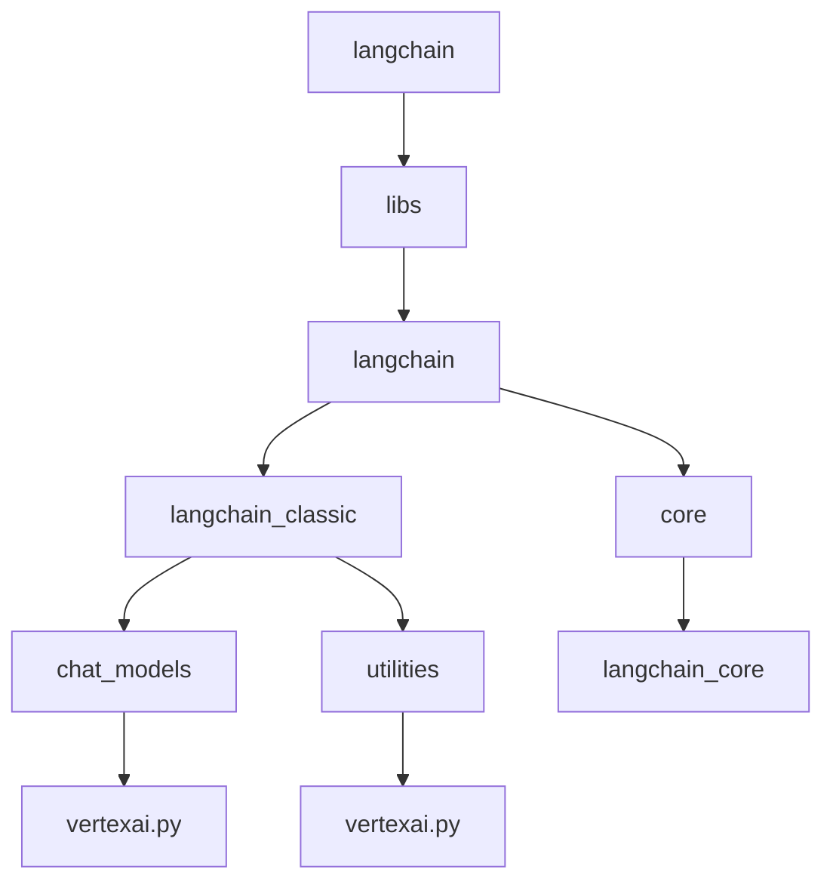
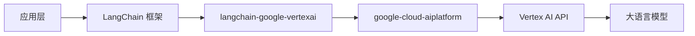
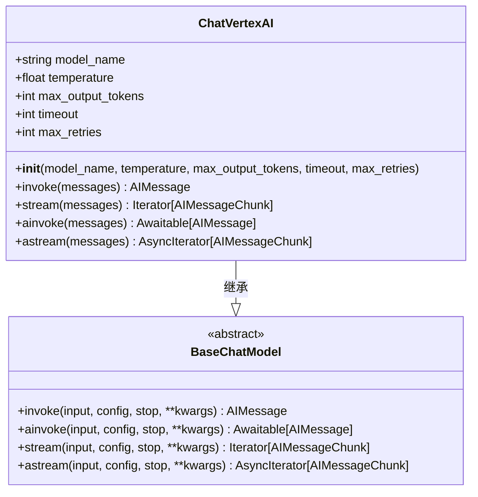
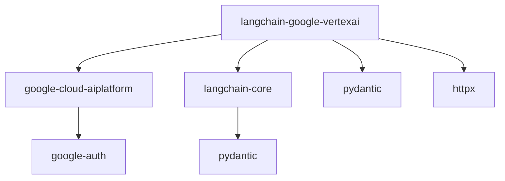

# VertexAI 聊天模型

<cite>
**本文档中引用的文件**  
- [vertexai.py](file://libs/langchain/langchain_classic/chat_models/vertexai.py)
- [base.py](file://libs/langchain/langchain_classic/chat_models/base.py)
- [uv.lock](file://libs/langchain/uv.lock)
- [utilities/vertexai.py](file://libs/langchain/langchain_classic/utilities/vertexai.py)
- [test_imports.py](file://libs/langchain/tests/unit_tests/chat_models/test_imports.py)
</cite>

## 目录
1. [简介](#简介)
2. [项目结构](#项目结构)
3. [核心组件](#核心组件)
4. [架构概述](#架构概述)
5. [详细组件分析](#详细组件分析)
6. [依赖分析](#依赖分析)
7. [性能考虑](#性能考虑)
8. [故障排除指南](#故障排除指南)
9. [结论](#结论)

## 简介
本文档详细介绍了如何通过 `langchain.chat_models.VertexAI` 类与 Google Cloud 的 Vertex AI 平台上的大语言模型进行集成。涵盖初始化参数如 `model_name`、`temperature`、`max_output_tokens` 的配置，以及 Google Cloud 认证方式（如服务账户密钥）。提供实际代码示例，展示如何发送对话消息、处理响应和系统提示。文档包括对 Vertex AI 上可用模型特性的介绍、成本考量、配额管理以及最佳实践。同时，讨论错误处理机制和超时设置等高级话题。

## 项目结构
LangChain 项目结构中，VertexAI 聊天模型的实现位于 `libs/langchain/langchain_classic/chat_models/vertexai.py` 文件中。该文件是 `langchain-google-vertexai` 包的一部分，该包依赖于 `google-cloud-aiplatform` 和 `langchain-core` 等核心库。项目结构遵循模块化设计，将聊天模型、嵌入模型和工具集成分别组织在不同的子目录中。

**图示来源**  
- [vertexai.py](file://libs/langchain/langchain_classic/chat_models/vertexai.py)
- [utilities/vertexai.py](file://libs/langchain/langchain_classic/utilities/vertexai.py)

**章节来源**  
- [vertexai.py](file://libs/langchain/langchain_classic/chat_models/vertexai.py)
- [uv.lock](file://libs/langchain/uv.lock)

## 核心组件
`ChatVertexAI` 类是 LangChain 中与 Google Cloud Vertex AI 集成的核心组件。它继承自 `BaseChatModel`，提供了与 Vertex AI 上的大语言模型进行交互的接口。该类支持多种初始化参数，包括 `model_name`、`temperature`、`max_output_tokens` 等，允许用户根据具体需求调整模型行为。

**章节来源**  
- [vertexai.py](file://libs/langchain/langchain_classic/chat_models/vertexai.py)
- [base.py](file://libs/langchain/langchain_classic/chat_models/base.py)

## 架构概述
LangChain 的 VertexAI 集成架构基于模块化设计，通过 `langchain-google-vertexai` 包提供与 Google Cloud Vertex AI 的连接。该架构利用 `google-cloud-aiplatform` SDK 与 Vertex AI API 进行通信，同时通过 `langchain-core` 提供的抽象层确保与其他 LangChain 组件的兼容性。

**图示来源**  
- [uv.lock](file://libs/langchain/uv.lock)
- [vertexai.py](file://libs/langchain/langchain_classic/chat_models/vertexai.py)

## 详细组件分析

### ChatVertexAI 类分析
`ChatVertexAI` 类是 LangChain 中与 Vertex AI 集成的主要接口。它提供了与 Vertex AI 上的大语言模型进行交互的方法，包括发送消息、处理响应和管理会话状态。

**图示来源**  
- [vertexai.py](file://libs/langchain/langchain_classic/chat_models/vertexai.py)
- [base.py](file://libs/langchain/langchain_classic/chat_models/base.py)

**章节来源**  
- [vertexai.py](file://libs/langchain/langchain_classic/chat_models/vertexai.py)
- [test_imports.py](file://libs/langchain/tests/unit_tests/chat_models/test_imports.py)

### 初始化与配置
`ChatVertexAI` 类的初始化支持多种参数，允许用户根据具体需求配置模型行为。关键参数包括：

- `model_name`: 指定要使用的 Vertex AI 模型名称，如 `gemini-1.5-pro`。
- `temperature`: 控制生成文本的随机性，值越高，输出越随机。
- `max_output_tokens`: 限制模型生成的最大 token 数。
- `timeout`: 设置请求超时时间（秒）。
- `max_retries`: 设置最大重试次数，以应对网络问题或服务中断。

这些参数通过 `__init__` 方法接收，并在内部传递给 Vertex AI API。

**章节来源**  
- [vertexai.py](file://libs/langchain/langchain_classic/chat_models/vertexai.py)
- [base.py](file://libs/langchain/langchain_classic/chat_models/base.py)

## 依赖分析
LangChain 的 VertexAI 集成依赖于多个外部库，这些依赖关系在 `uv.lock` 文件中明确定义。主要依赖包括：

- `google-cloud-aiplatform`: 用于与 Google Cloud Vertex AI API 进行通信。
- `langchain-core`: 提供 LangChain 框架的核心抽象和接口。
- `pydantic`: 用于数据验证和设置管理。
- `httpx`: 用于异步 HTTP 请求。

**图示来源**  
- [uv.lock](file://libs/langchain/uv.lock)
- [utilities/vertexai.py](file://libs/langchain/langchain_classic/utilities/vertexai.py)

**章节来源**  
- [uv.lock](file://libs/langchain/uv.lock)
- [utilities/vertexai.py](file://libs/langchain/langchain_classic/utilities/vertexai.py)

## 性能考虑
在使用 VertexAI 聊天模型时，需要考虑以下几个性能因素：

- **延迟**: 由于请求需要通过网络发送到 Google Cloud，因此存在一定的网络延迟。可以通过设置合理的超时时间来管理。
- **吞吐量**: Vertex AI 服务有配额限制，需要监控使用情况以避免超出配额。
- **成本**: 根据使用的模型和请求量，Vertex AI 会产生相应的费用。建议在生产环境中使用成本效益较高的模型。
- **重试机制**: 通过 `max_retries` 参数配置重试策略，以应对临时性网络问题或服务中断。

## 故障排除指南
在使用 VertexAI 聊天模型时，可能会遇到以下常见问题：

- **认证失败**: 确保已正确配置 Google Cloud 服务账户密钥，并具有访问 Vertex AI 的权限。
- **配额超限**: 检查 Google Cloud 控制台中的配额使用情况，必要时申请增加配额。
- **模型不可用**: 确认指定的模型名称正确，并且该模型在所选区域可用。
- **网络超时**: 增加 `timeout` 参数的值，或检查网络连接是否稳定。

**章节来源**  
- [vertexai.py](file://libs/langchain/langchain_classic/chat_models/vertexai.py)
- [utilities/vertexai.py](file://libs/langchain/langchain_classic/utilities/vertexai.py)

## 结论
LangChain 的 VertexAI 集成提供了一种简便的方式，将 Google Cloud 的大语言模型能力融入到应用程序中。通过 `ChatVertexAI` 类，开发者可以轻松地配置和使用 Vertex AI 上的模型，同时利用 LangChain 框架的强大功能构建复杂的语言应用。了解其架构、配置选项和最佳实践对于成功集成至关重要。