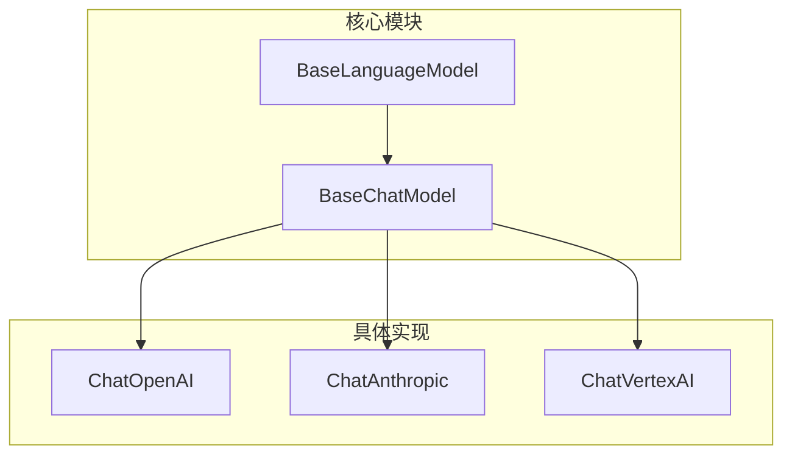
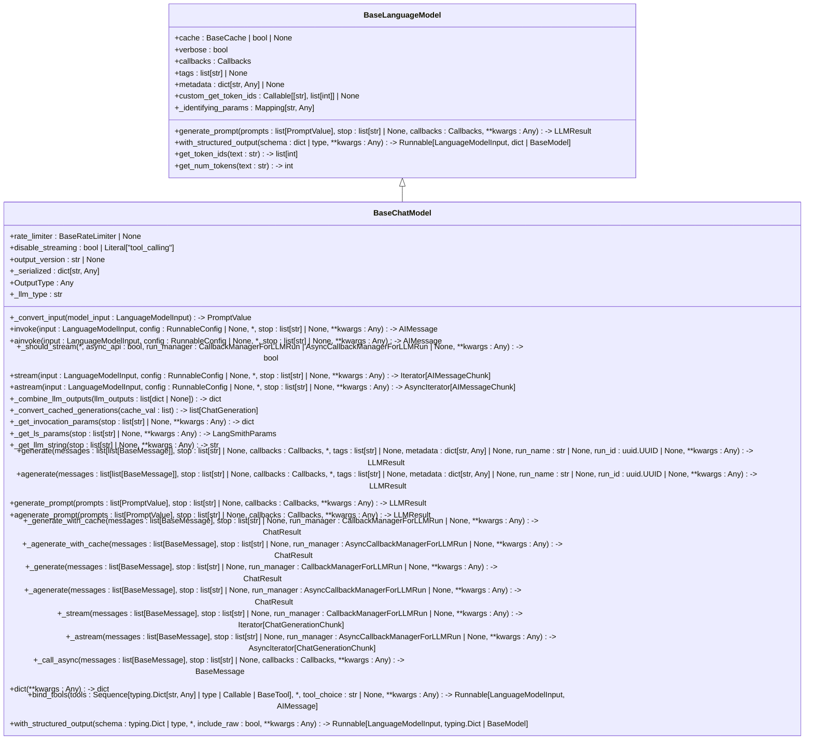
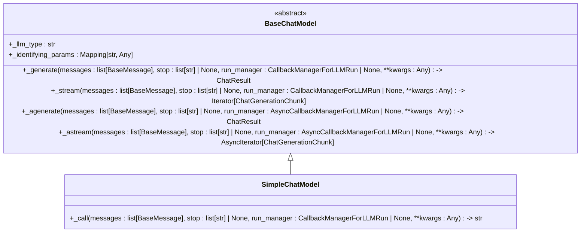
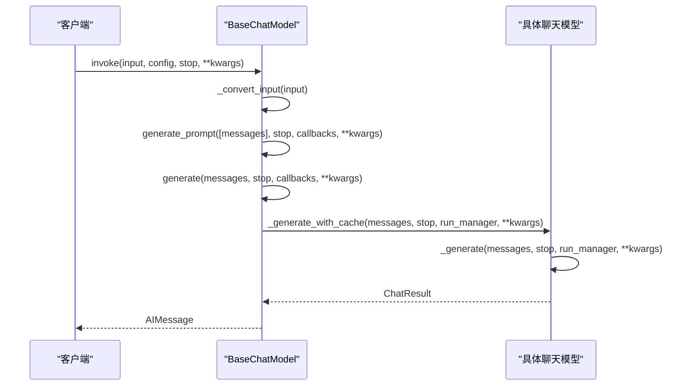
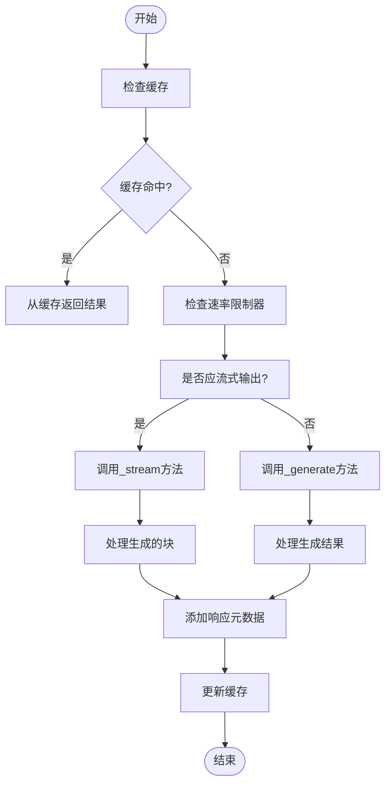

# 基础聊天模型接口

<cite>
**本文档中引用的文件**  
- [chat_models.py](file://libs/core/langchain_core/language_models/chat_models.py)
- [base.py](file://libs/core/langchain_core/language_models/base.py)
- [chat.py](file://libs/core/langchain_core/messages/chat.py)
</cite>

## 目录
1. [简介](#简介)
2. [项目结构](#项目结构)
3. [核心组件](#核心组件)
4. [架构概述](#架构概述)
5. [详细组件分析](#详细组件分析)
6. [依赖分析](#依赖分析)
7. [性能考虑](#性能考虑)
8. [故障排除指南](#故障排除指南)
9. [结论](#结论)
10. [附录](#附录)（如有必要）

## 简介
本文档详细解释了LangChain中基础聊天模型接口的设计与实现。`BaseChatModel`是所有具体聊天模型（如OpenAI、Anthropic、VertexAI）的抽象基类，它定义了聊天模型的核心行为和接口规范。文档将深入探讨其核心方法如`_call`、`_generate`的定义，以及消息对象（`BaseMessage`）的处理机制。同时，文档将涵盖接口的设计原则、继承关系、扩展方式，以及如何创建符合`BaseChatModel`接口的自定义聊天模型。

## 项目结构
LangChain的项目结构遵循模块化设计，将核心功能与具体实现分离。`BaseChatModel`位于`libs/core/langchain_core/language_models/chat_models.py`文件中，作为所有聊天模型的抽象基类。具体聊天模型的实现（如OpenAI、Anthropic）则位于`libs/langchain/langchain_classic/chat_models/`目录下，通过继承`BaseChatModel`来实现具体功能。

**图表来源**
- [chat_models.py](file://libs/core/langchain_core/language_models/chat_models.py#L241-L910)
- [base.py](file://libs/core/langchain_core/language_models/base.py#L248-L289)

**章节来源**
- [chat_models.py](file://libs/core/langchain_core/language_models/chat_models.py#L241-L910)
- [base.py](file://libs/core/langchain_core/language_models/base.py#L248-L289)

## 核心组件
`BaseChatModel`是LangChain中所有聊天模型的抽象基类，它继承自`BaseLanguageModel`并实现了`ABC`（抽象基类）接口。该类定义了聊天模型必须实现的核心方法和属性，确保了不同聊天模型之间的一致性和可互换性。

**章节来源**
- [chat_models.py](file://libs/core/langchain_core/language_models/chat_models.py#L241-L910)

## 架构概述
`BaseChatModel`的架构设计遵循了面向对象的继承和多态原则。它通过定义抽象方法和属性，强制子类实现特定的功能，同时提供了默认的实现以简化开发。该类还集成了回调管理、缓存、速率限制等高级功能，使得聊天模型能够更好地适应复杂的生产环境。

**图表来源**
- [chat_models.py](file://libs/core/langchain_core/language_models/chat_models.py#L241-L910)
- [base.py](file://libs/core/langchain_core/language_models/base.py#L248-L289)

## 详细组件分析
### BaseChatModel 分析
`BaseChatModel`类定义了聊天模型的核心行为，包括同步和异步的调用方法、流式输出、缓存、速率限制等。它通过抽象方法`_generate`和`_llm_type`强制子类实现具体的生成逻辑和模型类型标识。

#### 对象导向组件

**图表来源**
- [chat_models.py](file://libs/core/langchain_core/language_models/chat_models.py#L241-L910)

#### API/服务组件

**图表来源**
- [chat_models.py](file://libs/core/langchain_core/language_models/chat_models.py#L241-L910)

#### 复杂逻辑组件

**图表来源**
- [chat_models.py](file://libs/core/langchain_core/language_models/chat_models.py#L241-L910)

**章节来源**
- [chat_models.py](file://libs/core/langchain_core/language_models/chat_models.py#L241-L910)

### 消息处理机制
`BaseChatModel`通过`BaseMessage`类处理消息，支持多种消息类型（如文本、工具调用、系统消息等）。消息的序列化和反序列化通过`content_blocks`字段实现，确保了消息格式的一致性和可扩展性。

**章节来源**
- [chat.py](file://libs/core/langchain_core/messages/chat.py#L0-L64)

## 依赖分析
`BaseChatModel`依赖于多个核心模块，包括`BaseLanguageModel`、`CallbackManager`、`BaseCache`和`BaseRateLimiter`。这些模块提供了基础的语言模型功能、回调管理、缓存和速率限制支持，使得`BaseChatModel`能够构建一个健壮且可扩展的聊天模型框架。

```mermaid
graph TD
BaseChatModel --> BaseLanguageModel
BaseChatModel --> CallbackManager
BaseChatModel --> BaseCache
BaseChatModel --> BaseRateLimiter
BaseChatModel --> PromptValue
BaseChatModel --> ChatPromptValue
BaseChatModel --> StringPromptValue
BaseChatModel --> AIMessage
BaseChatModel --> AIMessageChunk
BaseChatModel --> ChatGeneration
BaseChatModel --> ChatGenerationChunk
BaseChatModel --> ChatResult
BaseChatModel --> LLMResult
BaseChatModel --> RunInfo
BaseChatModel --> LangSmithParams
BaseChatModel --> Runnable
BaseChatModel --> RunnableConfig
BaseChatModel --> RunnableMap
BaseChatModel --> RunnablePassthrough
```

**图表来源**
- [chat_models.py](file://libs/core/langchain_core/language_models/chat_models.py#L241-L910)
- [base.py](file://libs/core/langchain_core/language_models/base.py#L248-L289)

**章节来源**
- [chat_models.py](file://libs/core/langchain_core/language_models/chat_models.py#L241-L910)
- [base.py](file://libs/core/langchain_core/language_models/base.py#L248-L289)

## 性能考虑
`BaseChatModel`通过缓存和速率限制机制优化了性能。缓存可以避免重复的模型调用，而速率限制则防止了对模型API的过度请求。此外，流式输出功能允许客户端在生成过程中逐步接收结果，减少了等待时间。

## 故障排除指南
当使用`BaseChatModel`时，常见的问题包括缓存未命中、速率限制触发和消息格式错误。通过启用详细的日志记录和使用`LangSmithParams`进行追踪，可以有效地诊断和解决这些问题。

**章节来源**
- [chat_models.py](file://libs/core/langchain_core/language_models/chat_models.py#L241-L910)

## 结论
`BaseChatModel`作为LangChain中所有聊天模型的抽象基类，提供了一个强大且灵活的接口，使得开发者能够轻松地集成和扩展各种聊天模型。通过遵循其设计原则和实现要求，可以构建出高效、可靠且易于维护的聊天应用。