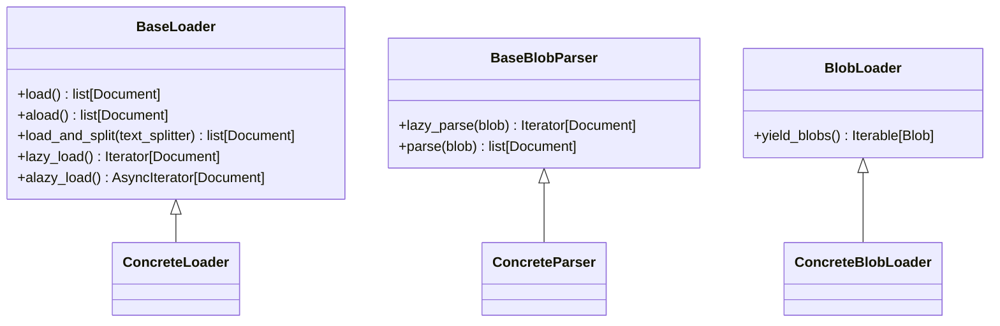
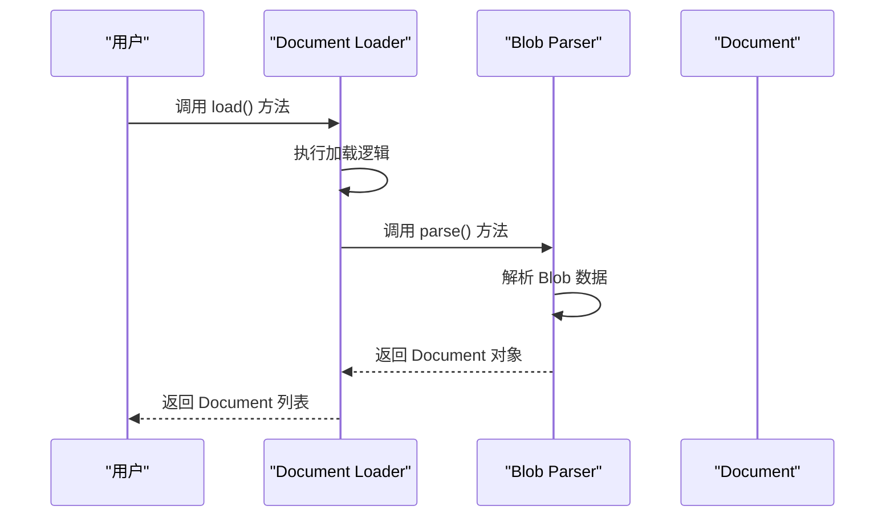

# Document Loaders

<cite>
**本文档中引用的文件**
- [base.py](file://libs/core/langchain_core/document_loaders/base.py)
- [blob_loaders.py](file://libs/core/langchain_core/document_loaders/blob_loaders.py)
- [pdf.py](file://libs/langchain/langchain_classic/document_loaders/pdf.py)
- [json_loader.py](file://libs/langchain/langchain_classic/document_loaders/json_loader.py)
- [web_base.py](file://libs/langchain/langchain_classic/document_loaders/web_base.py)
- [text.py](file://libs/langchain/langchain_classic/document_loaders/text.py)
- [csv_loader.py](file://libs/langchain/langchain_classic/document_loaders/csv_loader.py)
</cite>

## 目录
1. [简介](#简介)
2. [核心架构](#核心架构)
3. [常用Loader详解](#常用loader详解)
4. [文档加载与预处理示例](#文档加载与预处理示例)
5. [错误处理与性能优化](#错误处理与性能优化)
6. [扩展新数据源](#扩展新数据源)
7. [与Text Splitters的集成](#与text-splitters的集成)
8. [结论](#结论)

## 简介
LangChain Document Loaders 是一个功能强大的工具集，能够从200多种不同的数据源中提取和加载文本内容。这些数据源包括PDF文件、网页、JSON数据、数据库等多种格式。Document Loaders 的设计目标是提供统一的接口来处理各种格式的文档，同时保持灵活性和可扩展性，使开发者能够轻松地集成新的数据源。

**Section sources**
- [base.py](file://libs/core/langchain_core/document_loaders/base.py#L1-L155)

## 核心架构
LangChain Document Loaders 的核心架构基于抽象基类设计，提供了统一的接口和灵活的扩展机制。主要包含以下几个核心组件：

### BaseLoader
`BaseLoader` 是所有文档加载器的基类，定义了文档加载的基本接口。它提供了 `load`、`aload`、`lazy_load` 和 `alazy_load` 等方法，支持同步和异步加载模式。`load` 方法用于一次性加载所有文档到内存中，而 `lazy_load` 方法则使用生成器实现惰性加载，避免一次性加载大量文档导致内存溢出。

### BaseBlobParser
`BaseBlobParser` 是所有Blob解析器的基类，负责将原始数据（Blob）解析为一个或多个 `Document` 对象。这种设计使得内容解析与内容加载解耦，提高了代码的复用性和灵活性。

### BlobLoader
`BlobLoader` 是抽象接口，用于实现从存储系统中按需加载原始数据。它提供了一个 `yield_blobs` 方法，返回一个生成器，可以按需生成 `Blob` 对象，从而实现流式处理。



**Diagram sources**
- [base.py](file://libs/core/langchain_core/document_loaders/base.py#L1-L155)
- [blob_loaders.py](file://libs/core/langchain_core/document_loaders/blob_loaders.py#L1-L40)

**Section sources**
- [base.py](file://libs/core/langchain_core/document_loaders/base.py#L1-L155)
- [blob_loaders.py](file://libs/core/langchain_core/document_loaders/blob_loaders.py#L1-L40)

## 常用Loader详解
### PyPDFLoader
`PyPDFLoader` 是用于加载PDF文件的常用Loader。它利用 `PyPDF2` 库解析PDF文件，提取文本内容并生成 `Document` 对象。配置选项包括是否提取元数据、是否忽略页眉页脚等。

### WebBaseLoader
`WebBaseLoader` 用于从网页中提取内容。它支持通过HTTP请求获取网页内容，并使用BeautifulSoup等库解析HTML，提取文本内容。配置选项包括请求头、超时时间、是否跟随重定向等。

### JSONLoader
`JSONLoader` 用于加载JSON格式的数据。它可以解析JSON文件或字符串，提取指定路径的内容并生成 `Document` 对象。配置选项包括JSON路径表达式、编码格式等。



**Diagram sources**
- [pdf.py](file://libs/langchain/langchain_classic/document_loaders/pdf.py#L1-L65)
- [web_base.py](file://libs/langchain/langchain_classic/document_loaders/web_base.py#L1-L23)
- [json_loader.py](file://libs/langchain/langchain_classic/document_loaders/json_loader.py#L1-L23)

**Section sources**
- [pdf.py](file://libs/langchain/langchain_classic/document_loaders/pdf.py#L1-L65)
- [web_base.py](file://libs/langchain/langchain_classic/document_loaders/web_base.py#L1-L23)
- [json_loader.py](file://libs/langchain/langchain_classic/document_loaders/json_loader.py#L1-L23)

## 文档加载与预处理示例
以下是一些常见的文档加载与预处理示例：

### 加载PDF文件
```python
from langchain.document_loaders import PyPDFLoader

loader = PyPDFLoader("example.pdf")
documents = loader.load()
```

### 加载网页内容
```python
from langchain.document_loaders import WebBaseLoader

loader = WebBaseLoader("https://example.com")
documents = loader.load()
```

### 加载JSON数据
```python
from langchain.document_loaders import JSONLoader

loader = JSONLoader("data.json", jq_schema=".messages[]")
documents = loader.load()
```

**Section sources**
- [pdf.py](file://libs/langchain/langchain_classic/document_loaders/pdf.py#L1-L65)
- [web_base.py](file://libs/langchain/langchain_classic/document_loaders/web_base.py#L1-L23)
- [json_loader.py](file://libs/langchain/langchain_classic/document_loaders/json_loader.py#L1-L23)

## 错误处理与性能优化
### 错误处理
在使用Document Loaders时，可能会遇到各种错误，如文件不存在、网络连接失败、解析错误等。建议使用try-except语句捕获异常，并进行适当的错误处理。

### 性能优化
为了提高性能，可以采取以下措施：
- 使用惰性加载（lazy loading）避免一次性加载大量文档。
- 并行处理多个文件或数据源。
- 缓存已加载的文档以减少重复加载。

**Section sources**
- [base.py](file://libs/core/langchain_core/document_loaders/base.py#L1-L155)

## 扩展新数据源
要扩展支持新的数据源，可以继承 `BaseLoader` 或 `BlobLoader` 类，并实现相应的加载逻辑。例如，创建一个新的 `CustomLoader` 类来支持特定格式的文件。

```python
from langchain_core.document_loaders import BaseLoader

class CustomLoader(BaseLoader):
    def __init__(self, file_path: str):
        self.file_path = file_path

    def lazy_load(self):
        # 实现具体的加载逻辑
        pass
```

**Section sources**
- [base.py](file://libs/core/langchain_core/document_loaders/base.py#L1-L155)

## 与Text Splitters的集成
Document Loaders 可以与Text Splitters无缝集成，实现更有效的文本处理。`load_and_split` 方法允许在加载文档后立即进行分割，生成更小的文本块，便于后续处理。

```python
from langchain.text_splitter import RecursiveCharacterTextSplitter

text_splitter = RecursiveCharacterTextSplitter(chunk_size=1000, chunk_overlap=200)
documents = loader.load_and_split(text_splitter=text_splitter)
```

**Section sources**
- [base.py](file://libs/core/langchain_core/document_loaders/base.py#L1-L155)

## 结论
LangChain Document Loaders 提供了一个强大且灵活的框架，用于从多种数据源中提取和加载文本内容。通过理解其核心架构和使用方法，开发者可以高效地处理各种格式的文档，并结合Text Splitters实现更精细的文本处理。未来的工作可以进一步探索更多数据源的支持和性能优化策略。