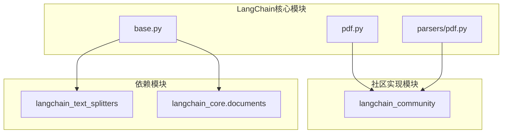
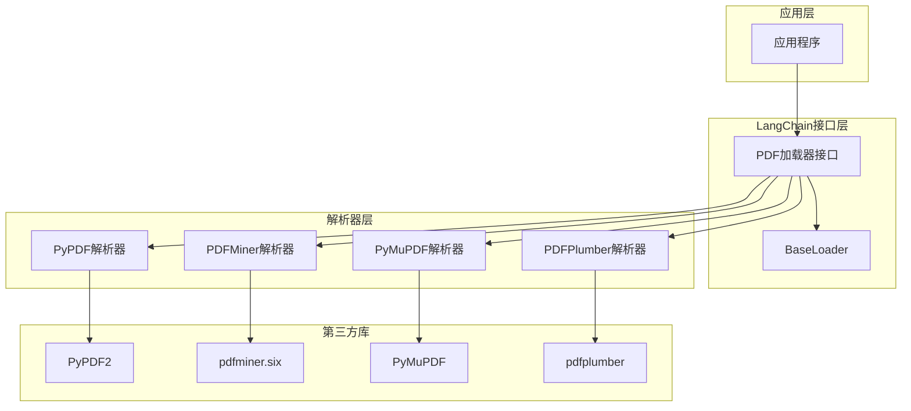
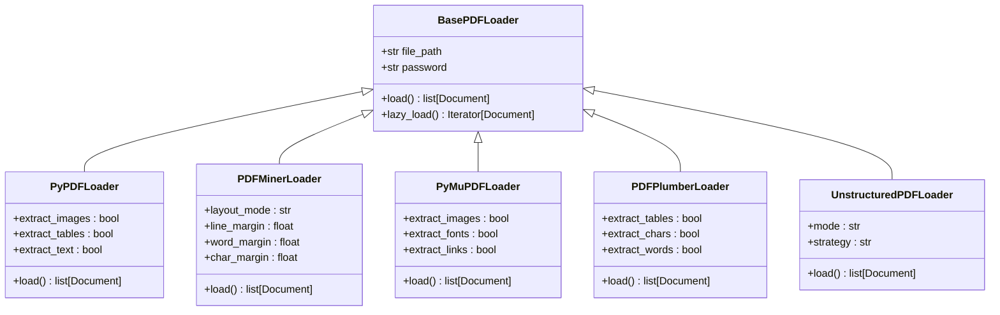
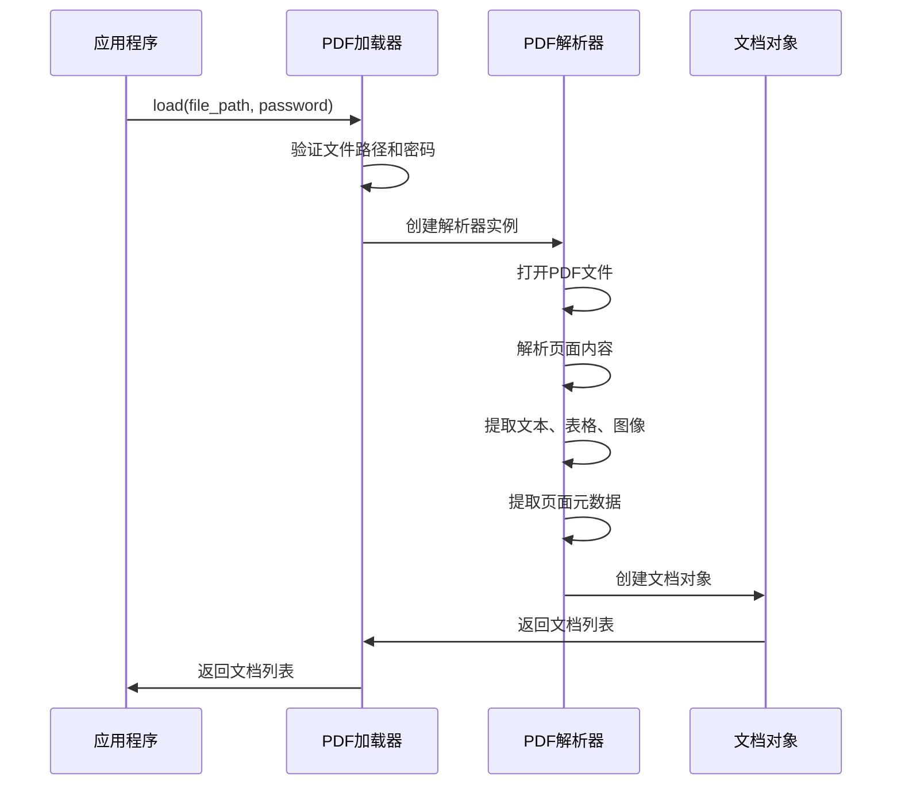
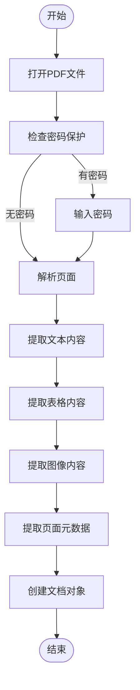
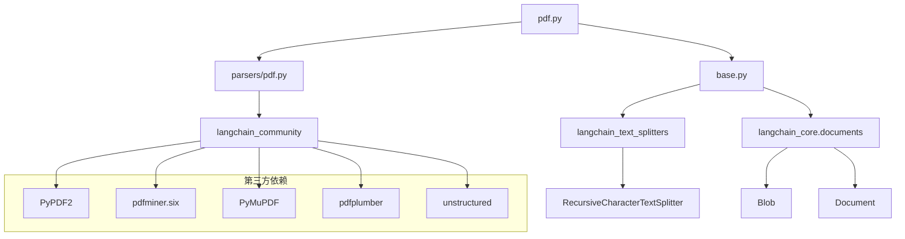

# PDF文档加载器

<cite>
**本文档中引用的文件**  
- [pdf.py](file://libs/langchain/langchain_classic/document_loaders/pdf.py)
- [base.py](file://libs/core/langchain_core/document_loaders/base.py)
- [parsers/pdf.py](file://libs/langchain/langchain_classic/document_loaders/parsers/pdf.py)
</cite>

## 目录
1. [简介](#简介)
2. [项目结构](#项目结构)
3. [核心组件](#核心组件)
4. [架构概述](#架构概述)
5. [详细组件分析](#详细组件分析)
6. [依赖分析](#依赖分析)
7. [性能考量](#性能考量)
8. [故障排除指南](#故障排除指南)
9. [结论](#结论)

## 简介
本文档深入介绍了LangChain框架中PDF文档加载器的实现原理和使用场景。重点分析了PyPDFLoader、PDFMinerLoader、PyMuPDFLoader等不同PDF解析器的技术特点，以及如何处理PDF中的文本、表格和图像内容。文档还涵盖了页面元数据提取、配置选项（如页面范围选择、密码保护文档处理和文本提取精度优化）等高级功能。通过实际代码示例，展示了如何从本地文件系统或网络URL加载PDF文档，并与其他组件（如Text Splitters）集成进行后续处理。最后，讨论了各种PDF解析库的优缺点及性能考量。

## 项目结构
LangChain的PDF文档加载器功能主要分布在`libs/langchain/langchain_classic/document_loaders/`目录下，通过动态导入机制从`langchain_community`包中加载具体的实现。核心的PDF加载器功能由`pdf.py`文件提供，该文件定义了各种PDF加载器的接口和导入逻辑。

**Diagram sources**
- [pdf.py](file://libs/langchain/langchain_classic/document_loaders/pdf.py)
- [base.py](file://libs/core/langchain_core/document_loaders/base.py)
- [parsers/pdf.py](file://libs/langchain/langchain_classic/document_loaders/parsers/pdf.py)

**Section sources**
- [pdf.py](file://libs/langchain/langchain_classic/document_loaders/pdf.py)
- [base.py](file://libs/core/langchain_core/document_loaders/base.py)

## 核心组件
PDF文档加载器的核心组件包括多种具体的加载器实现，如PyPDFLoader、PDFMinerLoader、PyMuPDFLoader等。这些加载器都继承自`BaseLoader`抽象类，实现了统一的文档加载接口。每个加载器针对不同的PDF解析需求和场景进行了优化，提供了灵活的配置选项。

**Section sources**
- [pdf.py](file://libs/langchain/langchain_classic/document_loaders/pdf.py)
- [base.py](file://libs/core/langchain_core/document_loaders/base.py)

## 架构概述
LangChain的PDF文档加载器采用分层架构设计，上层提供统一的API接口，下层通过动态导入机制集成多种第三方PDF解析库。这种设计既保证了API的一致性，又充分利用了不同解析库的优势。

**Diagram sources**
- [pdf.py](file://libs/langchain/langchain_classic/document_loaders/pdf.py)
- [parsers/pdf.py](file://libs/langchain/langchain_classic/document_loaders/parsers/pdf.py)
- [base.py](file://libs/core/langchain_core/document_loaders/base.py)

## 详细组件分析
### PDF加载器分析
LangChain提供了多种PDF加载器，每种加载器都有其特定的使用场景和优势。这些加载器通过统一的接口提供服务，但底层使用不同的PDF解析库。

#### 主要PDF加载器类型

**Diagram sources**
- [pdf.py](file://libs/langchain/langchain_classic/document_loaders/pdf.py)
- [parsers/pdf.py](file://libs/langchain/langchain_classic/document_loaders/parsers/pdf.py)

### 文档加载流程
PDF文档的加载流程遵循统一的模式，从文件读取到内容解析再到文档对象生成。

**Diagram sources**
- [pdf.py](file://libs/langchain/langchain_classic/document_loaders/pdf.py)
- [base.py](file://libs/core/langchain_core/document_loaders/base.py)

### 文本提取流程
不同PDF加载器的文本提取流程有所不同，但都遵循相似的基本步骤。

**Diagram sources**
- [parsers/pdf.py](file://libs/langchain/langchain_classic/document_loaders/parsers/pdf.py)
- [pdf.py](file://libs/langchain/langchain_classic/document_loaders/pdf.py)

## 依赖分析
PDF文档加载器的依赖关系复杂，涉及多个第三方库和内部模块的交互。

**Diagram sources**
- [pdf.py](file://libs/langchain/langchain_classic/document_loaders/pdf.py)
- [base.py](file://libs/core/langchain_core/document_loaders/base.py)
- [parsers/pdf.py](file://libs/langchain/langchain_classic/document_loaders/parsers/pdf.py)

**Section sources**
- [pdf.py](file://libs/langchain/langchain_classic/document_loaders/pdf.py)
- [base.py](file://libs/core/langchain_core/document_loaders/base.py)
- [parsers/pdf.py](file://libs/langchain/langchain_classic/document_loaders/parsers/pdf.py)

## 性能考量
在使用PDF文档加载器时，需要考虑多个性能因素，包括内存使用、处理速度和准确性。

1. **内存使用**：大型PDF文件可能占用大量内存，建议使用`lazy_load`方法进行流式处理。
2. **处理速度**：不同解析器的处理速度差异较大，PyMuPDF通常最快，PDFMiner最慢但最准确。
3. **准确性**：复杂的PDF布局可能影响文本提取的准确性，需要选择合适的解析器和配置。
4. **资源消耗**：图像和表格提取会显著增加处理时间和内存消耗。

## 故障排除指南
### 常见问题及解决方案
1. **密码保护的PDF无法打开**
   - 确保提供了正确的密码
   - 检查PDF加载器是否支持密码解密功能

2. **文本提取不完整或乱码**
   - 尝试使用不同的PDF解析器
   - 检查PDF文件是否损坏
   - 调整文本提取的配置参数

3. **内存不足错误**
   - 使用`lazy_load`方法替代`load`方法
   - 减少同时处理的PDF文件数量
   - 关闭不必要的内容提取功能（如图像提取）

4. **表格提取失败**
   - 确保使用的解析器支持表格提取
   - 检查PDF中的表格是否为图像形式
   - 调整表格检测的灵敏度参数

**Section sources**
- [pdf.py](file://libs/langchain/langchain_classic/document_loaders/pdf.py)
- [parsers/pdf.py](file://libs/langchain/langchain_classic/document_loaders/parsers/pdf.py)

## 结论
LangChain的PDF文档加载器提供了一套完整且灵活的解决方案，能够满足各种PDF处理需求。通过集成多种第三方PDF解析库，它在准确性、速度和功能丰富性之间取得了良好的平衡。开发者可以根据具体的应用场景选择合适的加载器，并通过丰富的配置选项优化性能和准确性。未来的发展方向可能包括更智能的布局分析、更好的表格识别算法以及对更多PDF特性的支持。