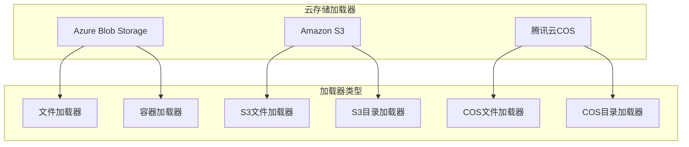
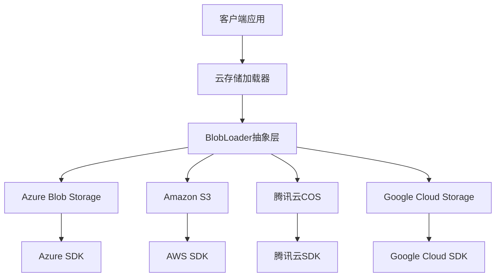
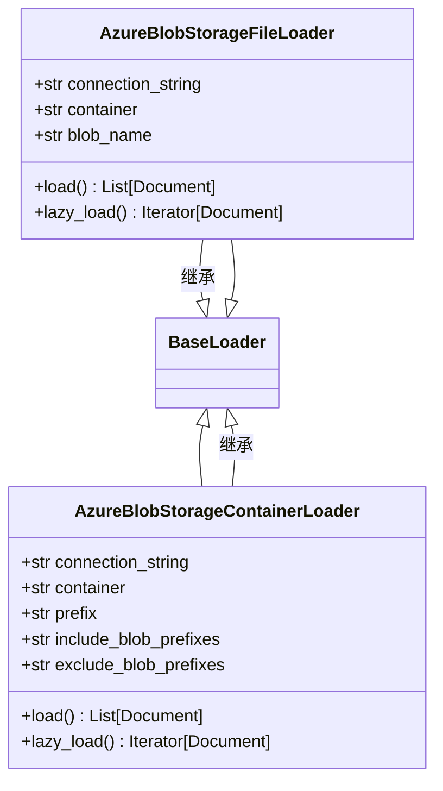
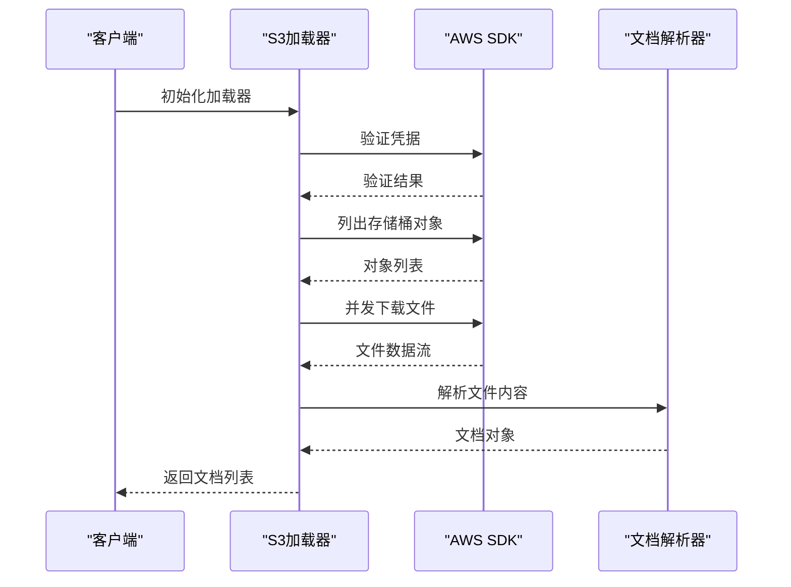
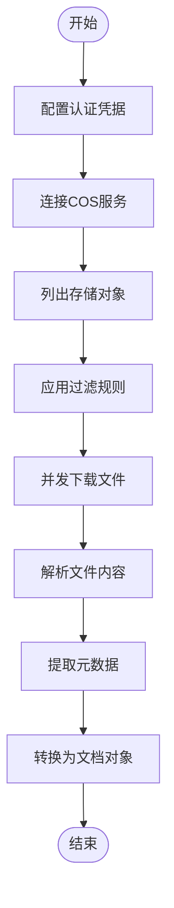
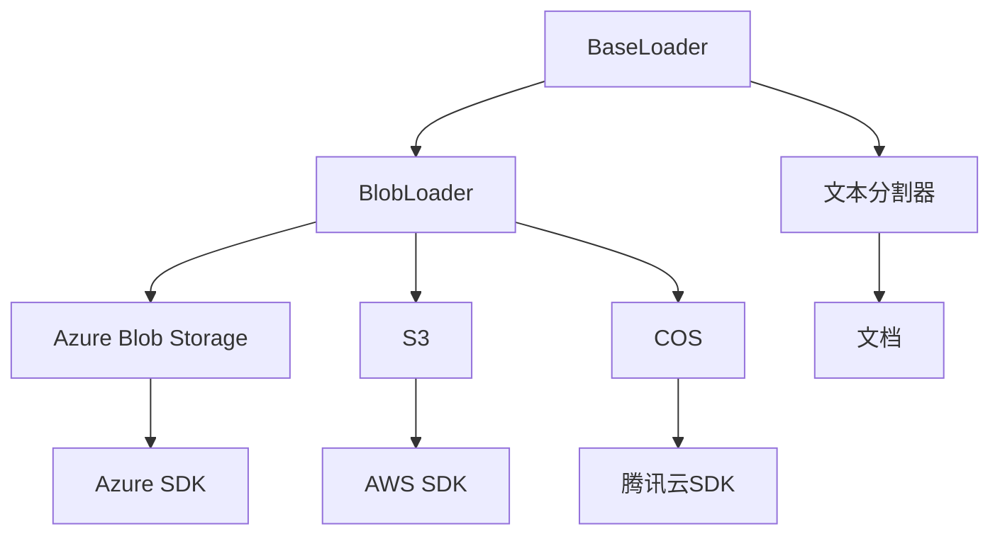

# 云存储加载器

<cite>
**本文档中引用的文件**  
- [azure_blob_storage_file.py](file://libs/langchain/langchain_classic/document_loaders/azure_blob_storage_file.py)
- [azure_blob_storage_container.py](file://libs/langchain/langchain_classic/document_loaders/azure_blob_storage_container.py)
- [s3_file.py](file://libs/langchain/langchain_classic/document_loaders/s3_file.py)
- [s3_directory.py](file://libs/langchain/langchain_classic/document_loaders/s3_directory.py)
- [tencent_cos_file.py](file://libs/langchain/langchain_classic/document_loaders/tencent_cos_file.py)
- [tencent_cos_directory.py](file://libs/langchain/langchain_classic/document_loaders/tencent_cos_directory.py)
- [base.py](file://libs/core/langchain_core/document_loaders/base.py)
- [blob_loaders.py](file://libs/core/langchain_core/document_loaders/blob_loaders.py)
</cite>

## 目录
1. [简介](#简介)
2. [项目结构](#项目结构)
3. [核心组件](#核心组件)
4. [架构概述](#架构概述)
5. [详细组件分析](#详细组件分析)
6. [依赖分析](#依赖分析)
7. [性能考虑](#性能考虑)
8. [故障排除指南](#故障排除指南)
9. [结论](#结论)

## 简介
本文档深入介绍了LangChain框架中云存储加载器的功能，重点阐述了如何从Azure Blob Storage、Amazon S3和腾讯云COS等主流云存储服务中批量加载文件。文档详细解释了认证凭据配置、存储桶权限处理和目录结构遍历等关键概念。同时提供了文件过滤、并发下载和元数据提取等配置选项的说明，并讨论了大规模文件处理的性能优化、成本控制和错误恢复机制。

## 项目结构
LangChain的云存储加载器功能分布在多个模块中，主要位于`libs/langchain/langchain_classic/document_loaders/`目录下。这些加载器通过抽象层与核心功能解耦，实现了对不同云存储服务的支持。

**图示来源**  
- [azure_blob_storage_file.py](file://libs/langchain/langchain_classic/document_loaders/azure_blob_storage_file.py)
- [s3_file.py](file://libs/langchain/langchain_classic/document_loaders/s3_file.py)
- [tencent_cos_file.py](file://libs/langchain/langchain_classic/document_loaders/tencent_cos_file.py)

**本节来源**  
- [libs/langchain/langchain_classic/document_loaders/](file://libs/langchain/langchain_classic/document_loaders/)

## 核心组件
云存储加载器的核心组件包括BlobLoader抽象类、BaseLoader基类以及针对不同云服务的具体实现。这些组件共同构成了一个灵活且可扩展的文件加载系统，支持从多种云存储服务中加载数据。

**本节来源**  
- [base.py](file://libs/core/langchain_core/document_loaders/base.py)
- [blob_loaders.py](file://libs/core/langchain_core/document_loaders/blob_loaders.py)

## 架构概述
云存储加载器的架构采用分层设计，将加载逻辑与具体云服务实现分离。这种设计模式提高了代码的可维护性和可扩展性，使得添加新的云存储服务支持变得更加容易。

**图示来源**  
- [blob_loaders.py](file://libs/core/langchain_core/document_loaders/blob_loaders.py)
- [base.py](file://libs/core/langchain_core/document_loaders/base.py)

## 详细组件分析

### Azure Blob Storage加载器分析
Azure Blob Storage加载器提供了两种主要的加载方式：文件加载器和容器加载器。文件加载器用于加载单个文件，而容器加载器则用于遍历整个存储容器中的所有文件。

#### 类图

**图示来源**  
- [azure_blob_storage_file.py](file://libs/langchain/langchain_classic/document_loaders/azure_blob_storage_file.py)
- [azure_blob_storage_container.py](file://libs/langchain/langchain_classic/document_loaders/azure_blob_storage_container.py)

**本节来源**  
- [azure_blob_storage_file.py](file://libs/langchain/langchain_classic/document_loaders/azure_blob_storage_file.py)
- [azure_blob_storage_container.py](file://libs/langchain/langchain_classic/document_loaders/azure_blob_storage_container.py)

### Amazon S3加载器分析
Amazon S3加载器提供了文件和目录两种加载方式，支持通过前缀过滤、并发下载和元数据提取等高级功能。

#### 序列图

**图示来源**  
- [s3_file.py](file://libs/langchain/langchain_classic/document_loaders/s3_file.py)
- [s3_directory.py](file://libs/langchain/langchain_classic/document_loaders/s3_directory.py)

**本节来源**  
- [s3_file.py](file://libs/langchain/langchain_classic/document_loaders/s3_file.py)
- [s3_directory.py](file://libs/langchain/langchain_classic/document_loaders/s3_directory.py)

### 腾讯云COS加载器分析
腾讯云COS加载器提供了与Azure和S3类似的接口，支持文件和目录级别的数据加载。

#### 流程图

**图示来源**  
- [tencent_cos_file.py](file://libs/langchain/langchain_classic/document_loaders/tencent_cos_file.py)
- [tencent_cos_directory.py](file://libs/langchain/langchain_classic/document_loaders/tencent_cos_directory.py)

**本节来源**  
- [tencent_cos_file.py](file://libs/langchain/langchain_classic/document_loaders/tencent_cos_file.py)
- [tencent_cos_directory.py](file://libs/langchain/langchain_classic/document_loaders/tencent_cos_directory.py)

## 依赖分析
云存储加载器的依赖关系清晰地展示了各组件之间的交互和依赖。

**图示来源**  
- [base.py](file://libs/core/langchain_core/document_loaders/base.py)
- [blob_loaders.py](file://libs/core/langchain_core/document_loaders/blob_loaders.py)

**本节来源**  
- [base.py](file://libs/core/langchain_core/document_loaders/base.py)
- [blob_loaders.py](file://libs/core/langchain_core/document_loaders/blob_loaders.py)

## 性能考虑
在处理大规模文件时，云存储加载器需要考虑多个性能因素，包括并发下载、内存使用和网络带宽优化。通过合理的配置，可以显著提高数据加载的效率。

## 故障排除指南
当云存储加载器出现问题时，可以从以下几个方面进行排查：认证凭据是否正确、存储桶权限是否足够、网络连接是否稳定、SDK版本是否兼容等。

**本节来源**  
- [azure_blob_storage_file.py](file://libs/langchain/langchain_classic/document_loaders/azure_blob_storage_file.py)
- [s3_file.py](file://libs/langchain/langchain_classic/document_loaders/s3_file.py)
- [tencent_cos_file.py](file://libs/langchain/langchain_classic/document_loaders/tencent_cos_file.py)

## 结论
LangChain的云存储加载器提供了一个强大而灵活的框架，用于从多种云存储服务中加载数据。通过统一的接口和可扩展的架构，开发者可以轻松地集成不同的云存储服务，实现高效的数据处理和分析。