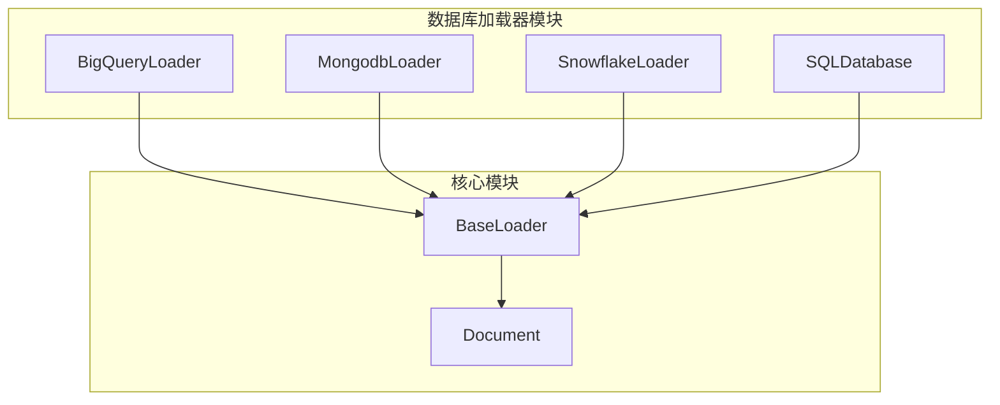
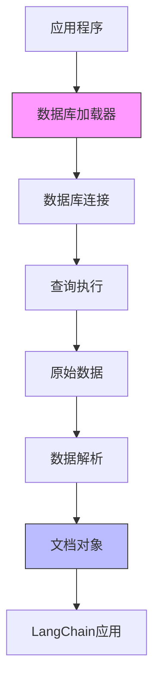
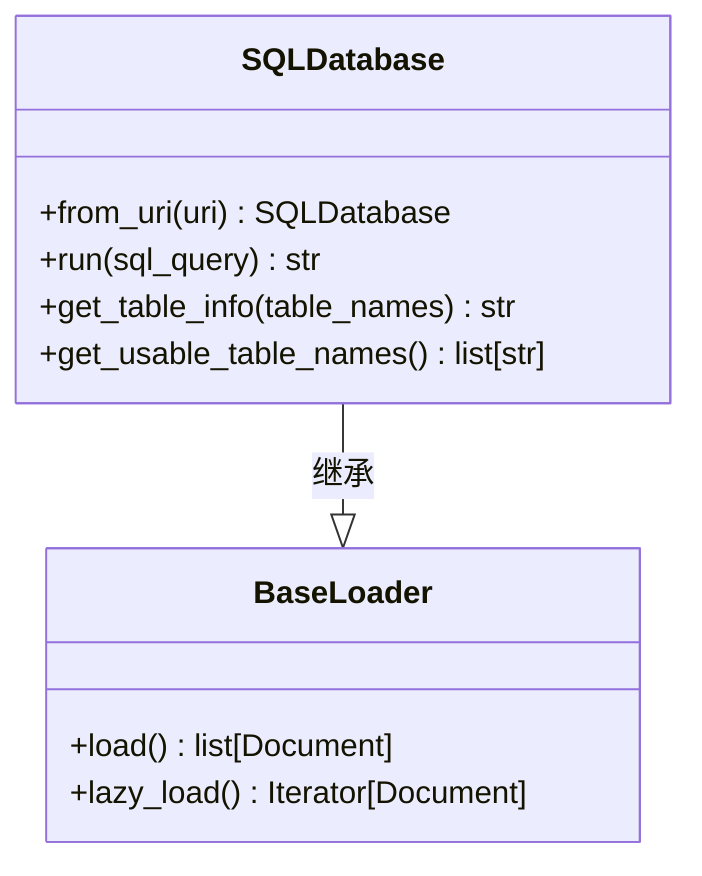
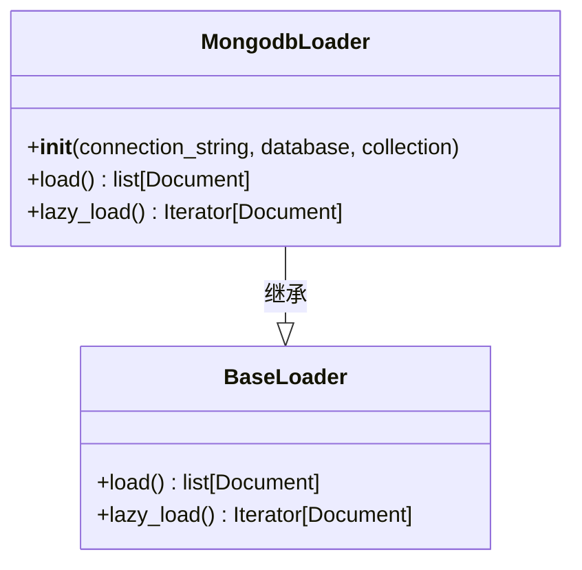
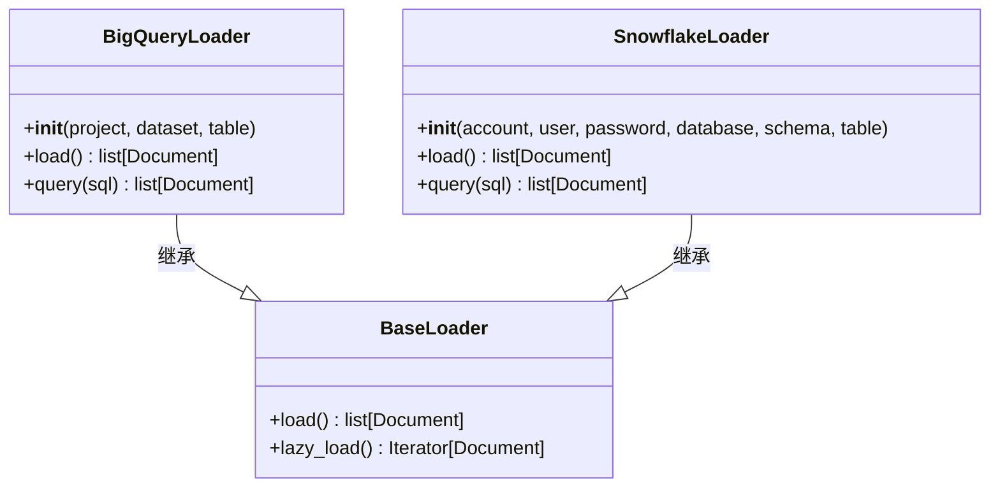
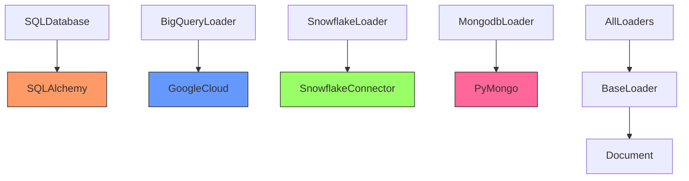

# 数据库加载器

<cite>
**本文档中引用的文件**
- [bigquery.py](file://libs/langchain/langchain_classic/document_loaders/bigquery.py)
- [mongodb.py](file://libs/langchain/langchain_classic/document_loaders/mongodb.py)
- [snowflake_loader.py](file://libs/langchain/langchain_classic/document_loaders/snowflake_loader.py)
- [sql_database.py](file://libs/langchain/langchain_classic/sql_database.py)
- [base.py](file://libs/core/langchain_core/document_loaders/base.py)
</cite>

## 目录
1. [简介](#简介)
2. [项目结构](#项目结构)
3. [核心组件](#核心组件)
4. [架构概述](#架构概述)
5. [详细组件分析](#详细组件分析)
6. [依赖分析](#依赖分析)
7. [性能考虑](#性能考虑)
8. [故障排除指南](#故障排除指南)
9. [结论](#结论)
10. [附录](#附录)（如有必要）

## 简介
本文档全面介绍了LangChain框架中的数据库加载器功能，重点阐述了如何从BigQuery、Snowflake、关系型数据库和MongoDB等不同数据库系统中提取数据。文档详细解释了SQLDatabaseLoader如何执行查询并将结果转换为文档，以及NoSQL数据库加载器如何处理文档型数据。同时提供了配置选项说明，包括连接参数、查询优化和增量加载策略。此外，文档还讨论了连接池管理、权限控制和数据隐私保护措施。

## 项目结构
LangChain的数据库加载器功能分布在多个模块中，主要位于`libs/langchain/langchain_classic/document_loaders/`目录下。该目录包含了针对不同数据库系统的专用加载器实现，如BigQuery、MongoDB和Snowflake。这些加载器通过统一的接口与LangChain的核心功能集成，实现了从多种数据源提取数据的能力。

**图示来源**
- [bigquery.py](file://libs/langchain/langchain_classic/document_loaders/bigquery.py)
- [mongodb.py](file://libs/langchain/langchain_classic/document_loaders/mongodb.py)
- [snowflake_loader.py](file://libs/langchain/langchain_classic/document_loaders/snowflake_loader.py)
- [sql_database.py](file://libs/langchain/langchain_classic/sql_database.py)

**章节来源**
- [bigquery.py](file://libs/langchain/langchain_classic/document_loaders/bigquery.py)
- [mongodb.py](file://libs/langchain/langchain_classic/document_loaders/mongodb.py)
- [snowflake_loader.py](file://libs/langchain/langchain_classic/document_loaders/snowflake_loader.py)

## 核心组件
数据库加载器的核心组件包括针对不同数据库系统的专用加载器类，这些类都继承自`BaseLoader`抽象基类。每个加载器负责处理特定数据库系统的连接、查询执行和数据转换。`SQLDatabase`类提供了对关系型数据库的统一访问接口，而`BigQueryLoader`、`MongodbLoader`和`SnowflakeLoader`则分别针对各自的云数据库服务进行了优化。

**章节来源**
- [sql_database.py](file://libs/langchain/langchain_classic/sql_database.py)
- [bigquery.py](file://libs/langchain/langchain_classic/document_loaders/bigquery.py)
- [mongodb.py](file://libs/langchain/langchain_classic/document_loaders/mongodb.py)
- [snowflake_loader.py](file://libs/langchain/langchain_classic/document_loaders/snowflake_loader.py)

## 架构概述
数据库加载器的架构采用分层设计，上层是针对特定数据库的加载器实现，底层是统一的数据处理和文档转换机制。这种设计使得新的数据库支持可以很容易地添加，同时保持了API的一致性。加载器通过安全的连接参数处理敏感信息，并使用参数化查询来防止SQL注入攻击。

**图示来源**
- [sql_database.py](file://libs/langchain/langchain_classic/sql_database.py)
- [base.py](file://libs/core/langchain_core/document_loaders/base.py)

## 详细组件分析

### SQL数据库加载器分析
SQL数据库加载器通过`SQLDatabase`类提供对关系型数据库的访问。该类使用SQLAlchemy作为底层ORM，支持多种数据库后端。加载器可以执行任意SQL查询，并将结果集转换为LangChain文档格式，其中每行数据成为一个文档，列名作为元数据。

**图示来源**
- [sql_database.py](file://libs/langchain/langchain_classic/sql_database.py)
- [base.py](file://libs/core/langchain_core/document_loaders/base.py)

### NoSQL数据库加载器分析
NoSQL数据库加载器如`MongodbLoader`专门处理文档型数据库。它们将MongoDB中的文档直接映射为LangChain文档，保留了原始的JSON结构。这种设计特别适合处理半结构化数据，能够保持数据的层次结构和嵌套关系。

**图示来源**
- [mongodb.py](file://libs/langchain/langchain_classic/document_loaders/mongodb.py)
- [base.py](file://libs/core/langchain_core/document_loaders/base.py)

### 云数据库加载器分析
云数据库加载器如`BigQueryLoader`和`SnowflakeLoader`针对各自的云平台进行了优化。这些加载器处理云身份验证、连接池管理和查询成本优化等特定于云环境的问题。它们通常使用各自平台的官方客户端库来确保最佳性能和功能支持。

**图示来源**
- [bigquery.py](file://libs/langchain/langchain_classic/document_loaders/bigquery.py)
- [snowflake_loader.py](file://libs/langchain/langchain_classic/document_loaders/snowflake_loader.py)
- [base.py](file://libs/core/langchain_core/document_loaders/base.py)

**章节来源**
- [bigquery.py](file://libs/langchain/langchain_classic/document_loaders/bigquery.py)
- [snowflake_loader.py](file://libs/langchain/langchain_classic/document_loaders/snowflake_loader.py)

## 依赖分析
数据库加载器依赖于多个外部库和内部模块。主要依赖包括SQLAlchemy用于关系型数据库操作，以及各云平台的官方客户端库。在LangChain内部，所有加载器都依赖于`BaseLoader`抽象基类和`Document`数据结构，确保了API的一致性和可扩展性。

**图示来源**
- [sql_database.py](file://libs/langchain/langchain_classic/sql_database.py)
- [bigquery.py](file://libs/langchain/langchain_classic/document_loaders/bigquery.py)
- [snowflake_loader.py](file://libs/langchain/langchain_classic/document_loaders/snowflake_loader.py)
- [mongodb.py](file://libs/langchain/langchain_classic/document_loaders/mongodb.py)

**章节来源**
- [sql_database.py](file://libs/langchain/langchain_classic/sql_database.py)
- [bigquery.py](file://libs/langchain/langchain_classic/document_loaders/bigquery.py)
- [snowflake_loader.py](file://libs/langchain/langchain_classic/document_loaders/snowflake_loader.py)
- [mongodb.py](file://libs/langchain/langchain_classic/document_loaders/mongodb.py)

## 性能考虑
数据库加载器在处理大规模数据集时需要考虑性能优化。建议使用分页查询和增量加载策略来避免内存溢出。对于云数据库，应注意查询成本和速率限制。连接池管理对于高并发场景至关重要，可以显著提高性能并减少连接开销。

## 故障排除指南
在使用数据库加载器时，常见的问题包括连接失败、认证错误和查询超时。确保连接参数正确，网络连接稳定，并且有足够的权限访问目标数据库。对于复杂查询，建议先在数据库客户端中测试，然后再集成到加载器中。

**章节来源**
- [sql_database.py](file://libs/langchain/langchain_classic/sql_database.py)
- [bigquery.py](file://libs/langchain/langchain_classic/document_loaders/bigquery.py)
- [snowflake_loader.py](file://libs/langchain/langchain_classic/document_loaders/snowflake_loader.py)
- [mongodb.py](file://libs/langchain/langchain_classic/document_loaders/mongodb.py)

## 结论
LangChain的数据库加载器提供了一套强大而灵活的工具，用于从各种数据库系统中提取数据。通过统一的API和可扩展的架构，开发者可以轻松集成不同的数据源到他们的应用中。安全性和性能是设计中的关键考虑因素，确保了在生产环境中的可靠使用。

## 附录
本文档中提到的所有数据库加载器都遵循相同的使用模式：创建加载器实例，配置连接参数，然后调用`load()`或`lazy_load()`方法获取数据。具体的配置选项和参数请参考各加载器的文档。