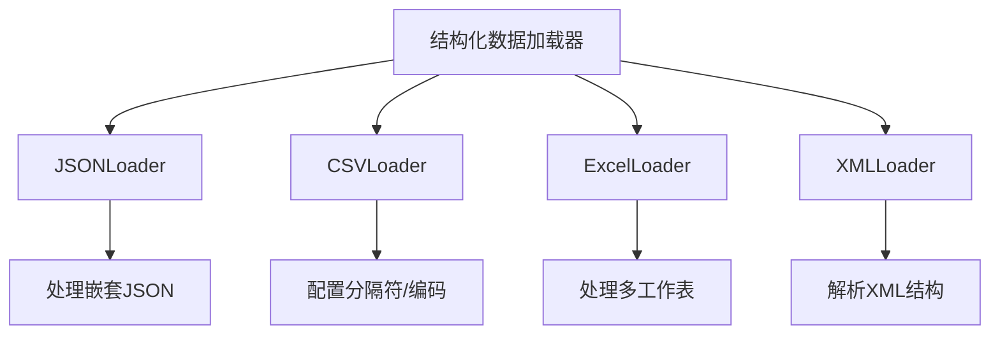
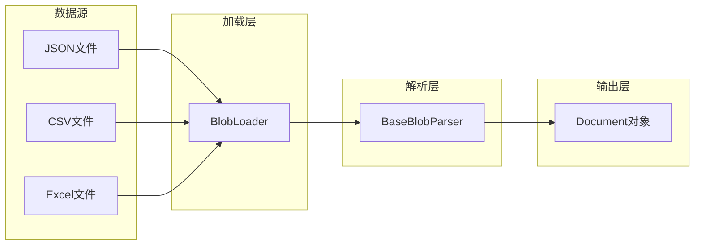
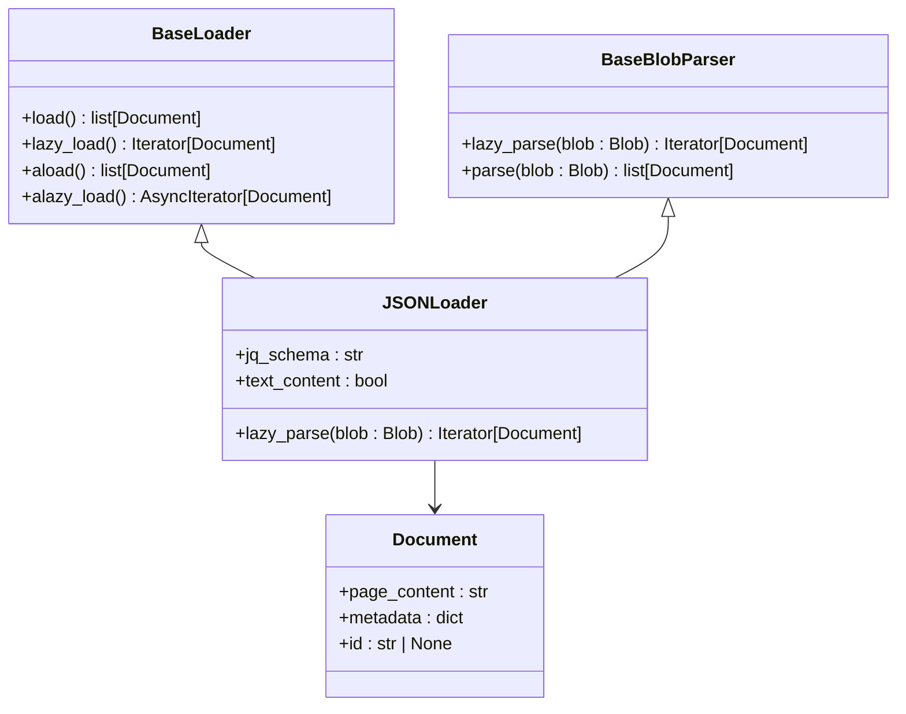
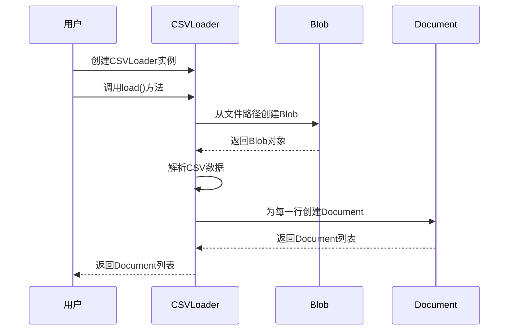
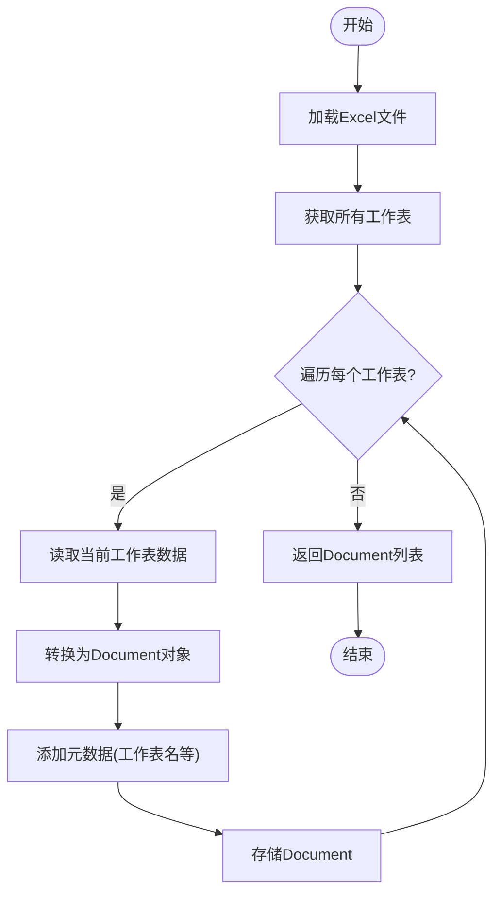
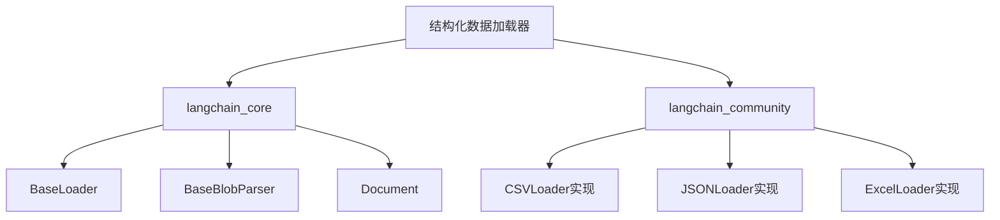

# 结构化数据加载器

<cite>
**本文档中引用的文件**
- [base.py](file://libs/core/langchain_core/document_loaders/base.py)
- [json_loader.py](file://libs/langchain/langchain_classic/document_loaders/json_loader.py)
- [csv_loader.py](file://libs/langchain/langchain_classic/document_loaders/csv_loader.py)
- [excel.py](file://libs/langchain/langchain_classic/document_loaders/excel.py)
- [base.py](file://libs/core/langchain_core/documents/base.py)
</cite>

## 目录
1. [简介](#简介)
2. [项目结构](#项目结构)
3. [核心组件](#核心组件)
4. [架构概述](#架构概述)
5. [详细组件分析](#详细组件分析)
6. [依赖分析](#依赖分析)
7. [性能考虑](#性能考虑)
8. [故障排除指南](#故障排除指南)
9. [结论](#结论)
10. [附录](#附录)（如有必要）

## 简介
本文档深入介绍了LangChain框架中结构化数据加载器的设计与实现。重点阐述了如何从JSON、CSV、Excel、XML等结构化数据格式中提取和转换内容。文档详细说明了JSONLoader如何处理嵌套JSON结构，CSVLoader如何配置分隔符和编码格式，以及ExcelLoader如何处理多工作表。同时，还提供了字段选择、数据类型转换和分块策略等配置选项的说明。通过实际代码示例，展示了如何将结构化数据转换为LangChain可用的Document对象，并与向量数据库集成。最后，讨论了大数据集的流式处理和内存优化策略。

## 项目结构
LangChain的结构化数据加载器主要分布在`libs/langchain/langchain_classic/document_loaders/`目录下。这些加载器遵循统一的设计模式，通过继承核心基类来实现特定格式的数据加载功能。每个加载器文件（如`json_loader.py`、`csv_loader.py`）都作为入口，动态导入实际的实现类，这些实现类通常位于`langchain_community`包中。

**图示来源**
- [json_loader.py](file://libs/langchain/langchain_classic/document_loaders/json_loader.py)
- [csv_loader.py](file://libs/langchain/langchain_classic/document_loaders/csv_loader.py)
- [excel.py](file://libs/langchain/langchain_classic/document_loaders/excel.py)

**本节来源**
- [json_loader.py](file://libs/langchain/langchain_classic/document_loaders/json_loader.py)
- [csv_loader.py](file://libs/langchain/langchain_classic/document_loaders/csv_loader.py)

## 核心组件
结构化数据加载器的核心是`BaseLoader`和`BaseBlobParser`抽象基类。`BaseLoader`定义了加载数据的基本接口，包括`load`、`lazy_load`等方法，支持同步和异步加载。`BaseBlobParser`则负责将原始数据（Blob）解析为一个或多个`Document`对象。`Document`类是LangChain中表示文本内容和元数据的基本单元，包含`page_content`和`metadata`等属性。

**本节来源**
- [base.py](file://libs/core/langchain_core/document_loaders/base.py)
- [base.py](file://libs/core/langchain_core/documents/base.py)

## 架构概述
结构化数据加载器的架构遵循解耦设计原则。`BlobLoader`负责从存储系统加载原始数据并生成`Blob`对象，`BaseBlobParser`则负责解析`Blob`对象并生成`Document`对象。这种设计使得内容加载和内容解析可以独立进行，提高了代码的可重用性和灵活性。

**图示来源**
- [base.py](file://libs/core/langchain_core/document_loaders/base.py)
- [base.py](file://libs/core/langchain_core/documents/base.py)

## 详细组件分析
### JSONLoader分析
JSONLoader专门用于处理JSON格式的数据。它能够解析嵌套的JSON结构，并通过`jq_schema`参数指定JSON路径，提取特定字段的内容。加载器会将JSON数据转换为`Document`对象，其中`page_content`包含提取的文本内容，`metadata`包含原始数据的元信息。

#### 对象导向组件

**图示来源**
- [base.py](file://libs/core/langchain_core/document_loaders/base.py)
- [json_loader.py](file://libs/langchain/langchain_classic/document_loaders/json_loader.py)

### CSVLoader分析
CSVLoader用于处理CSV格式的数据。它允许用户配置分隔符（`delimiter`）、编码格式（`encoding`）和列选择（`columns`）等参数。加载器会将CSV文件的每一行（或指定的列）转换为一个`Document`对象。

#### API/服务组件

**图示来源**
- [csv_loader.py](file://libs/langchain/langchain_classic/document_loaders/csv_loader.py)
- [base.py](file://libs/core/langchain_core/document_loaders/base.py)

### ExcelLoader分析
ExcelLoader用于处理Excel文件。它能够读取多工作表，并将每个工作表的数据转换为`Document`对象。加载器支持配置工作表名称、范围和数据类型转换等选项。

#### 复杂逻辑组件

**图示来源**
- [excel.py](file://libs/langchain/langchain_classic/document_loaders/excel.py)
- [base.py](file://libs/core/langchain_core/document_loaders/base.py)

**本节来源**
- [json_loader.py](file://libs/langchain/langchain_classic/document_loaders/json_loader.py)
- [csv_loader.py](file://libs/langchain/langchain_classic/document_loaders/csv_loader.py)
- [excel.py](file://libs/langchain/langchain_classic/document_loaders/excel.py)

## 依赖分析
结构化数据加载器依赖于`langchain_core`包中的核心基类和数据结构。同时，它们通过动态导入机制依赖于`langchain_community`包中的具体实现。这种设计使得核心框架保持轻量，而具体的加载器实现可以独立发展和维护。

**图示来源**
- [base.py](file://libs/core/langchain_core/document_loaders/base.py)
- [json_loader.py](file://libs/langchain/langchain_classic/document_loaders/json_loader.py)

**本节来源**
- [json_loader.py](file://libs/langchain/langchain_classic/document_loaders/json_loader.py)
- [csv_loader.py](file://libs/langchain/langchain_classic/document_loaders/csv_loader.py)
- [excel.py](file://libs/langchain/langchain_classic/document_loaders/excel.py)

## 性能考虑
对于大数据集，结构化数据加载器支持流式处理和内存优化。通过`lazy_load`方法，可以逐个生成`Document`对象，避免一次性将所有数据加载到内存中。此外，可以结合`TextSplitter`对大文档进行分块处理，以适应向量数据库的存储和检索需求。

## 故障排除指南
在使用结构化数据加载器时，常见的问题包括文件路径错误、编码格式不匹配和JSON路径无效等。建议检查文件路径是否正确，确保指定的编码格式与文件实际编码一致，并验证`jq_schema`参数的语法是否正确。

**本节来源**
- [base.py](file://libs/core/langchain_core/document_loaders/base.py)
- [base.py](file://libs/core/langchain_core/documents/base.py)

## 结论
LangChain的结构化数据加载器提供了一套强大而灵活的工具，用于从各种结构化数据源中提取和转换内容。通过统一的接口和可扩展的设计，开发者可以轻松地将JSON、CSV、Excel等格式的数据集成到LangChain应用中，并与向量数据库等组件无缝协作。