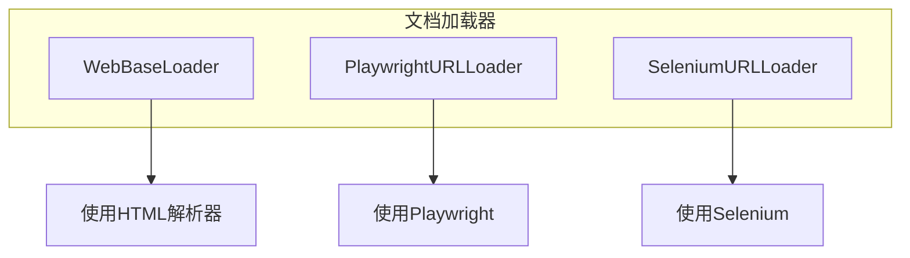
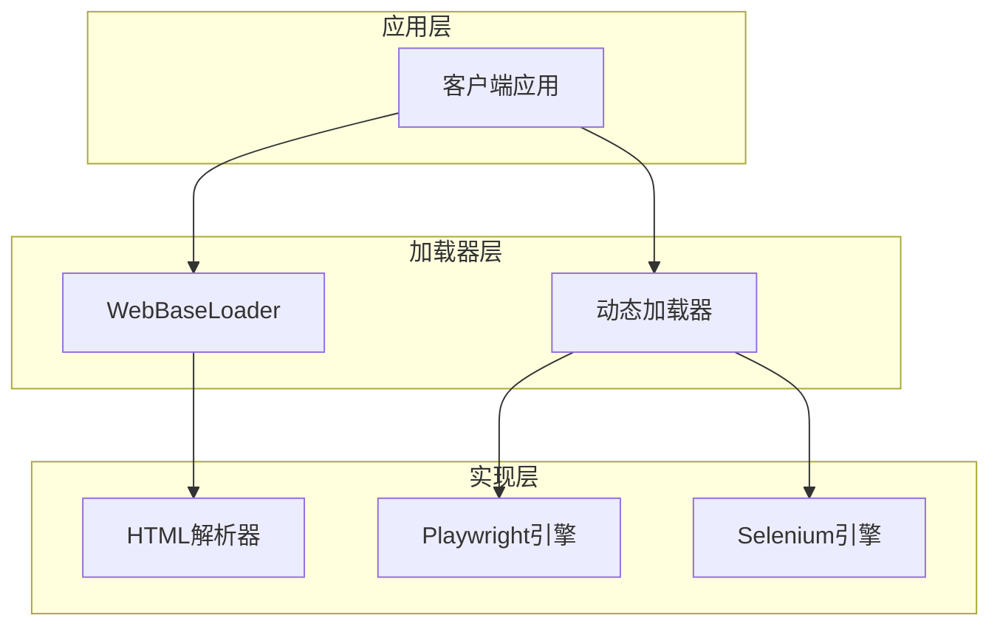
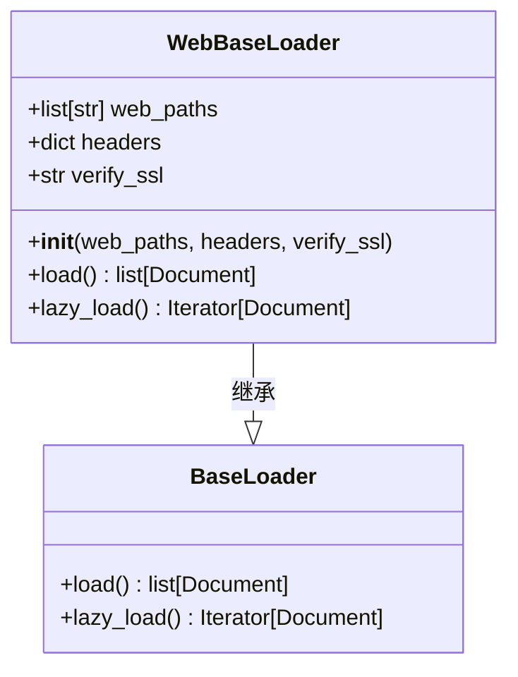
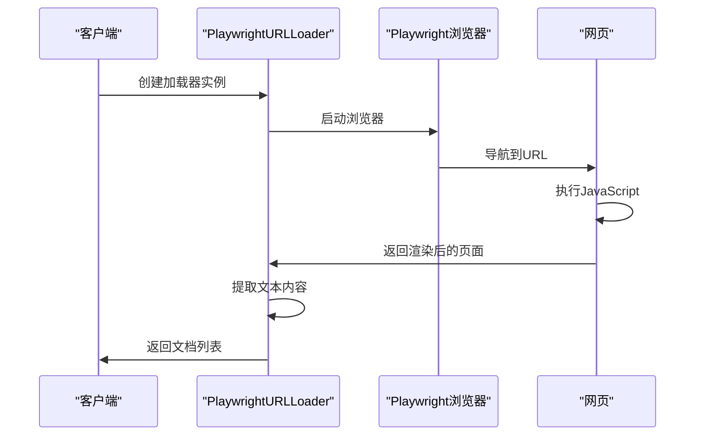
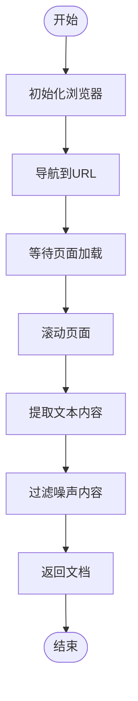
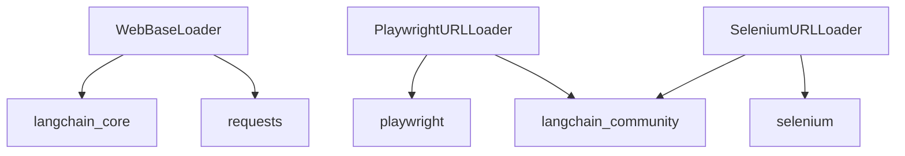

# 网页内容加载器

<cite>
**本文档引用的文件**
- [web_base.py](file://libs/langchain/langchain_classic/document_loaders/web_base.py)
- [url_playwright.py](file://libs/langchain/langchain_classic/document_loaders/url_playwright.py)
- [url_selenium.py](file://libs/langchain/langchain_classic/document_loaders/url_selenium.py)
- [crawler.py](file://libs/langchain/langchain_classic/chains/natbot/crawler.py)
- [__init__.py](file://libs/langchain/langchain_classic/document_loaders/__init__.py)
</cite>

## 目录
1. [简介](#简介)
2. [项目结构](#项目结构)
3. [核心组件](#核心组件)
4. [架构概述](#架构概述)
5. [详细组件分析](#详细组件分析)
6. [依赖分析](#依赖分析)
7. [性能考虑](#性能考虑)
8. [故障排除指南](#故障排除指南)
9. [结论](#结论)

## 简介
本文档全面介绍LangChain框架中的网页内容加载器，重点分析WebBaseLoader如何从网页URL提取文本内容。文档详细说明了基于Playwright和Selenium的动态网页加载器如何处理JavaScript渲染的页面，涵盖配置选项如自定义提取选择器、请求头设置和并发加载策略。同时包含批量抓取网页内容的代码示例、反爬虫策略应对、性能优化和错误重试机制。

## 项目结构
LangChain的网页内容加载器主要分布在`document_loaders`模块中，通过导入转发器从`langchain_community`包中获取实际实现。核心加载器包括用于静态HTML内容提取的WebBaseLoader和用于动态内容加载的PlaywrightURLLoader与SeleniumURLLoader。

**图示来源**
- [web_base.py](file://libs/langchain/langchain_classic/document_loaders/web_base.py)
- [url_playwright.py](file://libs/langchain/langchain_classic/document_loaders/url_playwright.py)
- [url_selenium.py](file://libs/langchain/langchain_classic/document_loaders/url_selenium.py)

**章节来源**
- [web_base.py](file://libs/langchain/langchain_classic/document_loaders/web_base.py)
- [__init__.py](file://libs/langchain/langchain_classic/document_loaders/__init__.py)

## 核心组件
网页内容加载器的核心组件包括WebBaseLoader、PlaywrightURLLoader和SeleniumURLLoader。WebBaseLoader用于提取静态HTML页面的文本内容，而PlaywrightURLLoader和SeleniumURLLoader则专门处理由JavaScript动态渲染的网页内容。这些加载器通过导入转发机制从langchain_community包中获取实际实现，确保了功能的可扩展性和维护性。

**章节来源**
- [web_base.py](file://libs/langchain/langchain_classic/document_loaders/web_base.py)
- [url_playwright.py](file://libs/langchain/langchain_classic/document_loaders/url_playwright.py)
- [url_selenium.py](file://libs/langchain/langchain_classic/document_loaders/url_selenium.py)

## 架构概述
网页内容加载器的架构采用分层设计，上层提供统一的API接口，底层通过不同的技术栈实现具体功能。对于静态内容，使用标准的HTML解析技术；对于动态内容，则通过浏览器自动化工具如Playwright或Selenium来加载和解析页面。

**图示来源**
- [web_base.py](file://libs/langchain/langchain_classic/document_loaders/web_base.py)
- [url_playwright.py](file://libs/langchain/langchain_classic/document_loaders/url_playwright.py)
- [url_selenium.py](file://libs/langchain/langchain_classic/document_loaders/url_selenium.py)

## 详细组件分析

### WebBaseLoader分析
WebBaseLoader是处理静态网页内容的基础加载器，它通过HTTP请求获取网页内容并解析HTML结构，提取有用的文本信息，同时过滤掉广告、导航栏等噪声内容。

#### 对象导向组件

**图示来源**
- [web_base.py](file://libs/langchain/langchain_classic/document_loaders/web_base.py)

### 动态加载器分析
动态网页加载器专门处理由JavaScript渲染的页面，使用浏览器自动化技术来确保页面完全加载后再提取内容。

#### API/服务组件

**图示来源**
- [url_playwright.py](file://libs/langchain/langchain_classic/document_loaders/url_playwright.py)
- [crawler.py](file://libs/langchain/langchain_classic/chains/natbot/crawler.py)

#### 复杂逻辑组件

**图示来源**
- [crawler.py](file://libs/langchain/langchain_classic/chains/natbot/crawler.py)

**章节来源**
- [url_playwright.py](file://libs/langchain/langchain_classic/document_loaders/url_playwright.py)
- [url_selenium.py](file://libs/langchain/langchain_classic/document_loaders/url_selenium.py)
- [crawler.py](file://libs/langchain/langchain_classic/chains/natbot/crawler.py)

## 依赖分析
网页内容加载器依赖于多个外部库和内部模块，形成了复杂的依赖关系网络。

**图示来源**
- [web_base.py](file://libs/langchain/langchain_classic/document_loaders/web_base.py)
- [url_playwright.py](file://libs/langchain/langchain_classic/document_loaders/url_playwright.py)
- [url_selenium.py](file://libs/langchain/langchain_classic/document_loaders/url_selenium.py)

**章节来源**
- [__init__.py](file://libs/langchain/langchain_classic/document_loaders/__init__.py)

## 性能考虑
在使用网页内容加载器时，需要考虑多个性能因素。对于静态内容加载，主要瓶颈在于网络请求和HTML解析速度；对于动态内容加载，浏览器启动和页面渲染时间成为主要性能影响因素。建议使用并发加载策略来提高批量处理效率，并合理配置请求头以避免被反爬虫机制限制。

## 故障排除指南
常见问题包括浏览器驱动未安装、网络连接超时和反爬虫机制触发。对于Playwright加载器，需要确保已通过`pip install playwright`安装并运行`playwright install`命令下载浏览器。对于Selenium加载器，需要确保相应浏览器驱动已正确配置。在遇到反爬虫问题时，可以通过设置合理的请求头和延迟来模拟人类用户行为。

**章节来源**
- [crawler.py](file://libs/langchain/langchain_classic/chains/natbot/crawler.py)
- [url_playwright.py](file://libs/langchain/langchain_classic/document_loaders/url_playwright.py)

## 结论
LangChain的网页内容加载器提供了一套完整的解决方案，既能处理静态HTML页面，又能应对复杂的JavaScript渲染页面。通过WebBaseLoader、PlaywrightURLLoader和SeleniumURLLoader的组合，开发者可以根据具体需求选择最适合的加载策略。这种模块化的设计不仅提高了代码的可维护性，也为未来的功能扩展提供了良好的基础。