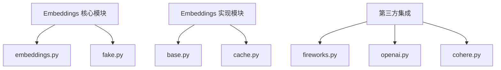
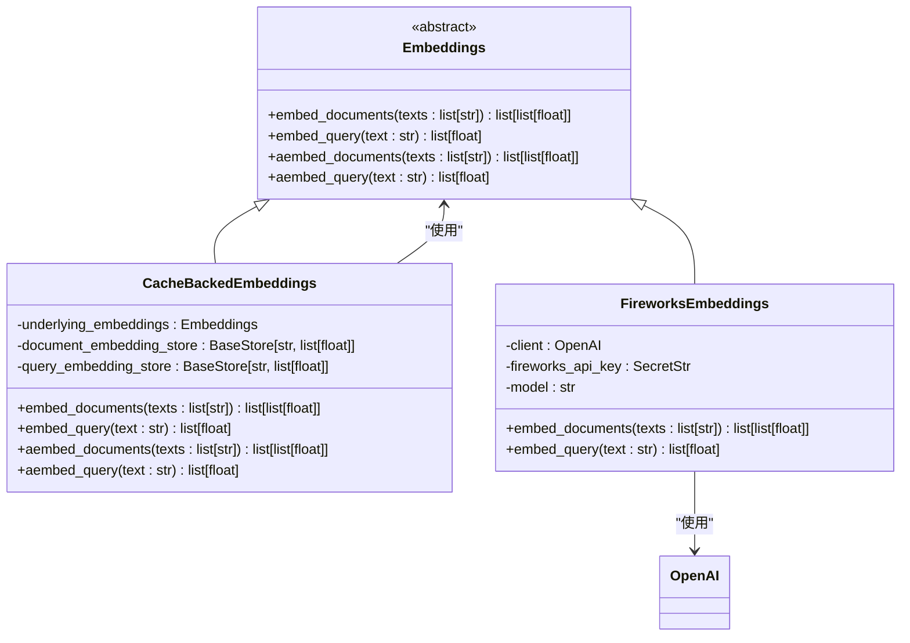
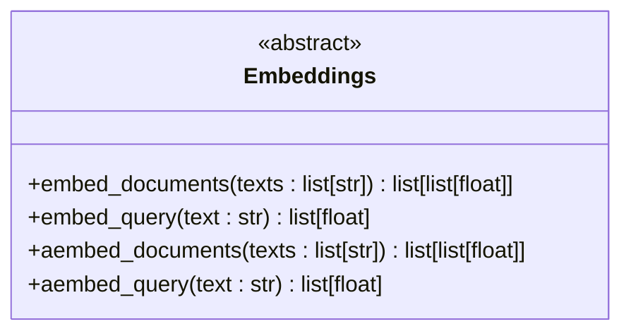
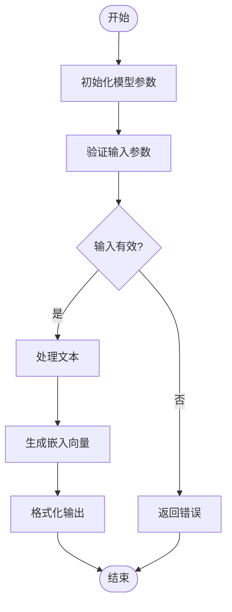
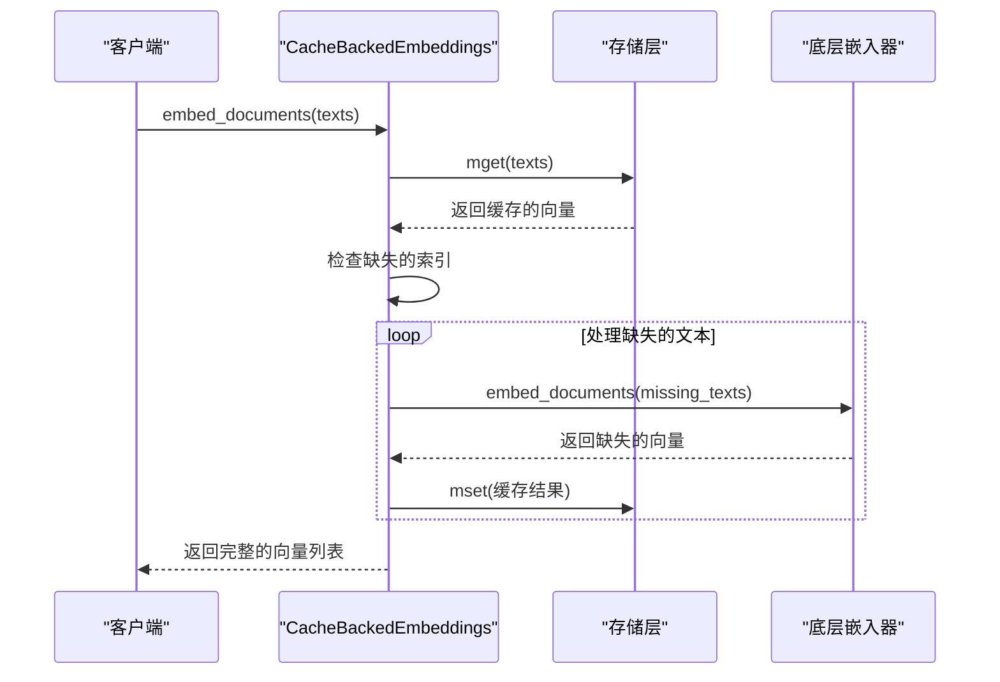
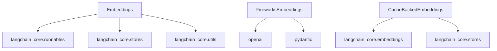

# Embeddings 基础接口

<cite>
**本文档中引用的文件**  
- [embeddings.py](file://libs/core/langchain_core/embeddings/embeddings.py)
- [cache.py](file://libs/langchain/langchain_classic/embeddings/cache.py)
- [base.py](file://libs/langchain/langchain_classic/embeddings/base.py)
- [fireworks.py](file://libs/partners/fireworks/langchain_fireworks/embeddings.py)
- [test_deterministic_embedding.py](file://libs/core/tests/unit_tests/embeddings/test_deterministic_embedding.py)
- [test_caching.py](file://libs/langchain/tests/unit_tests/embeddings/test_caching.py)
</cite>

## 目录
1. [简介](#简介)
2. [项目结构](#项目结构)
3. [核心组件](#核心组件)
4. [架构概述](#架构概述)
5. [详细组件分析](#详细组件分析)
6. [依赖分析](#依赖分析)
7. [性能考虑](#性能考虑)
8. [故障排除指南](#故障排除指南)
9. [结论](#结论)

## 简介
本文档深入探讨LangChain中Embeddings抽象基类的设计原理和核心方法。文档详细解释了`embed_documents`和`embed_query`等核心方法的设计理念，指导开发者如何实现自定义的Embeddings类以集成新的嵌入服务或本地模型。文档还涵盖了接口的线程安全性、异步支持以及与LangChain生态系统其他组件（如向量存储）的兼容性。

## 项目结构
LangChain项目中的Embeddings功能主要分布在`libs/core/langchain_core/embeddings/`目录下，核心接口定义在`embeddings.py`文件中。具体的实现类分布在`libs/langchain/langchain_classic/embeddings/`目录下，而第三方集成则位于`libs/partners/`目录下的各个子模块中。

**Diagram sources**
- [embeddings.py](file://libs/core/langchain_core/embeddings/embeddings.py)
- [base.py](file://libs/langchain/langchain_classic/embeddings/base.py)
- [fireworks.py](file://libs/partners/fireworks/langchain_fireworks/embeddings.py)

**Section sources**
- [embeddings.py](file://libs/core/langchain_core/embeddings/embeddings.py)
- [base.py](file://libs/langchain/langchain_classic/embeddings/base.py)

## 核心组件
Embeddings接口的核心是`Embeddings`抽象基类，它定义了文本嵌入模型的基本契约。该接口主要用于将文本映射到n维空间中的向量，相似的文本通常会被映射到空间中相近的点。

**Section sources**
- [embeddings.py](file://libs/core/langchain_core/embeddings/embeddings.py)

## 架构概述
Embeddings架构采用抽象基类模式，允许各种具体的嵌入模型实现统一的接口。核心的`Embeddings`类提供了同步和异步方法，支持文档和查询的嵌入。缓存机制通过`CacheBackedEmbeddings`类实现，可以有效避免重复计算。

**Diagram sources**
- [embeddings.py](file://libs/core/langchain_core/embeddings/embeddings.py)
- [cache.py](file://libs/langchain/langchain_classic/embeddings/cache.py)
- [fireworks.py](file://libs/partners/fireworks/langchain_fireworks/embeddings.py)

## 详细组件分析

### Embeddings 抽象基类分析
`Embeddings`抽象基类定义了所有嵌入模型必须实现的核心方法。该类使用Python的`abc`模块确保子类必须实现关键方法。

#### 核心方法设计

**Diagram sources**
- [embeddings.py](file://libs/core/langchain_core/embeddings/embeddings.py)

**Section sources**
- [embeddings.py](file://libs/core/langchain_core/embeddings/embeddings.py)

### 自定义Embeddings实现
开发者可以通过继承`Embeddings`基类来创建自定义的嵌入实现。以下是一个基本的实现模板：

#### 实现流程图

**Diagram sources**
- [fireworks.py](file://libs/partners/fireworks/langchain_fireworks/embeddings.py)

**Section sources**
- [fireworks.py](file://libs/partners/fireworks/langchain_fireworks/embeddings.py)

### 缓存机制分析
`CacheBackedEmbeddings`类提供了嵌入结果的缓存功能，可以显著提高性能，避免重复计算相同的文本嵌入。

#### 缓存工作流程

**Diagram sources**
- [cache.py](file://libs/langchain/langchain_classic/embeddings/cache.py)

**Section sources**
- [cache.py](file://libs/langchain/langchain_classic/embeddings/cache.py)

## 依赖分析
Embeddings组件依赖于LangChain核心库中的多个模块，包括运行时配置、存储抽象和可运行组件。第三方实现还依赖于特定的服务SDK。

**Diagram sources**
- [embeddings.py](file://libs/core/langchain_core/embeddings/embeddings.py)
- [cache.py](file://libs/langchain/langchain_classic/embeddings/cache.py)
- [fireworks.py](file://libs/partners/fireworks/langchain_fireworks/embeddings.py)

**Section sources**
- [embeddings.py](file://libs/core/langchain_core/embeddings/embeddings.py)
- [cache.py](file://libs/langchain/langchain_classic/embeddings/cache.py)

## 性能考虑
Embeddings接口设计时考虑了多种性能优化策略。异步方法默认使用`run_in_executor`在独立线程中执行同步方法，避免阻塞事件循环。批量处理和缓存机制可以显著减少API调用次数和计算开销。

## 故障排除指南
在使用Embeddings接口时，常见的问题包括API密钥配置错误、网络连接问题和缓存键冲突。开发者应确保正确配置环境变量，并注意SHA-1哈希算法的碰撞风险。

**Section sources**
- [fireworks.py](file://libs/partners/fireworks/langchain_fireworks/embeddings.py)
- [cache.py](file://libs/langchain/langchain_classic/embeddings/cache.py)

## 结论
LangChain的Embeddings基础接口提供了一个灵活且强大的抽象层，支持各种嵌入模型的集成。通过遵循本文档中的指导，开发者可以轻松创建自定义的嵌入解决方案，并与LangChain生态系统无缝集成。