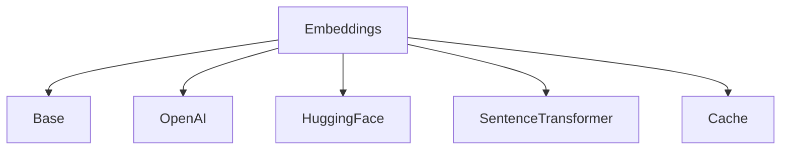
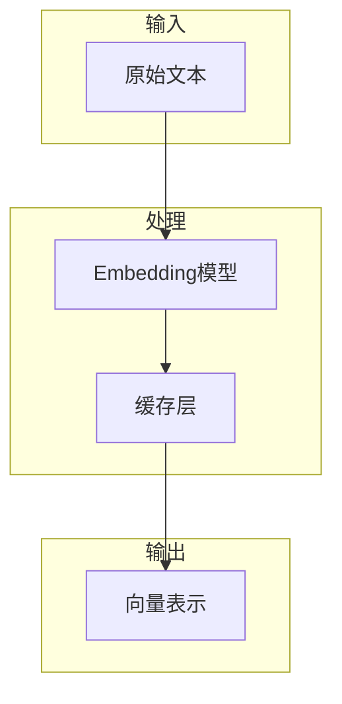
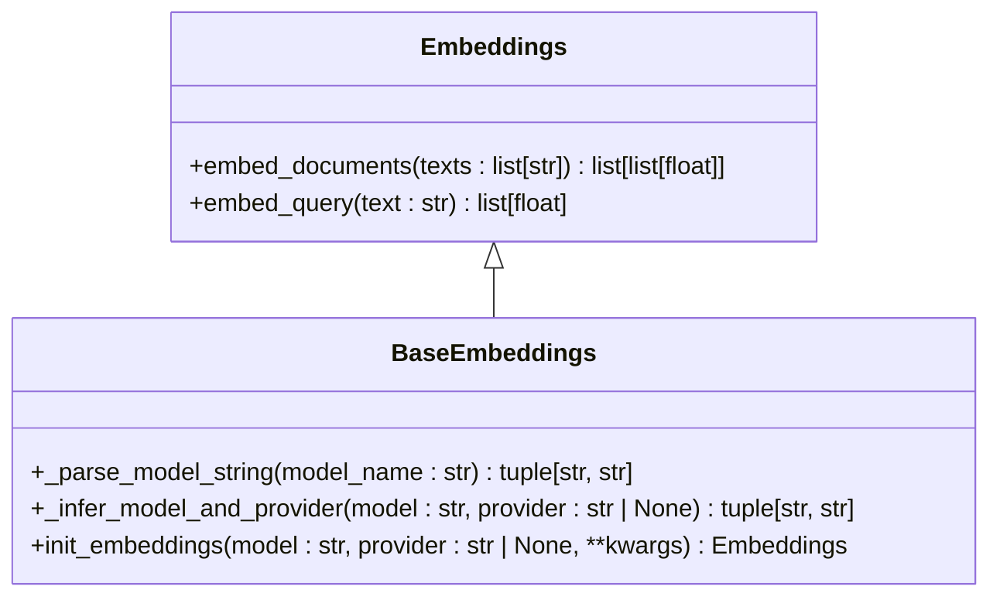
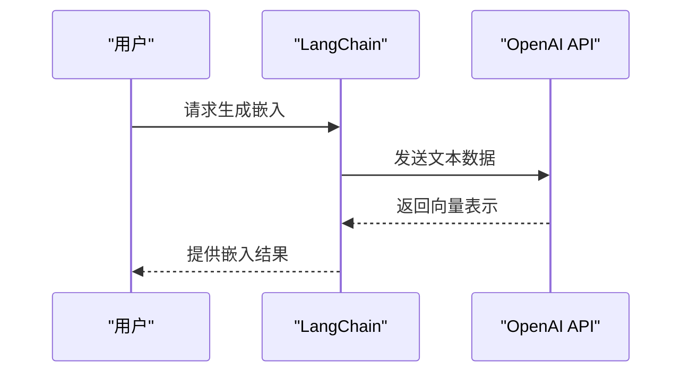
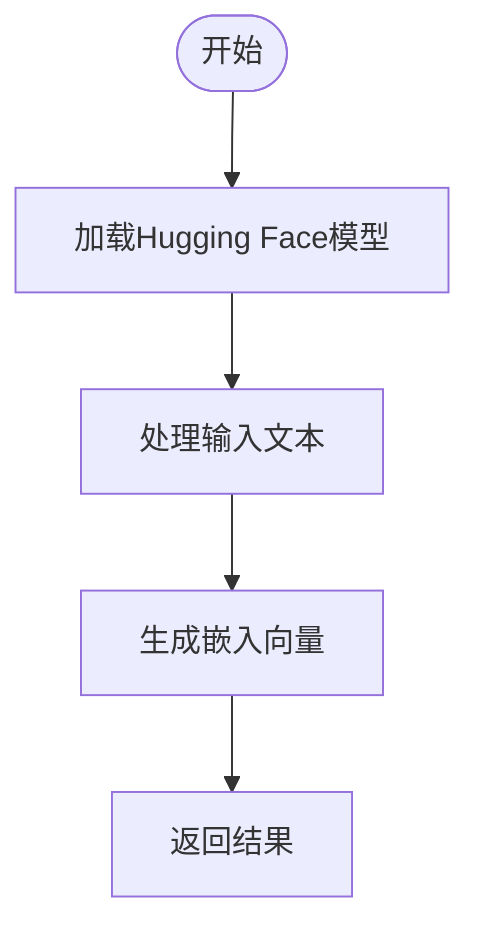
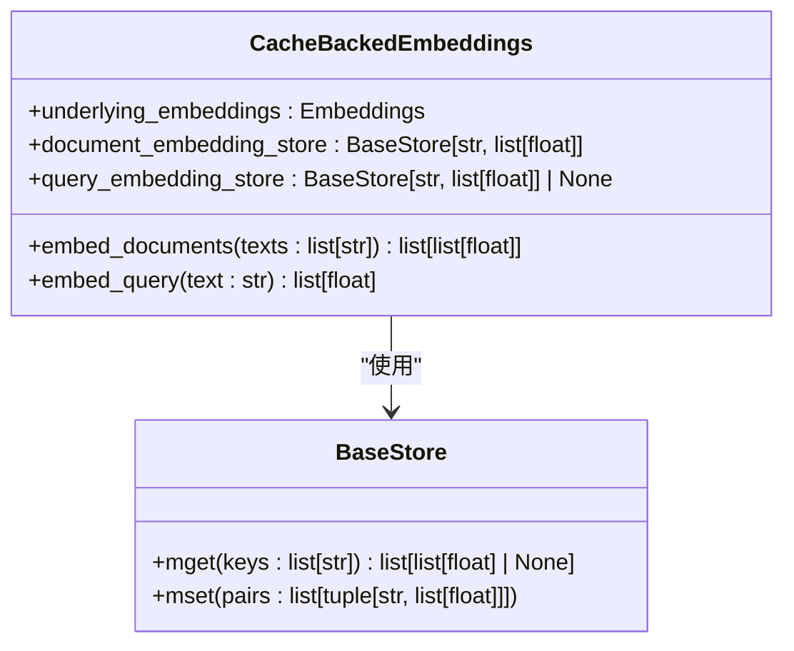
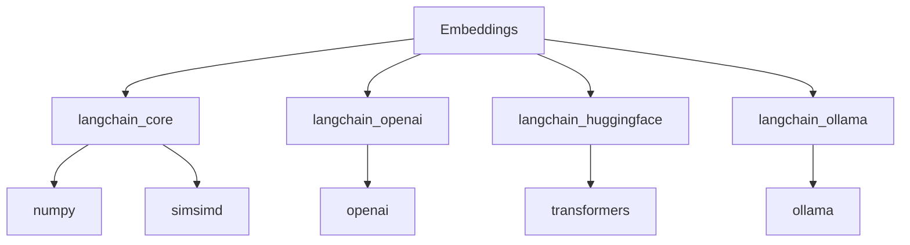

# Embeddings

<cite>
**本文档中引用的文件**  
- [base.py](file://libs/langchain/langchain_classic/embeddings/base.py)
- [cache.py](file://libs/langchain/langchain_classic/embeddings/cache.py)
- [openai.py](file://libs/langchain/langchain_classic/embeddings/openai.py)
- [huggingface.py](file://libs/langchain/langchain_classic/embeddings/huggingface.py)
- [sentence_transformer.py](file://libs/langchain/langchain_classic/embeddings/sentence_transformer.py)
- [utils.py](file://libs/core/langchain_core/vectorstores/utils.py)
</cite>

## 目录
1. [简介](#简介)
2. [项目结构](#项目结构)
3. [核心组件](#核心组件)
4. [架构概述](#架构概述)
5. [详细组件分析](#详细组件分析)
6. [依赖分析](#依赖分析)
7. [性能考量](#性能考量)
8. [故障排除指南](#故障排除指南)
9. [结论](#结论)

## 简介
LangChain中的Embeddings是将文本转换为高维向量表示的核心组件，用于语义搜索和相似度计算。本文档深入探讨Embeddings的工作原理、配置方法、使用场景以及不同模型的比较。

## 项目结构
LangChain的Embeddings功能分布在多个模块中，主要位于`libs/langchain/langchain_classic/embeddings`目录下。该目录包含了各种Embedding模型的具体实现，如OpenAI、Hugging Face等。

**图示来源**
- [base.py](file://libs/langchain/langchain_classic/embeddings/base.py)
- [openai.py](file://libs/langchain/langchain_classic/embeddings/openai.py)
- [huggingface.py](file://libs/langchain/langchain_classic/embeddings/huggingface.py)
- [sentence_transformer.py](file://libs/langchain/langchain_classic/embeddings/sentence_transformer.py)
- [cache.py](file://libs/langchain/langchain_classic/embeddings/cache.py)

**章节来源**
- [base.py](file://libs/langchain/langchain_classic/embeddings/base.py)

## 核心组件
LangChain的Embeddings系统由多个核心组件构成，包括基础类、具体实现和缓存机制。这些组件共同协作，提供高效的文本向量化服务。

**章节来源**
- [base.py](file://libs/langchain/langchain_classic/embeddings/base.py)
- [cache.py](file://libs/langchain/langchain_classic/embeddings/cache.py)

## 架构概述
LangChain的Embeddings架构设计旨在提供灵活且可扩展的文本向量化解决方案。通过统一的接口，用户可以轻松切换不同的Embedding模型，同时利用缓存机制提高性能。

**图示来源**
- [base.py](file://libs/langchain/langchain_classic/embeddings/base.py)
- [cache.py](file://libs/langchain/langchain_classic/embeddings/cache.py)

## 详细组件分析
### 基础类分析
`base.py`文件定义了所有Embedding模型的基础接口和通用功能，包括模型初始化、参数解析和错误处理。

**图示来源**
- [base.py](file://libs/langchain/langchain_classic/embeddings/base.py)

**章节来源**
- [base.py](file://libs/langchain/langchain_classic/embeddings/base.py)

### OpenAI Embeddings分析
OpenAI Embeddings是LangChain中最常用的Embedding模型之一，提供了高质量的文本向量化服务。

**图示来源**
- [openai.py](file://libs/langchain/langchain_classic/embeddings/openai.py)

**章节来源**
- [openai.py](file://libs/langchain/langchain_classic/embeddings/openai.py)

### Hugging Face Embeddings分析
Hugging Face Embeddings允许用户使用Hugging Face平台上的各种预训练模型进行文本向量化。

**图示来源**
- [huggingface.py](file://libs/langchain/langchain_classic/embeddings/huggingface.py)

**章节来源**
- [huggingface.py](file://libs/langchain/langchain_classic/embeddings/huggingface.py)

### 缓存机制分析
缓存机制是LangChain Embeddings的重要组成部分，可以显著提高重复查询的性能。

**图示来源**
- [cache.py](file://libs/langchain/langchain_classic/embeddings/cache.py)

**章节来源**
- [cache.py](file://libs/langchain/langchain_classic/embeddings/cache.py)

## 依赖分析
LangChain的Embeddings系统依赖于多个外部库和内部模块，形成了一个复杂的依赖网络。

**图示来源**
- [base.py](file://libs/langchain/langchain_classic/embeddings/base.py)
- [openai.py](file://libs/langchain/langchain_classic/embeddings/openai.py)
- [huggingface.py](file://libs/langchain/langchain_classic/embeddings/huggingface.py)
- [sentence_transformer.py](file://libs/langchain/langchain_classic/embeddings/sentence_transformer.py)

**章节来源**
- [base.py](file://libs/langchain/langchain_classic/embeddings/base.py)

## 性能考量
在生产环境中使用Embeddings时，需要考虑成本、延迟和可扩展性等因素。缓存机制可以有效降低API调用次数，从而减少成本和延迟。

## 故障排除指南
当遇到Embeddings相关问题时，首先检查API密钥是否正确配置，然后确认所需的依赖库已安装。对于性能问题，建议启用缓存机制。

**章节来源**
- [base.py](file://libs/langchain/langchain_classic/embeddings/base.py)
- [cache.py](file://libs/langchain/langchain_classic/embeddings/cache.py)

## 结论
LangChain的Embeddings系统提供了一个强大而灵活的文本向量化解决方案，支持多种模型和配置选项。通过合理使用缓存和选择合适的模型，可以在保证性能的同时控制成本。