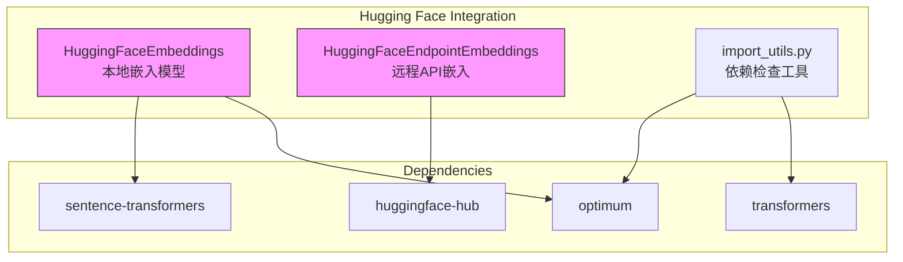
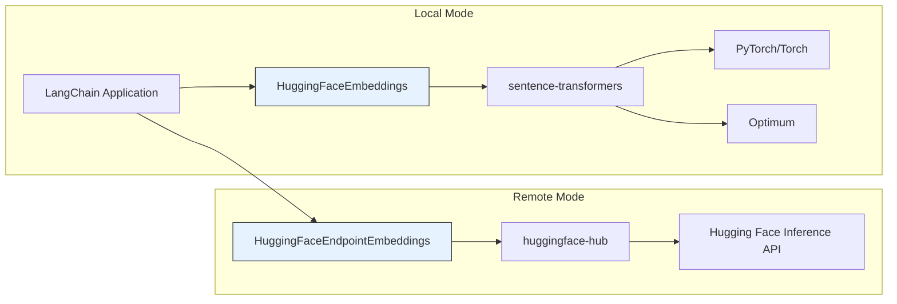
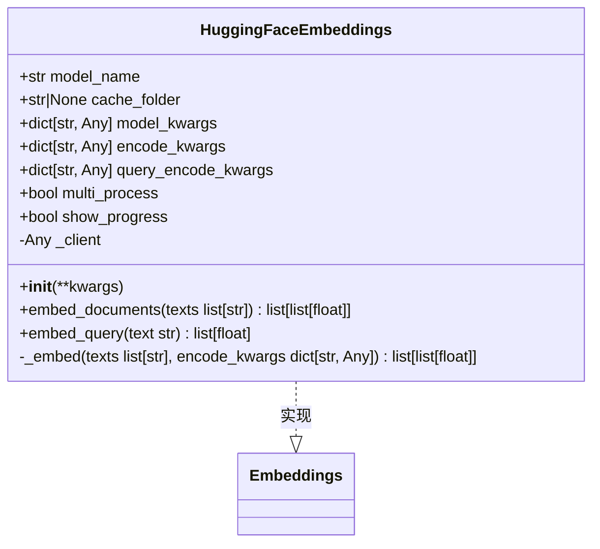
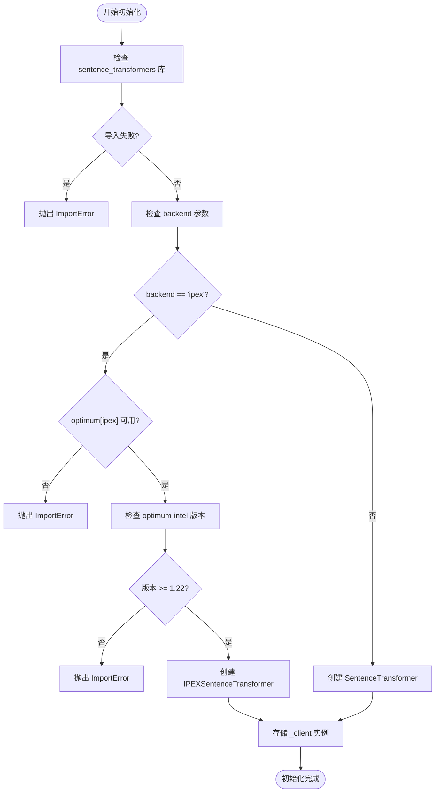
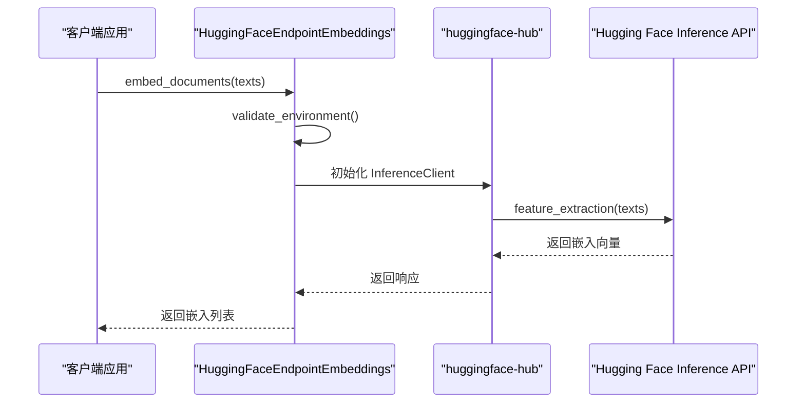
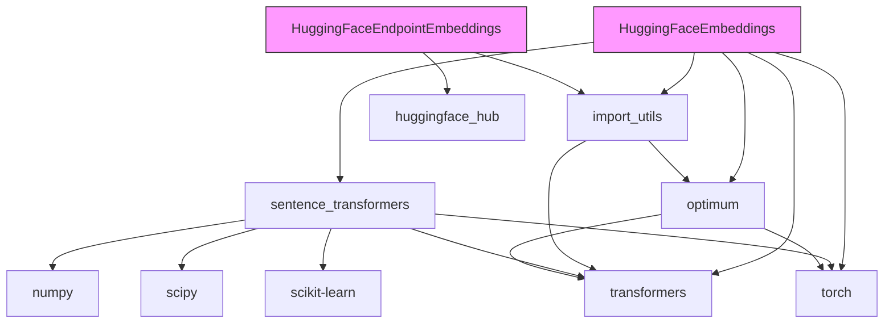

# Hugging Face Embeddings

<cite>
**本文档中引用的文件**
- [huggingface.py](file://libs/partners/huggingface/langchain_huggingface/embeddings/huggingface.py)
- [huggingface_endpoint.py](file://libs/partners/huggingface/langchain_huggingface/embeddings/huggingface_endpoint.py)
- [import_utils.py](file://libs/partners/huggingface/langchain_huggingface/utils/import_utils.py)
- [pyproject.toml](file://libs/partners/huggingface/pyproject.toml)
- [README.md](file://libs/partners/huggingface/README.md)
- [test_embeddings_standard.py](file://libs/partners/huggingface/tests/integration_tests/test_embeddings_standard.py)
</cite>

## 目录
1. [简介](#简介)
2. [项目结构](#项目结构)
3. [核心组件](#核心组件)
4. [架构概述](#架构概述)
5. [详细组件分析](#详细组件分析)
6. [依赖分析](#依赖分析)
7. [性能考虑](#性能考虑)
8. [故障排除指南](#故障排除指南)
9. [结论](#结论)

## 简介
本文档深入探讨了LangChain与Hugging Face Hub上各种开源嵌入模型（如sentence-transformers系列）的集成。文档详细介绍了如何选择合适的预训练模型、配置本地或远程推理服务，以及处理模型下载和缓存。提供了实际代码示例，展示如何加载模型、生成文本嵌入以及在资源受限环境下进行优化。文档涵盖了模型量化、蒸馏等性能优化技术，以及如何自定义和微调嵌入模型以适应特定领域。同时，讨论了Hugging Face Embeddings在隐私敏感场景中的优势，以及与托管服务相比的权衡。

## 项目结构
Hugging Face Embeddings功能主要位于`libs/partners/huggingface`目录下，该目录包含了与Hugging Face相关的LangChain集成。核心嵌入功能实现在`langchain_huggingface/embeddings`子目录中，包含两个主要类：`HuggingFaceEmbeddings`用于本地模型推理，`HuggingFaceEndpointEmbeddings`用于远程API调用。项目依赖于`sentence-transformers`和`huggingface-hub`等关键库，这些依赖在`pyproject.toml`文件中明确定义。

**图示来源**
- [huggingface.py](file://libs/partners/huggingface/langchain_huggingface/embeddings/huggingface.py)
- [huggingface_endpoint.py](file://libs/partners/huggingface/langchain_huggingface/embeddings/huggingface_endpoint.py)
- [import_utils.py](file://libs/partners/huggingface/langchain_huggingface/utils/import_utils.py)

**本节来源**
- [huggingface.py](file://libs/partners/huggingface/langchain_huggingface/embeddings/huggingface.py)
- [huggingface_endpoint.py](file://libs/partners/huggingface/langchain_huggingface/embeddings/huggingface_endpoint.py)

## 核心组件
Hugging Face Embeddings的核心组件包括两个主要类：`HuggingFaceEmbeddings`和`HuggingFaceEndpointEmbeddings`。前者用于在本地加载和运行sentence-transformers模型，后者用于通过Hugging Face Hub API进行远程嵌入计算。这两个类都实现了LangChain的`Embeddings`接口，提供了`embed_documents`和`embed_query`方法。`HuggingFaceEmbeddings`支持多种优化选项，如多进程推理和Intel IPEX加速，而`HuggingFaceEndpointEmbeddings`则专注于通过API进行异步调用。

**本节来源**
- [huggingface.py](file://libs/partners/huggingface/langchain_huggingface/embeddings/huggingface.py)
- [huggingface_endpoint.py](file://libs/partners/huggingface/langchain_huggingface/embeddings/huggingface_endpoint.py)

## 架构概述
Hugging Face Embeddings的架构分为本地和远程两种模式。本地模式直接在用户环境中加载sentence-transformers模型，利用PyTorch或Optimum进行推理。远程模式通过Hugging Face Hub的Inference API进行调用，适合资源受限的环境。两种模式都通过统一的接口与LangChain生态系统集成，确保了API的一致性。架构设计考虑了性能优化，支持多进程处理和硬件加速（如Intel IPEX），同时提供了灵活的配置选项来适应不同的使用场景。

**图示来源**
- [huggingface.py](file://libs/partners/huggingface/langchain_huggingface/embeddings/huggingface.py)
- [huggingface_endpoint.py](file://libs/partners/huggingface/langchain_huggingface/embeddings/huggingface_endpoint.py)

## 详细组件分析

### HuggingFaceEmbeddings 分析
`HuggingFaceEmbeddings`类是本地嵌入模型的核心实现。它封装了sentence-transformers库，提供了便捷的接口来加载和使用预训练模型。该类支持多种配置选项，包括设备选择（CPU/GPU）、缓存目录、编码参数等。特别地，它支持多进程推理，可以显著提高批量嵌入的性能。此外，通过集成Optimum库，它还支持Intel IPEX等硬件加速技术，进一步优化推理速度。

#### 类图

**图示来源**
- [huggingface.py](file://libs/partners/huggingface/langchain_huggingface/embeddings/huggingface.py)

#### 初始化流程

**图示来源**
- [huggingface.py](file://libs/partners/huggingface/langchain_huggingface/embeddings/huggingface.py)
- [import_utils.py](file://libs/partners/huggingface/langchain_huggingface/utils/import_utils.py)

**本节来源**
- [huggingface.py](file://libs/partners/huggingface/langchain_huggingface/embeddings/huggingface.py)

### HuggingFaceEndpointEmbeddings 分析
`HuggingFaceEndpointEmbeddings`类提供了通过Hugging Face Hub API进行远程嵌入的能力。这种模式特别适合资源受限的环境，或者当用户希望利用Hugging Face托管的高性能推理基础设施时。该类使用`huggingface-hub`库的`InferenceClient`进行API调用，支持同步和异步操作。它需要用户提供API令牌，并可以指定不同的服务提供商和任务类型。

#### 序列图

**图示来源**
- [huggingface_endpoint.py](file://libs/partners/huggingface/langchain_huggingface/embeddings/huggingface_endpoint.py)

**本节来源**
- [huggingface_endpoint.py](file://libs/partners/huggingface/langchain_huggingface/embeddings/huggingface_endpoint.py)

## 依赖分析
Hugging Face Embeddings的依赖关系清晰且分层明确。核心依赖包括`sentence-transformers`（用于本地模型推理）、`huggingface-hub`（用于远程API调用）和`transformers`（底层模型支持）。性能优化依赖如`optimum`和`optimum-intel`提供了硬件加速能力。所有依赖都在`pyproject.toml`中明确定义，并通过`import_utils.py`进行运行时检查，确保了环境的兼容性。

**图示来源**
- [pyproject.toml](file://libs/partners/huggingface/pyproject.toml)
- [huggingface.py](file://libs/partners/huggingface/langchain_huggingface/embeddings/huggingface.py)
- [huggingface_endpoint.py](file://libs/partners/huggingface/langchain_huggingface/embeddings/huggingface_endpoint.py)
- [import_utils.py](file://libs/partners/huggingface/langchain_huggingface/utils/import_utils.py)

**本节来源**
- [pyproject.toml](file://libs/partners/huggingface/pyproject.toml)
- [import_utils.py](file://libs/partners/huggingface/langchain_huggingface/utils/import_utils.py)

## 性能考虑
Hugging Face Embeddings提供了多种性能优化选项。对于本地模型，`HuggingFaceEmbeddings`支持多进程推理（`multi_process=True`），可以充分利用多核CPU的优势。通过`model_kwargs`参数，可以指定设备（如GPU）和精度设置，以平衡速度和内存使用。对于Intel硬件，集成`optimum-intel`库可以启用IPEX加速，显著提升推理性能。远程模式虽然避免了本地资源消耗，但需要考虑网络延迟和API调用成本。在资源受限环境下，建议使用量化模型或选择较小的预训练模型。

## 故障排除指南
使用Hugging Face Embeddings时可能遇到的常见问题包括依赖缺失、API令牌错误和模型加载失败。对于依赖问题，确保安装了正确的包版本，特别是`sentence-transformers`和`huggingface-hub`。对于IPEX加速，需要额外安装`optimum[ipex]`。API令牌错误通常源于环境变量未正确设置或令牌过期。模型加载失败可能是由于网络问题或模型名称错误。建议使用`validate_environment`方法检查配置，并查看详细的错误信息以定位问题。

**本节来源**
- [huggingface.py](file://libs/partners/huggingface/langchain_huggingface/embeddings/huggingface.py)
- [huggingface_endpoint.py](file://libs/partners/huggingface/langchain_huggingface/embeddings/huggingface_endpoint.py)
- [import_utils.py](file://libs/partners/huggingface/langchain_huggingface/utils/import_utils.py)

## 结论
Hugging Face Embeddings为LangChain提供了强大且灵活的文本嵌入能力。通过本地和远程两种模式，用户可以根据具体需求选择最适合的部署方式。本地模式提供了更高的隐私性和控制权，适合对数据安全要求高的场景；远程模式则简化了部署，适合快速原型开发。丰富的配置选项和性能优化功能使得该集成能够适应从个人项目到企业级应用的各种场景。随着Hugging Face生态的不断发展，这一集成将继续为开发者提供最先进的嵌入模型和技术。