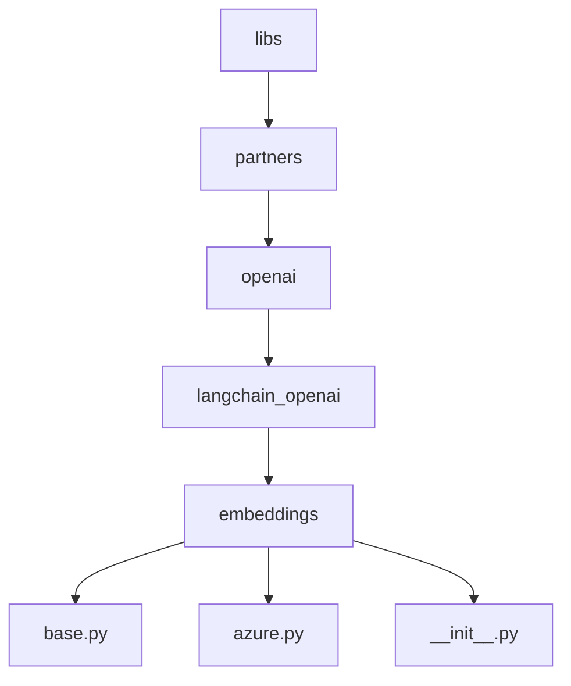
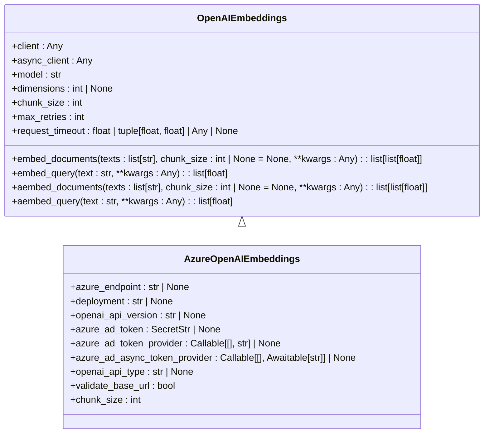
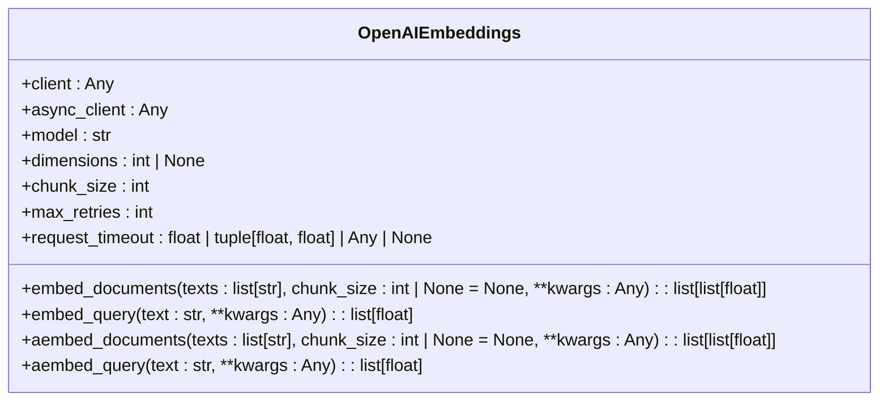
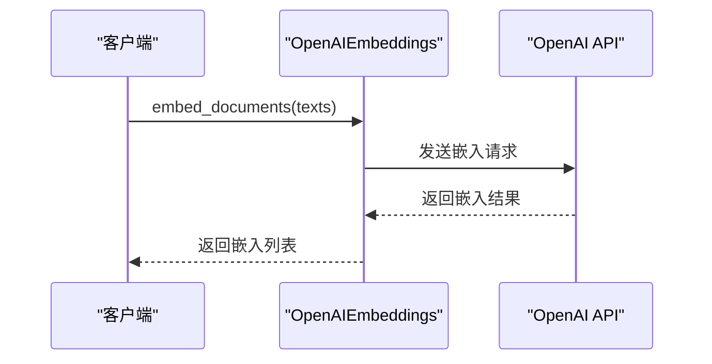
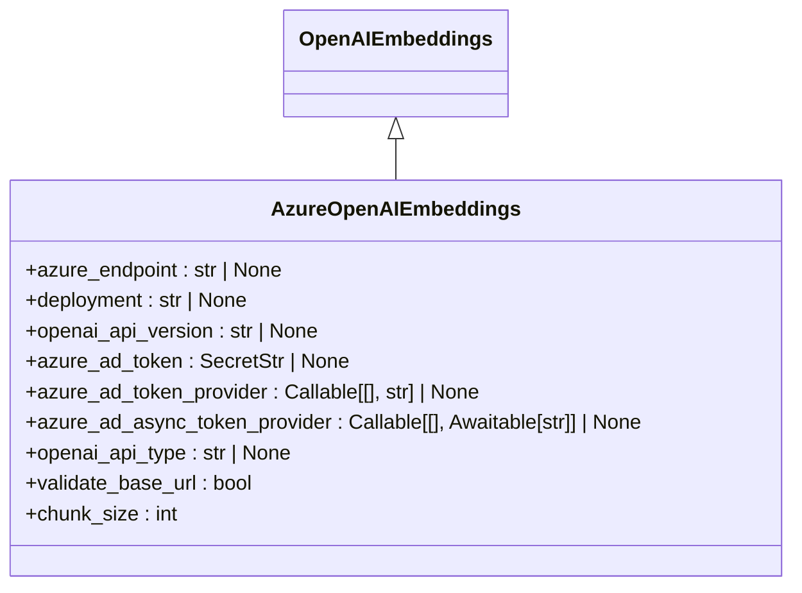
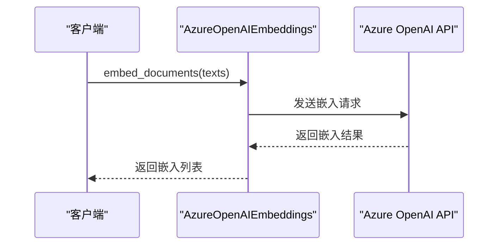
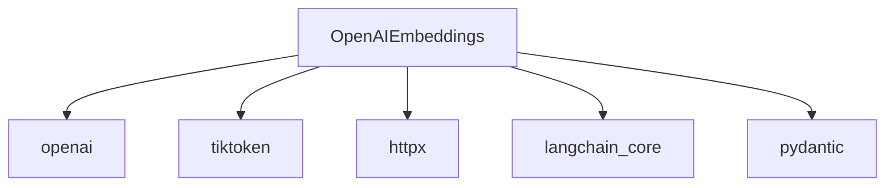

# OpenAI Embeddings

<cite>
**本文档中引用的文件**  
- [base.py](file://libs/partners/openai/langchain_openai/embeddings/base.py)
- [azure.py](file://libs/partners/openai/langchain_openai/embeddings/azure.py)
- [__init__.py](file://libs/partners/openai/langchain_openai/embeddings/__init__.py)
- [test_base.py](file://libs/partners/openai/tests/unit_tests/embeddings/test_base.py)
</cite>

## 目录
1. [简介](#简介)
2. [项目结构](#项目结构)
3. [核心组件](#核心组件)
4. [架构概述](#架构概述)
5. [详细组件分析](#详细组件分析)
6. [依赖分析](#依赖分析)
7. [性能考虑](#性能考虑)
8. [故障排除指南](#故障排除指南)
9. [结论](#结论)

## 简介
本文档深入探讨了如何使用LangChain集成OpenAI的文本嵌入服务，包括text-embedding-ada-002等模型。文档详细介绍了如何配置OpenAI API密钥、设置请求参数（如维度、批处理大小）以及处理API速率限制。通过实际代码示例，展示了如何生成高质量的文本嵌入、计算语义相似度以及在向量数据库中进行相似性搜索。文档还涵盖了错误处理、成本优化策略（如批处理请求）和性能调优技巧，并讨论了OpenAI Embeddings在不同应用场景中的最佳实践。

## 项目结构
LangChain项目结构清晰，主要分为多个模块，其中与OpenAI嵌入相关的文件位于`libs/partners/openai/langchain_openai/embeddings/`目录下。该目录包含`base.py`和`azure.py`两个核心文件，分别用于处理标准OpenAI嵌入和Azure OpenAI嵌入。

**Diagram sources**
- [base.py](file://libs/partners/openai/langchain_openai/embeddings/base.py)
- [azure.py](file://libs/partners/openai/langchain_openai/embeddings/azure.py)

**Section sources**
- [base.py](file://libs/partners/openai/langchain_openai/embeddings/base.py)
- [azure.py](file://libs/partners/openai/langchain_openai/embeddings/azure.py)

## 核心组件
OpenAI嵌入的核心组件包括`OpenAIEmbeddings`和`AzureOpenAIEmbeddings`类。这些类提供了生成文本嵌入的功能，并支持多种配置选项，如模型选择、维度设置、API密钥配置等。

**Section sources**
- [base.py](file://libs/partners/openai/langchain_openai/embeddings/base.py)
- [azure.py](file://libs/partners/openai/langchain_openai/embeddings/azure.py)

## 架构概述
OpenAI嵌入的架构设计旨在提供灵活且高效的文本嵌入服务。通过`OpenAIEmbeddings`类，用户可以轻松地生成文本嵌入，并通过配置参数优化性能和成本。

**Diagram sources**
- [base.py](file://libs/partners/openai/langchain_openai/embeddings/base.py)
- [azure.py](file://libs/partners/openai/langchain_openai/embeddings/azure.py)

## 详细组件分析
### OpenAIEmbeddings 分析
`OpenAIEmbeddings`类是OpenAI嵌入服务的核心，提供了生成文本嵌入的基本功能。该类支持同步和异步方法，允许用户根据需求选择合适的调用方式。

#### 对象导向组件

**Diagram sources**
- [base.py](file://libs/partners/openai/langchain_openai/embeddings/base.py)

#### API/服务组件

**Diagram sources**
- [base.py](file://libs/partners/openai/langchain_openai/embeddings/base.py)

**Section sources**
- [base.py](file://libs/partners/openai/langchain_openai/embeddings/base.py)

### AzureOpenAIEmbeddings 分析
`AzureOpenAIEmbeddings`类继承自`OpenAIEmbeddings`，专门用于处理Azure OpenAI服务的嵌入请求。该类提供了额外的配置选项，如Azure端点、部署名称和API版本。

#### 对象导向组件

**Diagram sources**
- [azure.py](file://libs/partners/openai/langchain_openai/embeddings/azure.py)

#### API/服务组件

**Diagram sources**
- [azure.py](file://libs/partners/openai/langchain_openai/embeddings/azure.py)

**Section sources**
- [azure.py](file://libs/partners/openai/langchain_openai/embeddings/azure.py)

## 依赖分析
OpenAI嵌入服务依赖于多个外部库和内部模块，包括`openai`、`tiktoken`、`httpx`等。这些依赖项确保了嵌入服务的稳定性和高效性。

**Diagram sources**
- [base.py](file://libs/partners/openai/langchain_openai/embeddings/base.py)
- [azure.py](file://libs/partners/openai/langchain_openai/embeddings/azure.py)

**Section sources**
- [base.py](file://libs/partners/openai/langchain_openai/embeddings/base.py)
- [azure.py](file://libs/partners/openai/langchain_openai/embeddings/azure.py)

## 性能考虑
在使用OpenAI嵌入服务时，性能优化是一个重要考虑因素。通过合理设置批处理大小、请求超时和重试次数，可以显著提高嵌入生成的效率和稳定性。

**Section sources**
- [base.py](file://libs/partners/openai/langchain_openai/embeddings/base.py)

## 故障排除指南
在使用OpenAI嵌入服务时，可能会遇到各种问题，如API密钥错误、请求超时等。通过检查配置参数和日志信息，可以快速定位和解决问题。

**Section sources**
- [base.py](file://libs/partners/openai/langchain_openai/embeddings/base.py)
- [azure.py](file://libs/partners/openai/langchain_openai/embeddings/azure.py)

## 结论
本文档详细介绍了如何使用LangChain集成OpenAI的文本嵌入服务，涵盖了配置、使用、性能优化和故障排除等多个方面。通过本文档，用户可以更好地理解和使用OpenAI嵌入服务，生成高质量的文本嵌入，并在各种应用场景中发挥其优势。